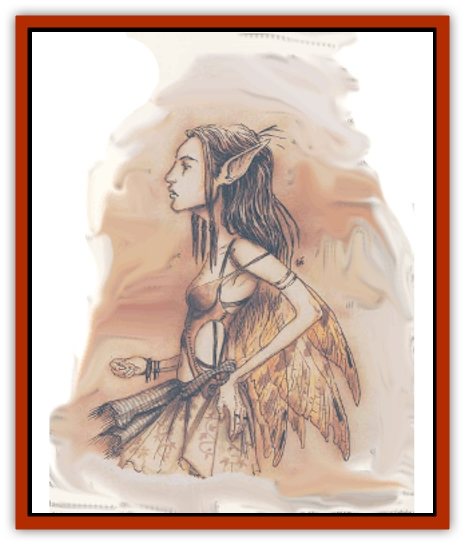

# Eladrin - Lesser - Coure

| Statistic | **Eladrin, Lesser, Coure** |
| --- | --- |
| **Activity Cycle:** | Night |
| **Alignment:** | Chaotic good |
| **Armor Class:** | 5 (0) |
| **Climate/Terrain:** | Arborea |
| **Damage/Attack:** | By weapon or 1d4+1 |
| **Diet:** | Omnivore |
| **Frequency:** | Common |
| **Hit Dice:** | 2+1 |
| **Intelligence:** | Very (11-12) |
| **Magic Resistance:** | 10% |
| **Morale:** | Unsteady (5-7) |
| **Movement:** | 9, Fl 24 (B) or 48 (A) |
| **No. Appearing:** | 2-40 |
| **No. of Attacks:** | 1 |
| **Organization:** | Band |
| **Size:** | S (2' tall) |
| **Special Attacks:** | <i>Magic missile</i> |
| **Special Defenses:** | Magic use |
| **THAC0:** | 19 |
| **Treasure:** | Incidental |
| **XP Value:** | 650 |

The smallest [[Eladrin_General_Information|eladrins]] are the coures, tiny, spritelike creatures who can be found throughout Arborea. They're messengers, scouts, pranksters, and mischief-makers who pester and annoy any travellers or more serious eladrins they run across. The coures' jests are not meant maliciously; in fact, it's hard for even the most dour Doomguard to hang on to a frown when a flock of coure eladrins is dancing around his head.

Despite their senses of humor and boundless energy for song, dance, and jest, coure eladrins tale a definite turn for the serious when confronting evil creatures. Harmless pranks develop into skilled guerilla tactics of hit-and-run nuisance attacks while messengers are sent to summon more suitable opposition to the threat.

Coure eladrin resemble tiny, slender [[Elf|elves]] with long gossamer wings trailing from their shoulders. They appear in a variety of improbable colors and are fond of wearing bright apparel of questionable taste. A coure can assume the shape of a tiny (6" diameter) ball of faerie-light at will.

**Combat:** Combat isn't the main strength of a coure. These tiny eladrins go to great lengths to avoid physical confrontations, choosing flight over battle against all but the weakest foes. The only time coure eladrins gladly seek battle is when confronting their nemeses, the [[Imp|imps]] of Baator or the Abyss. (They're not fond of [[Mephit_General_Information|mephits]], either.)

If a coure is forced to fihgt, she attacks with miniature weapons scaled perfectly to her size. Short swords and rapiers are favored; they're treated as *daggers +1*. Like their larger cousins, the bralani, coures're also archers of surprising skil; they gain a +4 attack bonus with their tiny bows, and their silver arrows are treated as *darts +1*.

As noted above, coures can assume the shape of a non-corporeal ball of light. If a coure wins initiative, she can make this change immediatly after attacking. In this form, the coure is AC 0 and can fly at twice her normal speed. The coure has no physical attack as a globe of faerie-light, but in humanoid form she can cast a *magic missile* up to 3 times per day.

Coure eladrins can also use the spell-like powers of *audible glamer*, *cantrip*, *dancing lights*, *faerie fire*, and *sleep* once per round at will. Once per day they can create a magical jest similar in effect to *Tasha's uncontrollable hideous laughter*.

Coure eladrins can be hit by normal weapons and suffer double damage from cold iron weapons. A coure cannot *gate* in any others of her kind.

**Habitat/Society:** Great numbers of coure eladrins live within the wilkd forests and deep-riven gorges of Olympus, the first layer of Arborea. They gather in bands known as faerie circles or faerie courts. Unlike their larger cousins, the coures have a much closer connection to the land and linger in a favorite grove or mountainside for centuries before moving on. The coures of a faerie circle can be fiercely protective of their enchanted homes and may stand up to far more powerful invaders if necessary.

The coures are the commoners of the eladrins. Like most eladrins, they look after their own affairs, but swarms of them can also be found as attendants to more powerful [[Eladrin_Greater_Firre|firre]] or [[Eladrin_Greater_Tulani|tulani]] courts. Among more powerful eladrins, coures're messengers, heralds, or pages.

Coures are creatures of starlight and darkness. By day they spend much of their time sleeping, wrapping themselves in their gossamer wings.

---
## Discovery & Documentation

**Source Publication:** Planescape II (1996)
**Campaign Setting:** Planescape
**Author(s):** Rich Baker, Karen S. Boomgarden

### Other Creatures Found in This Source Book
   * [[Aasimar|Aasimar]]
   * [[Abrian|Abrian]]
   * [[Arcane|Arcane]]
   * [[Balaena|Balaena]]
   * [[Beholder-kin_Observer|Beholder-kin, Observer]]
   * [[Bloodthorn|Bloodthorn]]
   * [[Bonespear|Bonespear]]
   * [[Darkweaver|Darkweaver]]
   * [[Demarax|Demarax]]
   * [[Dhour|Dhour]]
   * [[Eater_of_Knowledge|Eater of Knowledge]]
   * [[Eladrin_Greater_Firre|Eladrin, Greater, Firre]]
   * [[Eladrin_Greater_Ghaele|Eladrin, Greater, Ghaele]]
   * [[Eladrin_Greater_Tulani|Eladrin, Greater, Tulani]]
   * [[Eladrin_Lesser_Bralani|Eladrin, Lesser, Bralani]]
   * [[Eladrin_Lesser_Noviere|Eladrin, Lesser, Noviere]]
   * [[Eladrin_Lesser_Shiere|Eladrin, Lesser, Shiere]]
   * [[Fhorge|Fhorge]]
   * [[Ghostlight|Ghostlight]]
   * [[Guardinal_Avoral|Guardinal, Avoral]]
   * [[Guardinal_Cervidal|Guardinal, Cervidal]]
   * [[Guardinal_General_Information|Guardinal, General Information]]
   * [[Guardinal_Equinal|Guardinal, Equinal]]
   * [[Guardinal_Leonal|Guardinal, Leonal]]
   * [[Guardinal_Lupinal|Guardinal, Lupinal]]
   * [[Guardinal_Ursinal|Guardinal, Ursinal]]
   * [[Hollyphant|Hollyphant]]
   * [[Incantifer|Incantifer]]
   * [[Ironmaw|Ironmaw]]
   * [[Keeper|Keeper]]
   * [[Khaasta|Khaasta]]
   * [[Leomarh|Leomarh]]
   * [[Monster_of_Legend|Monster of Legend]]
   * [[Mortai|Mortai]]
   * [[Noctral|Noctral]]
   * [[Quill|Quill]]
   * [[Razorvine|Razorvine]]
   * [[Reave|Reave]]
   * [[Retriever|Retriever]]
   * [[Rilmani_Abiorach|Rilmani, Abiorach]]
   * [[Rilmani_General_Information|Rilmani, General Information]]
   * [[Rilmani_Argenach|Rilmani, Argenach]]
   * [[Rilmani_Aurumach|Rilmani, Aurumach]]
   * [[Rilmani_Cuprilach|Rilmani, Cuprilach]]
   * [[Rilmani_Ferrumach|Rilmani, Ferrumach]]
   * [[Rilmani_Plumach|Rilmani, Plumach]]
   * [[Shadowdrake|Shadowdrake]]
   * [[Spellhaunt|Spellhaunt]]
   * [[Spider_Hook|Spider, Hook]]
   * [[Sunfly|Sunfly]]
   * [[Sword_Spirit|Sword Spirit]]
   * [[Tanar'ri_Lesser_Bulezau|Tanar'ri, Lesser, Bulezau]]
   * [[Tanar'ri_Lesser_Maurezhi|Tanar'ri, Lesser, Maurezhi]]
   * [[Tanar'ri_Lesser_Yochlol|Tanar'ri, Lesser, Yochlol]]
   * [[Tanar'ri_General_Information|Tanar'ri, General Information]]
   * [[Tanar'ri_True_Alkilith|Tanar'ri, True, Alkilith]]
   * [[Terlen|Terlen]]
   * [[Tso|Tso]]
   * [[T'uen-rin|T'uen-rin]]
   * [[Vaporighu|Vaporighu]]
   * [[Vorr|Vorr]]
   * [[Wastrel|Wastrel]]
   * [[Wraithworm|Wraithworm]]
   * [[Yugoloth_Lesser_Canoloth|Yugoloth, Lesser, Canoloth]]
   * [[Zoveri|Zoveri]]
