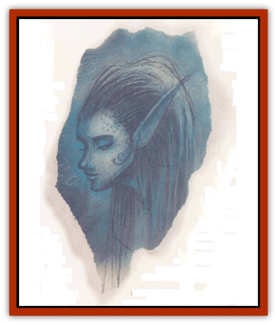

# Eladrin - Lesser - Noviere

| Statistic | **Eladrin, Lesser, Noviere** |
| --- | --- |
| **Activity Cycle:** | Any |
| **Alignment:** | Chaotic good |
| **Armor Class:** | 3 (-3) |
| **Climate/Terrain:** | Arborea |
| **Damage/Attack:** | By weapon +3 or 2d8 |
| **Diet:** | Omnivore |
| **Frequency:** | Uncommon |
| **Hit Dice:** | 5+7 |
| **Intelligence:** | High (13-14) |
| **Magic Resistance:** | 20% |
| **Morale:** | Fanatic (17-18) |
| **Movement:** | 15, Sw 24 |
| **No. Appearing:** | 2-16 |
| **No. of Attacks:** | 1 weapon or 1 ram |
| **Organization:** | Clan |
| **Size:** | M (5' tall or 7' long) |
| **Special Attacks:** | Drowning |
| **Special Defenses:** | Dolphin form |
| **THAC0:** | 15 |
| **Treasure:** | Incidental |
| **XP Value:** | 5,000 |

The seas and islands of Ossa, the second layer of Arborea, are the home of the noviere [[Eladrin_General_Information|eladrins]]. Like the [[Eladrin_Lesser_Bralani|bralani]], the novieres are a people who celebrate the beauty of the lands and emerald waters around them. They're the most straightforward and approachable of the eladrins. The [[Eladrin_Lesser_Shiere|shieres]] are blocks of ice to the typical cutter traveling in Arborea, the [[Eladrin_Lesser_Bralani|bralani]] are fickle and flighty, and trying to talk seriously to a [[Eladrin_Lesser_Coure|coure]] can drive a sod barmy - but the novieres're willing to take a basher at his word and deal with him the way he deals with them.

The novieres appear to be [[Elf_Aquatic|aquatic elves]] or [[Nixie|nixies]]. Their skins are greenish, blue, or golden in hue, and their hair ranges from deep blue-green to pale blond. They're equally at home in the water or on land. The novieres're somewhat more human in appearance than a full-blooded aquatic elf; they're stockier, and have no prominent gills or webbing in their fingers. Their eyes mirror the color of the seas around them. In addition to their demihuman form, novieres can take on the shape of golden [[Dolphin|dolphins]] made entirely of shimmering water.

Novieres prefer to remain in the seas of Ossa, but sometimes journey to other planes or prime-material worlds to visit with ocean [[Nymph|nymphs]] or [[Merman|merfolk]]. They love exploring a new coastline or listening to the sound of the surf on a strange shore. Of all eladrins, the novieres are most likely to be interested in trade or material things; they're fascinated by gemstones and jewelry.

**Combat:** The novieres're slow to anger and try to avoid combat unless it's absolutely necessary. If pressed, a noviere can fight fairly well - her lithe limbs and graceful frame conceal an 18/01 Strength. Novieres like weapons that can be used on water or land, and usually wield tridents +1, nets, or long-bladed daggers +2. Novieres can throw their nets 30 feet underwater or 60 feet on land; if they score a hit, their victim must successfully save vs. paralyzation or be entangled for 1d6 rounds. Entangled victims are attacked at a +4 bonus to hit. Novieres are usually careful not to allow air-breathers to drown while entangled in their nets.

In dolphin form, a noviere's body is composed of water bound together by her magical nature. She can attack by making a powerful ramming strike once per round and can use the surrounding water to shield herself from harm. In this body, the noviere is AC -3. If the noviere scores a hit with a natural 19 or 20, she can choose to envelop her opponent, effectively holding it motionless with a Strength of 20. Neither the held opponent nor the noviere can make any attacks while she holds it. To escape the noviere's grasp, the victim must succeed at a bend bars/lift gates roll or find a way to drive the noviere away with magic.

In any form, the noviere has the spell ability of a 5th-level priest. She can also use the following spell-like powers once per round at will: *alter self*, *charm person*, *continual light*, *improved phantasmal force*, *mirror image*, and *slow*. Once per day a noviere can confer *water breathing* for 6 hours or hurl a 60-foot *water bolt* that does 4d6 points of damage to all creatures in a 5-foot wide path (save vs. spell for half damage.)

**Habitat/Society:** After the coures, the novieres are the most social of the eladrins. They do not travel much, but choose a favorite island or coastline and linger there for years at a time. A clan of noviere eladrins is loosely governed by a chieftain, but individuals are not bound to obey this leader. Novieres tend to keep to themselves aud are a rare sight in the high eladrin courts of Olympus.

---
## Discovery & Documentation

**Source Publication:** Planescape II (1996)
**Campaign Setting:** Planescape
**Author(s):** Rich Baker, Karen S. Boomgarden

### Other Creatures Found in This Source Book
   * [[Aasimar|Aasimar]]
   * [[Abrian|Abrian]]
   * [[Arcane|Arcane]]
   * [[Balaena|Balaena]]
   * [[Beholder-kin_Observer|Beholder-kin, Observer]]
   * [[Bloodthorn|Bloodthorn]]
   * [[Bonespear|Bonespear]]
   * [[Darkweaver|Darkweaver]]
   * [[Demarax|Demarax]]
   * [[Dhour|Dhour]]
   * [[Eater_of_Knowledge|Eater of Knowledge]]
   * [[Eladrin_Greater_Firre|Eladrin, Greater, Firre]]
   * [[Eladrin_Greater_Ghaele|Eladrin, Greater, Ghaele]]
   * [[Eladrin_Greater_Tulani|Eladrin, Greater, Tulani]]
   * [[Eladrin_Lesser_Bralani|Eladrin, Lesser, Bralani]]
   * [[Eladrin_Lesser_Coure|Eladrin, Lesser, Coure]]
   * [[Eladrin_Lesser_Shiere|Eladrin, Lesser, Shiere]]
   * [[Fhorge|Fhorge]]
   * [[Ghostlight|Ghostlight]]
   * [[Guardinal_Avoral|Guardinal, Avoral]]
   * [[Guardinal_Cervidal|Guardinal, Cervidal]]
   * [[Guardinal_General_Information|Guardinal, General Information]]
   * [[Guardinal_Equinal|Guardinal, Equinal]]
   * [[Guardinal_Leonal|Guardinal, Leonal]]
   * [[Guardinal_Lupinal|Guardinal, Lupinal]]
   * [[Guardinal_Ursinal|Guardinal, Ursinal]]
   * [[Hollyphant|Hollyphant]]
   * [[Incantifer|Incantifer]]
   * [[Ironmaw|Ironmaw]]
   * [[Keeper|Keeper]]
   * [[Khaasta|Khaasta]]
   * [[Leomarh|Leomarh]]
   * [[Monster_of_Legend|Monster of Legend]]
   * [[Mortai|Mortai]]
   * [[Noctral|Noctral]]
   * [[Quill|Quill]]
   * [[Razorvine|Razorvine]]
   * [[Reave|Reave]]
   * [[Retriever|Retriever]]
   * [[Rilmani_Abiorach|Rilmani, Abiorach]]
   * [[Rilmani_General_Information|Rilmani, General Information]]
   * [[Rilmani_Argenach|Rilmani, Argenach]]
   * [[Rilmani_Aurumach|Rilmani, Aurumach]]
   * [[Rilmani_Cuprilach|Rilmani, Cuprilach]]
   * [[Rilmani_Ferrumach|Rilmani, Ferrumach]]
   * [[Rilmani_Plumach|Rilmani, Plumach]]
   * [[Shadowdrake|Shadowdrake]]
   * [[Spellhaunt|Spellhaunt]]
   * [[Spider_Hook|Spider, Hook]]
   * [[Sunfly|Sunfly]]
   * [[Sword_Spirit|Sword Spirit]]
   * [[Tanar'ri_Lesser_Bulezau|Tanar'ri, Lesser, Bulezau]]
   * [[Tanar'ri_Lesser_Maurezhi|Tanar'ri, Lesser, Maurezhi]]
   * [[Tanar'ri_Lesser_Yochlol|Tanar'ri, Lesser, Yochlol]]
   * [[Tanar'ri_General_Information|Tanar'ri, General Information]]
   * [[Tanar'ri_True_Alkilith|Tanar'ri, True, Alkilith]]
   * [[Terlen|Terlen]]
   * [[Tso|Tso]]
   * [[T'uen-rin|T'uen-rin]]
   * [[Vaporighu|Vaporighu]]
   * [[Vorr|Vorr]]
   * [[Wastrel|Wastrel]]
   * [[Wraithworm|Wraithworm]]
   * [[Yugoloth_Lesser_Canoloth|Yugoloth, Lesser, Canoloth]]
   * [[Zoveri|Zoveri]]
