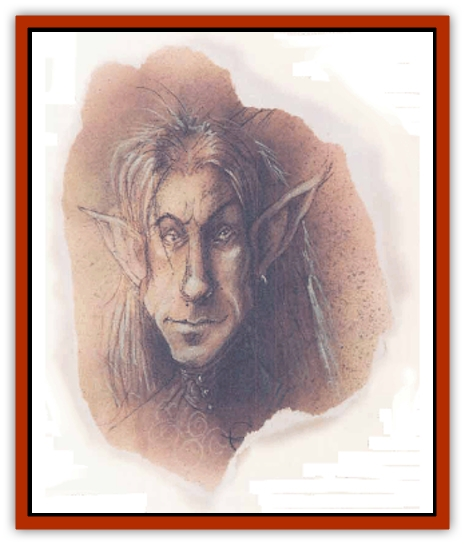

# Eladrin - Lesser - Shiere

| Statistic | **Eladrin, Lesser, Shiere** |
| --- | --- |
| **Activity Cycle:** | Night |
| **Alignment:** | Chaotic good |
| **Armor Class:** | 4 (-4) |
| **Climate/Terrain:** | Arborea |
| **Damage/Attack:** | By weapon +6 |
| **Diet:** | Omnivore |
| **Frequency:** | Common |
| **Hit Dice:** | 8+12 |
| **Intelligence:** | Very to Exceptional (11-16) |
| **Magic Resistance:** | 25% |
| **Morale:** | Fearless (19-20) |
| **Movement:** | 15, Fl 24 (A) |
| **No. Appearing:** | 3-24 |
| **No. of Attacks:** | 2 |
| **Organization:** | Company |
| **Size:** | M (7' tall) |
| **Special Attacks:** | Glance |
| **Special Defenses:** | Magic use |
| **THAC0:** | 13 |
| **Treasure:** | Incidental |
| **XP Value:** | 11,000 |

The warriors of Arborea are the shieres, graceful [[Eladrin_General_Information|eladrin]] knights who fight with skill, strength, and honor. They're the defenders of the eladrin courts, a shining host that seeks out evil intruders and ensures that no darkness will trouble the Queen of Stars or her people. By night the shieres gather together in bright companies to ride the wilds of Olympus and drive away any who would do the folk of Arborea harm.

The shieres appear to be exceptionally tall high [[Elf|elves]] of some kind. They're long-limbed and slender, with lanky frames and long, narrow faces and hands. A shiere's as strong as the mightiest mortal warrior despite his slender build. All shieres are very fair-skinned, with pale golden or silver hair and piercing eyes of blue, green, or violet.

Unlike the other eladrins, shieres're bound more permanently into their demihuman form and can change shape only into a harmless ball of faerie-light, similar to that of a coure eladrin. The shieres can transform only once per hour, so they don't often use this ability, preferring to maintain their demihuman appearance.

**Combat:** Shieres' natural Armor Class is 4, but they commonly wear armor of glass and crystal equivalent to *field plate armor +4* and use long, narrow *shields +1*. (If a shiere is slain, its armor is usually ruined by the damage.) Shieres favor any knightly weapon, especially the lance, battle axe, horseman's mace, horseman's flail, and long sword. A shiere's weapon is always enchanted to a value of +3 or better and may have *sharpness*, *quickness*, or *defender* properties. As highly skilled warriors, shieres receive 2 attacks per round with their favored weapons.

Shieres assume their faerie-light form only in extreme conditions, since they cannot easily resume their normal shape. A shiere may use this ability if he is badly wounded and needs to escape to warn others of trouble, or if he needs to maneuver with more stealth than his normal size allows.

In addition to his formidable combat skills, a shiere's gaze causes *fear* in any evil creature that meets his eyes. He also has the spell ability of a 5th-level priest and can use the following spell-like powers once per round at will: *alter self*, *color spray*, *continual light*, *detect evil*, *detect invisibility*, *ice storm*, *spectral force*, *wall of ice*, or cast a 10d4+10 *cone of cold*. Once per day the shiere can *heal* another creature.

<b class="bk">The Horses of the Shiere:** When hunting, patrolling, or riding to war, shiere are always mounted. A shiere's horse is the equivalent of a heavy war-horse (AC 7, 4+4 HD, THAC0 17, Dmg 1d8/1d8/1d3) but its morale is Fearless and it never has fewer than 5 hit points per Hit Die. In addition, the shiere's war-horse has a movement rate of 24 and can *fly* as long as the sun is not in the sky.

**Habitat/Society:** The shieres're the most numerous eladrins that regularly inhabit the [[Eladrin_Greater_Tulani|tulani]] courts, and are the highest of the common eladrins. Shieres of unusual wisdom or experience are often acknowledged as hunt leaders or captains in the service of a tulani lord, but when the battle is over all shiere companies share the same rank. Shieres're exceptionally honorable and courageous creatures who celebrate similar qualities in others. They can be cold as ice when dealing with those who don't measure up to their own high standards of behavior.

---
## Discovery & Documentation

**Source Publication:** Planescape II (1996)
**Campaign Setting:** Planescape
**Author(s):** Rich Baker, Karen S. Boomgarden

### Other Creatures Found in This Source Book
   * [[Aasimar|Aasimar]]
   * [[Abrian|Abrian]]
   * [[Arcane|Arcane]]
   * [[Balaena|Balaena]]
   * [[Beholder-kin_Observer|Beholder-kin, Observer]]
   * [[Bloodthorn|Bloodthorn]]
   * [[Bonespear|Bonespear]]
   * [[Darkweaver|Darkweaver]]
   * [[Demarax|Demarax]]
   * [[Dhour|Dhour]]
   * [[Eater_of_Knowledge|Eater of Knowledge]]
   * [[Eladrin_Greater_Firre|Eladrin, Greater, Firre]]
   * [[Eladrin_Greater_Ghaele|Eladrin, Greater, Ghaele]]
   * [[Eladrin_Greater_Tulani|Eladrin, Greater, Tulani]]
   * [[Eladrin_Lesser_Bralani|Eladrin, Lesser, Bralani]]
   * [[Eladrin_Lesser_Coure|Eladrin, Lesser, Coure]]
   * [[Eladrin_Lesser_Noviere|Eladrin, Lesser, Noviere]]
   * [[Fhorge|Fhorge]]
   * [[Ghostlight|Ghostlight]]
   * [[Guardinal_Avoral|Guardinal, Avoral]]
   * [[Guardinal_Cervidal|Guardinal, Cervidal]]
   * [[Guardinal_General_Information|Guardinal, General Information]]
   * [[Guardinal_Equinal|Guardinal, Equinal]]
   * [[Guardinal_Leonal|Guardinal, Leonal]]
   * [[Guardinal_Lupinal|Guardinal, Lupinal]]
   * [[Guardinal_Ursinal|Guardinal, Ursinal]]
   * [[Hollyphant|Hollyphant]]
   * [[Incantifer|Incantifer]]
   * [[Ironmaw|Ironmaw]]
   * [[Keeper|Keeper]]
   * [[Khaasta|Khaasta]]
   * [[Leomarh|Leomarh]]
   * [[Monster_of_Legend|Monster of Legend]]
   * [[Mortai|Mortai]]
   * [[Noctral|Noctral]]
   * [[Quill|Quill]]
   * [[Razorvine|Razorvine]]
   * [[Reave|Reave]]
   * [[Retriever|Retriever]]
   * [[Rilmani_Abiorach|Rilmani, Abiorach]]
   * [[Rilmani_General_Information|Rilmani, General Information]]
   * [[Rilmani_Argenach|Rilmani, Argenach]]
   * [[Rilmani_Aurumach|Rilmani, Aurumach]]
   * [[Rilmani_Cuprilach|Rilmani, Cuprilach]]
   * [[Rilmani_Ferrumach|Rilmani, Ferrumach]]
   * [[Rilmani_Plumach|Rilmani, Plumach]]
   * [[Shadowdrake|Shadowdrake]]
   * [[Spellhaunt|Spellhaunt]]
   * [[Spider_Hook|Spider, Hook]]
   * [[Sunfly|Sunfly]]
   * [[Sword_Spirit|Sword Spirit]]
   * [[Tanar'ri_Lesser_Bulezau|Tanar'ri, Lesser, Bulezau]]
   * [[Tanar'ri_Lesser_Maurezhi|Tanar'ri, Lesser, Maurezhi]]
   * [[Tanar'ri_Lesser_Yochlol|Tanar'ri, Lesser, Yochlol]]
   * [[Tanar'ri_General_Information|Tanar'ri, General Information]]
   * [[Tanar'ri_True_Alkilith|Tanar'ri, True, Alkilith]]
   * [[Terlen|Terlen]]
   * [[Tso|Tso]]
   * [[T'uen-rin|T'uen-rin]]
   * [[Vaporighu|Vaporighu]]
   * [[Vorr|Vorr]]
   * [[Wastrel|Wastrel]]
   * [[Wraithworm|Wraithworm]]
   * [[Yugoloth_Lesser_Canoloth|Yugoloth, Lesser, Canoloth]]
   * [[Zoveri|Zoveri]]
