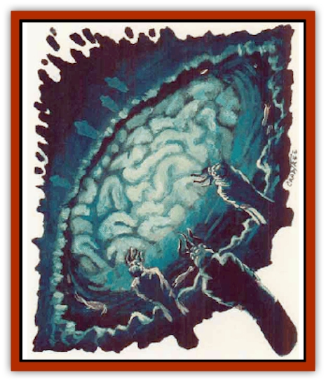

# Elder Brain

| Statistic | **Elder Brain** |
| --- | --- |
| **Activity Cycle:** | Any |
| **Alignment:** | Lawful evil |
| **Armor Class:** | 10 |
| **Climate/Terrain:** | Subterranean |
| **Damage/Attack:** | Nil |
| **Diet:** | Psychic energy |
| **Frequency:** | Very rare |
| **Hit Dice:** | 20 |
| **Intelligence:** | Supra-Genius (20) |
| **Magic Resistance:** | 90% |
| **Morale:** | Fearless (20) |
| **Movement:** | 0 |
| **No. Appearing:** | 1 |
| **No. of Attacks:** | 0 |
| **Organization:** | Solitary |
| **Size:** | H (10' diameter on prime) |
| **Special Attacks:** | Bud brain golem, psionics |
| **Special Defenses:** | Nil |
| **THAC0:** | 0 |
| **Treasure:** | Nil |
| **XP Value:** | 13,000 |

**Psionics Summary**

| Level | Dis/Sci/Dev | Attack/Defense | Score | PSPs |
| --- | --- | --- | --- | --- |
| 20 | 6/21/31 | EW,II,PB/All | = Int | 1d200+450 |

**Clairsentience -** *Sciences:* clairaudience, clairvoyance; *Devotions:* all-round vision, know location.

**Psychokinesis -** *Sciences:* create object, molecular rearrangement, telekinesis; *Devotions:* ballistic attack, control body, control lights, create sound, inertial barrier, levitation.

**Psychometabolism -** *Sciences:* complete healing, energy containment, metamorphosis; *Devotions:* , body equilibrium, suspend animation.

**Psychoportation -** *Sciences:* banishment, probability travel, teleport, teleport other; *Devotions:* astral projection, time shift, time/space anchor.

**Telepathy -** *Sciences:* domination, ejection, mass domination, mind wipe, probe, psionic blast; *Devotions:* awe, ESP, false sensory input, id insinuation, mind thrust, post-hypnotic suggestion, psionic crush, taste link.

**Metapsionics -** *Sciences:* empower, psychic surgery, ultrablast; *Devotions:* cannibalize, magnify, prolong, psionic drain, psionic inflation.

This psionic summary indicates the minimum psionic ability of an elder brain.

The elder brain is a huge, fibrous mass of cognizant brain tissue covered with writhing feelers. A single elder brain floats within the depths of a briny pool found at the center of its [[Mind_Flayer|illithid]] community. An elder brain's prodigious psychic abilities cause it to pulsate and glow like a windblown ember, charging its gray matter with vitality and purpose. This vitality allows it to remain active long after the bodily deaths of the individual [[Mind_Flayer|mind flayers]] whose brains were harvested to engender it.

Elder brains sense the world via an innate telepathy with a radius of up to 5 miles (in the oldest specimens). Within this radius, an elder brain detects all non-psionically shielded sentient beings - even through solid rock. Within this same range, an elder brain can communicate with any creature through the use of its innate telepathy. It can also scry through the eyes of any willing (or psionically dominated) individual within its telepathic radius, although its worldview is biased towards the mental plane.

**Combat:** If given sufficient warning, an elder brain can bud and grow a [[Golem_Brain|brain golem]]; this golem functions as a physical extension of the elder brain itself. An elder brain can bud up to three brain golems, requiring one full hour of undivided attention to fully form each avatar. During the budding process (which costs 1d10 PSPs per HD of the brain golem formed), the elder brain cannot exert any external psychic influence or ability beyond communication.

An elder brain only resorts to budding when its psionic abilities prove inadequate - an infrequent occurence at best - as its psionic arsenals contain the combined psionic knowledge of possibly hundreds of contributing illithid minds. The elder brain can use its psionic abilities at twice normal range.

An aggressor able to withstand the psionic fury of an elder brain must still overcome a physical obstacle in order to engage in melee with the mature. Since an elder brain is approximately 10 feet in diameter and floats 10 feet below the surface of its pool (a 30-foot-wide by 30-foot-deep basin), attackers must first enter the creature's watery domain (incurring underwater combat modifiers) before engaging in melee. Normal missile attacks (fired from the surface into the water) will not reach the submerged elder brain - though most spell attacks function normally, provided the brain is within the caster's line of sight and the spell in question does not change effects when cast into water.

If death is imminent, an elder brain relinquishes its hold on the Prime Material Plane and withdraws completely into the Astral Plane, where the bulk of its mass resides. Once it transports itself in this way, an elder brain loses its anchor to the prime and becomes trapped on the Astral Plane - a rogue creature without ties to its community. It is uncertain what becomes of a rogue elder brain; however, illithid communities that lose their elder brain swiftly fall apart.

**Habitat/Society:** The elder brain is the center of its illithid community, serving as an advisor and, most importantly, the living repository of the community�s technology, history, and psionic expertise. It is the right and obligation of every illithid to merge with the elder brain after death - living in exalted mentality while guiding and shepherding its erstwhile community. While most illithids believe that their personality will survive the transition, individual egos are suborned to the gestalt consciousness suffusing the tissue mass.

**Ecology:** An elder brain preys upon the thousands of tadpoles that share its pool; it extracts the pre-sentient psionic complexus from each tadpole to fuel its own existence. Despite the gradual addition of tadpole life force and the mass of new illithid brains, the size of an elder brain never swells beyond a 10-foot-diameter. It shunts any excess mass directly into a psionically maintained node on the Astral Plane.

---
## Discovery & Documentation

**Source Publication:** The Illithiad (1998)
**Campaign Setting:** Advanced Dungeons & Dragons 2nd Edition
**Author(s):** Bruce R Cordel

### Other Creatures Found in This Source Book
   * [[Bulette_Gohlbrorn|Bulette, Gohlbrorn]]
   * [[Neothelid|Neothelid]]
   * [[Urophion|Urophion]]
