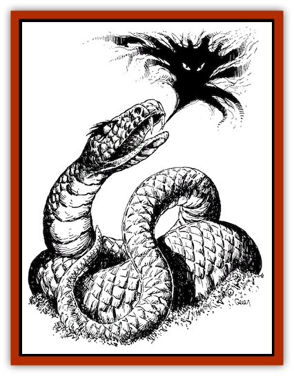
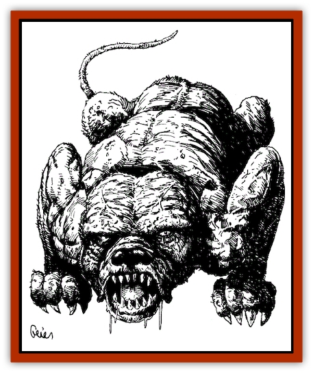
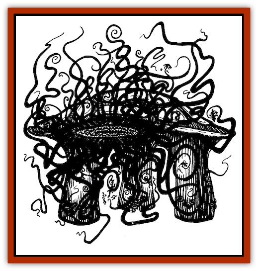
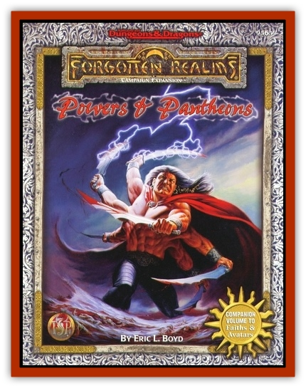

# Elder Eternal Evil

| Statistic | **Dendar the Night Serpent** | **Ityak-Ortheel, the Elf-Eater** | **Kezef the Chaos Hound** |
| --- | --- | --- | --- |
| **Activity Cycle:** | Nocturnal | Any | Any |
| **Alignment:** | Neutral evil | Chaotic evil | Chaotic evil |
| **Armor Class:** | -2 | -10 (carapace), 2 (tentacles), -6 (legs) | -6 |
| **Climate/Terrain:** | The Gray Waste | The Abyss & Prime Material Plane | Outer Planes & Prime Material Plane |
| **Damage/Attack:** | 3d20+10 (bite) | 1d10 per tentacle | 1d20+10 |
| **Diet:** | Unremembered nightmares | Elves and elf spirits | The Faithful (spirits, petitioners) |
| **Frequency:** | Unique | Unique | Unique |
| **Hit Dice:** | 28 (224 hit points) | 27 (216 hit points) | 26 (208 hit points) |
| **Intelligence:** | Genius (18) | Low (7) | Genius (18) |
| **Magic Resistance:** | 90% | 25% | 70% |
| **Morale:** | Fearless (20) | Fearless ( 20) | Fearless (20) |
| **Movement:** | 12 (or across planes) | 24 | 36 |
| **No. Appearing:** | 1 | 1 | 1 |
| **No. of Attacks:** | 1 | 40 (up to 8 on one target) | 1 |
| **Organization:** | Solitary | Solitary | Solitary |
| **Size:** | G (300 feet long) | G ( 80 feet in diameter) | H (15 feet long) |
| **Special Attacks:** | Unleash <i>nightmares</i>, unleash victim-specific <i>nightmares</i>, sleep/ nightmare venom, swallows whole, spell-like abilities (<i>demishadow magic</i>, <i>demishadow monsters</i>, <i>dreamspeak</i>, <i>fear</i>, <i>nightmare</i>, or <i>dream</i>) | Constrict, bite, kick | Always wins initiative, acid spittle, acid breath, maggot swarm |
| **Special Defenses:** | +5 or better magical weapon to hit, regenerates 5 hit points/round, unleashes nightmares, immune to poison, <i>hold</i>, <i>fear</i>, or <i>charm</i> spells, illusions, psionics, and death magic | Regenerates 2 hit points/round, does not need air to breathe, immune to acid, cold, poison, <i>hold</i>, <i>fear</i>, or <i>charm</i> spells, illusions, psionics, and death magic | Howl, burning blood, + 3 or better magical weapon to hit, regenerates 5 hit points/round, immune to poison, <i>hold</i>, <i>fear</i>, or <i>charm</i> spells, illusions, psionics, and death magic |
| **THAC0:** | -9 | -7 | -7 |
| **Treasure:** | Nil | Nil | Nil |
| **XP Value:** | 35,000 | 27,000 | 34,000 |

**Dendar the Night Serpent** 

Dendar the Night Serpent is one of the elder, eternal evils of the Outer Planes created in the dawn of Abeir-Toril's prehistory. She came into existence shortly after the first being slept in Realmspace and had a nightmare. Supposedly, she will be the harbinger of the end of the world, the gods, and the entire crystal sphere of Realmspace.

The Night Serpent's slit-pupilled eyes are the sickly yellow-black of rotten eggs. Her tongue is forked and flickers incessantly over her smooth lips. Her monstrous fangs are always coated with the viscous essence of lost dreams. She speaks with a sibilant, malignant voice that drips with ancient horrors. Her hide is covered in midnight-black scales, the physical embodiment of the most terrifying nightmares she has swallowed.

Although she can slither across the Gray Waste or any of the lower planes at will, the Night Serpent is almost always found in her lair. Dendar lives in a vast cave near the oozing river that serves as the moat for the Crystal Spire (or its predecessor, Cyric's Bone Castle). The hiss of the Night Serpent's breathing echoes through the City of Strife as she sleeps, contentedly gorged on the world's unremembered nightmares. Anyone who approaches her cave finds her awake and awaiting them with anticipatory delight as she savors and relives their worst unremembered nightmares. Her cavernous maw is large enough to swallow a hill giant, and her tongue can knock an armored man to the ground with a single flick. Beneath her tongue is a foul mire of greasy spittle and half-devoured bones-the corporeal manifestations of the remnants of her dream diet.

To the ancient Rus, Dendar was known as Nidhogg, the serpent who gnaws on the roots of Yggdrasil. In Calimport, she is known (incorrectly) as the Mother of the Night Parade. (However, those horrid denizens of another world who survived their war with Myrmeen Lhal and her Harper allies have begun to venerate Dendar since their permanent loss of the artifact connecting them with their home world.) In the Jungles of Chult, Dendar is known as the Eater of the World, and stories tell of how Ubtao will battle the Night Serpent when she emerges through a gigantic iron door located beneath one of the Peaks of Flame to attempt to eat the sun. According to legend, Dendar will succeed in breaking down the door to readily devour the sun if Ubtao fails in his duty when the doom of the world finally arrives.

Only the legendary blade of Alban Onire, *Titanslayer*, has ever truly injured the Night Serpent. When Gwydion the Quick dared to challenge the Night Serpent during the revolt against Cyric in the City of Strife, she battled the servant of Torm with a host of nightmare visions and lost. Dendar conceded defeat and unleashed the night-terrors that belonged to the denizens defending the Bone Castle, allowing the revolutionaries to storm the fortress.

**Combat:** Although Dendar can attack with her magically envenomed bite, she prefers to unleash unremembered nightmares on anyone so bold as to attack her. Her fangs cut through armor as if it does not exist-the Armor Class of any opponent is calculated using magical and Dexterity bonuses only. Anyone bitten by the Night Serpent must make a successful saving throw vs. death magic or fall into an eternal sleep, stalked by an endless stream of nightmares replayed over and over. The only way to end this tortured state is with a *limited wish* or *wish* spell followed by *heal* to prevent the victim from being permanently *feebleminded*. On an unmodified attack roll of 20, Dendar can swallow an opponent of huge size or smaller whole. When swallowed in this manner, victims can only be helped by forcing Dendar to disgorge nightmares and leaving her gullet in the outgoing flood. While in her gullet they take 1d6 points of acid damage per turn.

For every point of damage an opponent inflicts on the Night Serpent, one scale explodes and stretches into a fully formed nightmare, similar in effect to a *nightmare* spell (as the reverse of the 5th-level wizard spell dream). Although every *nightmare* is actually experienced instantaneously, each hideous and unsettling vision seems to go on forever. If the victim fails a saving throw vs. spell, each *nightmare* inflicts 1d10 points of damage and leaves the recipient fatigued and unable to regain spells for a week. If a second saving throw vs. spell is failed, the victim is under the effects of a permanent *fear* spell until *remove fear* is successfully cast upon them.

Dendar can also disgorge up to 10 *nightmares* per round against each attacker, although she is loath to do so unless confronted by a particularly dangerous opponent, since each lost *nightmare* delays the end of the world and her triumph just a little bit longer.

The Night Serpent can vomit forth any specific spirit's worst *nightmare* from its entire life. Such *nightmares* fly forth to attack their originators, wherever they may be (even on another plane). If victims have already confronted particular attacking visions and laid them to rest (as adjudicated by the DM), they are unaffected, and the Night Serpent must concede defeat to such opponents and be henceforth unable to ever harm them through night terrors ever again. If victims have not confronted and defeated particular attacking *nightmares* in the past and fail a saving throw vs. spell at-5, they become insane with a pernicious insanity curable only by a *wish* granted directly from a deity. If victims who have failed this saving throw are in the process of physically attacking the Night Serpent, a gathered host of horrors envelop them and draw them into the gullet of the Night Serpent. Such a fate results in the permanent annihilation of these victims and not even a greater power can restore the unfortunate being to life or the afterlife.

Dendar can cast one of the following spells at will (as an ability) once per round: *demishadow magic*, *demishadow monsters*, *dreamspeak* (as the 1st-level wizard spell, also known as *Detho's delirium*), *fear*, or *nightmare* (or its reverse, *dream*). The Night Serpent can intangibly manifest anywhere in the Realms and cast any of the  above spells as well.

Dendar can only be hit by weapons of +5 enchantment or greater. She regenerates 5 hit points per round. She is immune to poison, *hold*, *fear*, or *charm* spells, illusions, psionics, ang,' ·' 1\I ~ I\~ death magic.

Dendar can only be truly slain by mortals or powers under conditions similar to those required to slay a demipower on its home plane. Other wise, she always reforms in the Gray Waste after one day has passed. All of the Realms' inhabitants remember every nightmare they have that night in excruciating detail for the rest of their lives.

**Habitat/Society:** Dendar is a unique being who resides in the Gray Waste, eating the unremembered nightmares of Faen1n's populace. The Night Serpent has an uncountable horde of horrible dreams and foul visions in her gullet that she has been devouring since the dawn of time. She relishes the taste of particularly choice nightmares and savors the dreams of kings and deities alike.

**Ecology:** Dendar has consumed the unremembered nightmares of Faerun for uncounted eons, slowly fattening herself in preparation for the end of the world when she can escape to the Realms in order to devour the sun. If she did not feed her insatiable appetite, every being, mortal or deity, would remember every nightmare she or he ever dreamed in excruciating and possibly incapacitating detail.

Prior to Cyric's tenure, the Night Serpent ate only unremembered nightmares. Then, in his madness, the Prince of Lies fed her numerous denizens of the City of Strife (petitioners and other spirits). She developed a taste for the Faithful. As a result of this new diet, Dendar quickly swelled up to the point where she could no longer leave her lair and hence could no longer hunt for the most succulent nightmares or manifest in the Realms. Kelemvor, the new Lord of the Dead, no longer feeds denizens or any other Faithful to the Night Serpent, and Dendar has shrunk back to her normal gargantuan size, allowing her to leave her cave. She has developed a taste for the Faithful, however, and, like Kezef the Chaos Hound, any of the Faithful the Night Serpent manages to catch and consume are utterly destroyed. Since Cyric's defeat, Dendar is careful to only consume the occasional spirit morsel as a treat, and her diet once again consists predominantly of the world's unremembered nightmares.

**Kezef the Chaos Hound** 

Kezef the Chaos Hound is one of the elder, eternal evils of the Outer Planes created in the dawn of Abeir-Toril's prehistory. The ravager of the heavens appears as a huge mastiff with unearthly, malevolent, red eyes and a ratty tail. His fur teems with maggots, the coat shifting incessantly over barely covered sinews and bones. His flesh oozes like pus from an old sore and his paws leave burning prints in the ground that spread into pools of burning ichor in his wake. His pointed teeth glitter like daggers of jet in the light. His blood is a dark, liquid ooze that burns on the touch, and he radiates a pestilent aura of decay. The fetid air of his breath extinguishes all nearby fires, and he reeks with the sweet stench of ancient death that can be detected from many miles away. Kezef can speak any language in a low and rumbling growl.

Kezef was imprisoned for centuries on the layer of the plane of Pandemonium known as Cocytus by an alliance of members of the Faerunian pantheon when the Circle of Greater Powers forbade traffic by deity or mortal with the beast. After he was hunted down, the powers bet Kezef that he could not break a leash forged by Gond Wonderbringer. Kezef allowed Gond to place a short length of sturdy chain around his neck in exchange for Tyr placing his right hand in the Chaos Hound's slavering jaws. Gond anchored the chain miles deep in the floor of Pandemonium's caves, and Mystra wrapped the beast in an unbreachable, glowing curtain of magical energy that automatically repaired itself. From these two traps Kezef could not escape, and no one could reach him through Mystra's curtain. When Kezef discovered he was truly fettered, he bit off Tyr's hand and feasted on its divine essence for centuries as he strove to free himself.

Kezef was freed by Cyric shortly after the Time of Troubles to hunt for the soul of Kelemvor. The Prince of Lies tricked Mystra into ripping the magic weave enveloping Kezef and then shattered Gond's chain with his sword Godsbane, later revealed to be an avatar of Mask. Kezef traveled to Faerun and began to follow Kelemvor's life trail. When he reached Blackstaff Tower in Wat~rdeep, the site of the climactic battle between the avatar of Myrkul and Midnight, Adon, and Kelemvor, Mask and Lord Chess of Zhentil Keep reimprisoned Kezef in an enchanted candle with an ancient ritual provided by Oghma. Mask later gave the candle to Gwydion, a clockwork inquisitor turned against Cyric by Mystra, who then freed the Chaos Hound during a rebellion against Cyric in the City of Strife. The Chaos Hound feasted on Cyric's denizens until Kelemvor assumed the title of Lord of the Dead and the rest of the pantheon threatened to recapture the Hound within the Wall of the Faithless. Kezef fled and now stalks the planes hunting Mask, the Lord of Shadows, against whom he has sworn eternal revenge, and his normal prey, the Faithful (Outer Planes petitioners). Mask is forever on the run, always hearing Kezef's hellish baying behind him.

**Combat:** Kezef is incredibly quick, and always strikes first in combat except when battling a deity. In addition to the damage inflicted by his terrible bite, the Chaos Hound's spittle burns victims for an additional 1d10 points of acid damage per round for the three rounds after any successful bite. This additional acid damage is cumulative for multiple bite attacks.

In lieu of a bite attack, the Chaos Hound can breathe a puff of corrosive mist once per round in a 20-foot-diameter area in front of his mouth. This virulent acid can scour flesh from bones and inflicts 2d12 points of acid damage per round of exposure until neutralized or washed away by prolonged immersion in running water.

Kezef's ear-splitting howl causes *confusion* and *fear* (as the 4th-level wizard spells) in mortals for as long as it is heard. (The *fear* can even affect deities, who receive a +6 bonus to their saving throws.) A successful saving throw vs. spell holds off the howl's effects for one round.

Kezef regenerates 5 hit points per round. Any wounds he receives appear to immediately fester and then the putrefied flesh rapidly closes over the wound. The mass of corruption that is his skin shifts with each blow, as yielding as water, accounting for his high Armor Class.

Anyone successfully striking the Hound in melee must make a successful saving throw vs. breath weapon or be splattered by his oozing blood which burns like molten copper. This hot liquid inflicts 1d8 points of heat damage per round until wiped off.

Kezef can only be hit by magical weapons of + 3 or better enchantment. He is totally immune to poison, *hold*, *fear*, or *charm* spells, illusions, psionics, and death magic. His magic resistance drops to 40% when battling demipowers, and 20% when battling powers of greater stature.

The Chaos Hound can *plane shift* between planes or *teleport without error* within a plane at will.

Kezef becomes insubstantial as a ghost when he runs, and in this state he can move at a nearly limitless speed over any terrain. For example, it took him one hour to travel Kelemvor's path for four years of life. In this noncorporeal form, all that can be perceived of him is a ghostly blur that leaves a lingering scent of decay and a vague dread of darkened corners and howling in the night. When the Chaos Hound slows down, he becomes substantial once again and uses the movement rate listed above, although he can still travel over any terrain as if running on air. If he chooses, he can hide invisibly at will, leaving only a sense of being watched by some creeping thing with an evil laugh and noxious scent.

When the Chaos Hound hunts a particular soul, he can immediately transport himself to the site of the sought being's birth ( through *plane shift* and *teleport without error*). While on the hunt, he howls madly and is as infallible a tracker as Gwaeron Windstrom. Unlike the Master of Tracking, he tracks by lingering traces of emotional scent that may be years or even centuries old. Due to Kezef's astounding senses, no living creature can hide once he picks up its trail. The Chaos Hound can fully reconstruct every step of a being's life from the emotional echoes that remain in its path.

Kezef can only be truly slain by mortals or powers under conditions similar to those required to slay a demipower. Otherwise he always reforms in Pandemonium after a week, free to hunt again.

**Habitat/Society:** Kezef is a unique being who roams the Outer Planes hunting the Faithful and chasing Mask. He relishes the scent of hatred, and sometimes pauses and becomes substantial in order to savor a particularly juicy emotional scent. He is nauseated by the scent of cloying, reckless happiness. In his wake he leaves screaming nightmares particularly cherished by Dendar the Night Serpent.

**Ecology:** Souls and spirits are incredibly hardy. Only the hand of a deity, an elder, eternal evil such as the Chaos Hound, or a place of indescribable corruption such as the River Slith can truly destroy them. Kezef survives by raiding the planes and preying on the spirit-substance of the Faithful. He has no taste for the Faithless or the False and is sickened by the taste of the unripened spirits of the still-living. When Kezef destroys one of the Faithful, the maggots which make up his pelt swarm away from his jet-boned skeleton to devour the corpse. The gorged creatures then mill slowly over Kezef's body, making him appear bloated. Any of the Faithful who are eaten in this fashion are forever and truly destroyed, beyond even the recall of the powers.

**Ityak-Ortheel, the Elf-Eater** 

Ityak-Ortheel is one of the elder, eternal evils of the Outer Planes. Lurking in the depths of the Abyss since the dawn of Abeir-Toril's prehistory, the Elf-Eater lairs in a mire-choked lair deep in the Lower Planes, emerging from the reeking, primordial sludge only when summoned forth by Malar the Beastlord.

From a distance, Ityak-Ortheel resembles a gargantuan turtle. Three clubfooted legs of huge girth, each as broad as a gnarled oak stump, support a domed carapace as hard as granite. Despite appearances, Ityak-Ortheel can bound across any terrain with the speed of a galloping horse. Beneath the overhanging shell of its rough carapace, the bulky monster has a moist, toothless, sucking hole in the side of its domelike body. The blood-red aperture is capable of expanding to a gaping width or compressing into a long, probing snout. Within its maw, churning plates of cartilage thrash like giant tongues, instantly smashing to a bloody pulp any elf or other creature swept in by the surrounding mass of tentacles. Two score tentacles, each over 100 in length, ring the Elf-Eater's cavernous maw. Like the tentacles of a giant squid, each tendril is equipped with multiple suckers used to enwrap prey and drag it toward the monster's obscene orifice. Each snakelike tentacle seems to probe as if intelligent and is capable of attacking victims in front, to the side, or behind the rampaging monster. Ityak-Ortheel has a dim intellect driven by its ravenous hunger for elves and hatred for all living things. It has no eyes or ears, but it can sense the presence of all warm-blooded beings on all sides, and it can easily determine which are elves.

**Combat:** Ityak-Ortheel is a monstrous killing machine capable of attacking an army of opponents simultaneously. The Elf-Eater can attack a different foe with each of its tentacles, or it can employ up to eight tendrils at once against a single opponent. In addition to inflicting 1d10 points of damage per successful attack, each tentacle can entwine a man-sized opponent if it exceeds the required number to hit by 5 or more. A combined Strength of 18 or more is required to break a creature free from a tentacle. For example, if two tentacles entangle a warrior, the fighter's companions would need to bring a combined total of 36 points of Strength to bear to free their comrade. The victim's Strength does not count toward the total. While constricted, victims take 1d10 points of damage per tentacle per round. A single tentacle is severed by 16 points of damage. Damage inflicted against the monster's tentacles does not count toward the Elf-Eater's total damage taken.

Any creature entrapped by Ityak-Ortheel's tentacles is drawn into its gaping maw at the end of four rounds if not freed in the interim. The Elf-Eater's mouth inflicts 8d8 points of damage per round until its prey is dead, at which point the corpse is immediately swallowed and permanently disintegrated by the virulent acid in the Elf-Eater's stomach.

If stationary, the Elf-Eater can kick with any one of its three legs once per round for 4d8 points of damage. Each leg can reach up to 20 feet beyond the monster's carapace.

The Elf-Eater regenerates 2 hit points per round and does not require air to breathe. It is immune to acid, cold, poison, *hold*, *fear*, or *charm* spells, illusions, psionics, and death magic. The monster dislikes fire, and its legs, tentacles, and mouth are vulnerable to flames. The beast can easily avoid damage from fire by withdrawing into its shell until the flames are extinguished.

Ityak-Ortheel can only be truly slain by mortals or powers under conditions similar to those required to slay a demipower on its home plane. Otherwise, it always reforms in the Abyss after the passage of a decade. The Elf-Eater can be banished from the Realms by means of a relatively simple modification of either a teleport without error, banishment, dismissal, or dispel evil spell if first tricked into entering a region delineated by a pair of triangles, one inscribed within the other.

**Habitat/Society:** Ityak-Ortheel is a unique creature which lurks in the sludge of one of the Abyss's forgotten layers for years on end. The Elf-Eater first emerged from a pool of the mingled blood of Gruumsh and Corellon Larethian in the aftermath of their legendary battle. Unnoticed by any of the powers, it immediately fled to the Abyss where it has lurked ever since. Throughout known history, Ityak-Ortheel has plagued the elven race. It is reliant on the whim of Malar or other powers to be sent to visit the plane of its favorite prey, but after such trips it digests its victims for years thereafter.

Only in recent millennia has Ityak-Ortheel fallen under the aegis of Malar. Barely a century has passed when it has not ravaged an elven community after being transported to the Realms by the Beastlord. In response to this menace and others, the elves developed a *gate* known as Fey-Alamtine in the kingdom of Synnoria on the isle of Gwynneth in the heart of the Moonshae Isles. This *gate* was accessible from anywhere in Faerun by means of the platinum Alamtine triangles held by the leader of each elven community. When the Elf-Eater appeared, the elves could flee through the gate to Synnoria, bringing their triangle with them, and then pass on to Evermeet. While pursuing the Thy-Tach elves during one of its bloody sojourns in the Realms, the Elf-Eater managed to touch the tribe's Alamtine triangle. Shortly thereafter, in the Year of the Sword, Malar divined the terminus of the FeyAlamtine after many years of frustration. With the aid of Talas, the Beastlord unleashed ItyakOrtheel on Synnoria through the FeyA lam tine, forever destroying the gate. The Elf-Eater ravaged much of that fey land and shattered Chrysalis, the capital city, and Argen-Tellirynd, the Palace of Ages, before being banished back to the Abyss by a human princess.

**Ecology:** While Ityak-Ortheel can ingest nearly any form of matter, it derives sustenance only from elves. The Elf-Eater can go centuries between meals without difficulty, suggesting that it requires a diet of elven spirits, not corpses, on which to feed. Several elven sages of Evermeet have postulated that Ityak-Ortheel could gain sustenance from ingesting ores as well as elves. Others have speculated that the Elf-Eater would eventually waste away if starved of its favored fare for several millennia.

---
## Discovery & Documentation

**Source Publication:** Powers and Pantheons (1997)
**Campaign Setting:** Forgotten Realms
**Author(s):** Eric L. Boyd, Kate Grubb, Skip Williams, Julia Martin

### Other Creatures Found in This Source Book
   * [[Divine_Minion|Divine Minion]]
   * [[Shade|Shade]]
