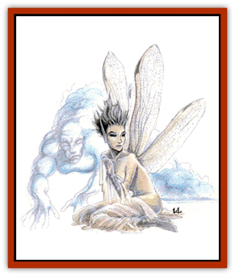
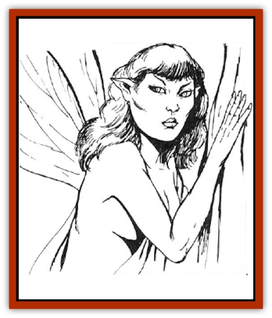

# Elemental - Air Kin

| Statistic | **Aerial Servant** | **Sylph** |
| --- | --- | --- |
| **Activity Cycle:** | Any | Any |
| **Alignment:** | Neutral | Neutral (good) |
| **Armor Class:** | 3 | 9 |
| **Climate/Terrain:** | Any (see below) | High altitudes or treetops |
| **Damage/Attack:** | 8-32 (8d4) | Nil |
| **Diet:** | Wind | Omnivore |
| **Frequency:** | Very rare | Very rare |
| **Hit Dice:** | 16 | 3 |
| **Intelligence:** | Semi- (2-4) | Exceptional (15-16) |
| **Magic Resistance:** | Nil | 50% |
| **Morale:** | Elite (14) | Elite (14) |
| **Movement:** | Fl 24 (A) | 12, Fl 36 (A) |
| **No. Appearing:** | 1 | 1 |
| **No. of Attacks:** | 1 | 0 |
| **Organization:** | Solitary | Solitary |
| **Size:** | L (8' tall) | M (4-5'  tall) |
| **Special Attacks:** | See below | See below |
| **Special Defenses:** | +1 or better weapon to hit | See below |
| **THAC0:** | 5 | 17 |
| **Treasure:** | Nil | Q&times;10,X |
| **XP Value:** | 9,000 | 2,000 |

Sylphs are beautiful, humanoid women with wings like dragonflies. Their wings are 4-5 feet long and translucent, clear, or spotted with iridescent color. Their long, bright, hair may be any "normal" color, or blue, purple, or green. They wear flowing, diaphanous robes which accent their wings or hair. Sylphs are related to [[Elemental_Air_Earth|air elementals]] and to [[Nymph|nymphs]], perhaps originating as a cross-breed between nymphs and [[Elemental_Air_Kin_Aerial_Servant|aerial servants]]. They speak Common and their own musical language.

Sylphs are friendly and may (20%) befriend adventurers and give them aid in exchange for a favor.

Sylphs speak Common and their own musical language.

**Combat:** Sylphs do not physically atack their opponents. Instead they employ a variety of magical abilities.

A sylph can cast spells as a 7th-level wizard, and most prefer spells of elemental air. In addition, the sylph can become invisible at will and summon an air elemental once each week.

**Habitat/Society:** Sylphs rarely touch ground in the lowlands. They are fond of travel, and it is rare to find one near its home.

Sylph nests are highly individualistic, some formed from whatever materials are available, others are elaborate retreats perched in tall trees or carved into mountains. Sylphs prefer simple and light possessions, keeping only gems and magical items as treasure. They often trade wealth for furnishings, such as light draperies, silks, and pillows.

There is a 1% chance that a sylph's home holds an egg or a child. All sylphs are female and mate with humanoid males, preferring [[Elf|elves]], but sometimes accepting a human or [[Halfling|halfling]] mate. Three months after conception, the sylph lays a pearly egg in a special nest, and summons an air elemental to guard it. Six months later, the egg hatches a baby girl with wing buds. The child grows at the same rate as a human child, gaining magical abilities at age five, and full flight by age 10.

The sylph has the innate ability to levitate; wings are needed only to provide thrust. If a sylph's wings are injured, it can only glide or hover. Anti-magical attacks may ground a sylph by negating its power of levitation. Sylphs live for up to 1,000 years, retaining their youthful looks throughout their lives.

Every 28 years, all sylphs gather in a grand meeting to trade, share news, renew friendships, and welcome young sylphs.

**Ecology:** Sylphs usually maintain their distance from the more mundane humanoid races, but associate freely with nymphs and [[Dryad|dryads]]. Aerial monsters occasionally feed on them, but they are in greater danger from evil humanoid males who attempt to capture them for dark purposes.

**Aerial Servant**

  This creature is a form of air elemental native to the plane of elemental Air, as well as the Ethereal and Astral planes, and can be summoned to the Prime Material plane by clerics.

Normally invisible, if seen on their home plane, they resemble legless humanoids of sparkling blue smoke, with empty eyes, a slash for a mouth, and long, four-fingered hands. [[Elemental_Air_Kin_Aerial_Servant|Aerial servants]] try to avoid combat on their native planes. It has a Strength of 23 and attacks by grabbing and strangling opponents, causing damage with the hit, and in each round, until the victim breaks free. A character with exceptional Strength receives a percentage chance equal to the percentage of exceptional Strength. Creatures with 18/00 Strength and above break free easily. Creatures with more hit points than the aerial servant can likewise break its grasp. Aerial servants penalize opponents surprise rolls by -5 when invisible.

A cleric who summons an aerial servant will be attacked unless behind a *protection from evil*, because the servants resent being summoned. Otherwise, the servant will complete any duty for the cleric, except fighting, as fast as possible. If the servant is prevented from completing its mission, it goes insane and returns to kill the summoning cleric.

Aerial servants are wanderers drawn to areas of extreme weather. If caught in a storm, there is a 5% chance it will be blown in two; this is the only way it can reproduce.

Aerial servants must feed on winds of their home planes at least once per month, or suffer 1d8 damage per day over 30 that they go without feeding.

---
## Discovery & Documentation

**Source Publication:** MC2 Volume II (1993)
**Campaign Setting:** Advanced Dungeons & Dragons 2nd Edition
**Author(s):** Jay Batista, Scott Bennie, Grant Boucher, William W. Connors, Steve Gilbert, Heike Kubasch, James Lowder, David Edward Martin, Bruce Nesmith, Jean Rabe, Rick Swan, John J. Terra, Gary L. Thomas

### Other Creatures Found in This Source Book
   * [[Ant|Ant]]
   * [[Ant_Lion_Giant|Ant Lion, Giant]]
   * [[Ape_Carnivorous|Ape, Carnivorous]]
   * [[Baboon|Baboon]]
   * [[Badger|Badger]]
   * [[Barracuda|Barracuda]]
   * [[Beetle_Giant|Beetle, Giant]]
   * [[Bulette|Bulette]]
   * [[Bullywug|Bullywug]]
   * [[Dwarf_Duergar|Dwarf, Duergar]]
   * [[Dwarf_Gully|Dwarf, Gully]]
   * [[Eagle|Eagle]]
   * [[Eel|Eel]]
   * [[Elemental_Water_Kin|Elemental, Water Kin]]
   * [[Elemental_Water_Kin_Water_Weird|Elemental, Water Kin, Water Weird]]
   * [[Firestar|Firestar]]
   * [[Firetail|Firetail]]
   * [[Fish_Giant|Fish, Giant]]
   * [[Frog|Frog]]
   * [[Gorgon|Gorgon]]
   * [[Hawk|Hawk]]
   * [[Heucuva|Heucuva]]
   * [[Hippocampus|Hippocampus]]
   * [[Hippogriff|Hippogriff]]
   * [[Kelpie|Kelpie]]
   * [[Kenku|Kenku]]
   * [[Killmoulis|Killmoulis]]
   * [[Kuo-Toa|Kuo-Toa]]
   * [[Lamia|Lamia]]
   * [[Lammasu|Lammasu]]
   * [[Lamprey|Lamprey]]
   * [[Leech|Leech]]
   * [[Leprechaun|Leprechaun]]
   * [[Leucrotta|Leucrotta]]
   * [[Locathah|Locathah]]
   * [[Lycanthrope_Wereboar|Lycanthrope, Wereboar]]
   * [[Lycanthrope_Werefox|Lycanthrope, Werefox]]
   * [[Mammal_Minimal|Mammal, Minimal]]
   * [[Mammal_Small|Mammal, Small]]
   * [[Mimic|Mimic]]
   * [[Morkoth|Morkoth]]
   * [[Muckdweller|Muckdweller]]
   * [[Myconid|Myconid]]
   * [[Naga|Naga]]
   * [[Obliviax|Obliviax]]
   * [[Octopus_Giant|Octopus, Giant]]
   * [[Otyugh|Otyugh]]
   * [[Piranha|Piranha]]
   * [[Plant_Dangerous_I|Plant, Dangerous I]]
   * [[Plant_Intelligent|Plant, Intelligent]]
   * [[Poltergeist|Poltergeist]]
   * [[Porcupine|Porcupine]]
   * [[Rat_Osquip|Rat, Osquip]]
   * [[Roc|Roc]]
   * [[Roper|Roper]]
   * [[Rot_Grub|Rot Grub]]
   * [[Rust_Monster|Rust Monster]]
   * [[Sahuagin|Sahuagin]]
   * [[Sea_Lion|Sea Lion]]
   * [[Sea_Horse_Giant|Sea Horse, Giant]]
   * [[Shambling_Mound|Shambling Mound]]
   * [[Shark|Shark]]
   * [[Sphinx|Sphinx]]
   * [[Squid_Giant|Squid, Giant]]
   * [[Stirge|Stirge]]
   * [[Swanmay|Swanmay]]
   * [[Tarrasque|Tarrasque]]
   * [[Tasloi|Tasloi]]
   * [[Triton|Triton]]
   * [[Troglodyte|Troglodyte]]
   * [[Urchin|Urchin]]
   * [[Urd|Urd]]
   * [[Weasel|Weasel]]
   * [[Wolverine|Wolverine]]
   * [[Yellow_Musk_Creeper|Yellow Musk Creeper]]
