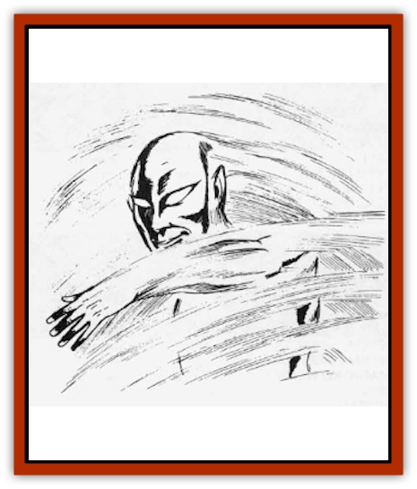

# Elemental - Air Kin - Aerial Servant

| Statistic | **Elemental, Air Kin, Aerial Servant** |
| --- | --- |
| **Activity Cycle:** | Any |
| **Alignment:** | Neutral |
| **Armor Class:** | 3 |
| **Climate/Terrain:** | Elemental Plane of Air, Astral Plane, Ethereal Plane |
| **Damage/Attack:** | 8-31 |
| **Diet:** | See below |
| **Frequency:** | Very rare |
| **Hit Dice:** | 16 |
| **Intelligence:** | Semi- (2-4) |
| **Magic Resistance:** | Nil |
| **Morale:** | Elite (14) |
| **Movement:** | Fl 24 (A) |
| **No. Appearing:** | 1 |
| **No. of Attacks:** | 1 |
| **Organization:** | Solitary |
| **Size:** | L (8' tall) |
| **Special Attacks:** | Surprise |
| **Special Defenses:** | +1 or better weapon to hit |
| **THAC0:** | 5 |
| **Treasure:** | Nil |
| **XP Value:** | 10,000 |

The aerial servant is a semi-intelligent form of an [[Elemental_Air_Earth|air elemental]] native to the elemental plane of air, the ethereal plane, and the astral plane. An encounter with an aerial servant in the prime material plane is usually the result of a conjuration by a cleric.

When encountered in the material plane, aerial servants normally are invisible. They are dimly visible in their native planes, resembling legless humanoids made of sparkling blue smoke. They have empty eye sockets, a thin slash for a mouth, and two long arms with large hands and four thick fingers.

**Combat:** An aerial servant generally avoids combat in its native planes. However, if attacked or threatened, it responds by attempting to grab and strangle its opponent. The aerial servant's first successful roll to hit means it has grabbed its victim; in each successive round that it holds its victim. the aerial servant, if it desires, automatically inflicts 8-32 hp of damage. An aerial servant is very strong and can easily carry weights in excess of 10,000 gold pieces. A character must have a Strength of 18 to have any chance of breaking free. For each percentage point score the character has, there is a like chance to break free of the aerial servant's grasp; for instance, a character with an 18/50% Strength has a 50% chance of breaking free, while a character with a 00% or 19 automatically breaks free. (If the grasped creature has no Strength rating, roll the appropriate number of the creature's Hit Dice and 16 HD for the aerial servant; if the creature's total is higher, it breaks free.)

An aerial servant in the command of a cleric will not fight for him, but will complete any other assigned duty, usually finding and returning an object or victim. If assigned to return a victims the aerial servant grabs the victim as described above. Additionally, those attacked by an aerial servant in the material plane have a -5 surprise modifier. If the summoning cleric does not protect himself by casting protection from evil or by standing inside a protective symbol, the aerial servant will attempt to crush and kill him. If the aerial servant is prevented from completing its assigned mission, it becomes insane, returns to the cleric, and attempts to kill him.

**Habitat/Society:** Aerial servants are not oganizd into families, communities, or any other social units. They do not collect treasure. Aerial servants pass the time by soaring on the elemental, astral, and ethereal wind, exploring the infinite mysteries of their native planes. As they have no permanent lairs, aerial servants have a virtually limitless range and are not tied to any specific territory. They are particularly drawn to areas of extreme weather, such as the ether cyclones of the ethereal plane (sinuous, serpentine columns of force), the psychic wind storms of the astral plane (hurricane-like areas of darkness), and the aerial maelstroms of the plane of elemental air (doughnut-shaped tornadoes). Generally, aerial servants are able to avoid the dangers of these phenomena. However, if a careless aerial servant is caught up in one of these storms, there is a 50% chance it will be blown in two, with each half becoming a separate aerial servant. This is the only way aerial servants reproduce, an extremely painful process the aerial servants strive to avoid.

Aerial servants will not voluntarily leave their home plane and have no interest in material plane affairs. They resent being summoned by clerics to the prime material plane and will attempt to complete their minions as soon as possible in order to return home.

**Ecology:** Aerial servants do not consume food for nourishment. Instead, they are refreshed and energized by being buffeted in the planar winds. Long periods of calm weather cause aerial servants to grow listless and weak. If an aerial servant is not exposed to a planar wind in excess of 30 miles per hour for 30 consecutive days, it risks suffering damage; beginning on day 31, it has a 10% chance per day of losing 1d8 hp. Aerial servants recover lost hit points at the rate of 1d8 per hour of being buffeted by planar winds in excess of 30 miles per hour. They are unaffected by winds of the prime material plane.

Aerial servants have no natural enemies. They rarely associate with other creatures, although they do have an affinity for air elementals, occasionally tagging along after them. However, air elementals avoid and discourage contact with aerial servants, considering them an inferior species.

---
## Discovery & Documentation

**Source Publication:** MC1 Volume I (w/binder #1) (1991)
**Campaign Setting:** Advanced Dungeons & Dragons 2nd Edition
**Author(s):** Jay Batista, Scott Bennie, Grant Boucher, William W. Connors, Steve Gilbert, Heike Kubasch, James Lowder, David Edward Martin, Bruce Nesmith, Jean Rabe, Rick Swan, John J. Terra, Gary L. Thomas

### Other Creatures Found in This Source Book
   * [[Bat|Bat]]
   * [[Bear|Bear]]
   * [[Behir|Behir]]
   * [[Boar|Boar]]
   * [[Bookworm|Bookworm]]
   * [[Brownie|Brownie]]
   * [[Bugbear|Bugbear]]
   * [[Carrion_Crawler|Carrion Crawler]]
   * [[Cat_Great|Cat, Great]]
   * [[Catoblepas|Catoblepas]]
   * [[Dragon_General_Information|Dragon, General Information]]
   * [[Dragonfish|Dragonfish]]
   * [[Elemental_Earth_Kin_Sandling|Elemental, Earth Kin, Sandling]]
   * [[Elephant|Elephant]]
   * [[Gnoll|Gnoll]]
   * [[Hobgoblin|Hobgoblin]]
   * [[Homunculus|Homunculus]]
   * [[Hornet_Giant|Hornet, Giant]]
   * [[Horse|Horse]]
   * [[Hyena|Hyena]]
   * [[Jackal|Jackal]]
   * [[Jackalwere|Jackalwere]]
   * [[Korred|Korred]]
   * [[Lich|Lich]]
   * [[Lizard|Lizard]]
   * [[Lizard_Man|Lizard Man]]
   * [[Lycanthrope_General_Information|Lycanthrope, General Information]]
   * [[Lycanthrope_Seawolf|Lycanthrope, Seawolf]]
   * [[Lycanthrope_Werebear|Lycanthrope, Werebear]]
   * [[Lycanthrope_Weretiger|Lycanthrope, Weretiger]]
   * [[Lycanthrope_Werewolf|Lycanthrope, Werewolf]]
   * [[Manticore|Manticore]]
   * [[Medusa|Medusa]]
   * [[Mind_Flayer|Mind Flayer]]
   * [[Minotaur|Minotaur]]
   * [[Mudman|Mudman]]
   * [[Mummy|Mummy]]
   * [[Nixie|Nixie]]
   * [[Nymph|Nymph]]
   * [[Ogre|Ogre]]
   * [[Ooze_Slime_Jelly_I|Ooze/Slime/Jelly I]]
   * [[Ooze_Slime_Jelly_II|Ooze/Slime/Jelly II]]
   * [[Orc|Orc]]
   * [[Owl|Owl]]
   * [[Owlbear_I|Owlbear I]]
   * [[Pegasus|Pegasus]]
   * [[Piercer|Piercer]]
   * [[Pudding_Deadly|Pudding, Deadly]]
   * [[Rakshasa|Rakshasa]]
   * [[Rat|Rat]]
   * [[Ray|Ray]]
   * [[Remorhaz|Remorhaz]]
   * [[Satyr|Satyr]]
   * [[Scorpion|Scorpion]]
   * [[Selkie|Selkie]]
   * [[Shadow|Shadow]]
   * [[Skeleton|Skeleton]]
   * [[Skunk|Skunk]]
   * [[Snake|Snake]]
   * [[Spectre|Spectre]]
   * [[Spider|Spider]]
   * [[Sprite|Sprite]]
   * [[Toad_Giant|Toad, Giant]]
   * [[Treant|Treant]]
   * [[Troll|Troll]]
   * [[Umber_Hulk|Umber Hulk]]
   * [[Unicorn|Unicorn]]
   * [[Vampire|Vampire]]
   * [[Wight|Wight]]
   * [[Will_O'Wisp|Will O'Wisp]]
   * [[Wolf|Wolf]]
   * [[Wolfwere|Wolfwere]]
   * [[Wraith|Wraith]]
   * [[Wyvern|Wyvern]]
   * [[Yeti|Yeti]]
   * [[Yuan-ti|Yuan-ti]]
   * [[Zombie|Zombie]]
