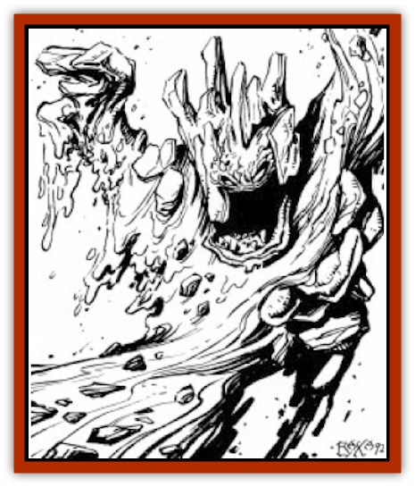
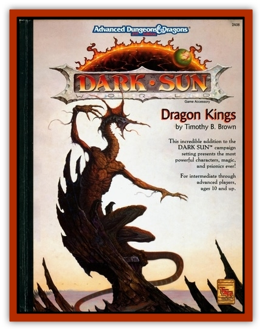

# Elemental - Athas - Clerical

| Statistic | **Elemental (Athas), Clerical** |
| --- | --- |
| **Activity Cycle:** | Any |
| **Alignment:** | Varies |
| **Armor Class:** | Varies |
| **Climate/Terrain:** | Any |
| **Damage/Attack:** | Varies |
| **Diet:** | Omnivore |
| **Frequency:** | Very rare |
| **Hit Dice:** | Varies |
| **Intelligence:** | Varies |
| **Magic Resistance:** | Varies |
| **Morale:** | Champion (15-16) |
| **Movement:** | Varies |
| **No. Appearing:** | 1 |
| **No. of Attacks:** | Varies |
| **Organization:** | Solitary |
| **Size:** | Varies |
| **Special Attacks:** | See below |
| **Special Defenses:** | See below |
| **THAC0:** | Varies |
| **Treasure:** | Varies |
| **XP Value:** | Varies |

A human dual-classed cleric/psionicist who attains 20th level can choose to pursue a strange and mysterious path that ultimately transforms him into an elemental being of tremendous power. Once the cleric begins this alteration, he can never stop it. Only his death prevents him from becoming an elemental being.

The elemental form taken is that of the original cleric's focus of worship. Thus, an earth cleric transforms to an earth elemental, an air cleric to an air elemental, etc. The disciplines necessary to specialize in one form of elemental magic prohibits crossover from one elemental form to another. During the transformation process, clerical elementals can switch between human and elemental forms. They do not age in elemental form, but they continue to age in human form. A character who reaches elemental form at 30th level can no longer switch and becomes permanently fixed in elemental form.

**Combat:** A cleric of this power in human form retains the abilities that he had prior to his journey along the road to transformation. Thus, he may cast spells and employs psionic powers as a 20th-level cleric. Any magical items or similar abilities that the cleric had are retained as well.

In elemental form, an individual of this type has the abilities and statistics of either a [[Elemental_General_Information|standard elemental]] or a [[Elemental_Athas_General_Information|greater elemental]]. In elemental form, the cleric has access to the spells and psionic powers that he had prior to the transformation, but he gains no benefits from any form of magical object. All abilities are now based on the elemental entry appropriate to the character's level as presented on the table at the end of this entry.

Each time the cleric assumes elemental form, its Hit Dice are rolled anew. As the creature attains greater levels of power, the cleric is entitled to Hit Die re-rolls for certain numbers. For example, an elemental cleric rolls 10 Hit Dice and has rerolls on 1, 2, and 3. Assume that ten 8-sided dice give rolls of 1,2,2,3,4,5,5,6,8, and 8. The four dice that rolled 1,2,2, and 3 are re-rolled until they don't read 1, 2, or 3. If they finally came up 4, 5, 6, and 7, the elemental.s hit points would total 58. See the table at the end of this entry for details.

Damage taken in either of the cleric's forms is erased after transformation. A cleric who is wounded down to 1 hit point in human form rolls completely new hit points for the elemental form. When he returns to human form, he is completely healed of damage. If the cleric is ever reduced to 0 hp in either form, of course, he dies.

Normally, an elemental cleric cannot be summoned, though he can be controlled, and that control can be stolen. When summoning spells are employed, other, less-willful elementals from the appropriate plane answer the call. A special spell could be researched to summon a specific elemental, even an elemental cleric, but such magic does not presently exist - the spell would have to be created under the rules governing magical research.

Devices that can control or govern the actions of elementals can affect clerics. Only magical items can control elemental clerics. Four of the most common means of gaining control over an elemental cleric are the *bowl commanding water elementals*, *brazier commending fire elementals*, *censer controlling air elementals*, and *stone of controlling earth elementals*. When properly employed, these devices can control an elemental cleric of the appropriate type. The cleric gets a saving throw to ignore the effects. Otherwise, it is controlled, just as described in the Monstrous Compendiums. Once freed, the cleric can attack or ignore the controller as desired.

A *ring of elemental command* attuned to the cleric's elemental plane can be used to full effect against the cleric. The affected cleric can be *held* at a 5' distance or even *charmed*.

A *scroll of protection - elementals* works against elemental clerics just as noted in the DMG.

As an elemental cleric gains power, it learns the ability to summon lesser and standard elementals. The first of these new powers, *conjure lesser elemental*, is identical to the spell of the same name presented in the Monstrous Compendium, *Dark Sun* Appendix. Eventually, the cleric gains the special ability, *conjure elemental*, identical to the spell of the same name in the *Dark Sun* Rules Book. The number of times that these powers can be used per day appears on the table at the end of this entry.

These conjured elementals need not be controlled, nor can their control be stolen from the elemental cleric. They obey the cleric's every thought while on the Prime Material plane.

**Habitat/Society:** The most potent of elemental clerics are powerful enough in their own right to be important personages on their elemental plane. Therefore, from time to time, their services are called for on those planes, and they must return there until their business is concluded.

**Ecology:** An elemental cleric.s transformation is quite different from that of other advanced beings. The cleric can attain full elemental form even at the lowest levels, though only for a limited time. The time the cleric can spend as an elemental and his relative power increase as he becomes more solidly anchored to his chosen elemental plane. At any given time, the cleric will either be fully elemental or fully human. Since there is no gradual change between the two forms, it is not termed a metamorphosis, but rather a transformation.

An elemental cleric must assume elemental form exactly once per day. Less-powerful elemental clerics retain human form for all but a short period during a day. More powerful elemental clerics only retain human form for half the day or less. The most powerful clerics abandon human form altogether.

The cleric may decide when during the day to take on his elemental form. For this purpose, a game day begins and ends at midnight. If the cleric fails to decide, his body transforms at the last moment possible. For instance, an cleric who must assume elemental form for two hours a day but hasn't transformed earlier changes two hours before midnight. The transformation takes one round, during which time the cleric's body takes on an ethereal form. Only weapons that can affect ethereal bodies can harm him. Successful attacks at this time use his human characteristics (Armor Class, hit points, etc.) The elemental cannot act or defend while transforming.

The cleric cannot control his transformation back into human form. It takes place after the cleric has spent the entire required duration in elemental form. The transformation takes one complete round, during which time the cleric cannot act. The cleric takes on ethereal form for the round, so attacks that don.t reach into the Ethereal plane cannot harm him. Those attacks that can do so affect his elemental form (Hit Dice, Armor Class, magical resistance, etc.). As with the transformation into elemental form, the cleric cannot defend himself while in flux. Once the transformation is complete, the cleric reverts to his full human hit points.

| Lvl | Hit Dice/Variety | HD Re-rolls | Time | Summons |
| --- | --- | --- | --- | --- |
| 21 | 8 HD Standard | - | 1 turn | - |
| 22 | 12 HD Standard | - | 3 turns | - |
| 23 | 12 HD Standard | - | 1 hour | - |
| 24 | 16 HD Standard | 1,2 | 2 hours | - |
| 25 | 16 HD Standard | 1,2 | 4 hours | - |
| 26 | 10 HD Greater | 1,2,3 | 6 hours | Lesser (1) |
| 27 | 10 HD Greater | 1,2,3 | 8 hours | Lesser (2) |
| 28 | 14 HD Greater | 1,2,3,4 | 12 hours | Lesser (3) |
| 29 | 14 HD Greater | 1,2,3,4 | 16 hours | Standard (1) |
| 30 | 18 HD Greater | 1,2,3,4 | 24 hours | Standard (3) |

Lvl indicates the level of the Cleric.
Hit Dice/Variety indicates the exact type of elemental form that the cleric will assume upon transformation.
HD Re-rolls indicates Hit Dice roll results that may be re-rolled when generating the elemental form's hit points.
Time is the length of time that the Cleric must remain in elemental form following transformation.
Summons indicates the type of elementals that may be summoned while in elemental form. The number in parentheses indicates the times per day this ability can be used.

---
## Discovery & Documentation

**Source Publication:** Dragon Kings (hardback) (1992)
**Campaign Setting:** Dark Sun
**Author(s):** Timothy B. Brown

### Other Creatures Found in This Source Book
   * [[Avangion|Avangion]]
   * [[Dragon_Athas|Dragon (Athas)]]
