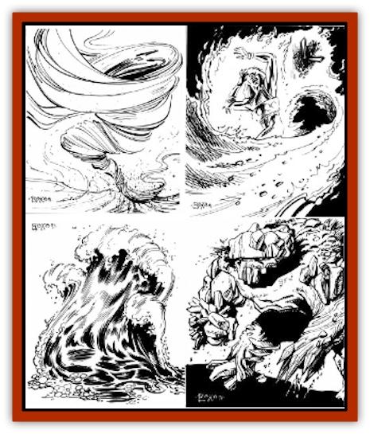

# Elemental - Athas - General Information

Worshipped and revered by priests across Athas, elementals represent the quintessential aspect of the known elements: air, earth, fire, and water. The four elementals represent the forces that shape the everyday lives of the inhabitants of the beleaguered planet. Air represents the act of living, as a child gulps it when first entering the world, and a dying man exhales it is as his last act before death. Water is life itself, always in need and never taken for granted. Earth represents the world, always changing, always harsh, but dependably always there. Fire represents the heat of the sun, the burning desert, and all that was lost.

On Athas, elementals come in three distinct varieties: lesser, "standard", and greater.

**Psionics and Athasian Elementals:** All Athasian elementals, greater, lesser, or standard, are completely immune to the effect of psionic abilities of the Telepathy, Psychometabolism, Clairsentience, and Metapsionic disciplines. They are however, normally affected by psionic powers of the Telekinesis and Psychoportive disciplines. Their extremely low intelligence prevents them from using any psionic powers, and their extraplanar nature grants them absolute resistance to telepathic abilities of psionic creatures from the Prime Material Plane.

## Lesser Elementals

The presence of elementals tends to inspire awe in the general populous of Athas as they look on the magical creatures with a sense of wonder and respect. The first elementals that a priest will be able to summon are the weaker lesser elementals. Clerics who obtain the power to summon these elementals are generally treated with more respect than younger acolytes who have yet to master the ability. Templars rightfully see this power as a direct threat to their own. Because of the conflict the summoning of elementals is banned in many cities.

If called on by a priest, the lesser elemental arrives to serve him. When an elemental is successfully conjured/summoned, the being is (sometimes unwillingly) pulled across the planes to the place of the conjurer/summoner.

Very little is known about the life, habits, or function of lesser elementals when they are in their home elemental planes. Those who have magically communicated with elementals say that they describe their homes as wonderful, yet at times, terrifying places. Many elemental worshippers have sought to cross over into their elemental planes of worship to escape life on Athas. Of those who "disappeared" to that end, none were ever heard from again; it is unknown if they were successful or not in their "crossing".

Lesser elementals are extremely vulnerable to the magic of defilers. When a defiler casts a spell to damage an elemental, the elemental is affected by the spell as if the caster were 5 experience levels higher than he actually is. In addition, if the elemental is within the area of destruction of a defiler spell, that elemental is immediately destroyed.

Not as powerful as their standard elemental brethren, lesser elementals can be harmed by any magical weapon of +1 enchantment or better. Creatures with under two hit dice and without any magical abilities cannot harm a lesser elemental. Lesser elementals are affected by *protection from evil* spells just like standard elementals. Lesser elementals are just as intelligent as standard elementals, which is to say, not very.

**Summoning a Lesser Elemental:** There are two ways to call a lesser elemental to the prime material plane, and the strength of the conjured lesser elemental depends on the method used to summon it:

<ul><li>Conjured by spell: 2, 4, or 6 Hit Dice</li><li>Conjured by staff: 6 Hit Dice</li></ul>Summoning devices always call standard elementals, never lesser elementals.

**Controlling a Lesser Elemental:** Regardless of its origins, a lesser elemental is severely restricted in its movements and actions. [[Elemental_Athas_Lesser_Air_Earth|Lesser air elementals]] cannot enter earth. They do only half damage against underground creatures. [[Elemental_Athas_Lesser_Air_Earth|Lesser earth elementals]] cannot enter or cross water, They do half damage to air-borne or waterborne creatures. [[Elemental_Athas_Lesser_Fire_Water|Lesser fire elementals]] cannot enter earth or water, nor may they cross water. [[Elemental_Athas_Lesser_Fire_Water|Lesser water elementals]] cannot enter or cross fire.

**Stealing Control of a Lesser Elemental:** Control of a lesser elemental can be stolen in the same manner as for standard elementals - through a *dispel magic* spell. On a roll of 20, the lesser elemental assumes a defensive posture only. If the *dispel magic* fails, the lesser elemental acts as a standard elemental in the same situation.

## Standard Elementals

On Athas, standard elementals are exactly like those presented in [[Elemental_General_Information|this entry]] (and the following entries for [[Elemental_Air_Earth|Air/Earth]] and [[Elemental_Fire_Water|Fire/Water Elementals]]. They can be summoned, controlled, and stolen just as described there.

Standard elementals are vulnerable to the magic of defilers. When a defiler casts a spell to damage an elemental, the elemental is affected by the spell as if the caster were 3 experience levels higher than he actually is. In addition, if the elemental is within the area of destruction of the defiler spell, it suffers 1d20 points of damage. When used against an elemental, defiler magic also increases the chances of the elemental breaking free of its control. Each time an elemental is affected by a defiler spell, the chance for it to break free of its control increases by 10%. This increase is in addition to the normal 5% chance per round. If and when an elemental succeeds in breaking free of its control, after attacking the being who summoned it, it will attack the defiler next.

## Greater Elementals

Though each of the four elemental types has it own particular strengths and weaknesses, and these will be discussed individually on the next few pages, all greater elementals share some common abilities. Due to their magical nature, greater elementals are very resistant to attacks made against them on the Prime Material plane. Greater elementals cannot be harmed by any nonmagical weapon, or magical weapons of less than +3 enchantment. In addition, creatures of less than 5 Hit Dice without any magical abilities are unable to harm elementals of Athas.

Being extra-planar creatures, they are also strongly affected by *protection from evil* spells, and cannot strike any creature protected by this spell. Further, elementals will recoil from the boundaries of this spell's area of effect.

Because they are the embodiment of the four elements worshipped by the priests of Athas, greater elementals have a fair degree of magic resistance, but only against spells cast by priests. All greater elementals have 50% magic resistance to priest spells from the sphere of their element, and 25% resistance to spells from all other spheres. A [[Elemental_Athas_Greater_Earth|greater earth elemental]], for example, would have 50% magic resistance to spells from the earth sphere and 25% resistance to the spells from the air, fire, water, and cosmos spheres.

While they are particularly resistant to priest magic, greater elementals are vulnerable to the magic of defilers. When a defiler casts a spell to damage a greater elemental, it is affected by the spell as if the caster were 2 experience levels higher than he actually is. In addition, if the greater elemental is within the area of destruction of the defiler spell, it suffers 1d10 additional points of damage. When used against an elemental, defiler magic also increases the chances of the elemental breaking free of its control. Each time an elemental is affected by a defiler spell, the chance for it to break free of its control increases by 10%. This increase is in addition to the normal 5% chance per round. If and when an elemental succeeds in breaking free of its control, after attacking the being who summoned it, it will attack the defiler next.

All greater elementals share one other characteristic. They are all basically stupid. Their low intelligence prevents them from resisting a magical summons, though they are able to resist the summons of a defiler (see below). Despite their limited intelligence, all elementals resent being taken from their homes planes and held in the Prime Material Plane.

**Summoning a Greater Elemental:** Athasian elementals are summoned and controlled in the same manner described in the basic [[Elemental_General_Information|Elemental]] entry, except that they are most often summoned by preserver mages. The destructive nature of defiler magic weakens the magical summons and allows the elemental spirit to more easily resist it. When a defiler mage attempts to summon an elemental, the DM should make two saving throws vs. spells for the elemental. If the first save fails, the elemental is summoned; it then makes its second saving throw. If this save is failed, the elemental will obey its summoner. If the elemental makes the second save, it is uncontrolled and turns on the defiler. If the first save is successful, the elemental has resisted the summons altogether and needn.t make the second. Thus, sorcerer-kings suffer tremendous risk summoning elementals, while their Templars can do so without difficulty.

**Controlling a Greater Elemental:** A greater elemental must be controlled in exactly the same manner as a standard elemental.

**Stealing Control of an Greater Elemental:** A greater elemental can be stolen in exactly the same manner as a standard elemental.

## Character Elementals

Exceptionally powerful clerics can become character elementals as a form of advanced being. While character elementals are in many ways identical to the Athasian elementals described here, the rules for summoning, controlling, and stealing them are far different. Consult Dragon Kings (TSR 2408) for complete information on character elementals.

---
## Discovery & Documentation

**Source Publication:** Monstrous Manual (1995)
**Campaign Setting:** Advanced Dungeons & Dragons 2nd Edition
**Author(s):** Tim Beach

### Other Creatures Found in This Source Book
   * [[Aarakocra|Aarakocra]]
   * [[Aboleth|Aboleth]]
   * [[Ankheg|Ankheg]]
   * [[Arcane|Arcane]]
   * [[Argos|Argos]]
   * [[Aurumvorax|Aurumvorax]]
   * [[Baatezu_Lesser_Abishai|Baatezu, Lesser, Abishai]]
   * [[Baatezu_General_Information|Baatezu, General Information]]
   * [[Baatezu_Greater_Pit_Fiend|Baatezu, Greater, Pit Fiend]]
   * [[Banshee|Banshee]]
   * [[Basilisk|Basilisk]]
   * [[Bat|Bat]]
   * [[Bear|Bear]]
   * [[Beetle_Giant|Beetle, Giant]]
   * [[Behir|Behir]]
   * [[Beholder_and_Beholder-kin_I|Beholder and Beholder-kin I]]
   * [[Beholder_and_Beholder-kin_II|Beholder and Beholder-kin II]]
   * [[Bird|Bird]]
   * [[Brain_Mole|Brain Mole]]
   * [[Broken_One|Broken One]]
   * [[Brownie|Brownie]]
   * [[Bugbear|Bugbear]]
   * [[Bulette|Bulette]]
   * [[Bullywug|Bullywug]]
   * [[Carrion_Crawler|Carrion Crawler]]
   * [[Cat_Great|Cat, Great]]
   * [[Catoblepas|Catoblepas]]
   * [[Cat_Small|Cat, Small]]
   * [[Cave_Fisher|Cave Fisher]]
   * [[Centaur|Centaur]]
   * [[Centipede|Centipede]]
   * [[Chimera|Chimera]]
   * [[Cloaker|Cloaker]]
   * [[Cockatrice|Cockatrice]]
   * [[Couatl|Couatl]]
   * [[Crabman|Crabman]]
   * [[Crawling_Claw|Crawling Claw]]
   * [[Crocodile|Crocodile]]
   * [[Crustacean_Giant|Crustacean, Giant]]
   * [[Crypt_Thing|Crypt Thing]]
   * [[Death_Knight|Death Knight]]
   * [[Deepspawn|Deepspawn]]
   * [[Dinosaur_I|Dinosaur I]]
   * [[Displacer_Beast|Displacer Beast]]
   * [[Dog|Dog]]
   * [[Dog_Moon|Dog, Moon]]
   * [[Dolphin|Dolphin]]
   * [[Doppelganger|Doppelganger]]
   * [[Dracolich|Dracolich]]
   * [[Dragon_Brown|Dragon, Brown]]
   * [[Dragon_Chromatic_Black|Dragon, Chromatic, Black]]
   * [[Dragon_Chromatic_Blue|Dragon, Chromatic, Blue]]
   * [[Dragon_Chromatic_Green|Dragon, Chromatic, Green]]
   * [[Dragon_Cloud|Dragon, Cloud]]
   * [[Dragon_Chromatic_Red|Dragon, Chromatic, Red]]
   * [[Dragon_Chromatic_White|Dragon, Chromatic, White]]
   * [[Dragon_Deep|Dragon, Deep]]
   * [[Dragon_Gem_Amethyst|Dragon, Gem, Amethyst]]
   * [[Dragon_Gem_Crystal|Dragon, Gem, Crystal]]
   * [[Dragon_Gem_Emerald|Dragon, Gem, Emerald]]
   * [[Dragon_Gem_Sapphire|Dragon, Gem, Sapphire]]
   * [[Dragon_Gem_Topaz|Dragon, Gem, Topaz]]
   * [[Dragon_Metallic_Brass|Dragon, Metallic, Brass]]
   * [[Dragon_Metallic_Bronze|Dragon, Metallic, Bronze]]
   * [[Dragon_Metallic_Copper|Dragon, Metallic, Copper]]
   * [[Dragon_Mercury|Dragon, Mercury]]
   * [[Dragon_Metallic_Gold|Dragon, Metallic, Gold]]
   * [[Dragon_Mist|Dragon, Mist]]
   * [[Dragon_Metallic_Silver|Dragon, Metallic, Silver]]
   * [[Dragon_General_Information|Dragon, General Information]]
   * [[Dragon_Shadow|Dragon, Shadow]]
   * [[Dragon_Steel|Dragon, Steel]]
   * [[Dragon_Yellow|Dragon, Yellow]]
   * [[Dragonne|Dragonne]]
   * [[Dragon_Turtle|Dragon Turtle]]
   * [[Dragonet_Faerie_Dragon|Dragonet, Faerie Dragon]]
   * [[Dragonet_Fire_Drake|Dragonet, Fire Drake]]
   * [[Dragonet_Pseudodragon|Dragonet, Pseudodragon]]
   * [[Dryad|Dryad]]
   * [[Dwarf_Derro|Dwarf, Derro]]
   * [[Dwarf|Dwarf]]
   * [[Elemental_Air_Kin|Elemental, Air Kin]]
   * [[Elemental_Earth_Kin|Elemental, Earth Kin]]
   * [[Elemental_Fire_Kin|Elemental, Fire Kin]]
   * [[Elemental_Water_Kin|Elemental, Water Kin]]
   * [[Elemental_of_Chaos_Air_Earth|Elemental of Chaos, Air/Earth]]
   * [[Elemental_of_Chaos_Fire_Water|Elemental of Chaos, Fire/Water]]
   * [[Elemental_Composite|Elemental, Composite]]
   * [[Elemental_Air_Earth|Elemental, Air/Earth]]
   * [[Elemental_Fire_Water|Elemental, Fire/Water]]
   * [[Elemental_General_Information|Elemental, General Information]]
   * [[Elephant|Elephant]]
   * [[Elf|Elf]]
   * [[Elf_Aquatic|Elf, Aquatic]]
   * [[Elf_Drow|Elf, Drow]]
   * [[Ettercap|Ettercap]]
   * [[Eyewing|Eyewing]]
   * [[Feyr|Feyr]]
   * [[Fish|Fish]]
   * [[Frog|Frog]]
   * [[Fungus|Fungus]]
   * [[Galeb_Duhr|Galeb Duhr]]
   * [[Gargantua|Gargantua]]
   * [[Gargoyle_I|Gargoyle I]]
   * [[Genie|Genie]]
   * [[Ghost|Ghost]]
   * [[Ghoul|Ghoul]]
   * [[Giant_Cloud|Giant, Cloud]]
   * [[Giant_Cyclops|Giant, Cyclops]]
   * [[Giant_Desert|Giant, Desert]]
   * [[Giant_Ettin|Giant, Ettin]]
   * [[Giant_Firbolg|Giant, Firbolg]]
   * [[Giant_Fire|Giant, Fire]]
   * [[Giant_Fog|Giant, Fog]]
   * [[Giant_Fomorian|Giant, Fomorian]]
   * [[Giant_Frost|Giant, Frost]]
   * [[Giant_Hill|Giant, Hill]]
   * [[Giant_Jungle|Giant, Jungle]]
   * [[Giant_Mountain|Giant, Mountain]]
   * [[Giant_Reef|Giant, Reef]]
   * [[Giant_Stone|Giant, Stone]]
   * [[Giant_Storm|Giant, Storm]]
   * [[Giant_Verbeeg|Giant, Verbeeg]]
   * [[Giant_Wood|Giant, Wood]]
   * [[Gibberling|Gibberling]]
   * [[Giff|Giff]]
   * [[Gith|Gith]]
   * [[Gith_Pirate_of|Gith, Pirate of]]
   * [[Githyanki|Githyanki]]
   * [[Githzerai|Githzerai]]
   * [[Gloomwing|Gloomwing]]
   * [[Gnoll|Gnoll]]
   * [[Gnome|Gnome]]
   * [[Gnome_Spriggan|Gnome, Spriggan]]
   * [[Goblin|Goblin]]
   * [[Golem_General_Information|Golem, General Information]]
   * [[Golem_I_Greater_Golem|Golem I (Greater Golem)]]
   * [[Golem_II_Lesser_Golem|Golem II (Lesser Golem)]]
   * [[Golem_III|Golem III]]
   * [[Golem_IV|Golem IV]]
   * [[Golem_V|Golem V]]
   * [[Golem_VI_Stone_Variants|Golem VI (Stone Variants)]]
   * [[Gorgon|Gorgon]]
   * [[Grell_Colonial|Grell, Colonial]]
   * [[Gremlin_Jermlaine|Gremlin, Jermlaine]]
   * [[Gremlin|Gremlin]]
   * [[Griffon|Griffon]]
   * [[Grimlock|Grimlock]]
   * [[Grippli|Grippli]]
   * [[Hag|Hag]]
   * [[Halfling|Halfling]]
   * [[Harpy|Harpy]]
   * [[Hatori|Hatori]]
   * [[Haunt|Haunt]]
   * [[Hell_Hound|Hell Hound]]
   * [[Heucuva|Heucuva]]
   * [[Hippocampus|Hippocampus]]
   * [[Hippogriff|Hippogriff]]
   * [[Hobgoblin|Hobgoblin]]
   * [[Homunculus|Homunculus]]
   * [[Hook_Horror|Hook Horror]]
   * [[Horse|Horse]]
   * [[Human|Human]]
   * [[Hydra|Hydra]]
   * [[Imp|Imp]]
   * [[Insect_Giant|Insect, Giant]]
   * [[Insect_Swarm|Insect Swarm]]
   * [[Intellect_Devourer|Intellect Devourer]]
   * [[Invisible_Stalker|Invisible Stalker]]
   * [[Ixitxachitl|Ixitxachitl]]
   * [[Jackalwere|Jackalwere]]
   * [[Kenku|Kenku]]
   * [[Ki-rin|Ki-rin]]
   * [[Kirre|Kirre]]
   * [[Kobold|Kobold]]
   * [[Kuo-Toa|Kuo-Toa]]
   * [[Lamia|Lamia]]
   * [[Lammasu|Lammasu]]
   * [[Leech|Leech]]
   * [[Leprechaun|Leprechaun]]
   * [[Leucrotta|Leucrotta]]
   * [[Lich|Lich]]
   * [[Living_Wall|Living Wall]]
   * [[Lizard|Lizard]]
   * [[Lizard_Man|Lizard Man]]
   * [[Locathah|Locathah]]
   * [[Lurker|Lurker]]
   * [[Lycanthrope_General_Information|Lycanthrope, General Information]]
   * [[Lycanthrope_Seawolf|Lycanthrope, Seawolf]]
   * [[Lycanthrope_Werebear|Lycanthrope, Werebear]]
   * [[Lycanthrope_Wereboar|Lycanthrope, Wereboar]]
   * [[Lycanthrope_Werebat|Lycanthrope, Werebat]]
   * [[Lycanthrope_Werefox|Lycanthrope, Werefox]]
   * [[Lycanthrope_Wererat|Lycanthrope, Wererat]]
   * [[Lycanthrope_Wereraven|Lycanthrope, Wereraven]]
   * [[Lycanthrope_Weretiger|Lycanthrope, Weretiger]]
   * [[Lycanthrope_Werewolf|Lycanthrope, Werewolf]]
   * [[Mammal|Mammal]]
   * [[Mammal_Giant|Mammal, Giant]]
   * [[Mammal_Herd_I|Mammal, Herd I]]
   * [[Mammal_Small|Mammal, Small]]
   * [[Manscorpion|Manscorpion]]
   * [[Manticore|Manticore]]
   * [[Medusa_Maedar|Medusa, Maedar]]
   * [[Medusa|Medusa]]
   * [[Mephit_General_Information|Mephit, General Information]]
   * [[Merman|Merman]]
   * [[Mimic|Mimic]]
   * [[Mind_Flayer|Mind Flayer]]
   * [[Minotaur|Minotaur]]
   * [[Mist_Crimson_Death|Mist, Crimson Death]]
   * [[Mist_Vampiric|Mist, Vampiric]]
   * [[Mold_I|Mold I]]
   * [[Moldman|Moldman]]
   * [[Mongrelman|Mongrelman]]
   * [[Morkoth|Morkoth]]
   * [[Muckdweller|Muckdweller]]
   * [[Mudman|Mudman]]
   * [[Mummy_Greater|Mummy, Greater]]
   * [[Mummy|Mummy]]
   * [[Myconid|Myconid]]
   * [[Naga|Naga]]
   * [[Naga_Dark|Naga, Dark]]
   * [[Neogi|Neogi]]
   * [[Nightmare|Nightmare]]
   * [[Nymph|Nymph]]
   * [[Octopus_Giant|Octopus, Giant]]
   * [[Ogre|Ogre]]
   * [[Ogre_Half-|Ogre, Half-]]
   * [[Ooze_Slime_Jelly_I|Ooze/Slime/Jelly I]]
   * [[Ooze_Slime_Jelly_II|Ooze/Slime/Jelly II]]
   * [[Ooze_Slime_Jelly_Slithering_Tracker|Ooze/Slime/Jelly, Slithering Tracker]]
   * [[Orc|Orc]]
   * [[Otyugh|Otyugh]]
   * [[Owlbear_I|Owlbear I]]
   * [[Pegasus|Pegasus]]
   * [[Peryton|Peryton]]
   * [[Phantom|Phantom]]
   * [[Phoenix|Phoenix]]
   * [[Piercer|Piercer]]
   * [[Plant_Dangerous_I|Plant, Dangerous I]]
   * [[Plant_Intelligent|Plant, Intelligent]]
   * [[Poltergeist|Poltergeist]]
   * [[Pudding_Deadly|Pudding, Deadly]]
   * [[Quaggoth|Quaggoth]]
   * [[Rakshasa|Rakshasa]]
   * [[Rat|Rat]]
   * [[Rat_Osquip|Rat, Osquip]]
   * [[Remorhaz|Remorhaz]]
   * [[Revenant|Revenant]]
   * [[Roc|Roc]]
   * [[Roper|Roper]]
   * [[Rust_Monster|Rust Monster]]
   * [[Sahuagin|Sahuagin]]
   * [[Satyr|Satyr]]
   * [[Scorpion|Scorpion]]
   * [[Sea_Lion|Sea Lion]]
   * [[Selkie|Selkie]]
   * [[Shadow|Shadow]]
   * [[Shedu|Shedu]]
   * [[Sirine|Sirine]]
   * [[Skeleton|Skeleton]]
   * [[Skeleton_Giant|Skeleton, Giant]]
   * [[Skeleton_Warrior|Skeleton, Warrior]]
   * [[Slaad|Slaad]]
   * [[Slug_Giant|Slug, Giant]]
   * [[Snake|Snake]]
   * [[Snake_Winged|Snake, Winged]]
   * [[Spectre|Spectre]]
   * [[Sphinx|Sphinx]]
   * [[Spider|Spider]]
   * [[Sprite|Sprite]]
   * [[Squid_Giant|Squid, Giant]]
   * [[Stirge|Stirge]]
   * [[Su-Monster|Su-Monster]]
   * [[Swanmay|Swanmay]]
   * [[Tabaxi|Tabaxi]]
   * [[Tako|Tako]]
   * [[Tanar'ri_True_Balor|Tanar'ri, True, Balor]]
   * [[Tanar'ri_True_Marilith|Tanar'ri, True, Marilith]]
   * [[Tarrasque|Tarrasque]]
   * [[Tasloi|Tasloi]]
   * [[Thought_Eater|Thought Eater]]
   * [[Thri-kreen|Thri-kreen]]
   * [[Titan|Titan]]
   * [[Toad_Giant|Toad, Giant]]
   * [[Treant|Treant]]
   * [[Triton|Triton]]
   * [[Troglodyte|Troglodyte]]
   * [[Troll|Troll]]
   * [[Umber_Hulk|Umber Hulk]]
   * [[Unicorn|Unicorn]]
   * [[Urchin|Urchin]]
   * [[Vampire|Vampire]]
   * [[Wemic|Wemic]]
   * [[Whale|Whale]]
   * [[Wight|Wight]]
   * [[Will_O'Wisp|Will O'Wisp]]
   * [[Wolf|Wolf]]
   * [[Wolfwere|Wolfwere]]
   * [[Worm|Worm]]
   * [[Wraith|Wraith]]
   * [[Wyvern|Wyvern]]
   * [[Xorn|Xorn]]
   * [[Yeti|Yeti]]
   * [[Yuan-ti_Histachii|Yuan-ti, Histachii]]
   * [[Yuan-ti|Yuan-ti]]
   * [[Yugoloth_Guardian|Yugoloth, Guardian]]
   * [[Zaratan|Zaratan]]
   * [[Zombie|Zombie]]
