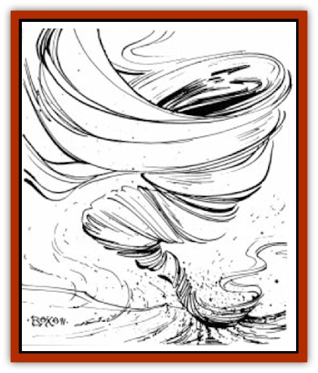

# Elemental - Athas - Greater - Air

| Statistic | **Elemental (Athas), Greater, Air** |
| --- | --- |
| **Activity Cycle:** | Any |
| **Alignment:** | Neutral |
| **Armor Class:** | 1 |
| **Climate/Terrain:** | Any air |
| **Damage/Attack:** | 5-50 |
| **Diet:** | Air |
| **Frequency:** | Very rare |
| **Hit Dice:** | 10, 14, or 18 |
| **Intelligence:** | Average (8-10) |
| **Magic Resistance:** | 50%/25% |
| **Morale:** | 10 and 14 Hit Dice: Champion (15-16) / 18 Hit Dice: Fanatic (17-18) |
| **Movement:** | Fl 36 (A) |
| **No. Appearing:** | 1 |
| **No. of Attacks:** | 1 |
| **Organization:** | Solitary |
| **Size:** | L to H (8-16' tall) |
| **Special Attacks:** | Whirlwind, sandstorm |
| **Special Defenses:** | + 3 weapon or better to hit |
| **THAC0:** | 10 Hit dice: 11 / 14 Hit Dice: 7 / 18 Hit Dice: 5 |
| **Treasure:** | Nil |
| **XP Value:** | 10 Hit Dice: 7,000 / 14 Hit Dice: 11,000 / 18 Hit Dice: 15,000 |

Greater air elementals can be conjured in any area of open air where gusts of wind are present. They are often summoned in open areas of the Athasian deserts, during sand and wind storms. Unlike other elementals, greater air elementals are not humanoid in shape, but are large amorphous columns of air.

While they are unable to speak, they are able to make sounds similar to the high-pitched scream of a tornado or the low moan of a night storm.

**Combat:** Greater air elementals have a special ability which allows them to conceal their presence. They are able to blend in with the natural winds and travel with them. They are unable to attack when in this form, but are able to revert to normal in one round. When in this form, greater air elementals are completely hidden from normal view, though a *detect magic* spell would indicate a magical presence in the air. When a greater air elemental reverts to its normal form, opponents receive a -3 penalty to their surprise rolls.

Greater air elementals are able to attack with a powerful concentrated blast of air which does 5d10 points of damage. This air blast will often resemble a large fist made up of swirling air. Greater air elementals are also capable of extremely rapid movement in the air, making them very good aerial combatants. This natural advantage grants them a +2 bonus to hit opponents in aerial combat, with a +5 bonus to their damage.

Greater air elementals possess a unique ability which allows them to turn into gigantic whirlwinds upon command. When using this ability, the elemental's appearance changes to that of a large, tornado-like, funnel cloud. This column of air is 15' wide at its base and up to 45' wide at its top. The greater air elemental's height when in this form is dependant on its Hit Dice. Greater air elementals of 10 Hit Dice are 50' tall, those of 14 Hit Dice are 70' tall, and 18-Hit Die elementals tower at 90' tall. Creating and dissipating this form takes one whole turn.

Once created, the whirlwind lasts for three melee rounds and sweeps up and kills all creatures of four Hit Dice (or levels) or less. Other creatures take 2d10 points of damage each round, though a saving throw versus breath weapon each round reduces this damage by one half.

This ability is particularly effective in the desert areas of Athas, especially on or near the Sea of Silt. When a greater air elemental creates a whirlwind while in the desert, a huge, 60' diameter, swirling cloud of sand is created, which limits visibility to 10 feet and inflicts 1d4 points of damage per round (save versus breath weapon for half damage). This sand cloud lasts a total of six melee rounds - three while the greater air elemental whirlwind is present and three afterward for the cloud to dissipate. When a whirlwind is created within 50' of the Sea of Silt, a massive cloud of sand and silt nearly 150' in diameter is generated, which prevents all visibility. In addition, all creatures inside the diameter of this cloud must save versus paralysis. Those who succeed suffer 1d10 points of damage per round, while those who fail suffocate and die within four rounds (unless treated by a *heal* or other similar spell). Creatures that don't breathe are immune to this damage.

---
## Discovery & Documentation

**Source Publication:** MC12 Dark Sun Appendix I - Terrors of the Desert (1991)
**Campaign Setting:** Dark Sun
**Author(s):** Tom Prusa, Louis J. Prosperi, Walter M. Baas

### Other Creatures Found in This Source Book
   * [[Animal_Herd_Athas|Animal, Herd (Athas)]]
   * [[Animal_Household_Athas|Animal, Household (Athas)]]
   * [[Antloid_Desert|Antloid, Desert]]
   * [[Banshee_Dwarf|Banshee, Dwarf]]
   * [[Beetle_Agony|Beetle, Agony]]
   * [[Bog_Wader|Bog Wader]]
   * [[Brambleweed|Brambleweed]]
   * [[B'rohg|B'rohg]]
   * [[Burnflower|Burnflower]]
   * [[Cat_Psionic|Cat, Psionic]]
   * [[Cha'thrang|Cha'thrang]]
   * [[Cistern_Fiend|Cistern Fiend]]
   * [[Clam_Giant|Clam, Giant]]
   * [[Cloud_Ray|Cloud Ray]]
   * [[Drake_Athas_Air|Drake (Athas), Air]]
   * [[Drake_Athas_Earth|Drake (Athas), Earth]]
   * [[Drake_Athas_Fire|Drake (Athas), Fire]]
   * [[Drake_Athas_Water|Drake (Athas), Water]]
   * [[Dune_Runner|Dune Runner]]
   * [[Dune_Trapper|Dune Trapper]]
   * [[Elemental_Athas_Greater_Earth|Elemental (Athas), Greater, Earth]]
   * [[Elemental_Athas_Greater_Fire|Elemental (Athas), Greater, Fire]]
   * [[Elemental_Athas_Greater_Water|Elemental (Athas), Greater, Water]]
   * [[Elemental_Athas_Lesser_Air_Earth|Elemental (Athas), Lesser, Air/Earth]]
   * [[Elemental_Athas_Lesser_Fire_Water|Elemental (Athas), Lesser, Fire/Water]]
   * [[Elemental_Athas_General_Information|Elemental (Athas), General Information]]
   * [[Erdland|Erdland]]
   * [[Esperweed|Esperweed]]
   * [[Flailer|Flailer]]
   * [[Floater|Floater]]
   * [[Giant_Athas|Giant (Athas)]]
   * [[Golem_Athas_I|Golem (Athas) I]]
   * [[Golem_Athas_II|Golem (Athas) II]]
   * [[Golem_Athas_III|Golem (Athas) III]]
   * [[Golem_Athas_General_Information|Golem (Athas), General Information]]
   * [[Halfling_Renegade|Halfling, Renegade]]
   * [[Hej-kin|Hej-kin]]
   * [[Id_Fiend|Id Fiend]]
   * [[Insect_Swarm_Athas|Insect Swarm (Athas)]]
   * [[Kank_Wild|Kank, Wild]]
   * [[Kirre|Kirre]]
   * [[Megapede|Megapede]]
   * [[Mul_Wild|Mul, Wild]]
   * [[Nightmare_Beast|Nightmare Beast]]
   * [[Plant_Carnivorous_Athas|Plant, Carnivorous (Athas)]]
   * [[Pterran|Pterran]]
   * [[Pterrax|Pterrax]]
   * [[Pulp_Bee|Pulp Bee]]
   * [[Pyreen|Pyreen]]
   * [[Rasclinn|Rasclinn]]
   * [[Razorwing|Razorwing]]
   * [[Roc_Athas|Roc (Athas)]]
   * [[Sand_Bride|Sand Bride]]
   * [[Sand_Cactus|Sand Cactus]]
   * [[Sand_Vortex|Sand Vortex]]
   * [[Scrab|Scrab]]
   * [[Silt_Horror|Silt Horror]]
   * [[Silt_Runner|Silt Runner]]
   * [[Sink_Worm|Sink Worm]]
   * [[Sloth_Athas|Sloth (Athas)]]
   * [[So-ut|So-ut]]
   * [[Spider_Cactus|Spider Cactus]]
   * [[Spider_Crystal|Spider, Crystal]]
   * [[Spirit_of_the_Land|Spirit of the Land]]
   * [[T'Chowb|T'Chowb]]
   * [[Thrax|Thrax]]
   * [[Tohr-kreen_I|Tohr-kreen I]]
   * [[Villichi|Villichi]]
   * [[Zhackal|Zhackal]]
   * [[Zombie_Plant|Zombie Plant]]
