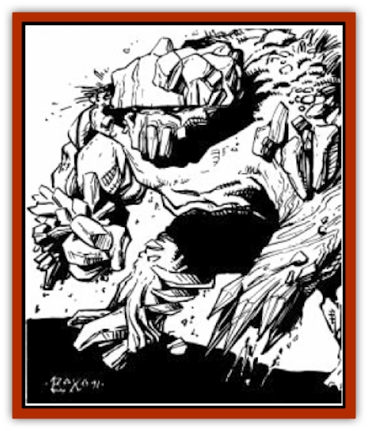

# Elemental - Athas - Greater - Earth

| Statistic | **Elemental (Athas), Greater, Earth** |
| --- | --- |
| **Activity Cycle:** | Any |
| **Alignment:** | Neutral |
| **Armor Class:** | 1 |
| **Climate/Terrain:** | Any land |
| **Damage/Attack:** | 4-48 |
| **Diet:** | Earth, metal or gem |
| **Frequency:** | Very rare |
| **Hit Dice:** | 10, 14, or 18 |
| **Intelligence:** | Average (8-10) |
| **Magic Resistance:** | 50%/25% |
| **Morale:** | 10 and 14 Hit Dice: Champion (15-16) / 18 Hit Dice: Fanatic (17-18) |
| **Movement:** | 9 |
| **No. Appearing:** | 1 |
| **No. of Attacks:** | 1 |
| **Organization:** | Solitary |
| **Size:** | L to H (8-16' tall) |
| **Special Attacks:** | Earthquake, structural damage |
| **Special Defenses:** | +3 weapon or better to hit |
| **THAC0:** | 10 Hit dice: 11 / 14 Hit Dice: 7 / 18 Hit Dice: 5 |
| **Treasure:** | Nil |
| **XP Value:** | 10 Hit Dice: 6,000 / 14 Hit Dice: 10,000 / 18 Hit Dice: 14,000 |

Greater earth [[Elemental_General_Information|elementals]] can be conjured in any area of earth or stone. When on the Prime Material plane, greater [[Elemental_Air_Earth|earth elementals]] appear as large humanoids made entirely of the material from which they were conjured, be it earth, stone, metal, or gems. The facial features of a greater earth [[Elemental_Athas_General_Information|elemental]] are expressionless, though their eyes are like shiny circles of gold.

Greater earth elementals are unable to speak, but they are capable of creating loud rumbling sounds, like the sound of an earthquake or landslide.

**Combat:** Greater earth elementals move at a fairly slow pace, but are able to move freely through rock, dirt, stone, or any material that comes from the earth. They are unable, however, to move across water and must either travel around bodies of water or under them. Greater earth elementals are able to travel across or through the Sea of Silt as they can through other earthen materials.

Greater earth elementals have a special ability which allows them to conceal themselves. They are able to blend into any earth-type material, so long as the volume of the material is equivalent to or greater than that of the elemental itself. For example, a greater earth elemental could conceal itself inside an area of open ground, or even within the actual walls of a city, but could not do so within a small rock or stone. Though undetectable by any normal means, a *detect magic* spell would indicate a magical presence within the stone or earth that the elemental occupied. When in this form, greater earth elementals are incapable of any actions (including movement), except reverting back to their normal appearance. It takes the elemental one round to conceal itself thus and one round to revert to its natural form. Greater earth elementals are often able to surprise their opponents with this ability, and when they attempt to do so, their opponents suffer a -2 penalty to their surprise rolls.

Whenever an earth elemental successfully attacks an opponent that is on the ground, the target takes 4d12 points of damage. Against creatures in the air or water, attacks made by a greater earth elemental are slightly less effective. When striking these opponents, subtract one point of damage per die, to a minimum of 1 point of damage per die.

When attacking structures made of earth or stone, or structures with earthen foundations, greater earth elementals are very effective. An attack by a greater earth elemental against such a structure does one point of structural damage per die normally rolled, or four structural points per attack. This makes these elementals particularly useful in siege combat. This, combined with their ability to travel through stone and earth, makes greater earth elementals very useful when attacking a fortification.

Perhaps the most devastating ability of greater earth elementals is their ability to create earthquakes in an immediate area around them. This ability takes one round to employ, and it can only be used once per day. The quake lasts for six melee rounds, growing in intensity during the first three rounds and then lessening for the remaining three rounds. During rounds 1 and 6, all creatures within 30' of the elemental must save versus paralysis or be knocked to the ground, taking 1d6 points of damage as they fall. Those making their saving throw still take 1d4 points of damage. During rounds 2 and 5, all creatures within 60' of the elemental must save versus paralysis with a -3 penalty, or be knocked to the ground, taking 1d8 points of damage as they fall. Those who make their saving throw still take 1d6 points of damage. During rounds 3 and 4, all creatures within 90' of the elemental must save versus paralysis with a -5 penalty or be knocked to the ground, taking 2d6 points of damage as they fall. Those who make their saving throw still take 2d4 points of damage. When this ability is used near or inside earthen structures, those walls within the area of effect take one structural point of damage per die rolled (one point in rounds 1 and 6, two points in rounds 2 and 5, and three points in rounds 3 and 4).

---
## Discovery & Documentation

**Source Publication:** MC12 Dark Sun Appendix I - Terrors of the Desert (1991)
**Campaign Setting:** Dark Sun
**Author(s):** Tom Prusa, Louis J. Prosperi, Walter M. Baas

### Other Creatures Found in This Source Book
   * [[Animal_Herd_Athas|Animal, Herd (Athas)]]
   * [[Animal_Household_Athas|Animal, Household (Athas)]]
   * [[Antloid_Desert|Antloid, Desert]]
   * [[Banshee_Dwarf|Banshee, Dwarf]]
   * [[Beetle_Agony|Beetle, Agony]]
   * [[Bog_Wader|Bog Wader]]
   * [[Brambleweed|Brambleweed]]
   * [[B'rohg|B'rohg]]
   * [[Burnflower|Burnflower]]
   * [[Cat_Psionic|Cat, Psionic]]
   * [[Cha'thrang|Cha'thrang]]
   * [[Cistern_Fiend|Cistern Fiend]]
   * [[Clam_Giant|Clam, Giant]]
   * [[Cloud_Ray|Cloud Ray]]
   * [[Drake_Athas_Air|Drake (Athas), Air]]
   * [[Drake_Athas_Earth|Drake (Athas), Earth]]
   * [[Drake_Athas_Fire|Drake (Athas), Fire]]
   * [[Drake_Athas_Water|Drake (Athas), Water]]
   * [[Dune_Runner|Dune Runner]]
   * [[Dune_Trapper|Dune Trapper]]
   * [[Elemental_Athas_Greater_Air|Elemental (Athas), Greater, Air]]
   * [[Elemental_Athas_Greater_Fire|Elemental (Athas), Greater, Fire]]
   * [[Elemental_Athas_Greater_Water|Elemental (Athas), Greater, Water]]
   * [[Elemental_Athas_Lesser_Air_Earth|Elemental (Athas), Lesser, Air/Earth]]
   * [[Elemental_Athas_Lesser_Fire_Water|Elemental (Athas), Lesser, Fire/Water]]
   * [[Elemental_Athas_General_Information|Elemental (Athas), General Information]]
   * [[Erdland|Erdland]]
   * [[Esperweed|Esperweed]]
   * [[Flailer|Flailer]]
   * [[Floater|Floater]]
   * [[Giant_Athas|Giant (Athas)]]
   * [[Golem_Athas_I|Golem (Athas) I]]
   * [[Golem_Athas_II|Golem (Athas) II]]
   * [[Golem_Athas_III|Golem (Athas) III]]
   * [[Golem_Athas_General_Information|Golem (Athas), General Information]]
   * [[Halfling_Renegade|Halfling, Renegade]]
   * [[Hej-kin|Hej-kin]]
   * [[Id_Fiend|Id Fiend]]
   * [[Insect_Swarm_Athas|Insect Swarm (Athas)]]
   * [[Kank_Wild|Kank, Wild]]
   * [[Kirre|Kirre]]
   * [[Megapede|Megapede]]
   * [[Mul_Wild|Mul, Wild]]
   * [[Nightmare_Beast|Nightmare Beast]]
   * [[Plant_Carnivorous_Athas|Plant, Carnivorous (Athas)]]
   * [[Pterran|Pterran]]
   * [[Pterrax|Pterrax]]
   * [[Pulp_Bee|Pulp Bee]]
   * [[Pyreen|Pyreen]]
   * [[Rasclinn|Rasclinn]]
   * [[Razorwing|Razorwing]]
   * [[Roc_Athas|Roc (Athas)]]
   * [[Sand_Bride|Sand Bride]]
   * [[Sand_Cactus|Sand Cactus]]
   * [[Sand_Vortex|Sand Vortex]]
   * [[Scrab|Scrab]]
   * [[Silt_Horror|Silt Horror]]
   * [[Silt_Runner|Silt Runner]]
   * [[Sink_Worm|Sink Worm]]
   * [[Sloth_Athas|Sloth (Athas)]]
   * [[So-ut|So-ut]]
   * [[Spider_Cactus|Spider Cactus]]
   * [[Spider_Crystal|Spider, Crystal]]
   * [[Spirit_of_the_Land|Spirit of the Land]]
   * [[T'Chowb|T'Chowb]]
   * [[Thrax|Thrax]]
   * [[Tohr-kreen_I|Tohr-kreen I]]
   * [[Villichi|Villichi]]
   * [[Zhackal|Zhackal]]
   * [[Zombie_Plant|Zombie Plant]]
