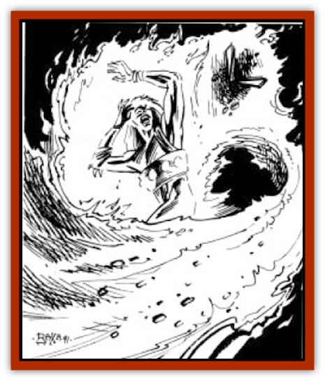

# Elemental - Athas - Greater - Fire

| Statistic | **Elemental (Athas), Greater, Fire** |
| --- | --- |
| **Activity Cycle:** | Any |
| **Alignment:** | Neutral |
| **Armor Class:** | 1 |
| **Climate/Terrain:** | Any dry land |
| **Damage/Attack:** | 4-40 |
| **Diet:** | Any combustible |
| **Frequency:** | Very rare |
| **Hit Dice:** | 10, 14, or 18 |
| **Intelligence:** | Average (8-10) |
| **Magic Resistance:** | 50%/25% |
| **Morale:** | 10 and 14 Hit Dice: Champion (15-16) / 18 Hit Dice: Fanatic (17-18) |
| **Movement:** | 12 |
| **No. Appearing:** | 1 |
| **No. of Attacks:** | 1 |
| **Organization:** | Solitary |
| **Size:** | L to H (8-16' tall) |
| **Special Attacks:** | Engulf |
| **Special Defenses:** | +3 weapon or better to hit |
| **THAC0:** | 10 Hit Dice: 11 / 14 Hit Dice: 7 / 18 Hit Dice: 5 |
| **Treasure:** | Nil |
| **XP Value:** | 10 Hit Dice: 6,000 / 14 Hit Dice: 10,000 / 18 Hit Dice: 14,000 |

Greater [[Elemental_Fire_Water|fire elementals]] can be conjured in any area containing a large, open flame. Any flame used to conjure a greater fire [[Elemental_Athas_General_Information|elemental]] should be at least 6' in diameter.

On the Prime Material plane, a greater fire elemental appear as a large sheet of flame, roughly humanoid in shape, bearing two arm-like appendages. The only facial features noticeable on a greater fire elemental are its eyes, which glow an intense, bright red.

Though they are incapable of speech, greater fire elementals are able to make sounds similar to the hisses and crackles of a large fire.

**Combat:** Greater fire elementals are limited in terms of their movement capabilities. They are totally unable to move across or through water or other nonflammable liquids.

Athasian greater fire elementals have a special ability which allows them to conceal their presence from observers. A greater fire elemental may shrink itself in size and intensity to conceal itself within a small flame, as small as the flame at the end of a torch. The only way for a greater fire elemental to move while in this form is through the contact of one flame to another. For example, a greater fire elemental concealed within a campfire could only move to the flame of a torch if the torch were to come in contact with the campfire. Though the elemental is undetectable by any normal means, a *detect magic* spell would indicate a magical presence within the flame that houses the elemental. While in this form, a greater fire elemental is unable to perform any other actions except transfer itself from flame to flame and revert to its normal appearance. Reverting to and changing from its original form takes one round. This ability will often grant a greater fire elemental the advantage of surprise. When a greater fire elemental reveals itself in this manner, any opponents suffer a -2 penalty to their surprise rolls.

A greater fire elemental is particularly resentful of being summoned to the Prime Material plane and will, therefore, fight viciously against all its opponents. Any creature struck by a greater fire elemental takes 4d10 points of damage. Any flammable object struck must save versus magical fire with a -3 penalty or immediately begin to burn.

The fire-using abilities of a greater fire elemental have a unique affect on its interactions with other fire-using and flame-based creature. Any flame-based creature attacked by a greater fire elemental takes slightly less damage than normal. Subtract 1 point from each die of damage rolled, to a minimum of 1 point per die. Also, attacks made by flame-based creatures against greater fire elementals suffer the same reduction in damage.

Greater fire elementals of Athas have one other special ability which is perhaps their most deadly. A greater fire elemental may attempt to engulf its opponent, completely surrounding it within the Prime Material body of the elemental. The greater fire elemental cannot otherwise attack on a turn that it engulfs a victim; it must make a normal attack roll to engulf. Once it has engulfed a victim, it can continue to attack normally. Any creature successfully engulfed must save versus paralysis each round or suffer 4d10 points of damage. Those who make their saving throw suffer 2d10 points of damage per round. Escaping from a greater fire elemental's engulf attack requires a Strength ability check with a -10 penalty. While engulfed, a creature may not perform any actions except to try to escape. Attacks made against a greater fire elemental that has engulfed a creature do not in any way affect that creature. In fact, if a greater fire elemental is damaged for 25 or more hit points in a single round, it will release its victim in order to concentrate its attacks elsewhere.

---
## Discovery & Documentation

**Source Publication:** MC12 Dark Sun Appendix I - Terrors of the Desert (1991)
**Campaign Setting:** Dark Sun
**Author(s):** Tom Prusa, Louis J. Prosperi, Walter M. Baas

### Other Creatures Found in This Source Book
   * [[Animal_Herd_Athas|Animal, Herd (Athas)]]
   * [[Animal_Household_Athas|Animal, Household (Athas)]]
   * [[Antloid_Desert|Antloid, Desert]]
   * [[Banshee_Dwarf|Banshee, Dwarf]]
   * [[Beetle_Agony|Beetle, Agony]]
   * [[Bog_Wader|Bog Wader]]
   * [[Brambleweed|Brambleweed]]
   * [[B'rohg|B'rohg]]
   * [[Burnflower|Burnflower]]
   * [[Cat_Psionic|Cat, Psionic]]
   * [[Cha'thrang|Cha'thrang]]
   * [[Cistern_Fiend|Cistern Fiend]]
   * [[Clam_Giant|Clam, Giant]]
   * [[Cloud_Ray|Cloud Ray]]
   * [[Drake_Athas_Air|Drake (Athas), Air]]
   * [[Drake_Athas_Earth|Drake (Athas), Earth]]
   * [[Drake_Athas_Fire|Drake (Athas), Fire]]
   * [[Drake_Athas_Water|Drake (Athas), Water]]
   * [[Dune_Runner|Dune Runner]]
   * [[Dune_Trapper|Dune Trapper]]
   * [[Elemental_Athas_Greater_Air|Elemental (Athas), Greater, Air]]
   * [[Elemental_Athas_Greater_Earth|Elemental (Athas), Greater, Earth]]
   * [[Elemental_Athas_Greater_Water|Elemental (Athas), Greater, Water]]
   * [[Elemental_Athas_Lesser_Air_Earth|Elemental (Athas), Lesser, Air/Earth]]
   * [[Elemental_Athas_Lesser_Fire_Water|Elemental (Athas), Lesser, Fire/Water]]
   * [[Elemental_Athas_General_Information|Elemental (Athas), General Information]]
   * [[Erdland|Erdland]]
   * [[Esperweed|Esperweed]]
   * [[Flailer|Flailer]]
   * [[Floater|Floater]]
   * [[Giant_Athas|Giant (Athas)]]
   * [[Golem_Athas_I|Golem (Athas) I]]
   * [[Golem_Athas_II|Golem (Athas) II]]
   * [[Golem_Athas_III|Golem (Athas) III]]
   * [[Golem_Athas_General_Information|Golem (Athas), General Information]]
   * [[Halfling_Renegade|Halfling, Renegade]]
   * [[Hej-kin|Hej-kin]]
   * [[Id_Fiend|Id Fiend]]
   * [[Insect_Swarm_Athas|Insect Swarm (Athas)]]
   * [[Kank_Wild|Kank, Wild]]
   * [[Kirre|Kirre]]
   * [[Megapede|Megapede]]
   * [[Mul_Wild|Mul, Wild]]
   * [[Nightmare_Beast|Nightmare Beast]]
   * [[Plant_Carnivorous_Athas|Plant, Carnivorous (Athas)]]
   * [[Pterran|Pterran]]
   * [[Pterrax|Pterrax]]
   * [[Pulp_Bee|Pulp Bee]]
   * [[Pyreen|Pyreen]]
   * [[Rasclinn|Rasclinn]]
   * [[Razorwing|Razorwing]]
   * [[Roc_Athas|Roc (Athas)]]
   * [[Sand_Bride|Sand Bride]]
   * [[Sand_Cactus|Sand Cactus]]
   * [[Sand_Vortex|Sand Vortex]]
   * [[Scrab|Scrab]]
   * [[Silt_Horror|Silt Horror]]
   * [[Silt_Runner|Silt Runner]]
   * [[Sink_Worm|Sink Worm]]
   * [[Sloth_Athas|Sloth (Athas)]]
   * [[So-ut|So-ut]]
   * [[Spider_Cactus|Spider Cactus]]
   * [[Spider_Crystal|Spider, Crystal]]
   * [[Spirit_of_the_Land|Spirit of the Land]]
   * [[T'Chowb|T'Chowb]]
   * [[Thrax|Thrax]]
   * [[Tohr-kreen_I|Tohr-kreen I]]
   * [[Villichi|Villichi]]
   * [[Zhackal|Zhackal]]
   * [[Zombie_Plant|Zombie Plant]]
