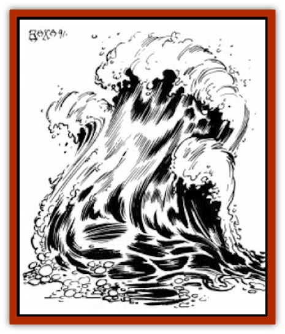

# Elemental - Athas - Greater - Water

| Statistic | **Elemental (Athas), Greater, Water** |
| --- | --- |
| **Activity Cycle:** | Any |
| **Alignment:** | Neutral |
| **Armor Class:** | 1 |
| **Climate/Terrain:** | Large areas of water |
| **Damage/Attack:** | 6-36 |
| **Diet:** | Any liquid |
| **Frequency:** | Very rare |
| **Hit Dice:** | 10, 14, or 18 |
| **Intelligence:** | Average (8-10) |
| **Magic Resistance:** | 50%/25% |
| **Morale:** | 10 and 14 Hit Dice: Champion (15-16) / 18 Hit Dice: Fanatic (17-18) |
| **Movement:** | 6, Sw 18 |
| **No. Appearing:** | 1 |
| **No. of Attacks:** | 1 |
| **Organization:** | Solitary |
| **Size:** | L to H (8-16' tall) |
| **Special Attacks:** | Drown |
| **Special Defenses:** | +3 weapon or better to hit |
| **THAC0:** | 10 Hit dice: 11 / 14 Hit Dice: 7 / 18 Hit Dice: 5 |
| **Treasure:** | Nil |
| **XP Value:** | 10 Hit Dice: 6,000 / 14 Hit Dice: 10,000 / 18 Hit Dice: 14,000 |

Greater water elementals can be conjured in any area containing a large body of water or watery liquid. The creation of a greater water elemental requires at least one hundred cubic feet of water, which serves as the Prime Material shell for the creature.

On Athas a greater water elemental appears as a large, high-crested wave. The arms of a greater water elemental appear as smaller waves, flowing out from either side of the larger wave. Though the entire surface of the elemental resembles rough water, there are two completely smooth areas which serve it as eyes.

Like all elementals, greater water elementals are unable to speak, though they are able to make sounds similar to the roaring and crashing waves.

**Combat:** The movement of greater water elementals is severely limited on land. Though they are able to move in and across water, they can only to move onto dry land so long as they remain within 30 feet of the body of water from which they arose.

Athasian greater water elementals have a special ability which allows them to conceal their presence from observers. They are able to blend in completely with the body of water from which they spawned and are able to move through this body of water freely. When in this form, a greater water elemental is completely undetectable by any normal means, though a detect magic spell would indicate a magical presence in the body of water. Changing to or from this form takes one round and will often grant the elemental the advantage of surprise over its opponents. When an elemental changes form, its intended opponents suffer a -2 penalty to their surprise rolls.

When in combat, greater water elementals prefer to attack opponents that are in or on the water. The elemental strikes with one of its large, wave-like arms and does 6d6 points of damage per successful attack. When attacking on dry land or against land-based opponents, a greater water elemental's attack does slightly less damage. Subtract one point per die of damage rolled, to a minimum of one point per die.

Greater water elementals are particularly effective when fighting against water vessels. They are easily capable of overturning small craft (10 to 50 feet in length) and stopping or slowing larger ships (50 or more feet in length). Direct attacks against ships inflict a structural point of damage per 2 dice of damage, or 3 structural points per attack.

Athasian greater water elementals have one other special attack form usable against targets which are man-sized or smaller. They are able to reach out and grapple an opponent and drag it into itself, drowning it. This attack can be attempted against targets either on the ground or on board a ship provided the elemental can reach it. The elemental must make a successful attack roll to grab the target. If successful, the target is caught by the elemental and dragged inside. The victim must save versus paralysis each round or take 2d10 points of damage. Those who make their saving throws still take 1d10 points of damage per round. Breaking free requires a Strength ability check with a -6 penalty. The greater water elemental can attempt to grapple the victim again.

**Ecology:** On Athas, greater water elementals are very rare, as there are very few bodies of water large enough to supply the required amount of water.

---
## Discovery & Documentation

**Source Publication:** MC12 Dark Sun Appendix I - Terrors of the Desert (1991)
**Campaign Setting:** Dark Sun
**Author(s):** Tom Prusa, Louis J. Prosperi, Walter M. Baas

### Other Creatures Found in This Source Book
   * [[Animal_Herd_Athas|Animal, Herd (Athas)]]
   * [[Animal_Household_Athas|Animal, Household (Athas)]]
   * [[Antloid_Desert|Antloid, Desert]]
   * [[Banshee_Dwarf|Banshee, Dwarf]]
   * [[Beetle_Agony|Beetle, Agony]]
   * [[Bog_Wader|Bog Wader]]
   * [[Brambleweed|Brambleweed]]
   * [[B'rohg|B'rohg]]
   * [[Burnflower|Burnflower]]
   * [[Cat_Psionic|Cat, Psionic]]
   * [[Cha'thrang|Cha'thrang]]
   * [[Cistern_Fiend|Cistern Fiend]]
   * [[Clam_Giant|Clam, Giant]]
   * [[Cloud_Ray|Cloud Ray]]
   * [[Drake_Athas_Air|Drake (Athas), Air]]
   * [[Drake_Athas_Earth|Drake (Athas), Earth]]
   * [[Drake_Athas_Fire|Drake (Athas), Fire]]
   * [[Drake_Athas_Water|Drake (Athas), Water]]
   * [[Dune_Runner|Dune Runner]]
   * [[Dune_Trapper|Dune Trapper]]
   * [[Elemental_Athas_Greater_Air|Elemental (Athas), Greater, Air]]
   * [[Elemental_Athas_Greater_Earth|Elemental (Athas), Greater, Earth]]
   * [[Elemental_Athas_Greater_Fire|Elemental (Athas), Greater, Fire]]
   * [[Elemental_Athas_Lesser_Air_Earth|Elemental (Athas), Lesser, Air/Earth]]
   * [[Elemental_Athas_Lesser_Fire_Water|Elemental (Athas), Lesser, Fire/Water]]
   * [[Elemental_Athas_General_Information|Elemental (Athas), General Information]]
   * [[Erdland|Erdland]]
   * [[Esperweed|Esperweed]]
   * [[Flailer|Flailer]]
   * [[Floater|Floater]]
   * [[Giant_Athas|Giant (Athas)]]
   * [[Golem_Athas_I|Golem (Athas) I]]
   * [[Golem_Athas_II|Golem (Athas) II]]
   * [[Golem_Athas_III|Golem (Athas) III]]
   * [[Golem_Athas_General_Information|Golem (Athas), General Information]]
   * [[Halfling_Renegade|Halfling, Renegade]]
   * [[Hej-kin|Hej-kin]]
   * [[Id_Fiend|Id Fiend]]
   * [[Insect_Swarm_Athas|Insect Swarm (Athas)]]
   * [[Kank_Wild|Kank, Wild]]
   * [[Kirre|Kirre]]
   * [[Megapede|Megapede]]
   * [[Mul_Wild|Mul, Wild]]
   * [[Nightmare_Beast|Nightmare Beast]]
   * [[Plant_Carnivorous_Athas|Plant, Carnivorous (Athas)]]
   * [[Pterran|Pterran]]
   * [[Pterrax|Pterrax]]
   * [[Pulp_Bee|Pulp Bee]]
   * [[Pyreen|Pyreen]]
   * [[Rasclinn|Rasclinn]]
   * [[Razorwing|Razorwing]]
   * [[Roc_Athas|Roc (Athas)]]
   * [[Sand_Bride|Sand Bride]]
   * [[Sand_Cactus|Sand Cactus]]
   * [[Sand_Vortex|Sand Vortex]]
   * [[Scrab|Scrab]]
   * [[Silt_Horror|Silt Horror]]
   * [[Silt_Runner|Silt Runner]]
   * [[Sink_Worm|Sink Worm]]
   * [[Sloth_Athas|Sloth (Athas)]]
   * [[So-ut|So-ut]]
   * [[Spider_Cactus|Spider Cactus]]
   * [[Spider_Crystal|Spider, Crystal]]
   * [[Spirit_of_the_Land|Spirit of the Land]]
   * [[T'Chowb|T'Chowb]]
   * [[Thrax|Thrax]]
   * [[Tohr-kreen_I|Tohr-kreen I]]
   * [[Villichi|Villichi]]
   * [[Zhackal|Zhackal]]
   * [[Zombie_Plant|Zombie Plant]]
