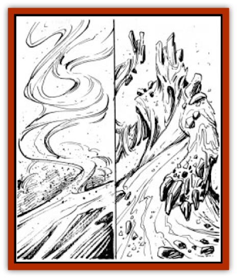

# Elemental - Athas - Lesser - Air - Earth

| Statistic | **Air** | **Earth** |
| --- | --- | --- |
| **Activity Cycle:** | Any | Any |
| **Alignment:** | Neutral | Neutral |
| **Armor Class:** | 4 | 4 |
| **Climate/Terrain:** | Any Air | Any land |
| **Damage/Attack:** | 2 Hit Dice: 1-6 / 4 Hit Dice: 1-10 / 6 Hit Dice: 1-12 | 2 Hit Dice: 1-8 / 4 Hit Dice: 2-16 / 6 Hit Dice: 3-24 |
| **Diet:** | Air | Earth, metals, or gems |
| **Frequency:** | Rare | Rare |
| **Hit Dice:** | 2, 4, or 6 | 2, 4, or 6 |
| **Intelligence:** | Low (5-7) | Low (5-7) |
| **Magic Resistance:** | Nil | Nil |
| **Morale:** | 2 HD: Steady (11-12) / 4-6 HD: Elite (13-14) | 2 HD: Steady (11-12) / 4-6 HD: Elite (13-14) |
| **Movement:** | Fl 18 (A) | 6 |
| **No. Appearing:** | 1 | 1 |
| **No. of Attacks:** | 1 | 1 |
| **Organization:** | Solitary | Solitary |
| **Size:** | S-M (2-6'); Height = HD | S-M (2-6'); Height = HD |
| **Special Attacks:** | See below | See below |
| **Special Defenses:** | +1 or better weapon to hit | +1 or better weapon to hit |
| **THAC0:** | 2 Hit Dice: 19 / 4 Hit Dice: 17 / 6 Hit Dice: 15 | 2 Hit Dice: 19 / 4 Hit Dice: 17 / 6 Hit Dice: 15 |
| **Treasure:** | Nil | Nil |
| **XP Value:** | 2 Hit Dice: 650 / 4 Hit Dice: 975 / 6 Hit Dice: 1,400 | 2 Hit Dice: 420 / 4 Hit Dice: 650 / 6 Hit Dice: 975 |

## Lesser Air Elemental

Dust devils and sirocco winds blow frequently across the Athasian desert. Travellers often look upon these natural phenomenon with fear, thinking them to be lesser air elementals.

An individual could be in the presence of a lesser air elemental and never know it as they are predominantly transparent. Looking right at one, the viewer might occasionally see an ephemeral gossamer shape that appears to wane in the breeze.

**Combat:** Lesser air elementals use their near invisibility to their advantage. They are the fastest of the lesser elementals and use their speed to attack. They move by a target at their highest rate of speed (18) and strike a glancing blow with their body. The damage varies by the number of Hit Dice the lesser elemental possesses. When struck in this fashion, any target with fewer Hit Dice than the lesser air elemental must make a successful Dexterity check to keep from being knocked off balance.

The lesser air elemental can spin itself into a wind vortex but the cost is high. The vortex is the same size as the lesser air elemental. The visible, whirling vortex doubles the amount of damage the lesser air elemental can cause per round, but halves the number of rounds it remains conjured or summoned, starting in the round it is created. Lesser air elementals do not combat underground or earth-based creatures with much success; any damage inflicted against such creatures is halved.

## Lesser Earth Elemental

Coalesced sand, silt, or rock, the lesser earth elemental is the mightiest elemental a low-level conjurer can summon.

Comprised of desert sand, salt, rock, or silt from the Great Sea, the lesser earth elemental appears as a small hillock with a vague humanoid shape. The creature has features like a humanoid, including hollows where eyes should be. The most disconcerting part of the creature is its ability to reverse direction by shifting its features to the opposite side of its body instead of turning around.

**Combat:** A formidable foe, the lesser earth elemental prefers the direct approach of pounding its adversary into submission. The lesser elemental can travel freely through all types of earth. The lesser earth elemental delivers a single, powerful punch each round. The amount of damage caused is directly linked to the number of Hit Dice the creature possesses. The lesser earth elemental does not fight airborne or waterborne creatures very effectively. All damage inflicted against opponents in flight or in water is halved.

Although powerful, the lesser earth elemental remains at rest between orders. They require simple motivation. Complex orders, tasks, or errands are lost on the lesser earth elemental. Commands should be kept simple and direct for the lesser earth elemental to best aid the conjurer/summoner.

---
## Discovery & Documentation

**Source Publication:** Planescape III (1996)
**Campaign Setting:** Planescape
**Author(s):** Monte Cook

### Other Creatures Found in This Source Book
   * [[Animental|Animental]]
   * [[Archomental_Evil|Archomental, Evil]]
   * [[Archomental_Good|Archomental, Good]]
   * [[Belker|Belker]]
   * [[Bzastra|Bzastra]]
   * [[Chososion|Chososion]]
   * [[Darklight|Darklight]]
   * [[Devete|Devete]]
   * [[Devourer_Planescape|Devourer (Planescape)]]
   * [[Dharum_Suhn|Dharum Suhn]]
   * [[Egarus|Egarus]]
   * [[Elemental_Athas_Lesser_Fire_Water|Elemental (Athas), Lesser, Fire/Water]]
   * [[Elemental_Fire_Kin_Salamander_II|Elemental, Fire Kin, Salamander II]]
   * [[Entrope|Entrope]]
   * [[Facet|Facet]]
   * [[Frost_Salamander|Frost Salamander]]
   * [[Fundamental_Air_Earth|Fundamental, Air/Earth]]
   * [[Fundamental_Fire_Water|Fundamental, Fire/Water]]
   * [[Fundamental_All_Elements|Fundamental, All Elements]]
   * [[Garmorm|Garmorm]]
   * [[Homunculus_Elemental|Homunculus, Elemental]]
   * [[Immoth|Immoth]]
   * [[Khargra|Khargra]]
   * [[Klyndes|Klyndes]]
   * [[Magran|Magran]]
   * [[Menglis|Menglis]]
   * [[Nathri|Nathri]]
   * [[Ooze_Sprite|Ooze Sprite]]
   * [[Paraelemental|Paraelemental]]
   * [[Phirblas|Phirblas]]
   * [[Psurlon|Psurlon]]
   * [[Quasielemental_Negative|Quasielemental, Negative]]
   * [[Quasielemental_Positive|Quasielemental, Positive]]
   * [[Rast|Rast]]
   * [[Ravid|Ravid]]
   * [[Ruvoka|Ruvoka]]
   * [[Scile|Scile]]
   * [[Shad|Shad]]
   * [[Shocker|Shocker]]
   * [[Sislan|Sislan]]
   * [[Suisseen|Suisseen]]
   * [[Terithran|Terithran]]
   * [[Thoqqua|Thoqqua]]
   * [[Trilloch|Trilloch]]
   * [[Tsnng|Tsnng]]
   * [[Ungulosin|Ungulosin]]
   * [[Vacuous|Vacuous]]
   * [[Wavefire|Wavefire]]
   * [[Xag-Ya_Xeg-Yi|Xag-Ya/Xeg-Yi]]
   * [[Xill|Xill]]
