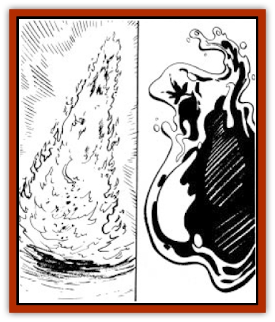

# Elemental - Athas - Lesser - Fire - Water

| Statistic | **Fire** | **Water** |
| --- | --- | --- |
| **Activity Cycle:** | Any | Any |
| **Alignment:** | Neutral | Neutral |
| **Armor Class:** | 4 | 4 |
| **Climate/Terrain:** | Fire or dry land | Any water |
| **Damage/Attack:** | 2 Hit Dice: 1-6 / 4 Hit Dice: 1-12 / 6 Hit Dice: 2-20 | 2 Hit Dice: 2-12 / 4 Hit Dice: 3-18 / 6 Hit Dice: 4-24 |
| **Diet:** | Combustibles | Any liquids |
| **Frequency:** | Rare | Rare |
| **Hit Dice:** | 2, 4, or 6 | 2, 4, or 6 |
| **Intelligence:** | Low (5-7) | Low (5-7) |
| **Magic Resistance:** | Nil | Nil |
| **Morale:** | 2 HD: Steady (11-12) / 4-6 HD: Elite (13-14) | 2 HD: Steady (11-12) / 4-6 HD: Elite (13-14) |
| **Movement:** | Fl 15 (A) | 6 |
| **No. Appearing:** | 1-3 | 1-3 |
| **No. of Attacks:** | 1 | 1 |
| **Organization:** | Solitary | Solitary |
| **Size:** | S-M (2-6') Height = HD | S-M (2-6') Height = HD |
| **Special Attacks:** | Flame tongue | Ram |
| **Special Defenses:** | +1 or better weapon to hit | +1 or better weapon to hit |
| **THAC0:** | 2 Hit Dice: 19 / 4 Hit Dice: 17 / 6 Hit Dice: 15 | 2 Hit Dice: 19 / 4 Hit Dice: 17 / 6 Hit Dice: 15 |
| **Treasure:** | Nil | Nil |
| **XP Value:** | 2 Hit Dice: 420 / 4 Hit Dice: 650 / 6 Hit Dice: 975 | 2 Hit Dice: 420 / 4 Hit Dice: 650 / 6 Hit Dice: 975 |

## Lesser Fire Elemental

These creatures from the elemental plane of fire are the most spirited and mischievous of all the lesser elementals.

Lesser fire elementals appear as columns of iridescent flame and constantly change color. When first conjured, the lesser fire elemental appears a burning, bright white-blue. As it becomes weaker, the color changes to yellow-orange, and then to deep red before it fades away. Their height in height is equal to the number of Hit Dice they possess, and they are half that distance in width. For locomotion, the column of flame leans in the direction it wishes to travel.

**Combat:** In combat, the lesser fire elemental will either move up against its target to burn it or will use its flame tongue. The appendage resembles a long tongue composed of flame that the creature can flick in a whip-like fashion at an enemy. The flame tongue has a range of 3 feet. Both attacks do the same amount of damage but the lesser flame elemental can only do one attack per round. Any flammable object struck by the lesser fire elemental must save versus magic fire with a -1 penalty or immediately begin to burn. All damage against other fire-based creatures is automatically halved.

Lesser fire elementals take all commands literally. Until they are told exactly what actions they can, should, or should not perform, they will act mischievously (setting fire to the nearest flammable object, etc.) They do not mean to disobey, it is just that they have yet to be told what to do - lesser fire elementals are impatient beings. Although they do not have any visible sensory organs, they possess the ability to see and to hear.

## Lesser Water Elemental

All water elementals, including the lesser ones, are looked on with awe and respect on Athas because of their link with the lifegiving fluid.

Blue to transparent in color, lesser water elementals are bulbous and amorphous in shape. Constantly changing, but generally the creature has a rounded bottom that gets thinner towards the top. The lesser water elemental looks like a moving teardrop. For locomotion the elemental circulates its liquid, moving the water in the back of its body to the front. The motion is so smooth it gives the impression that the creature is flowing.

**Combat:** The lesser elemental uses its flowing motion as one of its basic forms of attack. Gathering speed as it goes, it uses its entire body to ram, inflicting 4-32 (4d8) points of damage. Otherwise, it creates a single pseudopod to use in a concussive attack, inflicting damage as listed above. The pseudopod flows back into the body cavity after one attack, only to be replaced by another if the creature wills it.

Conjuring/summoning a lesser water elemental when in the Athasian desert is a risky proposition at best. If exposed to the heat of the desert and the direct rays of the hot desert sun, the lesser water elemental may not last the full length of its conjuration/summoning. After 5 rounds in the desert heat, the creature must make a successful saving throw versus death magic or return to the Elemental Plane of Water.

---
## Discovery & Documentation

**Source Publication:** Planescape III (1996)
**Campaign Setting:** Planescape
**Author(s):** Monte Cook

### Other Creatures Found in This Source Book
   * [[Animental|Animental]]
   * [[Archomental_Evil|Archomental, Evil]]
   * [[Archomental_Good|Archomental, Good]]
   * [[Belker|Belker]]
   * [[Bzastra|Bzastra]]
   * [[Chososion|Chososion]]
   * [[Darklight|Darklight]]
   * [[Devete|Devete]]
   * [[Devourer_Planescape|Devourer (Planescape)]]
   * [[Dharum_Suhn|Dharum Suhn]]
   * [[Egarus|Egarus]]
   * [[Elemental_Athas_Lesser_Air_Earth|Elemental (Athas), Lesser, Air/Earth]]
   * [[Elemental_Fire_Kin_Salamander_II|Elemental, Fire Kin, Salamander II]]
   * [[Entrope|Entrope]]
   * [[Facet|Facet]]
   * [[Frost_Salamander|Frost Salamander]]
   * [[Fundamental_Air_Earth|Fundamental, Air/Earth]]
   * [[Fundamental_Fire_Water|Fundamental, Fire/Water]]
   * [[Fundamental_All_Elements|Fundamental, All Elements]]
   * [[Garmorm|Garmorm]]
   * [[Homunculus_Elemental|Homunculus, Elemental]]
   * [[Immoth|Immoth]]
   * [[Khargra|Khargra]]
   * [[Klyndes|Klyndes]]
   * [[Magran|Magran]]
   * [[Menglis|Menglis]]
   * [[Nathri|Nathri]]
   * [[Ooze_Sprite|Ooze Sprite]]
   * [[Paraelemental|Paraelemental]]
   * [[Phirblas|Phirblas]]
   * [[Psurlon|Psurlon]]
   * [[Quasielemental_Negative|Quasielemental, Negative]]
   * [[Quasielemental_Positive|Quasielemental, Positive]]
   * [[Rast|Rast]]
   * [[Ravid|Ravid]]
   * [[Ruvoka|Ruvoka]]
   * [[Scile|Scile]]
   * [[Shad|Shad]]
   * [[Shocker|Shocker]]
   * [[Sislan|Sislan]]
   * [[Suisseen|Suisseen]]
   * [[Terithran|Terithran]]
   * [[Thoqqua|Thoqqua]]
   * [[Trilloch|Trilloch]]
   * [[Tsnng|Tsnng]]
   * [[Ungulosin|Ungulosin]]
   * [[Vacuous|Vacuous]]
   * [[Wavefire|Wavefire]]
   * [[Xag-Ya_Xeg-Yi|Xag-Ya/Xeg-Yi]]
   * [[Xill|Xill]]
