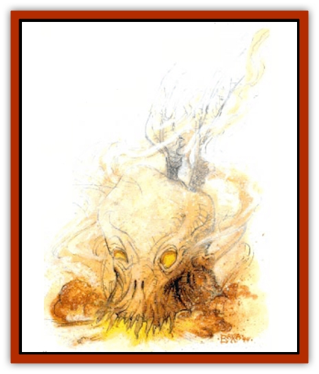

# Elemental Beast - Athas - Air

| Statistic | **Elemental Beast (Athas), Air** |
| --- | --- |
| **Activity Cycle:** | Any |
| **Alignment:** | Neutral |
| **Armor Class:** | 2 |
| **Climate/Terrain:** | Any air |
| **Damage/Attack:** | 2d6 |
| **Diet:** | Air |
| **Frequency:** | Very rare |
| **Hit Dice:** | 8+3 |
| **Intelligence:** | Semi- (2-4) |
| **Magic Resistance:** | Nil |
| **Morale:** | Elite (13-14) |
| **Movement:** | Fl 36 (A) |
| **No. Appearing:** | 1 |
| **No. of Attacks:** | 1 |
| **Organization:** | Solitary |
| **Size:** | L (8' tall) |
| **Special Attacks:** | See below |
| **Special Defenses:** | +1 weapon or better to hit |
| **THAC0:** | 13 |
| **Treasure:** | Nil |
| **XP Value:** | 3,000 |

An air elemental beast is made of only the purest elemental material available. It is native to the Elemental Plane of Air where it is highly prized by [[Genie|djinni]] as a guardian beast and as a tracker and hunter.

On its native plane, elemental beast is usually invisible. On Athas, however, foreign material such as sand or silt can get caught up in the whirling winds and air currents that formulate the beast, causing it great pain and revealing its true form. The elemental beast is an enormous 8-foot head with wings attached at the back. Its wide mouth is filled with rows of pointed razor-sharp teeth. Its eyes shine with pain and malicious The turbulent winds that give the beast its form create a howling and whistling sound.

**Combat:** The intense winds that twist about within the elemental air beast give the creature its ability to attack. Like the [[Elemental_Air_Earth|air elemental]], this creature is a master of its environment and gains a +1 attack bonus and a +4 damage bonus in aerial combat. This bonus is only effective against beings that are not native to the Elemental Plane of Air.

The air elemental beast attacks with its any fangs, causing 2-12 (2d6) points of damage. If unseen and invisible, it makes its first attack at +4. If the beast's attack roll is a natural 20, and its opponent is no larger than medium-sized, it seizes its opponent in its large mouth. If the creature is land-based, the air beast lifts the being from the ground to a height of 50 feet and drops the victim, causing 5-30 (5d6) points of damage. If the victim flies, the air beast flies at its maximum speed directly at a solid object such as a rock or the ground. At the last minute, the air beast releases its victim and veers away. Its class A maneuverability allows it to instantly change direction; the victim takes 3.18 (3d6) points of damage and must roll a successful System Shock roll or be stunned for 1-6 (1d6) rounds.

If the air elemental beast absorbs a large amount of foreign matter such as dust, sand, or dirt, it goes into a berserk fury. In this state, all the beast's attacks are made at +2, but its AC suffers a -2 penalty from the reckless nature of the attacks. For every round the elemental air beast is within 10 feet of a source of loose foreign matter, there is a 5% cumulative chance the beast absorbs enough material to send it into this berserk rage. This lasts for 1-8 (1d8) rounds, after which the material has been ejected from its body.

Certain spells have unusual effects on the elemental beast. A *control weather* spell cast at an elemental beast of air causes it 8-64 (8d8) points of damage, but the creature gets a saving throw for half damage. A *gust of wind* spell cast at the air beast adds a +2 HD to the beast for 1-4 (1d4) rounds and has a 50% chance of sending the creature into a berserk fury. Damage suffered during this period is first subtracted from the added HD, and all attacks made during this time are made as if the beast were of 10+3 HD (THAC0 11).

**Habitat/Society:** The elemental beast of air finds comfort only in the Elemental Plane of Air, though some have been rumored to be spotted in the areas near a sandstorm or tornado. It is a solitary beast and is not known to socialize with other creatures or even other air beasts.

**Ecology:** This beast has no place in the natural order on Athas. On its home plane, it is fairly common and is sought as a pet or guardian.

---
## Discovery & Documentation

**Source Publication:** Dark Sun Appendix II - Terrors Beyond Tyr (1991)
**Campaign Setting:** Dark Sun
**Author(s):** Jim Atkiss, Steve Brown, Timothy B. Brown, Andrew P. Morris, Bruce Nesmith, Wes Nicholson, Bill Slavicsek

### Other Creatures Found in This Source Book
   * [[Aarakocra_Athas|Aarakocra (Athas)]]
   * [[Animal_Domestic_Athas_II|Animal, Domestic (Athas) II]]
   * [[Aviarag|Aviarag]]
   * [[Baazrag|Baazrag]]
   * [[Baazrag_Boneclaw|Baazrag, Boneclaw]]
   * [[Bloodgrass|Bloodgrass]]
   * [[Cactus_Hunting|Cactus, Hunting]]
   * [[Cactus_Rock|Cactus, Rock]]
   * [[Cilops|Cilops]]
   * [[Crodlu|Crodlu]]
   * [[Dagorran|Dagorran]]
   * [[Dhaot|Dhaot]]
   * [[Drake_Lesser_Athas_General_Information|Drake, Lesser (Athas), General Information]]
   * [[Drake_Lesser_Athas_Magma|Drake, Lesser (Athas), Magma]]
   * [[Drake_Lesser_Athas_Rain|Drake, Lesser (Athas), Rain]]
   * [[Drake_Lesser_Athas_Silt|Drake, Lesser (Athas), Silt]]
   * [[Drake_Lesser_Athas_Sun|Drake, Lesser (Athas), Sun]]
   * [[Dray|Dray]]
   * [[Drik|Drik]]
   * [[Dune_Reaper|Dune Reaper]]
   * [[Dwarf_Athas|Dwarf (Athas)]]
   * [[Elemental_Beast_Athas_Earth|Elemental Beast (Athas), Earth]]
   * [[Elemental_Beast_Athas_Fire|Elemental Beast (Athas), Fire]]
   * [[Elemental_Beast_Athas_Water|Elemental Beast (Athas), Water]]
   * [[Elf_Athas|Elf (Athas)]]
   * [[Fael|Fael]]
   * [[Feylaar|Feylaar]]
   * [[Fordorran|Fordorran]]
   * [[Giant_Half-giant|Giant, Half-giant]]
   * [[Giant_Shadow|Giant, Shadow]]
   * [[Golem_Athas_Magma|Golem (Athas), Magma]]
   * [[Golem_Athas_Salt|Golem (Athas), Salt]]
   * [[Golem_Athas_General_Information|Golem (Athas), General Information]]
   * [[Gorak|Gorak]]
   * [[Halfling_Athas|Halfling (Athas)]]
   * [[Human_Athas|Human (Athas)]]
   * [[Jhakar|Jhakar]]
   * [[Kaisharga|Kaisharga]]
   * [[Kes'trekel|Kes'trekel]]
   * [[Klar|Klar]]
   * [[Krag|Krag]]
   * [[Kragling|Kragling]]
   * [[Lirr|Lirr]]
   * [[Mastyrial|Mastyrial]]
   * [[Meorty|Meorty]]
   * [[Mul|Mul]]
   * [[Nikaal|Nikaal]]
   * [[Paraelemental_Beast_General_Information|Paraelemental Beast, General Information]]
   * [[Paraelemental_Beast_Magma|Paraelemental Beast, Magma]]
   * [[Paraelemental_Beast_Rain|Paraelemental Beast, Rain]]
   * [[Paraelemental_Beast_Silt|Paraelemental Beast, Silt]]
   * [[Paraelemental_Beast_Sun|Paraelemental Beast, Sun]]
   * [[Pakubrazi|Pakubrazi]]
   * [[Psionocus|Psionocus]]
   * [[Psurlon|Psurlon]]
   * [[Raaig|Raaig]]
   * [[Retriever_Obsidian|Retriever, Obsidian]]
   * [[Ruktoi|Ruktoi]]
   * [[Ruvoka_Athas|Ruvoka (Athas)]]
   * [[Sand_Howler|Sand Howler]]
   * [[Scorpion_Athas|Scorpion (Athas)]]
   * [[Seed_Brain|Seed, Brain]]
   * [[Silt_Horror_Black|Silt Horror, Black]]
   * [[Silt_Horror_Magma|Silt Horror, Magma]]
   * [[Silt_Horror_Red|Silt Horror, Red]]
   * [[Silt_Spawn|Silt Spawn]]
   * [[Slig|Slig]]
   * [[Spider_Athas|Spider (Athas)]]
   * [[Spinewyrm|Spinewyrm]]
   * [[Ssurran|Ssurran]]
   * [[Stalking_Horror|Stalking Horror]]
   * [[Tarek|Tarek]]
   * [[Tari|Tari]]
   * [[Thri-kreen|Thri-kreen]]
   * [[T'liz|T'liz]]
   * [[Tohr-kreen_II|Tohr-kreen II]]
   * [[Tohr-kreen_III|Tohr-kreen III]]
   * [[Trin|Trin]]
   * [[Tul'k|Tul'k]]
   * [[Undead_Athas_General_Information|Undead (Athas), General Information]]
   * [[Wraith_Athas|Wraith (Athas)]]
   * [[Xerichou|Xerichou]]
   * [[Zombie_Thinking|Zombie, Thinking]]
