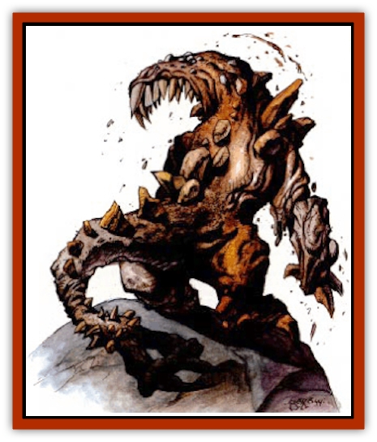

# Elemental Beast - Athas - Earth

| Statistic | **Elemental Beast (Athas), Earth** |
| --- | --- |
| **Activity Cycle:** | Any |
| **Alignment:** | Neutral |
| **Armor Class:** | 2 |
| **Climate/Terrain:** | Any land |
| **Damage/Attack:** | 3d6/2d6 |
| **Diet:** | Earth |
| **Frequency:** | Very rare |
| **Hit Dice:** | 8+3 |
| **Intelligence:** | Semi- (2-4) |
| **Magic Resistance:** | Nil |
| **Morale:** | Elite (13-14) |
| **Movement:** | 12 |
| **No. Appearing:** | 1 |
| **No. of Attacks:** | 2 |
| **Organization:** | Solitary |
| **Size:** | L (8' tall) |
| **Special Attacks:** | See below |
| **Special Defenses:** | +1 or better weapon to hit |
| **THAC0:** | 13 |
| **Treasure:** | Nil |
| **XP Value:** | 3,000 |

The elemental beast of earth is native to the Elemental Plane of Earth. An earth elemental beast is made solely of rock, minerals, clay, and dirt, all in their purest forms. There is no foreign or organic substances within the creature.

An earth beast stands approximately 8 feet tall at the shoulders. It is quadrupedal and vaguely resembles a reptile with an elongated tail. It has an inordinately large mouth with rows of sharp teeth made from various rocks and minerals. A single ridge of spikes runs down the center of its back. The spikes cluster at end of the tail like a mornnigstar. It emits a growl that resembles the sound of an avalanche or an earthquake.

**Combat:** The elemental beast of earth can move as swiftly and as easily through earth and rock as it does above ground. On Athas its favored attack method is erupt from under the surface and surprise its victims. A target of such an attack has only a 1 in 6 chance of detecting the ground movement and preparing for any conflict.

An earth elemental beast attacks using a powerful bite that causes 3-18 (3d6) points of damage. If the attack roll for the earth beast is a natural 20 and its opponent is no larger than medium-sized, the target is caught in the beast's jaws. Each round, the victim must make a successful Bend Bars/Lift Gates roll to escape the beast's crushing laws. If the victim fails, he automatically receives 3'18 (3d6) points of damage. Attacks by the victim are possible if a successful Dexterity check is made at a -2.

The beast can also whip its tail at an 360 degree arc at any opponent within 15 feet. Such an attack, if successful, causes 2-12 (2d6) points of damage and the victim must make a successful save vs. paralyzation or be stunned for 1-6 (1d6) rounds. A stunned victim can make no attacks for the duration of the effect.

In siege warfare, the earth elemental beast causes damage equal to that of a small catapult (8 points of damage to hard stone, 11 points to soft stone, 10 points to earthen structures, 17 points to wood, and 9 points to thick wood). It can dig a tunnel through as much as 20 feet of stone per round.

While an earth beast enjoys an immunity to nonmagical weapons, it does have vulnerabilities. If the creature is levitated or flying, it panics. It will attempt to reach the ground by any means. An earth elemental beast cannot travel through water. All attacks made by the earth elemental beast against airborne or waterborne creatures are made at -2 and all damage is reduced by 1 hp per die (to a minimum of 1 point of damage per die).

The priest spell *earthquake* causes 8-64 (8d8) points of damage to the elemental, but only if the creature is touched by the priest at the time of casting. A *rock to mud* spell slows the earth beast to half movement both above and below ground. Attacks by the beast can only be made every other round because of this sluggishness.

**Habitat/Society:** The earth elemental beast is solitary creature and makes its home on the Elemental Plane of Earth. The primary function of its razor-sharp teeth is to crush rocks, stones, minerals, and earth, from which it gains its sustenance. On Athas, a stranded earth beast makes its home in the mountains and rocky badlands, though it sometimes inhabit other areas as well. The earth beast finds no value in treasure, but it has a great fondness for the taste of gems and precious metals and can sense them within a 30-foot radius. Because of the metal-poor nature of Athas, the earth beast rarely gets to enjoy these delicacies.

**Ecology:** This beast is frequently caught and trained by the evil race of [[Genie|djinni]] known as dao. Frequently the beast is ill-treated by its malicious masters and seeks a means of escape. An elemental beast in such a state may not be upset at having its routine interrupted by being summoned.

---
## Discovery & Documentation

**Source Publication:** Dark Sun Appendix II - Terrors Beyond Tyr (1991)
**Campaign Setting:** Dark Sun
**Author(s):** Jim Atkiss, Steve Brown, Timothy B. Brown, Andrew P. Morris, Bruce Nesmith, Wes Nicholson, Bill Slavicsek

### Other Creatures Found in This Source Book
   * [[Aarakocra_Athas|Aarakocra (Athas)]]
   * [[Animal_Domestic_Athas_II|Animal, Domestic (Athas) II]]
   * [[Aviarag|Aviarag]]
   * [[Baazrag|Baazrag]]
   * [[Baazrag_Boneclaw|Baazrag, Boneclaw]]
   * [[Bloodgrass|Bloodgrass]]
   * [[Cactus_Hunting|Cactus, Hunting]]
   * [[Cactus_Rock|Cactus, Rock]]
   * [[Cilops|Cilops]]
   * [[Crodlu|Crodlu]]
   * [[Dagorran|Dagorran]]
   * [[Dhaot|Dhaot]]
   * [[Drake_Lesser_Athas_General_Information|Drake, Lesser (Athas), General Information]]
   * [[Drake_Lesser_Athas_Magma|Drake, Lesser (Athas), Magma]]
   * [[Drake_Lesser_Athas_Rain|Drake, Lesser (Athas), Rain]]
   * [[Drake_Lesser_Athas_Silt|Drake, Lesser (Athas), Silt]]
   * [[Drake_Lesser_Athas_Sun|Drake, Lesser (Athas), Sun]]
   * [[Dray|Dray]]
   * [[Drik|Drik]]
   * [[Dune_Reaper|Dune Reaper]]
   * [[Dwarf_Athas|Dwarf (Athas)]]
   * [[Elemental_Beast_Athas_Air|Elemental Beast (Athas), Air]]
   * [[Elemental_Beast_Athas_Fire|Elemental Beast (Athas), Fire]]
   * [[Elemental_Beast_Athas_Water|Elemental Beast (Athas), Water]]
   * [[Elf_Athas|Elf (Athas)]]
   * [[Fael|Fael]]
   * [[Feylaar|Feylaar]]
   * [[Fordorran|Fordorran]]
   * [[Giant_Half-giant|Giant, Half-giant]]
   * [[Giant_Shadow|Giant, Shadow]]
   * [[Golem_Athas_Magma|Golem (Athas), Magma]]
   * [[Golem_Athas_Salt|Golem (Athas), Salt]]
   * [[Golem_Athas_General_Information|Golem (Athas), General Information]]
   * [[Gorak|Gorak]]
   * [[Halfling_Athas|Halfling (Athas)]]
   * [[Human_Athas|Human (Athas)]]
   * [[Jhakar|Jhakar]]
   * [[Kaisharga|Kaisharga]]
   * [[Kes'trekel|Kes'trekel]]
   * [[Klar|Klar]]
   * [[Krag|Krag]]
   * [[Kragling|Kragling]]
   * [[Lirr|Lirr]]
   * [[Mastyrial|Mastyrial]]
   * [[Meorty|Meorty]]
   * [[Mul|Mul]]
   * [[Nikaal|Nikaal]]
   * [[Paraelemental_Beast_General_Information|Paraelemental Beast, General Information]]
   * [[Paraelemental_Beast_Magma|Paraelemental Beast, Magma]]
   * [[Paraelemental_Beast_Rain|Paraelemental Beast, Rain]]
   * [[Paraelemental_Beast_Silt|Paraelemental Beast, Silt]]
   * [[Paraelemental_Beast_Sun|Paraelemental Beast, Sun]]
   * [[Pakubrazi|Pakubrazi]]
   * [[Psionocus|Psionocus]]
   * [[Psurlon|Psurlon]]
   * [[Raaig|Raaig]]
   * [[Retriever_Obsidian|Retriever, Obsidian]]
   * [[Ruktoi|Ruktoi]]
   * [[Ruvoka_Athas|Ruvoka (Athas)]]
   * [[Sand_Howler|Sand Howler]]
   * [[Scorpion_Athas|Scorpion (Athas)]]
   * [[Seed_Brain|Seed, Brain]]
   * [[Silt_Horror_Black|Silt Horror, Black]]
   * [[Silt_Horror_Magma|Silt Horror, Magma]]
   * [[Silt_Horror_Red|Silt Horror, Red]]
   * [[Silt_Spawn|Silt Spawn]]
   * [[Slig|Slig]]
   * [[Spider_Athas|Spider (Athas)]]
   * [[Spinewyrm|Spinewyrm]]
   * [[Ssurran|Ssurran]]
   * [[Stalking_Horror|Stalking Horror]]
   * [[Tarek|Tarek]]
   * [[Tari|Tari]]
   * [[Thri-kreen|Thri-kreen]]
   * [[T'liz|T'liz]]
   * [[Tohr-kreen_II|Tohr-kreen II]]
   * [[Tohr-kreen_III|Tohr-kreen III]]
   * [[Trin|Trin]]
   * [[Tul'k|Tul'k]]
   * [[Undead_Athas_General_Information|Undead (Athas), General Information]]
   * [[Wraith_Athas|Wraith (Athas)]]
   * [[Xerichou|Xerichou]]
   * [[Zombie_Thinking|Zombie, Thinking]]
