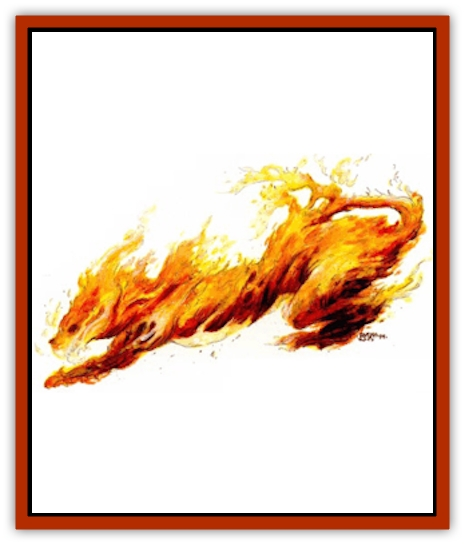

# Elemental Beast - Athas - Fire

| Statistic | **Elemental Beast (Athas), Fire** |
| --- | --- |
| **Activity Cycle:** | Any |
| **Alignment:** | Neutral |
| **Armor Class:** | 2 |
| **Climate/Terrain:** | Any dry land |
| **Damage/Attack:** | 1d8/1d8/2d6 |
| **Diet:** | Fire or combustible material |
| **Frequency:** | Very rare |
| **Hit Dice:** | 8+3 |
| **Intelligence:** | Semi (2-4) |
| **Magic Resistance:** | Nil |
| **Morale:** | Very steady (13-14) |
| **Movement:** | 18 |
| **No. Appearing:** | 1 |
| **No. of Attacks:** | 3 |
| **Organization:** | Solitary |
| **Size:** | L (8' tall) |
| **Special Attacks:** | See below |
| **Special Defenses:** | +1 weapon or better to hit |
| **THAC0:** | 13 |
| **Treasure:** | Nil |
| **XP Value:** | 3,000 |

A fire elemental beast is large four-legged creature made from pure fire. It can be summoned to any dry area, but requires a small flame to give the beast a starting point from which it can collect the heat from the surrounding area to generate its flaming body.

The fire beast resembles a large pantherlike beast with extremely broad shoulders. The elemental fire that dances and flickers throughout its body gives the illusion of rippling muscles beneath a fiery orange coat. A mane of pure fire surrounds its head and its eyes are black voids that look like empty sockets. Flames lick out from its formless, ever-changing face, but there is the consistent appearance of large fiery teeth. The fire beast emits a fierce bellow that sounds like the roar of a hundred fires.

**Combat:** The movement of the fire elemental beast is smooth, graceful, and silent. When moving at full speed, the creature resembles a *fireball* and has frequently been mistaken for one when summoned in combat. Only when it stops can its true nature be realized.

The beast attacks using its two flaming paws (1d8 damage each) and a searing bite (2d6 damage). These attacks can be directed at two different opponents simultaneously. Any target successfully attacked risks additional damage from ignited clothing, equipment, or debris about the victim. The item must successfully save vs. magical fire at -2 or the victim receives an additional 1-6 (1d6) points of damage.

The elemental fire beast can also breathe a cone of fire 30' long and 10' wide at the base once every 3 rounds. Its fiery breath causes 2-16 (2d8) points of damage. All creatures within its radius are allowed a save vs. breath weapon for half damage. A victim successfully attacked with the beast's breath receives an additional 2-12 (2d6) points of damage of ignition damage.

Mundane fire does no damage, but can pollute the purity of the element within the creature. A successful save vs. poison must be made by the fire beast or it enters a fury for 1-6 (1d6) rounds. In this berserk frenzy, all attacks by the beast are made at +2, but it suffers a -2 penalty to its AC. Magical fires such as those caused by a spell, staff, or other magical item, cause only 1 point of damage per hit die of damage caused by the incantation.

While it is a powerful foe, the elemental fire beast does have weaknesses. It cannot travel over surfaces made of nonflammable liquids. Also, water based spells such as *create water* cause 1d8 points of damage per level of the caster to the beast. Any saving throws against such attacks are made at -2.

**Habitat/Society:** The fire elemental beast has no true place in the natural order of Athas. The beast normally hunts, runs, and plays in the fire fields of the elemental planes.

If stranded on Athas, it suffers the pain of feeding on mundane fire. It can eat combustible materials such as wood, cloth, or coal, but detests them. This diet causes the fire beast to weaken and its fire becomes dimmer until it blinks out of existence. Each month, the fire beast must make a successful save vs. poison at a -2 cumulative penalty. If the save is failed, the beast deteriorates by 1 HD. If it runs out of hit dice, it vanishes. The process can be reversed if it manages to procure a diet of pure elemental fire for at least two weeks.

**Ecology:** The elemental beast of fire is resentful of being Summoned away from the fire fields of it home plane. The nature of the elements on Athas causes the fire beast extreme discomfort and outright pain. As a result, the elemental fire beast is one of the most difficult of the elemental beasts to control. When first summoned, the beast can make a successful save vs. spell at -4 to break free of the caster's control. In such an instance, the beast immediately attacks its summoner.

---
## Discovery & Documentation

**Source Publication:** Dark Sun Appendix II - Terrors Beyond Tyr (1991)
**Campaign Setting:** Dark Sun
**Author(s):** Jim Atkiss, Steve Brown, Timothy B. Brown, Andrew P. Morris, Bruce Nesmith, Wes Nicholson, Bill Slavicsek

### Other Creatures Found in This Source Book
   * [[Aarakocra_Athas|Aarakocra (Athas)]]
   * [[Animal_Domestic_Athas_II|Animal, Domestic (Athas) II]]
   * [[Aviarag|Aviarag]]
   * [[Baazrag|Baazrag]]
   * [[Baazrag_Boneclaw|Baazrag, Boneclaw]]
   * [[Bloodgrass|Bloodgrass]]
   * [[Cactus_Hunting|Cactus, Hunting]]
   * [[Cactus_Rock|Cactus, Rock]]
   * [[Cilops|Cilops]]
   * [[Crodlu|Crodlu]]
   * [[Dagorran|Dagorran]]
   * [[Dhaot|Dhaot]]
   * [[Drake_Lesser_Athas_General_Information|Drake, Lesser (Athas), General Information]]
   * [[Drake_Lesser_Athas_Magma|Drake, Lesser (Athas), Magma]]
   * [[Drake_Lesser_Athas_Rain|Drake, Lesser (Athas), Rain]]
   * [[Drake_Lesser_Athas_Silt|Drake, Lesser (Athas), Silt]]
   * [[Drake_Lesser_Athas_Sun|Drake, Lesser (Athas), Sun]]
   * [[Dray|Dray]]
   * [[Drik|Drik]]
   * [[Dune_Reaper|Dune Reaper]]
   * [[Dwarf_Athas|Dwarf (Athas)]]
   * [[Elemental_Beast_Athas_Air|Elemental Beast (Athas), Air]]
   * [[Elemental_Beast_Athas_Earth|Elemental Beast (Athas), Earth]]
   * [[Elemental_Beast_Athas_Water|Elemental Beast (Athas), Water]]
   * [[Elf_Athas|Elf (Athas)]]
   * [[Fael|Fael]]
   * [[Feylaar|Feylaar]]
   * [[Fordorran|Fordorran]]
   * [[Giant_Half-giant|Giant, Half-giant]]
   * [[Giant_Shadow|Giant, Shadow]]
   * [[Golem_Athas_Magma|Golem (Athas), Magma]]
   * [[Golem_Athas_Salt|Golem (Athas), Salt]]
   * [[Golem_Athas_General_Information|Golem (Athas), General Information]]
   * [[Gorak|Gorak]]
   * [[Halfling_Athas|Halfling (Athas)]]
   * [[Human_Athas|Human (Athas)]]
   * [[Jhakar|Jhakar]]
   * [[Kaisharga|Kaisharga]]
   * [[Kes'trekel|Kes'trekel]]
   * [[Klar|Klar]]
   * [[Krag|Krag]]
   * [[Kragling|Kragling]]
   * [[Lirr|Lirr]]
   * [[Mastyrial|Mastyrial]]
   * [[Meorty|Meorty]]
   * [[Mul|Mul]]
   * [[Nikaal|Nikaal]]
   * [[Paraelemental_Beast_General_Information|Paraelemental Beast, General Information]]
   * [[Paraelemental_Beast_Magma|Paraelemental Beast, Magma]]
   * [[Paraelemental_Beast_Rain|Paraelemental Beast, Rain]]
   * [[Paraelemental_Beast_Silt|Paraelemental Beast, Silt]]
   * [[Paraelemental_Beast_Sun|Paraelemental Beast, Sun]]
   * [[Pakubrazi|Pakubrazi]]
   * [[Psionocus|Psionocus]]
   * [[Psurlon|Psurlon]]
   * [[Raaig|Raaig]]
   * [[Retriever_Obsidian|Retriever, Obsidian]]
   * [[Ruktoi|Ruktoi]]
   * [[Ruvoka_Athas|Ruvoka (Athas)]]
   * [[Sand_Howler|Sand Howler]]
   * [[Scorpion_Athas|Scorpion (Athas)]]
   * [[Seed_Brain|Seed, Brain]]
   * [[Silt_Horror_Black|Silt Horror, Black]]
   * [[Silt_Horror_Magma|Silt Horror, Magma]]
   * [[Silt_Horror_Red|Silt Horror, Red]]
   * [[Silt_Spawn|Silt Spawn]]
   * [[Slig|Slig]]
   * [[Spider_Athas|Spider (Athas)]]
   * [[Spinewyrm|Spinewyrm]]
   * [[Ssurran|Ssurran]]
   * [[Stalking_Horror|Stalking Horror]]
   * [[Tarek|Tarek]]
   * [[Tari|Tari]]
   * [[Thri-kreen|Thri-kreen]]
   * [[T'liz|T'liz]]
   * [[Tohr-kreen_II|Tohr-kreen II]]
   * [[Tohr-kreen_III|Tohr-kreen III]]
   * [[Trin|Trin]]
   * [[Tul'k|Tul'k]]
   * [[Undead_Athas_General_Information|Undead (Athas), General Information]]
   * [[Wraith_Athas|Wraith (Athas)]]
   * [[Xerichou|Xerichou]]
   * [[Zombie_Thinking|Zombie, Thinking]]
