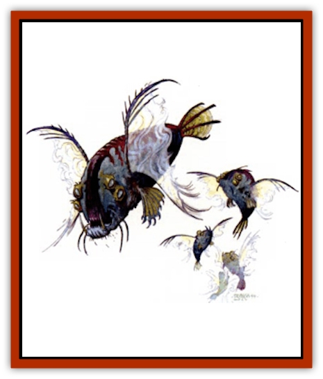

# Elemental Beast - Athas - Water

| Statistic | **Elemental Beast (Athas), Water** |
| --- | --- |
| **Activity Cycle:** | Any |
| **Alignment:** | Neutral |
| **Armor Class:** | 2 |
| **Climate/Terrain:** | Any water |
| **Damage/Attack:** | 1d8 each |
| **Diet:** | Water |
| **Frequency:** | Very rare |
| **Hit Dice:** | 1+1 |
| **Intelligence:** | Semi- (2-4) |
| **Magic Resistance:** | Nil |
| **Morale:** | Elite (13-14) |
| **Movement:** | 6, Sw 18, Fl 18 |
| **No. Appearing:** | 5-10 (1d6+4) |
| **No. of Attacks:** | 5-10 (one for each) |
| **Organization:** | School |
| **Size:** | S (1' long) |
| **Special Attacks:** | See below |
| **Special Defenses:** | +1 or better weapon to hit |
| **THAC0:** | Special |
| **Treasure:** | Nil |
| **XP Value:** | 300 |

Water elemental beasts can be summoned to any area near a large volume of water. The water must be relatively pure. The summoner can use no other tainted liquid such as ale or wine. A summoner needs at least 700 cubic feet of water (10'x10'x7' for example) to support a spell summoning this creature. They are always summoned as a school, one beast for each hit die of elemental summoned.

Water elemental beasts resemble flying [[Piranha|piranhas]]. They range in size from 9 to 12 inches and have fanlike membranous wings that fold from the back. These creatures are always encountered in schools, but they move and attack in combat as if there was a single intelligence controlling them.

The most telling feature of the beasts is their long, sharp teeth that seem overlarge for the small creatures. The only noise they make is caused by their movement through the water that they call home.

**Combat:** In combat, a school of water elemental beasts moves as if it were one creature. It darts and swims, attacks and retreats, as one. Because of this oneness, a school of water elemental beasts attacks as if it were a creature of as many Hit Dice as there are individuals in the school (school of 8 equals 8 HD). When an individual is destroyed, the effective Hit Dice of the school is also lowered by one. A school of water elemental beasts also gets a cumulative saving throw as if it were a creature of as many Hit Dice as individuals within the school.

When attacking, each beast can dart in and cause 1d8 points of damage with its sharklike teeth. It can also fly up to 18 feet before landing. Attacks made while flying are made as if the beast were charging, with a +2 attack bonus, but the beast suffers a -1 penalty to its Armor Class. When attacking in water, the beast is invisible and it gains automatic surprise against beings not native to their water environment. Attacks against a submerged elemental water beast are made with a -4 penalty, in addition to any other penalty received for underwater combat.

When attacking while flying, the school has an instinct to fly directly into the face of air-breathing creatures. If the attack roll is a natural 20, one of the water elemental beasts separates from the school and lodges in the throat of the victim. The victim must make a successful save vs. paralyzation or suffer 1-6 (1d6) points of damage per round in suffocation damage. Each round after the first, the victim must also make another saving throw or pass out from lack of air. If the saving throw is ever successful, the victim spits out the water beast. Otherwise, the elemental water beast emerges when the victim dies.

A water beast is immune to nonmagical weapons. It does have several limitations, however. The water beast cannot travel more than 20 feet beyond the shores of the water it was summoned to and must return every 2 rounds or it suffers 1d8 points of damage. Also, fire-based attacks such as *fireball* and *flamestrike* cause double damage. For all area effect attacks, damage is divided evenly among them.

**Habitat/Society:** Schools of water elemental beasts swim in the pure waters of their home elemental plane and are not indigenous to any other plane.

**Ecology:** [[Genie|Marids]] have been known to use water elemental beasts as guardians and for hunting and tracking. On Athas, these elemental beasts are the least often summoned since there are few bodies of water large enough to accommodate the creatures. Also, the dryness of Athas can cause water beasts great pain. Every month the school makes saving throw vs. death. If it fails, the school loses one beast.

---
## Discovery & Documentation

**Source Publication:** Dark Sun Appendix II - Terrors Beyond Tyr (1991)
**Campaign Setting:** Dark Sun
**Author(s):** Jim Atkiss, Steve Brown, Timothy B. Brown, Andrew P. Morris, Bruce Nesmith, Wes Nicholson, Bill Slavicsek

### Other Creatures Found in This Source Book
   * [[Aarakocra_Athas|Aarakocra (Athas)]]
   * [[Animal_Domestic_Athas_II|Animal, Domestic (Athas) II]]
   * [[Aviarag|Aviarag]]
   * [[Baazrag|Baazrag]]
   * [[Baazrag_Boneclaw|Baazrag, Boneclaw]]
   * [[Bloodgrass|Bloodgrass]]
   * [[Cactus_Hunting|Cactus, Hunting]]
   * [[Cactus_Rock|Cactus, Rock]]
   * [[Cilops|Cilops]]
   * [[Crodlu|Crodlu]]
   * [[Dagorran|Dagorran]]
   * [[Dhaot|Dhaot]]
   * [[Drake_Lesser_Athas_General_Information|Drake, Lesser (Athas), General Information]]
   * [[Drake_Lesser_Athas_Magma|Drake, Lesser (Athas), Magma]]
   * [[Drake_Lesser_Athas_Rain|Drake, Lesser (Athas), Rain]]
   * [[Drake_Lesser_Athas_Silt|Drake, Lesser (Athas), Silt]]
   * [[Drake_Lesser_Athas_Sun|Drake, Lesser (Athas), Sun]]
   * [[Dray|Dray]]
   * [[Drik|Drik]]
   * [[Dune_Reaper|Dune Reaper]]
   * [[Dwarf_Athas|Dwarf (Athas)]]
   * [[Elemental_Beast_Athas_Air|Elemental Beast (Athas), Air]]
   * [[Elemental_Beast_Athas_Earth|Elemental Beast (Athas), Earth]]
   * [[Elemental_Beast_Athas_Fire|Elemental Beast (Athas), Fire]]
   * [[Elf_Athas|Elf (Athas)]]
   * [[Fael|Fael]]
   * [[Feylaar|Feylaar]]
   * [[Fordorran|Fordorran]]
   * [[Giant_Half-giant|Giant, Half-giant]]
   * [[Giant_Shadow|Giant, Shadow]]
   * [[Golem_Athas_Magma|Golem (Athas), Magma]]
   * [[Golem_Athas_Salt|Golem (Athas), Salt]]
   * [[Golem_Athas_General_Information|Golem (Athas), General Information]]
   * [[Gorak|Gorak]]
   * [[Halfling_Athas|Halfling (Athas)]]
   * [[Human_Athas|Human (Athas)]]
   * [[Jhakar|Jhakar]]
   * [[Kaisharga|Kaisharga]]
   * [[Kes'trekel|Kes'trekel]]
   * [[Klar|Klar]]
   * [[Krag|Krag]]
   * [[Kragling|Kragling]]
   * [[Lirr|Lirr]]
   * [[Mastyrial|Mastyrial]]
   * [[Meorty|Meorty]]
   * [[Mul|Mul]]
   * [[Nikaal|Nikaal]]
   * [[Paraelemental_Beast_General_Information|Paraelemental Beast, General Information]]
   * [[Paraelemental_Beast_Magma|Paraelemental Beast, Magma]]
   * [[Paraelemental_Beast_Rain|Paraelemental Beast, Rain]]
   * [[Paraelemental_Beast_Silt|Paraelemental Beast, Silt]]
   * [[Paraelemental_Beast_Sun|Paraelemental Beast, Sun]]
   * [[Pakubrazi|Pakubrazi]]
   * [[Psionocus|Psionocus]]
   * [[Psurlon|Psurlon]]
   * [[Raaig|Raaig]]
   * [[Retriever_Obsidian|Retriever, Obsidian]]
   * [[Ruktoi|Ruktoi]]
   * [[Ruvoka_Athas|Ruvoka (Athas)]]
   * [[Sand_Howler|Sand Howler]]
   * [[Scorpion_Athas|Scorpion (Athas)]]
   * [[Seed_Brain|Seed, Brain]]
   * [[Silt_Horror_Black|Silt Horror, Black]]
   * [[Silt_Horror_Magma|Silt Horror, Magma]]
   * [[Silt_Horror_Red|Silt Horror, Red]]
   * [[Silt_Spawn|Silt Spawn]]
   * [[Slig|Slig]]
   * [[Spider_Athas|Spider (Athas)]]
   * [[Spinewyrm|Spinewyrm]]
   * [[Ssurran|Ssurran]]
   * [[Stalking_Horror|Stalking Horror]]
   * [[Tarek|Tarek]]
   * [[Tari|Tari]]
   * [[Thri-kreen|Thri-kreen]]
   * [[T'liz|T'liz]]
   * [[Tohr-kreen_II|Tohr-kreen II]]
   * [[Tohr-kreen_III|Tohr-kreen III]]
   * [[Trin|Trin]]
   * [[Tul'k|Tul'k]]
   * [[Undead_Athas_General_Information|Undead (Athas), General Information]]
   * [[Wraith_Athas|Wraith (Athas)]]
   * [[Xerichou|Xerichou]]
   * [[Zombie_Thinking|Zombie, Thinking]]
