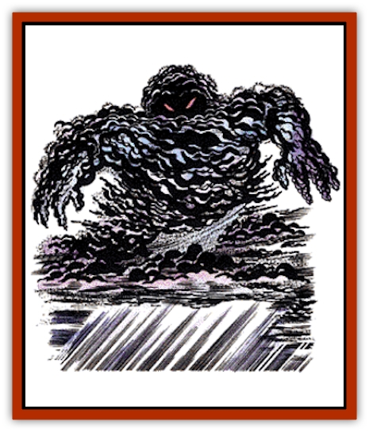

# Elemental - Composite

| Statistic | **Skriaxit** | **Tempest** |
| --- | --- | --- |
| **Activity Cycle:** | Any | Any |
| **Alignment:** | Neutral evil | Chaotic neutral |
| **Armor Class:** | -5 | 2 |
| **Climate/Terrain:** | Subtropical desert | Any outside |
| **Damage/Attack:** | 2-20/2-20 | 2-16 |
| **Diet:** | See below | See below |
| **Frequency:** | Very rare | Very rare |
| **Hit Dice:** | 16+16 or 24+24 | 9-12 |
| **Intelligence:** | Exceptional (15-16) | Low to average (5-10) |
| **Magic Resistance:** | 50% | Nil |
| **Morale:** | Fanatic (17-18) | Champion (15-16) |
| **Movement:** | 12, 18, or 24 | Fl 24 |
| **No. Appearing:** | 3-18 | 1 |
| **No. of Attacks:** | 2 | 1 |
| **Organization:** | Pack | Solitary |
| **Size:** | L (10' tall) | G (50' diameter) |
| **Special Attacks:** | Sandstorm, <i>dispel magic</i> | Whirlwind, lightning |
| **Special Defenses:** | +2 or better weapon to hit; see below |  2 or better weapon to hit; see below |
| **THAC0:** | 5 | 9-10 HD: 11 / 11-12 HD: 9 |
| **Treasure:** | Nil | K |
| **XP Value:** | 16+16 HD: 16,000 / 24+24 HD: 24,000 | 9 HD: 6,000 / 10 HD: 7,000 / 11 HD: 8,000 / 12 HD: 9,000 |

## Tempest

The tempest is a living storm which appears as a dark storm cloud of comparatively small size. Human or bestial features can often be seen in the roiling vapors of the tempest. Silver veins extend across the creature and carry the electrical impulses that maintain the storm's energy.

Tempests have no language that humans may learn. They can communicate with [[Elemental_Air_Earth|air]] and [[Elemental_Fire_Water|water]] [[Elemental_General_Information|elementals]] and their kin, and genies, through subtle wind buffets and spatterings of precipitation. A few, perhaps 10%, have learned to speak a few words of Common. Their voices are very soft and sibilant, with a hint of malice behind the words.

**Combat:** Tempests are territorial and consider any violation of their airspace to be a direct challenge. They feed on moisture from animals and often hunt in and around their territories. They have a number of innate abilities which they can use to make life miserable for other creatures. Unless otherwise specified, all special abilities are used as if the tempest were a 9th-level wizard. A tempest can make two attacks each round, one using its wind powers and one using its lightning power.

Once per round, a tempest can use *wind wall* or *gust of wind*, or may attack with a strong wind buffet for 2-16 points of damage. Alternately, it may create a small whirlwind, which is conical in shape, 10 feet in diameter at the bottom, and 30 feet in diameter at the top. The whirlwind can be up to 50 feet high, and must connect to the tempest's main body.

The tempest takes one full round to create the whirlwind, which can cover an area of 100 square feet per round. Within that area, it automatically sweeps away and kills all creatures with less than 2 Hit Dice, and causes 2d6 points of damage to all creatures which it fails to kill outright.

Tempests may also use their powers over the air to penalize missile attacks by -6, or to batter down flying creatures, causing falling damage to flying creatures that fail to make a successful saving throw vs. paralyzation.

A tempest can also cast a *lightning bolt* once per round, at one victim. The *lightning bolt* causes one die of damage per Hit Die of the tempest. A victim of a lightning attack can make a saving throw vs. spells; if successful, the victim takes only half damage. The tempest's *lightning bolt* is like the 3rd-level wizard spell in other respects, having a length of 80 feet, setting fire to combustibles, melting metals, and shattering barriers. An exceptionally hungry or perturbed tempest may use lightning to destroy an entire building to reach the creatures inside.

Tempests can also use a chilling wind to affect opponents, causing damage as a *chill touch* spell, 1d4 points of damage and the loss of 1 point of Strength, unless the victim makes a successful saving throw vs. spells. This attack takes the place of either an electrical attack or another wind attack.

A tempest can produce up to 20 gallons of rain per round if it concentrates and forgoes other attacks while raining. While precipitation is usually evenly distributed throughout its area, the tempest can concentrate the fall to fill a hole, wash out a bridge, or otherwise harm its victims.

Tempests are immune to wind, gas, and water attacks, and take only half damage from electrical or cold-based attacks. They are immune to all weapons of less than +2 enchantment.

**Habitat/Society:** There is much speculation about the origin of these beings, who are apparently related to elementals and to [[Genie|genie-kind]]. Tempests are composed of all four basic elements, fire, earth, air, and water; fire in the form of lightning, earth in their silver "circulatory system", air in their winds, and water in the form of rain. They may be summoned accidentally when a spellcaster tries to summon an elemental, especially one of air or water. At the DM's option, when a summoning is interfered with, the  caster may be given a 10%-50% chance to summon a tempest. These beings may also be attracted by a *weather summoning* spell, with a 1% (non-cumulative) chance of appearing each time a spell is cast.

Some sages believe these creatures are [[Genie|jann]] that have been injured in some way and cannot retain human form. Whatever their origin, they do breed and reproduce as storms. Though "male" and "female" do not truly describe the different types of tempests, there are two genders. When living storms of different genders meet, they have a brief, tempestuous affair, causing a great conflagration that may last more than a week. Hurricanes or tornadoes are produced irregularly from the mass, to wreak havoc upon the surrounding area.

When the storm finally breaks, the two tempests leave the area, and the residue they leave behind forms 1d4 infant tempests. These infant storms, sometimes referred to as tantrums, often travel together until they reach maturity, one year after birth. The young storms have 6 Hit Dice each, and can use only the *gust of wind power*, besides producing rain.

Most tempests quite naturally seem to have very stormy dispositions. Their hunger for animal life goes beyond their need for the moisture contained in animal bodies. Some sages speculate that their physical form, or possibly some event in their history, causes them to hate animal life. It is quite possible that the electrical impulses produced by animal brains cause pain to the tempest.

Tempests may be related to skriaxits, the living sandstorms of some worlds' deserts. No tempest has ever been known to encounter a skriaxit, and their relationship and possible interactions are completely unknown.

**Ecology:** Tempests feed on the moisture found in animal bodies. Though unable to cause harm to living creatures by draining their moisture, they hover close to the ground after a battle to suck the water from dead opponents, as well as any water they may have precipitated during the battle. They are sometimes found scavenging after great battles between humans. By removing water from a corpse, they render it inviable to return to life via a *raise dead* spell, though *resurrection* and other spells work normally.

When a tempest is killed, a silver residue rains down from its form. If carefully gathered, this residue provides a mass of silver equivalent to 3d6 silver pieces. Though valuable as a precious metal, the silver can also be used as a component in making a wand of lightning or casting a weather-related spell. Bits of the silver are also useful for making other weather or elemental related magical items.

Genies and elementals are enemies of tempests; they often attack them, and tempests respond in like manner. However, some genies, especially djinn and marids, keep tempests as pets, training them as guards and to attack.

Tempests can be quite devastating to a local ecology if annoyed, and can cause great damage with wind, rain, and other attack forms. Living storms are never found inside buildings or underground.

## Skriaxit

[[Skriaxit|Skriaxits]], also called blackstorms or living sandstorms, are the most feared creatures in many deserts. Spirits of retribution summoned millennia ago by ancient gods, blackstorms combine the elements of earth and air to dangerous effect. They are, fortunately, only rarely active. They speak the tongue of air elementals and their own language, a howling, shrieking tongue that frightens most humans who hear it.

Much like very large versions of the dust devils created by the wizard's spell, blackstorms take the sand and the dust of the desert and whirl it to create their 10-foot-tall conical forms. At rest, a skriaxit appears to be a wind-scattered pile of black dust. As a pack, they create their greatest terror, generating high winds and a fierce sandstorm that can render a human fleshless in minutes.

**Combat:** Skriaxits move by generating a large vortex of wind that propels them at high speeds. If there are 1-6 skriaxits together, their speed is 12; 7-12 skriaxits have a speed of 18; if there are 13 or more skriaxits, their speed is 24. The skriaxit vortex creates a sandstorm in a 200-yard radius around them; those caught in this storm suffer 1 point of damage per round per skriaxit (so if there are 12 skriaxits in a pack, victims take 12 points of damage per round.

Within this sandstorm, the skriaxit pack constantly dispels magic as a 16th-level wizard.

Each skriaxit can form its winds into razor sharp lashes, inflicting 2d10 points of damage on a successful strike.

Though they were originally summoned from the elemental plane of Air, they have merged with earth, and the Prime Material plane is now their home. Thus, they cannot be sent to an elemental plane by a *holy word* or similar magic. No known magic can control them, though they are susceptible to *wards* against air elementals.

Each skriaxit pack is led by a Great Skriax, the most evil member of the pack. This creature has 24+24 Hit Dice and gains a +4 bonus to attack and damage rolls.

**Habitat/Society:** Skriaxits are highly intelligent, but extremely evil, elementals, combinations of the elements of air and earth. They hate and fear nothing, but simply delight in destruction. They feed on terror and destruction; once they have caused enough catastrophe, they sleep for 1d3 centuries. While asleep, they cannot be affected in any way by any being. They reawaken when hungry. They view humans, demihumans, and humanoids as playthings, with the same sadistic attitude as a human child playing with a fly. They may amuse themselves by listening to humans bargain with them, but humans have nothing of interest to offer them.

**Ecology:** Skriaxits feed upon the emotions of terror and fear they generate in those they destroy and kill.

**Arctic Tempest**

  This is a variety of tempest found only in arctic regions and some of the colder temperate lands. While they are similar to tempests in most respects, their special powers differ. They cannot use the *whirlwind* or *lightning bolt* powers of the standard tempest. Instead, they can either cause snow to fall or cast *ice storm* spells. The arctic tempest usually uses a hail form of *ice storm*, but may use sleet instead. It can cause very cold snow to fall, inflicting 9d4+9 points of cold damage to those beneath it. Victims who make a successful saving throw vs. spells suffer only half damage from the attack.

Like the standard tempest, the arctic variety can make only two attacks per round, one using a wind power, such as gust of wind or wind wall, and one using a cold-based power, such as *ice storm* or *cause snow*. It may also substitute an electrical attack for either of its normal attacks, causing damage as a *shocking grasp* spell for 1d8+9 points of damage.

**Black Cloud of Vengeance**

  [[Black_Cloud_of_Vengeance|This living storm]], usually found in deserts, combines the elements of fire and air. It unleashes a fiery rain which causes 7d10 damage to all beneath it, though a successful saving throw vs. breath weapon halves the damage. It then fans the flames, and will they continue to burn as long as there is fuel.

---
## Discovery & Documentation

**Source Publication:** Monstrous Manual (1995)
**Campaign Setting:** Advanced Dungeons & Dragons 2nd Edition
**Author(s):** Tim Beach

### Other Creatures Found in This Source Book
   * [[Aarakocra|Aarakocra]]
   * [[Aboleth|Aboleth]]
   * [[Ankheg|Ankheg]]
   * [[Arcane|Arcane]]
   * [[Argos|Argos]]
   * [[Aurumvorax|Aurumvorax]]
   * [[Baatezu_Lesser_Abishai|Baatezu, Lesser, Abishai]]
   * [[Baatezu_General_Information|Baatezu, General Information]]
   * [[Baatezu_Greater_Pit_Fiend|Baatezu, Greater, Pit Fiend]]
   * [[Banshee|Banshee]]
   * [[Basilisk|Basilisk]]
   * [[Bat|Bat]]
   * [[Bear|Bear]]
   * [[Beetle_Giant|Beetle, Giant]]
   * [[Behir|Behir]]
   * [[Beholder_and_Beholder-kin_I|Beholder and Beholder-kin I]]
   * [[Beholder_and_Beholder-kin_II|Beholder and Beholder-kin II]]
   * [[Bird|Bird]]
   * [[Brain_Mole|Brain Mole]]
   * [[Broken_One|Broken One]]
   * [[Brownie|Brownie]]
   * [[Bugbear|Bugbear]]
   * [[Bulette|Bulette]]
   * [[Bullywug|Bullywug]]
   * [[Carrion_Crawler|Carrion Crawler]]
   * [[Cat_Great|Cat, Great]]
   * [[Catoblepas|Catoblepas]]
   * [[Cat_Small|Cat, Small]]
   * [[Cave_Fisher|Cave Fisher]]
   * [[Centaur|Centaur]]
   * [[Centipede|Centipede]]
   * [[Chimera|Chimera]]
   * [[Cloaker|Cloaker]]
   * [[Cockatrice|Cockatrice]]
   * [[Couatl|Couatl]]
   * [[Crabman|Crabman]]
   * [[Crawling_Claw|Crawling Claw]]
   * [[Crocodile|Crocodile]]
   * [[Crustacean_Giant|Crustacean, Giant]]
   * [[Crypt_Thing|Crypt Thing]]
   * [[Death_Knight|Death Knight]]
   * [[Deepspawn|Deepspawn]]
   * [[Dinosaur_I|Dinosaur I]]
   * [[Displacer_Beast|Displacer Beast]]
   * [[Dog|Dog]]
   * [[Dog_Moon|Dog, Moon]]
   * [[Dolphin|Dolphin]]
   * [[Doppelganger|Doppelganger]]
   * [[Dracolich|Dracolich]]
   * [[Dragon_Brown|Dragon, Brown]]
   * [[Dragon_Chromatic_Black|Dragon, Chromatic, Black]]
   * [[Dragon_Chromatic_Blue|Dragon, Chromatic, Blue]]
   * [[Dragon_Chromatic_Green|Dragon, Chromatic, Green]]
   * [[Dragon_Cloud|Dragon, Cloud]]
   * [[Dragon_Chromatic_Red|Dragon, Chromatic, Red]]
   * [[Dragon_Chromatic_White|Dragon, Chromatic, White]]
   * [[Dragon_Deep|Dragon, Deep]]
   * [[Dragon_Gem_Amethyst|Dragon, Gem, Amethyst]]
   * [[Dragon_Gem_Crystal|Dragon, Gem, Crystal]]
   * [[Dragon_Gem_Emerald|Dragon, Gem, Emerald]]
   * [[Dragon_Gem_Sapphire|Dragon, Gem, Sapphire]]
   * [[Dragon_Gem_Topaz|Dragon, Gem, Topaz]]
   * [[Dragon_Metallic_Brass|Dragon, Metallic, Brass]]
   * [[Dragon_Metallic_Bronze|Dragon, Metallic, Bronze]]
   * [[Dragon_Metallic_Copper|Dragon, Metallic, Copper]]
   * [[Dragon_Mercury|Dragon, Mercury]]
   * [[Dragon_Metallic_Gold|Dragon, Metallic, Gold]]
   * [[Dragon_Mist|Dragon, Mist]]
   * [[Dragon_Metallic_Silver|Dragon, Metallic, Silver]]
   * [[Dragon_General_Information|Dragon, General Information]]
   * [[Dragon_Shadow|Dragon, Shadow]]
   * [[Dragon_Steel|Dragon, Steel]]
   * [[Dragon_Yellow|Dragon, Yellow]]
   * [[Dragonne|Dragonne]]
   * [[Dragon_Turtle|Dragon Turtle]]
   * [[Dragonet_Faerie_Dragon|Dragonet, Faerie Dragon]]
   * [[Dragonet_Fire_Drake|Dragonet, Fire Drake]]
   * [[Dragonet_Pseudodragon|Dragonet, Pseudodragon]]
   * [[Dryad|Dryad]]
   * [[Dwarf_Derro|Dwarf, Derro]]
   * [[Dwarf|Dwarf]]
   * [[Elemental_Athas_General_Information|Elemental (Athas), General Information]]
   * [[Elemental_Air_Kin|Elemental, Air Kin]]
   * [[Elemental_Earth_Kin|Elemental, Earth Kin]]
   * [[Elemental_Fire_Kin|Elemental, Fire Kin]]
   * [[Elemental_Water_Kin|Elemental, Water Kin]]
   * [[Elemental_of_Chaos_Air_Earth|Elemental of Chaos, Air/Earth]]
   * [[Elemental_of_Chaos_Fire_Water|Elemental of Chaos, Fire/Water]]
   * [[Elemental_Air_Earth|Elemental, Air/Earth]]
   * [[Elemental_Fire_Water|Elemental, Fire/Water]]
   * [[Elemental_General_Information|Elemental, General Information]]
   * [[Elephant|Elephant]]
   * [[Elf|Elf]]
   * [[Elf_Aquatic|Elf, Aquatic]]
   * [[Elf_Drow|Elf, Drow]]
   * [[Ettercap|Ettercap]]
   * [[Eyewing|Eyewing]]
   * [[Feyr|Feyr]]
   * [[Fish|Fish]]
   * [[Frog|Frog]]
   * [[Fungus|Fungus]]
   * [[Galeb_Duhr|Galeb Duhr]]
   * [[Gargantua|Gargantua]]
   * [[Gargoyle_I|Gargoyle I]]
   * [[Genie|Genie]]
   * [[Ghost|Ghost]]
   * [[Ghoul|Ghoul]]
   * [[Giant_Cloud|Giant, Cloud]]
   * [[Giant_Cyclops|Giant, Cyclops]]
   * [[Giant_Desert|Giant, Desert]]
   * [[Giant_Ettin|Giant, Ettin]]
   * [[Giant_Firbolg|Giant, Firbolg]]
   * [[Giant_Fire|Giant, Fire]]
   * [[Giant_Fog|Giant, Fog]]
   * [[Giant_Fomorian|Giant, Fomorian]]
   * [[Giant_Frost|Giant, Frost]]
   * [[Giant_Hill|Giant, Hill]]
   * [[Giant_Jungle|Giant, Jungle]]
   * [[Giant_Mountain|Giant, Mountain]]
   * [[Giant_Reef|Giant, Reef]]
   * [[Giant_Stone|Giant, Stone]]
   * [[Giant_Storm|Giant, Storm]]
   * [[Giant_Verbeeg|Giant, Verbeeg]]
   * [[Giant_Wood|Giant, Wood]]
   * [[Gibberling|Gibberling]]
   * [[Giff|Giff]]
   * [[Gith|Gith]]
   * [[Gith_Pirate_of|Gith, Pirate of]]
   * [[Githyanki|Githyanki]]
   * [[Githzerai|Githzerai]]
   * [[Gloomwing|Gloomwing]]
   * [[Gnoll|Gnoll]]
   * [[Gnome|Gnome]]
   * [[Gnome_Spriggan|Gnome, Spriggan]]
   * [[Goblin|Goblin]]
   * [[Golem_General_Information|Golem, General Information]]
   * [[Golem_I_Greater_Golem|Golem I (Greater Golem)]]
   * [[Golem_II_Lesser_Golem|Golem II (Lesser Golem)]]
   * [[Golem_III|Golem III]]
   * [[Golem_IV|Golem IV]]
   * [[Golem_V|Golem V]]
   * [[Golem_VI_Stone_Variants|Golem VI (Stone Variants)]]
   * [[Gorgon|Gorgon]]
   * [[Grell_Colonial|Grell, Colonial]]
   * [[Gremlin_Jermlaine|Gremlin, Jermlaine]]
   * [[Gremlin|Gremlin]]
   * [[Griffon|Griffon]]
   * [[Grimlock|Grimlock]]
   * [[Grippli|Grippli]]
   * [[Hag|Hag]]
   * [[Halfling|Halfling]]
   * [[Harpy|Harpy]]
   * [[Hatori|Hatori]]
   * [[Haunt|Haunt]]
   * [[Hell_Hound|Hell Hound]]
   * [[Heucuva|Heucuva]]
   * [[Hippocampus|Hippocampus]]
   * [[Hippogriff|Hippogriff]]
   * [[Hobgoblin|Hobgoblin]]
   * [[Homunculus|Homunculus]]
   * [[Hook_Horror|Hook Horror]]
   * [[Horse|Horse]]
   * [[Human|Human]]
   * [[Hydra|Hydra]]
   * [[Imp|Imp]]
   * [[Insect_Giant|Insect, Giant]]
   * [[Insect_Swarm|Insect Swarm]]
   * [[Intellect_Devourer|Intellect Devourer]]
   * [[Invisible_Stalker|Invisible Stalker]]
   * [[Ixitxachitl|Ixitxachitl]]
   * [[Jackalwere|Jackalwere]]
   * [[Kenku|Kenku]]
   * [[Ki-rin|Ki-rin]]
   * [[Kirre|Kirre]]
   * [[Kobold|Kobold]]
   * [[Kuo-Toa|Kuo-Toa]]
   * [[Lamia|Lamia]]
   * [[Lammasu|Lammasu]]
   * [[Leech|Leech]]
   * [[Leprechaun|Leprechaun]]
   * [[Leucrotta|Leucrotta]]
   * [[Lich|Lich]]
   * [[Living_Wall|Living Wall]]
   * [[Lizard|Lizard]]
   * [[Lizard_Man|Lizard Man]]
   * [[Locathah|Locathah]]
   * [[Lurker|Lurker]]
   * [[Lycanthrope_General_Information|Lycanthrope, General Information]]
   * [[Lycanthrope_Seawolf|Lycanthrope, Seawolf]]
   * [[Lycanthrope_Werebear|Lycanthrope, Werebear]]
   * [[Lycanthrope_Wereboar|Lycanthrope, Wereboar]]
   * [[Lycanthrope_Werebat|Lycanthrope, Werebat]]
   * [[Lycanthrope_Werefox|Lycanthrope, Werefox]]
   * [[Lycanthrope_Wererat|Lycanthrope, Wererat]]
   * [[Lycanthrope_Wereraven|Lycanthrope, Wereraven]]
   * [[Lycanthrope_Weretiger|Lycanthrope, Weretiger]]
   * [[Lycanthrope_Werewolf|Lycanthrope, Werewolf]]
   * [[Mammal|Mammal]]
   * [[Mammal_Giant|Mammal, Giant]]
   * [[Mammal_Herd_I|Mammal, Herd I]]
   * [[Mammal_Small|Mammal, Small]]
   * [[Manscorpion|Manscorpion]]
   * [[Manticore|Manticore]]
   * [[Medusa_Maedar|Medusa, Maedar]]
   * [[Medusa|Medusa]]
   * [[Mephit_General_Information|Mephit, General Information]]
   * [[Merman|Merman]]
   * [[Mimic|Mimic]]
   * [[Mind_Flayer|Mind Flayer]]
   * [[Minotaur|Minotaur]]
   * [[Mist_Crimson_Death|Mist, Crimson Death]]
   * [[Mist_Vampiric|Mist, Vampiric]]
   * [[Mold_I|Mold I]]
   * [[Moldman|Moldman]]
   * [[Mongrelman|Mongrelman]]
   * [[Morkoth|Morkoth]]
   * [[Muckdweller|Muckdweller]]
   * [[Mudman|Mudman]]
   * [[Mummy_Greater|Mummy, Greater]]
   * [[Mummy|Mummy]]
   * [[Myconid|Myconid]]
   * [[Naga|Naga]]
   * [[Naga_Dark|Naga, Dark]]
   * [[Neogi|Neogi]]
   * [[Nightmare|Nightmare]]
   * [[Nymph|Nymph]]
   * [[Octopus_Giant|Octopus, Giant]]
   * [[Ogre|Ogre]]
   * [[Ogre_Half-|Ogre, Half-]]
   * [[Ooze_Slime_Jelly_I|Ooze/Slime/Jelly I]]
   * [[Ooze_Slime_Jelly_II|Ooze/Slime/Jelly II]]
   * [[Ooze_Slime_Jelly_Slithering_Tracker|Ooze/Slime/Jelly, Slithering Tracker]]
   * [[Orc|Orc]]
   * [[Otyugh|Otyugh]]
   * [[Owlbear_I|Owlbear I]]
   * [[Pegasus|Pegasus]]
   * [[Peryton|Peryton]]
   * [[Phantom|Phantom]]
   * [[Phoenix|Phoenix]]
   * [[Piercer|Piercer]]
   * [[Plant_Dangerous_I|Plant, Dangerous I]]
   * [[Plant_Intelligent|Plant, Intelligent]]
   * [[Poltergeist|Poltergeist]]
   * [[Pudding_Deadly|Pudding, Deadly]]
   * [[Quaggoth|Quaggoth]]
   * [[Rakshasa|Rakshasa]]
   * [[Rat|Rat]]
   * [[Rat_Osquip|Rat, Osquip]]
   * [[Remorhaz|Remorhaz]]
   * [[Revenant|Revenant]]
   * [[Roc|Roc]]
   * [[Roper|Roper]]
   * [[Rust_Monster|Rust Monster]]
   * [[Sahuagin|Sahuagin]]
   * [[Satyr|Satyr]]
   * [[Scorpion|Scorpion]]
   * [[Sea_Lion|Sea Lion]]
   * [[Selkie|Selkie]]
   * [[Shadow|Shadow]]
   * [[Shedu|Shedu]]
   * [[Sirine|Sirine]]
   * [[Skeleton|Skeleton]]
   * [[Skeleton_Giant|Skeleton, Giant]]
   * [[Skeleton_Warrior|Skeleton, Warrior]]
   * [[Slaad|Slaad]]
   * [[Slug_Giant|Slug, Giant]]
   * [[Snake|Snake]]
   * [[Snake_Winged|Snake, Winged]]
   * [[Spectre|Spectre]]
   * [[Sphinx|Sphinx]]
   * [[Spider|Spider]]
   * [[Sprite|Sprite]]
   * [[Squid_Giant|Squid, Giant]]
   * [[Stirge|Stirge]]
   * [[Su-Monster|Su-Monster]]
   * [[Swanmay|Swanmay]]
   * [[Tabaxi|Tabaxi]]
   * [[Tako|Tako]]
   * [[Tanar'ri_True_Balor|Tanar'ri, True, Balor]]
   * [[Tanar'ri_True_Marilith|Tanar'ri, True, Marilith]]
   * [[Tarrasque|Tarrasque]]
   * [[Tasloi|Tasloi]]
   * [[Thought_Eater|Thought Eater]]
   * [[Thri-kreen|Thri-kreen]]
   * [[Titan|Titan]]
   * [[Toad_Giant|Toad, Giant]]
   * [[Treant|Treant]]
   * [[Triton|Triton]]
   * [[Troglodyte|Troglodyte]]
   * [[Troll|Troll]]
   * [[Umber_Hulk|Umber Hulk]]
   * [[Unicorn|Unicorn]]
   * [[Urchin|Urchin]]
   * [[Vampire|Vampire]]
   * [[Wemic|Wemic]]
   * [[Whale|Whale]]
   * [[Wight|Wight]]
   * [[Will_O'Wisp|Will O'Wisp]]
   * [[Wolf|Wolf]]
   * [[Wolfwere|Wolfwere]]
   * [[Worm|Worm]]
   * [[Wraith|Wraith]]
   * [[Wyvern|Wyvern]]
   * [[Xorn|Xorn]]
   * [[Yeti|Yeti]]
   * [[Yuan-ti_Histachii|Yuan-ti, Histachii]]
   * [[Yuan-ti|Yuan-ti]]
   * [[Yugoloth_Guardian|Yugoloth, Guardian]]
   * [[Zaratan|Zaratan]]
   * [[Zombie|Zombie]]
