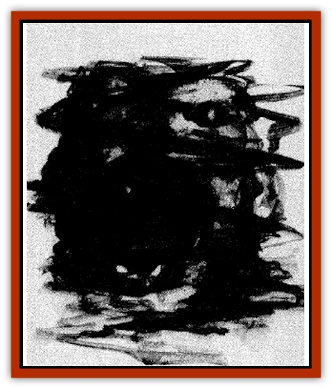

# Elemental - Darkness

| Statistic | **Elemental, Darkness** |
| --- | --- |
| **Activity Cycle:** | Night |
| **Alignment:** | Neutral evil |
| **Armor Class:** | 2 |
| **Climate/Terrain:** | Any dark |
| **Damage/Attack:** | 4-24 |
| **Diet:** | Darkness |
| **Frequency:** | Very rare |
| **Hit Dice:** | 8. 12 or 16 |
| **Intelligence:** | Low (5-7) |
| **Magic Resistance:** | Nil |
| **Morale:** | 8 or 12 HD: Champion (15-16) / 16 HD: Fanatic (17) |
| **Movement:** | 15 |
| **No. Appearing:** | 1 |
| **No. of Attacks:** | 1 |
| **Organization:** | Solitary |
| **Size:** | L to H (8-16' tall) |
| **Special Attacks:** | Chill, blind |
| **Special Defenses:** | +2 or better weapon to hit, hide |
| **THAC0:** | 8 HD: 13 / 12 HD: 9 / 16 HD: 5 |
| **Treasure:** | Nil |
| **XP Value:** | 8 HD: 3,000 / 12 HD: 7,000 / 16 HD: 11,000 |

Summoned by elder priests of dark gods, darkness [[Elemental_General_Information|elementals]] are creatures of pure negative life energy, the distilled spirit of undeath, decay, and the night. They can be summoned only at midnight or deep underground, and few stay for more than a single night.

**Combat:** A darkness elemental can chill a target creature's spirit by attacking it through its shadow; this constitutes an attack against AC 10, plus any Dexterity bonus if the target creature is aware of what the elemental is attempting. A successful hit allows the darkness elemental to blind its target by wrapping it in its own shadow, unless a saving throw vs. petrification (at -6) is successful. This blindness can be removed only by a casting a *cure blindness* or *heal* spell, or by exposing the victim to full sunlight.

Darkness elementals suffer damage from magical light spells and healing spells of all kinds; when contacted by one of these spells, an explosion occurs as the negative and positive magical energies destroy each other, inflicting 1d8 hp damage to the elemental for each level of the spell. Creatures within 10' of the explosion suffer 1 hp damage per level of the spell, half if a saving throw vs. breath weapon is successful.

Darkness elementals can automatically Hide in Shadows; they can hide from infravision as well, becoming effectively invisible as long as they remain immobile. As soon as they move at more than a creeping shadow's pace (a Movement Rate of 1), they become obvious to any onlooker.

**Habitat/Society:** Because the plane of elemental Darkness is so inhospitable to all forms of life, little is known about the society of these rare elementals. It is thought to mirror that of the better-known elementals of [[Elemental_Fire_Water|fire, water]], <a href="element1">air, and earth</a>, that is, a somewhat Arabian style caliphate or sultanate, with a more-or-less feudal social structure.

However, the evil alignment of darkness elementals may indicate a different social structure entirely, perhaps one ruled by a [[Archomental_Evil|Prince of Elemental Evil]] or a lord of the [[Yugoloth_General_Information|yugoloth]]. The [[Genie|dao]] seem to have some sort of agreement with these elementals; the details are unclear, but the two races have worked together on raids deep underground and on the elemental plane of Earth.

**Ecology:** Darkness elementals are the enemies of all creatures of light and life; they seek to destroy both at every opportunity. Undead creatures are either their allies or their servants; the relationship between the two is unclear. Like other elementals. they are not natural creatures and neither require anything from nor contribute anything to the natural ecosystem.

---
## Discovery & Documentation

**Source Publication:** Dragon227 (1996)
**Campaign Setting:** Dragon Magazine
**Author(s):** 

### Other Creatures Found in This Source Book
   * [[Beetle_Scarab_Giant|Beetle, Scarab, Giant]]
   * [[Fireweed|Fireweed]]
   * [[Glouras|Glouras]]
   * [[Octopus_Blue-Ring|Octopus, Blue-Ring]]
