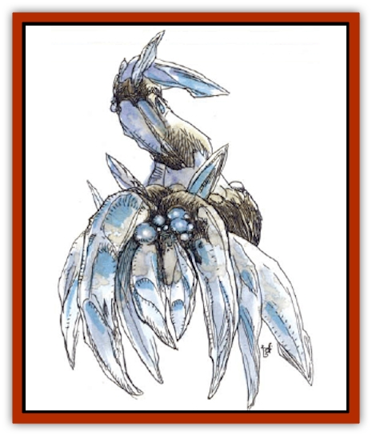

# Elemental - Earth Kin - Chrysmal

| Statistic | **Elemental, Earth Kin, Chrysmal** |
| --- | --- |
| **Activity Cycle:** | Day |
| **Alignment:** | Neutral evil |
| **Armor Class:** | 0 |
| **Climate/Terrain:** | Any/Land |
| **Damage/Attack:** | 3d4 (2d4) |
| **Diet:** | Petrivore |
| **Frequency:** | Very rare |
| **Hit Dice:** | 6+6 |
| **Intelligence:** | High to exceptional (13-16) |
| **Magic Resistance:** | Nil |
| **Morale:** | Champion (15-16) |
| **Movement:** | 6 |
| **No. Appearing:** | 1d6 |
| **No. of Attacks:** | 1 |
| **Organization:** | Solitary |
| **Size:** | S (3' tall) |
| **Special Attacks:** | Crystal missile |
| **Special Defenses:** | See below |
| **THAC0:** | 13 |
| **Treasure:** | Q&times;2d4 |
| **XP Value:** | 4,000 |

**Psionics Summary**

| Level | Dis/Sci/Dev | Attack/Defense | Score | PSPs |
| --- | --- | --- | --- | --- |
| 7 | 3/4/12 | MT,EW/M- | 15 | 91-110 |

**Metapsionics -** *Science:* appraise; *Devotions:* psionic drain, receptacle, stasis field.

**Psychokinesis -** *Science:* project force; *Devotions:* animate object, create sound, soften.

**Telepathy -** *Sciences:* mind wipe, probe; *Devotions:* contact, ego whip, ESP, mind thrust, mind wipe.

The crystal is a crystalline creature from the Elemental Plane of Earth. It is occasionally encountered on the Prime Material Plane, but only in subterranean places rich in mineral formations that form its diet (particularly favored are quartz, beryl, corundum, and carbon crystals). A crystal often attacks in order to gain these minerals. Inside an individual crysmal will be found 4d8 undigested rough gems.

Crysmals look like truncated, prismed heaps of translucent crystals. An individual crysmal tends to be of one color, ranging from pale amber through olive and into deep violet.

**Combat:** Because of its crystalline nature, edged and piercing weapons used against a crysmal must attack at a penalty of -4. Against blunt metallic or stone weapons, a crysmal's effective AC is 0, and normal wooden weapons are ineffective. The structure of the crysmal also makes it slow. Its faceted walking appendages (4-6) allow for only stumping, jerky movement. A crysmal attacks with a sharp, rotating appendage that extrudes from its top. If sorely pressed, the monster can shoot this appendage up to 60 feet, inflicting 1d8+8 points of damage. Thereafter, the crysmal has only a secondary appendage with which to attack, and its damage range drops from 3d4 to 2d4.

A crysmal is unaffected by fire- or cold-based spells. Electrical attacks cause only one-quarter or no damage whatsoever, depending on the saving throw. Poisons and gases do not affect a crysmal. <!--inflicts 3d6 points of damage upon a crystal, a --> A *glassee* spell blinds it for 1d4+1 rounds, and a *stone to flesh* spell lowers its Armor Class to 6 for all weapons, lasting one melee round. The creature can move through solid rock or earth as a [[Xorn|xorn]] does, taking one round to shift its molecular structure to do so. If struck by a *phase door* spell when shifting, the creature is immediately slain.

**Habitat/Society:** Crysmals live in roving packs with a clearly defined separation of duties between individuals. However, these duties are fluid, and individual crysmals may change positions freely. Psionically powerful crysmals are most often the leaders.

**Ecology:** Crysmals absorb stone and transform it into ordered, living matter, mostly quartzlike crystals. Sages have reported that crysmals fed precious stones develop better health, a gerater resistance to damage, and more potent psionic powers, but few can afford the handfuls of diamonds, sapphires, and topazes that the crysmals can devour in a single day.

When removed from a silicate environment, crysmals slowly starve. In extreme cases they cannibalize other mineral creatures or their own bodies, shrinking each day but retaining their form. After a full month, starving crysmals become about the size of a paperweight. They die within another week.

Crysmals hate xorn, as the latter prey on them. They sometimes ally themselves with the [[Genie|dao]], as they enjoy the rich food and the freedom from fear that the dao provide. The dao simply consider the crysmals good and trustworthy slaves. Crysmals sometimes tame [[Elemental_Grue_Chaggrin|chaggrin]] with their psionic abilities, and keep them as servants.

---
## Discovery & Documentation

**Source Publication:** Monstrous Compendium, 1994 Annual, Volume 1 (1995)
**Campaign Setting:** Advanced Dungeons & Dragons 2nd Edition
**Author(s):** David Wise

### Other Creatures Found in This Source Book
   * [[Abyss_Ant|Abyss Ant]]
   * [[Achaierai|Achaierai]]
   * [[Afanc|Afanc]]
   * [[Al-Jahar|Al-Jahar]]
   * [[Baelnorn|Baelnorn]]
   * [[Baneguard|Baneguard]]
   * [[Banelar|Banelar]]
   * [[Bird_Talking|Bird, Talking]]
   * [[Blazing_Bones|Blazing Bones]]
   * [[Campestri|Campestri]]
   * [[Caniquine|Caniquine]]
   * [[Cat_Winged|Cat, Winged]]
   * [[Crypt_Servant|Crypt Servant]]
   * [[Death's_Head_Tree|Death's Head Tree]]
   * [[Dog_Saluqi|Dog, Saluqi]]
   * [[Dragon_Electrum|Dragon, Electrum]]
   * [[Dragon_Fang|Dragon, Fang]]
   * [[Dragon_Linnorm_Corpse_Tearer|Dragon, Linnorm, Corpse Tearer]]
   * [[Dragon_Linnorm_Dread|Dragon, Linnorm, Dread]]
   * [[Dragon_Linnorm_Flame|Dragon, Linnorm, Flame]]
   * [[Dragon_Linnorm_Forest|Dragon, Linnorm, Forest]]
   * [[Dragon_Linnorm_Frost|Dragon, Linnorm, Frost]]
   * [[Dragon_Linnorm_Gray|Dragon, Linnorm, Gray]]
   * [[Dragon_Linnorm_Land|Dragon, Linnorm, Land]]
   * [[Dragon_Linnorm_Midgard|Dragon, Linnorm, Midgard]]
   * [[Dragon_Linnorm_Rain|Dragon, Linnorm, Rain]]
   * [[Dragon_Linnorm_Sea|Dragon, Linnorm, Sea]]
   * [[Dragon_Neutral_Jacinth|Dragon, Neutral, Jacinth]]
   * [[Dragon_Neutral_Jade|Dragon, Neutral, Jade]]
   * [[Dragon_Neutral_Pearl|Dragon, Neutral, Pearl]]
   * [[Dread|Dread]]
   * [[Dragon-kin|Dragon-kin]]
   * [[Elemental_Earth_Kin_Earth_Weird|Elemental, Earth Kin, Earth Weird]]
   * [[Elemental_Fire_Kin_Azer|Elemental, Fire Kin, Azer]]
   * [[Elemental_Sandman|Elemental, Sandman]]
   * [[Elemental_Wind_Walker|Elemental, Wind Walker]]
   * [[Elemental_Vermin|Elemental Vermin]]
   * [[Feystag|Feystag]]
   * [[Flame_Skull|Flame Skull]]
   * [[Foulwing|Foulwing]]
   * [[Gambado|Gambado]]
   * [[Garbug|Garbug]]
   * [[Genie_Tasked_Administrator|Genie, Tasked, Administrator]]
   * [[Genie_Tasked_Deceiver|Genie, Tasked, Deceiver]]
   * [[Genie_Tasked_Harim_Servant|Genie, Tasked, Harim Servant]]
   * [[Genie_Tasked_Messenger|Genie, Tasked, Messenger]]
   * [[Genie_Tasked_Miner|Genie, Tasked, Miner]]
   * [[Genie_Tasked_Oathbinder|Genie, Tasked, Oathbinder]]
   * [[Gibbering_Mouther|Gibbering Mouther]]
   * [[Gnasher|Gnasher]]
   * [[Gnasher_Winged|Gnasher, Winged]]
   * [[Golem_Brain|Golem, Brain]]
   * [[Golem_Hammer|Golem, Hammer]]
   * [[Golem_Metagolem|Golem, Metagolem]]
   * [[Golem_Spiderstone|Golem, Spiderstone]]
   * [[Gorynych|Gorynych]]
   * [[Greelox|Greelox]]
   * [[Helmed_Horror|Helmed Horror]]
   * [[Jarbo|Jarbo]]
   * [[Laraken|Laraken]]
   * [[Lich_Psionic|Lich, Psionic]]
   * [[Living_Steel|Living Steel]]
   * [[Lock_Lurker|Lock Lurker]]
   * [[Loxo|Loxo]]
   * [[Lycanthrope_Loup_de_Noir|Lycanthrope, Loup de Noir]]
   * [[Lycanthrope_Werebadger|Lycanthrope, Werebadger]]
   * [[Lycanthrope_Werejaguar|Lycanthrope, Werejaguar]]
   * [[Lythlyx|Lythlyx]]
   * [[Magebane|Magebane]]
   * [[Marrashi|Marrashi]]
   * [[Metalmaster|Metalmaster]]
   * [[Mimic_House_Hunter|Mimic, House Hunter]]
   * [[Naga_Bone|Naga, Bone]]
   * [[Nautilus_Giant|Nautilus, Giant]]
   * [[Nightshade_Toril|Nightshade (Toril)]]
   * [[Nishruu|Nishruu]]
   * [[Noran|Noran]]
   * [[Opinicus|Opinicus]]
   * [[Ormyrr|Ormyrr]]
   * [[Parasite|Parasite]]
   * [[Pasari-Niml|Pasari-Niml]]
   * [[Plant_Vampire_Moss|Plant, Vampire Moss]]
   * [[Pteraman|Pteraman]]
   * [[Rautym|Rautym]]
   * [[Shadeling|Shadeling]]
   * [[Skum|Skum]]
   * [[Snake_Giant_Cobra|Snake, Giant Cobra]]
   * [[Snake_Stone|Snake, Stone]]
   * [[Spectral_Wizard|Spectral Wizard]]
   * [[Spell_Weaver|Spell Weaver]]
   * [[Spider_Brain|Spider, Brain]]
   * [[Suwyze|Suwyze]]
   * [[Tatalla|Tatalla]]
   * [[Tick_Heart|Tick, Heart]]
   * [[Tree_Dark|Tree, Dark]]
   * [[Tree_Singing|Tree, Singing]]
   * [[Tressym|Tressym]]
   * [[Troll_Snow|Troll, Snow]]
   * [[Tuyewera|Tuyewera]]
   * [[Ulitharid|Ulitharid]]
   * [[Undead_Dwarf|Undead Dwarf]]
   * [[Undead_Lake_Monster|Undead Lake Monster]]
   * [[Whipsting|Whipsting]]
   * [[Windghost|Windghost]]
   * [[Wolf_Dread|Wolf, Dread]]
   * [[Wolf_Stone|Wolf, Stone]]
   * [[Wolf_Vampiric|Wolf, Vampiric]]
   * [[Wraith_Shimmering|Wraith, Shimmering]]
   * [[Xantravar|Xantravar]]
   * [[Xaver|Xaver]]
