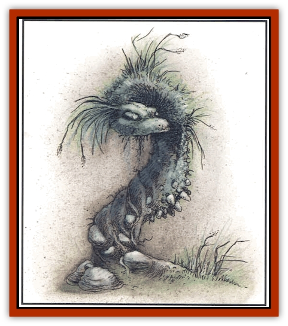

# Elemental - Earth Kin - Earth Weird

| Statistic | **Elemental, Earth Kin, Earth Weird** |
| --- | --- |
| **Activity Cycle:** | Any |
| **Alignment:** | Chaotic evil |
| **Armor Class:** | 0 |
| **Climate/Terrain:** | Any dry terrain |
| **Damage/Attack:** | 1d8 |
| **Diet:** | See below |
| **Frequency:** | Very rare |
| **Hit Dice:** | 8+3 |
| **Intelligence:** | Very (11-12) |
| **Magic Resistance:** | Nil |
| **Morale:** | Elite (13-14) |
| **Movement:** | 9 |
| **No. Appearing:** | 1 |
| **No. of Attacks:** | 1 |
| **Organization:** | Solitary |
| **Size:** | L (10'+ long) |
| **Special Attacks:** | Smothering |
| **Special Defenses:** | See below |
| **THAC0:** | 13 |
| **Treasure:** | I,O,P,Y |
| **XP Value:** | 5,000 |

These creatures are inhabitants of the Elemental Plane of Earth, but they have often been encountered more recently on the Prime Material Plane. They are related to the [[Elemental_Water_Kin_Water_Weird|water weird]], both of them filling a specific niche in their respective planes' ecologies.

When encountered on the Prime Material, earth weirds are invariably hostile and tend to attack all living things quite quickly. Once they have vanquished a foe, they feed off the remains as it decomposes within their substance.

**Combat:** When first encountered, these creatures appear to be nothing more than an exceptionally dry spot of dirt on the road. The use of a *detect invisibility* spell reveals that something is amiss, but nothing specific can be determined until the creature shows itself.

Once the earth weird senses a living creature within 10 feet, it starts to form itself into the likeness of a huge earthen serpent. This transformation takes two rounds to complete. Once in this shape, the earth weird lashes out at anything within its considerable 15-foot range.

Most forms of attack have little effect on the earth weird. Normal edged and blunt weapons inflict only 1 point of damage per attack, and Strength bonuses have no effect. Piercing weapons never affect the weird, which flows around the damage and repairs itself instantly. Enchanted weapons have full effect and inflict normal damage.

A water attack affects the weird as a slow spell and enables normal bludgeoning and slashing weapons to have full effect. If an earth weird is completely immersed in water for over 10 rounds, it dissolves. A *wind wall* or *control wind* spell inflicts 1d10 points of damage upon the weird and causes it to lose initiative for two rounds.

A weird reduced to 0 hit points is not destroyed, just disrupted. It takes four turns for the weird to recorporate itself. Once done, it attacks as before, a fresh creature. A weird must be reduced to -10 hit points before it is completely destroyed. *Plant growth* or *spike growth* is one of the most effective ways to stop an earth weird. It takes an earth weird one hour to work its way out of the effect of a *plant/spike growth* spell. A *passwall* or *move earth* spell kills it instantly, as do magical items that involve digging.

**Habitat/Society:** Earth weirds tend to be solitary and territorial. Though they will not always attack other weirds, they show aggressive behavior until the trespassing weird leaves or initiates combat. Earth weirds favor dry areas. This does not necessarily mean deserts, but includes drier areas of forests, especially along paths where it might find prey among the animals of the forest and passing adventurers. Once a weird has staked out a spot, it seldom leaves that area.

**Ecology:** It is unknown what keeps an earth weird alive. It is surmised that they must feed off the bodies of their prey, probably through the blood that leeches into the soil, fertilizing an already fierce opponent.

Sages theorize that the first earth weird on the Prime Material Plane was summoned by a powerful mage, and it may have been abandoned by its old master. Some may have found their way through rare dimensional vortices, while others are the result of cruel pranksters or evil men.

Since they are not native to the Prime Material Plane, earth weirds tend to have a hard time finding a niche in any ecosystem. It is likely, however, that they will be a dominant feature in any landscape in which they appear.

Earth-weird dirt is valued by wizards for spell components. Pieces of these weirds are especially useful in various spells involving earth, including *passwall*, *flesh to stone*, and *stone to mud*.

---
## Discovery & Documentation

**Source Publication:** Monstrous Compendium, 1994 Annual, Volume 1 (1995)
**Campaign Setting:** Advanced Dungeons & Dragons 2nd Edition
**Author(s):** David Wise

### Other Creatures Found in This Source Book
   * [[Abyss_Ant|Abyss Ant]]
   * [[Achaierai|Achaierai]]
   * [[Afanc|Afanc]]
   * [[Al-Jahar|Al-Jahar]]
   * [[Baelnorn|Baelnorn]]
   * [[Baneguard|Baneguard]]
   * [[Banelar|Banelar]]
   * [[Bird_Talking|Bird, Talking]]
   * [[Blazing_Bones|Blazing Bones]]
   * [[Campestri|Campestri]]
   * [[Caniquine|Caniquine]]
   * [[Cat_Winged|Cat, Winged]]
   * [[Crypt_Servant|Crypt Servant]]
   * [[Death's_Head_Tree|Death's Head Tree]]
   * [[Dog_Saluqi|Dog, Saluqi]]
   * [[Dragon_Electrum|Dragon, Electrum]]
   * [[Dragon_Fang|Dragon, Fang]]
   * [[Dragon_Linnorm_Corpse_Tearer|Dragon, Linnorm, Corpse Tearer]]
   * [[Dragon_Linnorm_Dread|Dragon, Linnorm, Dread]]
   * [[Dragon_Linnorm_Flame|Dragon, Linnorm, Flame]]
   * [[Dragon_Linnorm_Forest|Dragon, Linnorm, Forest]]
   * [[Dragon_Linnorm_Frost|Dragon, Linnorm, Frost]]
   * [[Dragon_Linnorm_Gray|Dragon, Linnorm, Gray]]
   * [[Dragon_Linnorm_Land|Dragon, Linnorm, Land]]
   * [[Dragon_Linnorm_Midgard|Dragon, Linnorm, Midgard]]
   * [[Dragon_Linnorm_Rain|Dragon, Linnorm, Rain]]
   * [[Dragon_Linnorm_Sea|Dragon, Linnorm, Sea]]
   * [[Dragon_Neutral_Jacinth|Dragon, Neutral, Jacinth]]
   * [[Dragon_Neutral_Jade|Dragon, Neutral, Jade]]
   * [[Dragon_Neutral_Pearl|Dragon, Neutral, Pearl]]
   * [[Dread|Dread]]
   * [[Dragon-kin|Dragon-kin]]
   * [[Elemental_Earth_Kin_Chrysmal|Elemental, Earth Kin, Chrysmal]]
   * [[Elemental_Fire_Kin_Azer|Elemental, Fire Kin, Azer]]
   * [[Elemental_Sandman|Elemental, Sandman]]
   * [[Elemental_Wind_Walker|Elemental, Wind Walker]]
   * [[Elemental_Vermin|Elemental Vermin]]
   * [[Feystag|Feystag]]
   * [[Flame_Skull|Flame Skull]]
   * [[Foulwing|Foulwing]]
   * [[Gambado|Gambado]]
   * [[Garbug|Garbug]]
   * [[Genie_Tasked_Administrator|Genie, Tasked, Administrator]]
   * [[Genie_Tasked_Deceiver|Genie, Tasked, Deceiver]]
   * [[Genie_Tasked_Harim_Servant|Genie, Tasked, Harim Servant]]
   * [[Genie_Tasked_Messenger|Genie, Tasked, Messenger]]
   * [[Genie_Tasked_Miner|Genie, Tasked, Miner]]
   * [[Genie_Tasked_Oathbinder|Genie, Tasked, Oathbinder]]
   * [[Gibbering_Mouther|Gibbering Mouther]]
   * [[Gnasher|Gnasher]]
   * [[Gnasher_Winged|Gnasher, Winged]]
   * [[Golem_Brain|Golem, Brain]]
   * [[Golem_Hammer|Golem, Hammer]]
   * [[Golem_Metagolem|Golem, Metagolem]]
   * [[Golem_Spiderstone|Golem, Spiderstone]]
   * [[Gorynych|Gorynych]]
   * [[Greelox|Greelox]]
   * [[Helmed_Horror|Helmed Horror]]
   * [[Jarbo|Jarbo]]
   * [[Laraken|Laraken]]
   * [[Lich_Psionic|Lich, Psionic]]
   * [[Living_Steel|Living Steel]]
   * [[Lock_Lurker|Lock Lurker]]
   * [[Loxo|Loxo]]
   * [[Lycanthrope_Loup_de_Noir|Lycanthrope, Loup de Noir]]
   * [[Lycanthrope_Werebadger|Lycanthrope, Werebadger]]
   * [[Lycanthrope_Werejaguar|Lycanthrope, Werejaguar]]
   * [[Lythlyx|Lythlyx]]
   * [[Magebane|Magebane]]
   * [[Marrashi|Marrashi]]
   * [[Metalmaster|Metalmaster]]
   * [[Mimic_House_Hunter|Mimic, House Hunter]]
   * [[Naga_Bone|Naga, Bone]]
   * [[Nautilus_Giant|Nautilus, Giant]]
   * [[Nightshade_Toril|Nightshade (Toril)]]
   * [[Nishruu|Nishruu]]
   * [[Noran|Noran]]
   * [[Opinicus|Opinicus]]
   * [[Ormyrr|Ormyrr]]
   * [[Parasite|Parasite]]
   * [[Pasari-Niml|Pasari-Niml]]
   * [[Plant_Vampire_Moss|Plant, Vampire Moss]]
   * [[Pteraman|Pteraman]]
   * [[Rautym|Rautym]]
   * [[Shadeling|Shadeling]]
   * [[Skum|Skum]]
   * [[Snake_Giant_Cobra|Snake, Giant Cobra]]
   * [[Snake_Stone|Snake, Stone]]
   * [[Spectral_Wizard|Spectral Wizard]]
   * [[Spell_Weaver|Spell Weaver]]
   * [[Spider_Brain|Spider, Brain]]
   * [[Suwyze|Suwyze]]
   * [[Tatalla|Tatalla]]
   * [[Tick_Heart|Tick, Heart]]
   * [[Tree_Dark|Tree, Dark]]
   * [[Tree_Singing|Tree, Singing]]
   * [[Tressym|Tressym]]
   * [[Troll_Snow|Troll, Snow]]
   * [[Tuyewera|Tuyewera]]
   * [[Ulitharid|Ulitharid]]
   * [[Undead_Dwarf|Undead Dwarf]]
   * [[Undead_Lake_Monster|Undead Lake Monster]]
   * [[Whipsting|Whipsting]]
   * [[Windghost|Windghost]]
   * [[Wolf_Dread|Wolf, Dread]]
   * [[Wolf_Stone|Wolf, Stone]]
   * [[Wolf_Vampiric|Wolf, Vampiric]]
   * [[Wraith_Shimmering|Wraith, Shimmering]]
   * [[Xantravar|Xantravar]]
   * [[Xaver|Xaver]]
