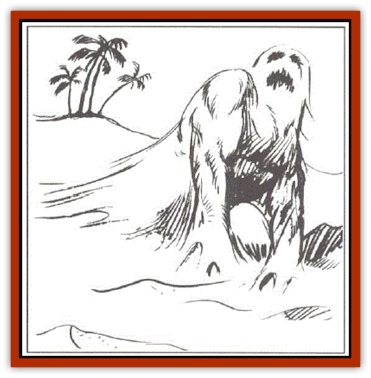

# Elemental - Earth Kin - Sandling

| Statistic | **Elemental, Earth Kin, Sandling** |
| --- | --- |
| **Activity Cycle:** | Any |
| **Alignment:** | Neutral |
| **Armor Class:** | 3 |
| **Climate/Terrain:** | Temperate or tropical, sandy or subterranean |
| **Damage/Attack:** | 2-16 |
| **Diet:** | Minerals |
| **Frequency:** | Rare |
| **Hit Dice:** | 4 |
| **Intelligence:** | Non- (0) |
| **Magic Resistance:** | Nil |
| **Morale:** | Unsteady (7) |
| **Movement:** | 12, Br 6 |
| **No. Appearing:** | 1 |
| **No. of Attacks:** | 1 |
| **Organization:** | Solitary |
| **Size:** | L (10' diameter) |
| **Special Attacks:** | Nil |
| **Special Defenses:** | See below |
| **THAC0:** | 17 |
| **Treasure:** | Nil |
| **XP Value:** | 420 |

A solitary and non-carbon based life form, sandlings seem content to eat and guard their territory. Not aggressive unless provoked, sandlings are hard to see and consequently easy for some hapless adventurer to provoke.

Sandlings appear to be an amorphous mass of moving, sliding sand capable of creating color variances in order to blend in better with their background.

**Combat:** These odd creatures are savagely territorial and attack any beings that trespass in their areas. They fight by slashing and lacerating with a coarse, abrasive pseudopod. Sandlings' flexible, shifting forms are difficult to damage by physical assault, thus the AC of 3. If a sufficient quantity of water or other liquid, at least ten gallons, is cast upon the creature, it will have the same effects as a slow spell and the handling strikes for only one-half damage (1d8).

If a sandling is stepped on, it lunges upward, trapping one or two man-sized opponents much like a [[Lurker|trapper]]. It is not so much a deliberate attack as it is a reflex. When this happens, the sandling's unexpected attack imposes a -2 penalty to opponents' surprise rolls.

Sandlings sense heat, sound, and moisture. They dislike wetness and burrow underground to avoid rain or water unless already defending their territories. They are always the same temperature as their surroundings and thus invisible to intravision. Due to their bizarre physical makeup, they are immune to *sleep*, *charm*, *hold*, and other mind-influencing spells.

**Habitat/Society:** Sandlings have no society as we know it. They are a solitary race. Their fanatical defense of their turf precludes even the possibility of cooperating with others of their kind. They are apparently silicon-based creatures, and some sages believe that they originated on the elemental plane of Earth. They subsist on rocks, sand, and minerals, contrary to the rumors of overly melodramatic storytellers. In fact, they despise organic matter and, upon killing an intruder, move about one-quarter mile away from the battle site. This explains the lack of treasure in their lairs. Most of the victims' possessions sink down into the soft sand, forced down by the bulk of the sandings. Unfortunately, sandlings also eat gems.

A sandling grows until it reaches full size (ten feet in diameter), and then it begins to reproduce by budding. Tiny sandlings grow to about two inches in diameter before they split from the parent. An adult sandling's territory often swarms with thousands of infant sandlings, none larger than six inches in diameter. When one grows above this size, the parent saddling perceives it as a threat and kills it. When the parent handling dies, the largest infant grows to take its place, killing all rivals, if it can. A group of sandling infants grouped together form an uneven surface and may trip an unwary creature.

There have been reports of huge sandlings three times as large as normal adults, but these reports have not been substantiated. If any such specimens are ever found, they are likely to actually have two pseudopods to fight with rather than one.

As mentioned earlier, an adult saddling is a solitary creature. It dwells in lonely sandy areas such as uninhabited deserts, caverns, and deserted beaches. It has no lair per se, it merely sits in the sand, where its instincts have set boundaries for its territory. Sandlings live to eat minerals, reproduce, and defend their territories.

**Ecology:** Sandlings are outside factors in ecosystems. They take a small fraction of the minerals in any given parcel of land and are completely inoffensive. Sometimes, dwarves mining clans seek out a sandling's haunts to see if it has unearthed any new mineral deposits.

Some individuals kill sandlings and use the bodies as ingredients in mortar. Their bodies are rumored to have truly remarkable adhesive abilities. Druids who discover a building that is being held together by sandlings may very well hurl spells at it, in hopes of destroying it.

---
## Discovery & Documentation

**Source Publication:** MC1 Volume I (w/binder #1) (1991)
**Campaign Setting:** Advanced Dungeons & Dragons 2nd Edition
**Author(s):** Jay Batista, Scott Bennie, Grant Boucher, William W. Connors, Steve Gilbert, Heike Kubasch, James Lowder, David Edward Martin, Bruce Nesmith, Jean Rabe, Rick Swan, John J. Terra, Gary L. Thomas

### Other Creatures Found in This Source Book
   * [[Bat|Bat]]
   * [[Bear|Bear]]
   * [[Behir|Behir]]
   * [[Boar|Boar]]
   * [[Bookworm|Bookworm]]
   * [[Brownie|Brownie]]
   * [[Bugbear|Bugbear]]
   * [[Carrion_Crawler|Carrion Crawler]]
   * [[Cat_Great|Cat, Great]]
   * [[Catoblepas|Catoblepas]]
   * [[Dragon_General_Information|Dragon, General Information]]
   * [[Dragonfish|Dragonfish]]
   * [[Elemental_Air_Kin_Aerial_Servant|Elemental, Air Kin, Aerial Servant]]
   * [[Elephant|Elephant]]
   * [[Gnoll|Gnoll]]
   * [[Hobgoblin|Hobgoblin]]
   * [[Homunculus|Homunculus]]
   * [[Hornet_Giant|Hornet, Giant]]
   * [[Horse|Horse]]
   * [[Hyena|Hyena]]
   * [[Jackal|Jackal]]
   * [[Jackalwere|Jackalwere]]
   * [[Korred|Korred]]
   * [[Lich|Lich]]
   * [[Lizard|Lizard]]
   * [[Lizard_Man|Lizard Man]]
   * [[Lycanthrope_General_Information|Lycanthrope, General Information]]
   * [[Lycanthrope_Seawolf|Lycanthrope, Seawolf]]
   * [[Lycanthrope_Werebear|Lycanthrope, Werebear]]
   * [[Lycanthrope_Weretiger|Lycanthrope, Weretiger]]
   * [[Lycanthrope_Werewolf|Lycanthrope, Werewolf]]
   * [[Manticore|Manticore]]
   * [[Medusa|Medusa]]
   * [[Mind_Flayer|Mind Flayer]]
   * [[Minotaur|Minotaur]]
   * [[Mudman|Mudman]]
   * [[Mummy|Mummy]]
   * [[Nixie|Nixie]]
   * [[Nymph|Nymph]]
   * [[Ogre|Ogre]]
   * [[Ooze_Slime_Jelly_I|Ooze/Slime/Jelly I]]
   * [[Ooze_Slime_Jelly_II|Ooze/Slime/Jelly II]]
   * [[Orc|Orc]]
   * [[Owl|Owl]]
   * [[Owlbear_I|Owlbear I]]
   * [[Pegasus|Pegasus]]
   * [[Piercer|Piercer]]
   * [[Pudding_Deadly|Pudding, Deadly]]
   * [[Rakshasa|Rakshasa]]
   * [[Rat|Rat]]
   * [[Ray|Ray]]
   * [[Remorhaz|Remorhaz]]
   * [[Satyr|Satyr]]
   * [[Scorpion|Scorpion]]
   * [[Selkie|Selkie]]
   * [[Shadow|Shadow]]
   * [[Skeleton|Skeleton]]
   * [[Skunk|Skunk]]
   * [[Snake|Snake]]
   * [[Spectre|Spectre]]
   * [[Spider|Spider]]
   * [[Sprite|Sprite]]
   * [[Toad_Giant|Toad, Giant]]
   * [[Treant|Treant]]
   * [[Troll|Troll]]
   * [[Umber_Hulk|Umber Hulk]]
   * [[Unicorn|Unicorn]]
   * [[Vampire|Vampire]]
   * [[Wight|Wight]]
   * [[Will_O'Wisp|Will O'Wisp]]
   * [[Wolf|Wolf]]
   * [[Wolfwere|Wolfwere]]
   * [[Wraith|Wraith]]
   * [[Wyvern|Wyvern]]
   * [[Yeti|Yeti]]
   * [[Yuan-ti|Yuan-ti]]
   * [[Zombie|Zombie]]
