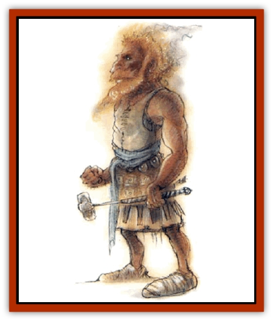

# Elemental - Fire Kin - Azer

| Statistic | **Elemental, Fire Kin, Azer** |
| --- | --- |
| **Activity Cycle:** | Any |
| **Alignment:** | Lawful neutral |
| **Armor Class:** | 2 |
| **Climate/Terrain:** | Any fire (Elemntal Plane of Fire) |
| **Damage/Attack:** | By weapon type |
| **Diet:** | Omnivore |
| **Frequency:** | Very rare (common) |
| **Hit Dice:** | 2+1 to 5+4 |
| **Intelligence:** | Very (11-12) |
| **Magic Resistance:** | 5-20% |
| **Morale:** | Elite (13-14) |
| **Movement:** | 12 |
| **No. Appearing:** | 2d8 |
| **No. of Attacks:** | 1 |
| **Organization:** | Band |
| **Size:** | M (5' tall) |
| **Special Attacks:** | Heat |
| **Special Defenses:** | Immune to fire |
| **THAC0:** | 19 to 15 |
| **Treasure:** | Special |
| **XP Value:** | 2+1 HD: 420 / 3+2 HD: 650 / 4+3 HD: 975 / 5+4 HD: 1,400 |

The azer are a race of humanoid creatures that normally inhabit the Elemental Plane of Fire. Except under special circumstances, they are very rarely found on the Prime Material Plane.

In appearance they are much like [[Dwarf|dwarves]], except that they have metallic, brass-colored skin and flames for hair. They wear only kilts or apronlike garments of beaten brass, copper, or bronze.

**Combat:** Azer use broad-bladed javelins that inflict damage as spears. In hand-to-hand combats they employ malletlike weapons equal to a footman's mace. Due to their great strength, their attack and damage rolls are adjusted as follows:

| HD | STR | Attack | Damage |
| --- | --- | --- | --- |
| 2+1 | 17 | +1 | +1 |
| 3+2 | 18 | +2 | +1 |
| 4+3 | 18/01-50 | +1 | +3 |
| 5+4 | 18/51-00 | +2 | +3 |

Creatures not immune to fire suffer 1d4+1 points of damage if grasped by an azer, and the heat of an azer's weapons inflicts an additional +1 damage to such victims. Azer suffer double damage from cold-based attacks.

**Habitat/Society:** Azer on their home plane are part of an extremely regimented society where every individual has his or her place. The azer civilization in general is heavily stratified, with law taking precedence over individual freedoms and even an individual's life.

Azer construct their outposts and cities as towers built from basalt, granite, or metal. There they dwell in small groups, using their plentiful complexes of flames to shape the stone.

They grow strange trees with metallic outer skins or barks, and the leaves of these trees are actually made entirely of metal - in some cases, precious metals.

Azer are unfriendly and taciturn, and they lack compassion. They capture and interrogate intruders; particularly dangerous or violent prisoners are slain. They are greedy, particularly for gems that are a clear purple or red (rubies, amethysts, garnets, etc.) Once given, the word of an azer is a solid bond.

**Ecology:** It is not known just what if anything azer eat. On their home plane, their only enemies are other intelligent fire dwelling creatures, and even then this enmity is not related to relative position on the food chain. The greatest of their enemies are the [[Genie|efreet]], who sometimes fight wars of conquest against the azer, taking their territories and making slaves of them. The azer defend themselves and their towers with powerful, bellows-like air projectors and special containers used to pour elemental water on attackers.

**Amaimon**

  Amaimon is the legendary king of the ager. He is the largest (9+8 HD), strongest (18/00 strength), and most intelligent of all azer. He has 35% magic resistance; his other powers are unknown.

**Nobles**

  Amaimon's nobles number from 8d4 and are only slightly weaker than their king (7+6 HD, 18/76-90 Strength). They have 25% magic resistance; the noble azers' full powers are also unknown.

---
## Discovery & Documentation

**Source Publication:** Monstrous Compendium, 1994 Annual, Volume 1 (1995)
**Campaign Setting:** Advanced Dungeons & Dragons 2nd Edition
**Author(s):** David Wise

### Other Creatures Found in This Source Book
   * [[Abyss_Ant|Abyss Ant]]
   * [[Achaierai|Achaierai]]
   * [[Afanc|Afanc]]
   * [[Al-Jahar|Al-Jahar]]
   * [[Baelnorn|Baelnorn]]
   * [[Baneguard|Baneguard]]
   * [[Banelar|Banelar]]
   * [[Bird_Talking|Bird, Talking]]
   * [[Blazing_Bones|Blazing Bones]]
   * [[Campestri|Campestri]]
   * [[Caniquine|Caniquine]]
   * [[Cat_Winged|Cat, Winged]]
   * [[Crypt_Servant|Crypt Servant]]
   * [[Death's_Head_Tree|Death's Head Tree]]
   * [[Dog_Saluqi|Dog, Saluqi]]
   * [[Dragon_Electrum|Dragon, Electrum]]
   * [[Dragon_Fang|Dragon, Fang]]
   * [[Dragon_Linnorm_Corpse_Tearer|Dragon, Linnorm, Corpse Tearer]]
   * [[Dragon_Linnorm_Dread|Dragon, Linnorm, Dread]]
   * [[Dragon_Linnorm_Flame|Dragon, Linnorm, Flame]]
   * [[Dragon_Linnorm_Forest|Dragon, Linnorm, Forest]]
   * [[Dragon_Linnorm_Frost|Dragon, Linnorm, Frost]]
   * [[Dragon_Linnorm_Gray|Dragon, Linnorm, Gray]]
   * [[Dragon_Linnorm_Land|Dragon, Linnorm, Land]]
   * [[Dragon_Linnorm_Midgard|Dragon, Linnorm, Midgard]]
   * [[Dragon_Linnorm_Rain|Dragon, Linnorm, Rain]]
   * [[Dragon_Linnorm_Sea|Dragon, Linnorm, Sea]]
   * [[Dragon_Neutral_Jacinth|Dragon, Neutral, Jacinth]]
   * [[Dragon_Neutral_Jade|Dragon, Neutral, Jade]]
   * [[Dragon_Neutral_Pearl|Dragon, Neutral, Pearl]]
   * [[Dread|Dread]]
   * [[Dragon-kin|Dragon-kin]]
   * [[Elemental_Earth_Kin_Chrysmal|Elemental, Earth Kin, Chrysmal]]
   * [[Elemental_Earth_Kin_Earth_Weird|Elemental, Earth Kin, Earth Weird]]
   * [[Elemental_Sandman|Elemental, Sandman]]
   * [[Elemental_Wind_Walker|Elemental, Wind Walker]]
   * [[Elemental_Vermin|Elemental Vermin]]
   * [[Feystag|Feystag]]
   * [[Flame_Skull|Flame Skull]]
   * [[Foulwing|Foulwing]]
   * [[Gambado|Gambado]]
   * [[Garbug|Garbug]]
   * [[Genie_Tasked_Administrator|Genie, Tasked, Administrator]]
   * [[Genie_Tasked_Deceiver|Genie, Tasked, Deceiver]]
   * [[Genie_Tasked_Harim_Servant|Genie, Tasked, Harim Servant]]
   * [[Genie_Tasked_Messenger|Genie, Tasked, Messenger]]
   * [[Genie_Tasked_Miner|Genie, Tasked, Miner]]
   * [[Genie_Tasked_Oathbinder|Genie, Tasked, Oathbinder]]
   * [[Gibbering_Mouther|Gibbering Mouther]]
   * [[Gnasher|Gnasher]]
   * [[Gnasher_Winged|Gnasher, Winged]]
   * [[Golem_Brain|Golem, Brain]]
   * [[Golem_Hammer|Golem, Hammer]]
   * [[Golem_Metagolem|Golem, Metagolem]]
   * [[Golem_Spiderstone|Golem, Spiderstone]]
   * [[Gorynych|Gorynych]]
   * [[Greelox|Greelox]]
   * [[Helmed_Horror|Helmed Horror]]
   * [[Jarbo|Jarbo]]
   * [[Laraken|Laraken]]
   * [[Lich_Psionic|Lich, Psionic]]
   * [[Living_Steel|Living Steel]]
   * [[Lock_Lurker|Lock Lurker]]
   * [[Loxo|Loxo]]
   * [[Lycanthrope_Loup_de_Noir|Lycanthrope, Loup de Noir]]
   * [[Lycanthrope_Werebadger|Lycanthrope, Werebadger]]
   * [[Lycanthrope_Werejaguar|Lycanthrope, Werejaguar]]
   * [[Lythlyx|Lythlyx]]
   * [[Magebane|Magebane]]
   * [[Marrashi|Marrashi]]
   * [[Metalmaster|Metalmaster]]
   * [[Mimic_House_Hunter|Mimic, House Hunter]]
   * [[Naga_Bone|Naga, Bone]]
   * [[Nautilus_Giant|Nautilus, Giant]]
   * [[Nightshade_Toril|Nightshade (Toril)]]
   * [[Nishruu|Nishruu]]
   * [[Noran|Noran]]
   * [[Opinicus|Opinicus]]
   * [[Ormyrr|Ormyrr]]
   * [[Parasite|Parasite]]
   * [[Pasari-Niml|Pasari-Niml]]
   * [[Plant_Vampire_Moss|Plant, Vampire Moss]]
   * [[Pteraman|Pteraman]]
   * [[Rautym|Rautym]]
   * [[Shadeling|Shadeling]]
   * [[Skum|Skum]]
   * [[Snake_Giant_Cobra|Snake, Giant Cobra]]
   * [[Snake_Stone|Snake, Stone]]
   * [[Spectral_Wizard|Spectral Wizard]]
   * [[Spell_Weaver|Spell Weaver]]
   * [[Spider_Brain|Spider, Brain]]
   * [[Suwyze|Suwyze]]
   * [[Tatalla|Tatalla]]
   * [[Tick_Heart|Tick, Heart]]
   * [[Tree_Dark|Tree, Dark]]
   * [[Tree_Singing|Tree, Singing]]
   * [[Tressym|Tressym]]
   * [[Troll_Snow|Troll, Snow]]
   * [[Tuyewera|Tuyewera]]
   * [[Ulitharid|Ulitharid]]
   * [[Undead_Dwarf|Undead Dwarf]]
   * [[Undead_Lake_Monster|Undead Lake Monster]]
   * [[Whipsting|Whipsting]]
   * [[Windghost|Windghost]]
   * [[Wolf_Dread|Wolf, Dread]]
   * [[Wolf_Stone|Wolf, Stone]]
   * [[Wolf_Vampiric|Wolf, Vampiric]]
   * [[Wraith_Shimmering|Wraith, Shimmering]]
   * [[Xantravar|Xantravar]]
   * [[Xaver|Xaver]]
