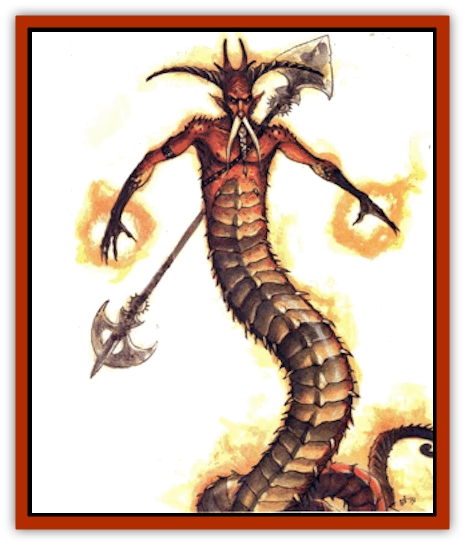

# Elemental - Fire Kin - Salamander II

| Statistic | **Lesser** | **Noble** |
| --- | --- | --- |
| **Activity Cycle:** | Any | Any |
| **Alignment:** | Neutral evil | Lawful evil |
| **Armor Class:** | 8 | 0 |
| **Climate/Terrain:** | Plane of Fire | Plane of Fire |
| **Damage/Attack:** | By weapon | By weapon +4, 2d8+4 |
| **Diet:** | Omnivore | Omnivore |
| **Frequency:** | Uncommon | Very rare |
| **Hit Dice:** | 2+2 | 12 |
| **Intelligence:** | Average (8-10) | Genius (17-18) |
| **Magic Resistance:** | Nil | 25% |
| **Morale:** | Average (8-10) | Fanatic (17-18) |
| **Movement:** | 12 | 18 |
| **No. Appearing:** | 3d6 | 1 |
| **No. of Attacks:** | 1 | 2 |
| **Organization:** | Pack | Solitary |
| **Size:** | M (6' long) | L (10' long) |
| **Special Attacks:** | +2 heat dmg | +1d6 heat dmg |
| **Special Defenses:** | See below | See below |
| **THAC0:** | 19 | 9 |
| **Treasure:** | K,M | G |
| **XP Value:** | 175 | 10,000 |

Most folks have heard of salamanders - the creatures appear more frequently than a body'd think, even off the Elemental Plane of Fire - but few really know the dark of them. See, the creatures've got a fairly complex life cycle.

They start their existence in a larval stage, during which time they're called [[Elemental_Fire_Kin|fire snakes]]. The name was bestowed by some prime long ago, and unfortunately, it stuck. Some fire snakes eventually mature into what're called lesser salamanders, while others remain as they are until they die. No one knows why this occurs.

Lesser salamanders aren't spotted often by most bashers, as they rarely leave their home plane. However, experienced planewalkers know that Fire's thick with the monsters. Some, but not all, grow and develop into [[Elemental_Fire_Kin|normal salamanders]]. Only one in a hundred thousand of these creatures has the potential to develop further. These special bloods, if they manage to survive for at least a thousand years, become salamander nobles. This name derives not only from their societal position as leaders, but also from their personal power - nobles're mighty foes in combat.

**Note:** This entry describes only lesser salamanders and nobles. For more information on fire snakes and normal salamanders, refer to the [[Elemental_Fire_Kin|Elemental, Fire Kin]] entry.

## Lesser Salamander

Lesser salamanders, sometimes called flamebrothers, are fairly bestial in nature, possessing only the civilization imposed upon them by their more sophisticated superiors.

**Combat:** Lesser salamanders use iron weapons in combat. Many wield spears, but others brandish swords, axes, daggers, or maces, all forged entirely of red-hot iron. The body heat of a flamebrother inflicts an additional 2 points of damage upon those struck by its weapon.

Lesser salamanders are immune to fire-based attacks, and *sleep*, *hold*, and *charm* spells. Cold-based attacks inflict 1 additional point of damage per damage die.

**Habitat/Society:** These creatures of fire and heat dwell in flame-filled caverns on their home plane. They're usually encountered in huge numbers, often led by a normal salamander. Powerful creatures of the plane of Fire, such as [[Genie|efreet]] or intelligent elementals, sometimes put lesser salamanders to work as personal guards or soldiers in their armies. Vast nations of flamebrothers may be ruled by many normal salamanders, with a single salamander noble sitting above them all.

**Ecology:** In the hierarchy of the plane of Fire, lesser salamanders find themselves somewhere near the very bottom. They're the front-line skirmishers - in other words, the fodder - in the armies of the plane. Many spend their days tending the deep pits of flame where the larval salamanders (fire snakes) grow to maturity.

## Salamander Noble

Enormous armies and huge kingdoms of salamanders (both lesser and normal) serve the nobles of the race, as do most other creatures of heat and flame. Occasionally, however, these formidable bloods wander about alone, even traveling to other planes. Chant is these plane-hoppers are really exiles, banished for their transgressions. Others believe that they simply search for means and methods of seizing more power and that the wandering salamander nobles are free to return to their home at any time. Both theories sound plausible.

**Combat:** Like their lessers, salamander nobles favor fighting with metal spears, which're often enchanted with at least a +2 or +3 bonus. The nobles' great strength adds another 4 points to the damage caused by the spears. And to make matters even worse, the great heat generated by the creatures' bodies inflicts an additional 1d6 points of fire damage to any berk struck by theyr weapons. If unarmed, a noble can grab a sod with its tail and constrict him, inflicting 2d8+4 points of damage per round, plus another 1d6 points due to its body heat.

Salamander nobles can be struck only by weapons of +2 or better enchantment. They're immune to heat as well as *sleep*, *charm*, and *hold* spells. However, they can also resist the harmful effects of hated cold, so unlike other salamanders, they suffer only normal amounts of damage from such attacks.

Furthermore, these masters of fire wield potent spellcasting abilities. They can cast each of the following spells three times per day as 10th-level wizards: *affect normal fires*, *burning hands*, *fireball*, *flame arrow*, *flaming sphere*, and *wall of fire*. Once each day, a salamander noble can cast *conjure fire elemental* and a special form of dispel magic that robs a fire-resistant creature of this protection for 2d4 rounds. This spell negates *rings of fire resistance*, *protection from fire spells*, and even the natural resistance of creatures not native to the plane of Fire (such as fiends, [[Dragon_Chromatic_Red|red dragons]], and so on). It doesn't work against [[Elemental_Fire_Water|fire elementals]] or other creatures native to the plane. Obviously, if cast on a plane-walking sod who's using special protections to pass safely through the Elemental Plane of Fire, it almost certainly spells his doom.

**Habitat/Society:** Salamander nobles recognize no authority above their own. They do their best to ignore beings like [[Archomental_Evil|Imix]] or [[Archomental_Good|Zaaman Rul]], and they stay out of the way of powers on the plane of Fire. Some fiery creatures - including certain elementals, [[Elemental_Grue_Harginn|grue]], [[Elemental_Fire_Kin_Azer|azer]], [[Mephit_General_Information|mephits]], [[Hell_Hound|hell hounds]], and [[Fire_Minion|fire minions]] - look upon the nobles as masters. The efreet, as a rule, hate the salamander nobles but grudgingly respect their strength.

Despite all their underlings, these powerful bloods are true loners. Since they're not a race unto themselves, they don't take mates or raise young. Lesser salamanders fear them too much to give them anything but blind obedience. If life as a salamander noble has any drawbacks, it's that the tyrant has no confidants, companions, or real allies - only servants.

Most nobles live in fabulous fortresses or palaces on the Elemcntal Plane of Fire. Each is a unique individual with a very different dwelling and personality. But one thing a berk can count on is that all salamander nobles are cruel masters that spend a great deal of time and energy imposing order and organization upon their chaotic lessers.

**Ecology:** Salamander nobles are among the more powerful creatures on the Elemental Plane of Fire. Their life spans have virtually no limit.

---
## Discovery & Documentation

**Source Publication:** Planescape III (1996)
**Campaign Setting:** Planescape
**Author(s):** Monte Cook

### Other Creatures Found in This Source Book
   * [[Animental|Animental]]
   * [[Archomental_Evil|Archomental, Evil]]
   * [[Archomental_Good|Archomental, Good]]
   * [[Belker|Belker]]
   * [[Bzastra|Bzastra]]
   * [[Chososion|Chososion]]
   * [[Darklight|Darklight]]
   * [[Devete|Devete]]
   * [[Devourer_Planescape|Devourer (Planescape)]]
   * [[Dharum_Suhn|Dharum Suhn]]
   * [[Egarus|Egarus]]
   * [[Elemental_Athas_Lesser_Air_Earth|Elemental (Athas), Lesser, Air/Earth]]
   * [[Elemental_Athas_Lesser_Fire_Water|Elemental (Athas), Lesser, Fire/Water]]
   * [[Entrope|Entrope]]
   * [[Facet|Facet]]
   * [[Frost_Salamander|Frost Salamander]]
   * [[Fundamental_Air_Earth|Fundamental, Air/Earth]]
   * [[Fundamental_Fire_Water|Fundamental, Fire/Water]]
   * [[Fundamental_All_Elements|Fundamental, All Elements]]
   * [[Garmorm|Garmorm]]
   * [[Homunculus_Elemental|Homunculus, Elemental]]
   * [[Immoth|Immoth]]
   * [[Khargra|Khargra]]
   * [[Klyndes|Klyndes]]
   * [[Magran|Magran]]
   * [[Menglis|Menglis]]
   * [[Nathri|Nathri]]
   * [[Ooze_Sprite|Ooze Sprite]]
   * [[Paraelemental|Paraelemental]]
   * [[Phirblas|Phirblas]]
   * [[Psurlon|Psurlon]]
   * [[Quasielemental_Negative|Quasielemental, Negative]]
   * [[Quasielemental_Positive|Quasielemental, Positive]]
   * [[Rast|Rast]]
   * [[Ravid|Ravid]]
   * [[Ruvoka|Ruvoka]]
   * [[Scile|Scile]]
   * [[Shad|Shad]]
   * [[Shocker|Shocker]]
   * [[Sislan|Sislan]]
   * [[Suisseen|Suisseen]]
   * [[Terithran|Terithran]]
   * [[Thoqqua|Thoqqua]]
   * [[Trilloch|Trilloch]]
   * [[Tsnng|Tsnng]]
   * [[Ungulosin|Ungulosin]]
   * [[Vacuous|Vacuous]]
   * [[Wavefire|Wavefire]]
   * [[Xag-Ya_Xeg-Yi|Xag-Ya/Xeg-Yi]]
   * [[Xill|Xill]]
