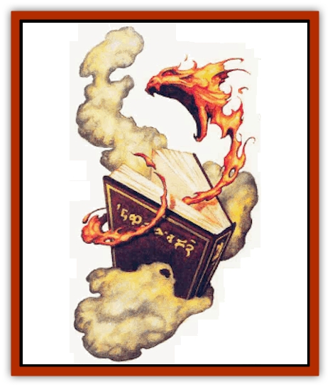

# Elemental - Fire Kin - Tome Guardian

| Statistic | **Elemental, Fire Kin, Tome Guardian** |
| --- | --- |
| **Activity Cycle:** | Any |
| **Alignment:** | Neutral |
| **Armor Class:** | 2 |
| **Climate/Terrain:** | Any |
| **Damage/Attack:** | 1d4 |
| **Diet:** | Fire, electricity, and heat |
| **Frequency:** | Very rare |
| **Hit Dice:** | 4+4 |
| **Intelligence:** | Average (8-10) |
| **Magic Resistance:** | Nil |
| **Morale:** | Fearless (20) when bound / Elite (13-14) when free |
| **Movement:** | 12 (or as guarded object moves) |
| **No. Appearing:** | 1 |
| **No. of Attacks:** | 1 |
| **Organization:** | Solitary |
| **Size:** | T (1-2' tall) |
| **Special Attacks:** | Fireburst |
| **Special Defenses:** | Spell immunities, healed by fire |
| **THAC0:** | 15 |
| **Treasure:** | One guarded object |
| **XP Value:** | 3,000 |

The tome guardian (sometimes mistakenly heard and passed on as "tomb guardian") is a creature of the Elemental Plane of Fire. Its nature and activities there are unknown, but it can be summoned to the Prime Material plane by magical means to serve as a guardian.

The tome guardian is typically bound to a magical tome (thus its name), but can also be found guarding another object instead. An object with a tome guardian can be protected by symbol or glyph as well. There are rare reports of two or more tome guardians being bound to the same item, but such reports have not been confirmed by reliable sources.

Tome guardians have never been known to attempt communication with living beings, but can apparently hear and understand Common (and perhaps other languages).

**Combat:** An object protected by a tome guardian typically shows no sign of being inhabited, except that it radiates a faint dweomer and a small amount of heat. The tome guardian shows its presence only when its object is touched, or when the object or the guardian itself is attacked. A tome guardian always uses this attack against a [[Bookworm|bookworm]] or any other creature attempting to consume or strike the object it is guarding. It never attacks a master for whom it guards an item.

The tome guardian's preferred method of attack, which it can use only three times per day, is a *fireburst*, a pencil-thin, white-hot flame; though the tome guardian can use the attack only three times per day, it cannot miss its target. Only one *fireburst* per round can be released by a single tome guardian, and it can affect only one target per release. The *fireburst* can operate through clothing or armor, or even through weapons; thus, it can be used without fail against any creature that touches or physically attacks the tome guardian or its protected object. The *fireburst* can also be passed through a mental attack or attempt at mental communication of any kind, whether from spell, item, or natural ability, to the individual that launched the mental attack or communication.

The *fireburst* deals 6d4 points of internal damage (no saving throw) to any creature not immune to the effects of heat or fire. Human, demihuman, and humanoid beings who survive a *fireburst* attack are rendered unconscious for 1d4+1 turns unless they make a successful saving throw vs. poison, with a -3 to the roll, due to the shock of their blood boiling momentarily in the area affected by the *fireburst*.

The *fireburst* does not generate any incidental heat or flame that might damage surrounding creatures or objects (such as the item being guarded). If two or more creatures laid hands on a guarded object simultaneously, and the guardian generated a *fireburst* in one of them, the other(s) would not be affected or even feel it.

If the tome guardian or its object is attacked or touched, and the tome guardian is unable to launch a *fireburst*, it can attack normally by swiping a fiery tendril at an opponent. The attack causes only 1d4 points of damage, but sets fire to flammable materials that fail a saving throw vs. magical fire. The tome guardian saves this attack for a last resort, because of its comparative weakness.

A tome guardian can absorb fiery or electrical energy impinging upon it (when it guards an object, it envelops it, and thus absorbs all fire directed at the object), whether of natural or magical (*fireball* or *lightning bolt*) origin. It gains a number of hit points equal to the number of points of damage the fire(s) or shock(s) would deal to an unprotected creature; this replenishes any damage it has suffered and then increases the creature's own hit points temporarily (for the following 24 hours). During this time, the tome guardian can add any or all of this additional energy directly to the damage dealt by any *fireburst* attack(s) it makes. Heat energy, such as that caused by the *heat metal* spell, the guardian merely absorbs.

A tome guardian is immune to the attacks of, but cannot itself harm, a [[Elemental_Fire_Water|fire elemental]], [[Elemental_Fire_Kin|salamander]], [[Will_O'Wisp|will-o-wisp]], and [[Xag-Ya_Xeg-Yi|xag-ya]]. The tome guardian can also absorb and redirect any appropriate energies from these creatures' attacks. On rare occasions, tome guardians have been known to cooperate with such creatures for mutual survival and protection.

Cold inflicts double damage on the tome guardian; water-based attacks, it should be noted, do not. All physical attacks upon the object guarded do not harm the object until the guardian is destroyed, because it gathers its form into a rigid shell to ward off blows; however, because of this, all such attacks inflict the maximum possible damage upon the guardian. When a guardian is in free form, physical attacks inflict normal damage.

Tome guardians can be affected by most spells normally, but are aided by fire, electrical, and heat attacks, and unaffected by enchantment/charm magic such as *maze*, *sleep*, and *suggestion* (although *geas* is an exception). Door spells (such as *phase door* or *dimension door*) do not affect guardians, and are viewed as attacks. Tome guardians cannot be psionically dominated, and anyone attempting *ESP* or similar mind-meeting magic, by spell, item, or natural ability, finds that attempts to attack, control, or change a guardian cause it to attack (and, as mentioned, that it can employ its *fireburst* attack through such a mental link).

A tome guardian can be "driven out" of the object it is guarding by the casting of a *dispel magic* (the guardian receives a saving throw vs. spell; if the saving throw is successful, the creature is unaffected). Even the individual who bound the guardian to the object can dismiss it only in this way. The guardian is seen leaving the object, even in darkness.

**Habitat/Society:** Little is known of the tome guardian's life on the Elemental Plane of Fire, but interactions observed on the Prime Material Plane indicate that they are on reasonably good terms with most other creatures of flame. Only fire elementals that meet the parameters discussed here are summoned as tome guardians, so it is unknown if they have a weaker form (such as the lesser elemental summoned by a *Daltim's fiery protector* spell) or develop into something else later.

A mage summons the tome guardian by casting an *ensnarement* (sending or demand can work if the guardian's name is known; they do have personal names), and compels it to service by the use of a *binding* spell. The object to be guarded must be visible to the mage, who indicates it (by pointing and speaking) to the guardian. Tome guardians do not mind protecting an object, for unknown reasons of their own, and unless otherwise attacked are not hostile.

The guardian envelops, and appears to merge with, the object it has been bound to, becoming invisible. The object radiates a faint dweomer, and *infravision* detects the presence of the guardian - but the creature cannot be telepathically contacted or in any way coerced, tricked, or forced to leave its object except as described previously (through the use of a *dispel magic*). A guardian can guard only one physical object - and if the object is composed of readily separable parts, only one part (for example, a sword or its scabbard, not both). The guarded object must be small (of less than four cubic feet volume), and nonliving. Usually magical tomes of lore are so guarded, hence the guardian's name.

An individual can summon only one tome guardian per 24 hours. Normally, only one guardian can be bound to any object, though unsubstantiated reports suggest the presence of one or more within a single item is possible. If so, the method for binding more than one tome guardian to a single object is a generally unknown process, available only through the most obscure of arcane lore.

Guardians that are summoned to the Prime Material Plane but not successfully bound to an object, or who have been driven forth from the object they were guarding, assume what is known as their "free form", and remain on the Prime Material Plane for 2d20 turns before "dwindling away", returning to their own plane by natural means. They are not under any being's control during this time, and attack any creature who attacks (or attempts to control) them. Otherwise, they are attracted to large fires, of natural origin (such as volcanoes and forest fire) or manmade (like bonfires, forges, or even isolated campfires).

A tome guardian can be bound to a magical item, serving as a protector, or perhaps even being trained to release a *fireburst* if its guarded item is used in an attack (for example, if a tome guardian is bound to a sword, then that sword could be used to deliver three *firebursts* per day, in addition to any other powers it has). If attached to a magical item that produces flame or electricity (such as a *ring of shocking grasp*), the tome guardian absorbs such energies and prevents their function. However, at the DM's discretion, such energies might be used to enhance the tome guardian's *fireburst* ability.

Symbols and glyphs cast upon a guarded object do not affect the guardian and function normally against others. Note that fiery or electrical protective spells such as *explosive runes* and *fire trap* can be cast upon a tome guarded by a guardian, but the creature absorbs the spell energy as it is being cast, so that the spell's protection does not exist (and the guardian gains, for a day, hit points equal to the maximum damage these spells would have dealt).

Tome guardians can coexist peacefully with [[Yugoloth_Guardian|guardian yugoloths]], guardian familiars, [[Homunculus|homunculi]], and the like, as well as with other creatures of elemental fire. If a guardian is brought into the presence of a [[Xag-Ya_Xeg-Yi|xeg-yi]], they attack each other at once. Otherwise, the tome guardian is peaceful and solitary, at least on the Prime Material Plane.

**Ecology:** Ecology: Tome guardians might collect treasures on their home plane, but on the Prime Material Plane, a tome guardian is never found with more treasure than the item it guards and whatever might be lying nearby. They collect nothing, and they do not pursue prey of any kind. Sages who know about these creatures generally agree that they must feed on warmth, fire, and perhaps even light, and that they may even take nourishment from the heat of bodies they cause to burn.

If killed, a tome guardian's essence dissipates in a wave of heat and a dusting of ash. The ash has proven a viable ingredient for *oil of fiery burning* and *smoke powder*, and would presumably serve well in other fire-related potions or magical items. The heat released by the death of a tome guardian has been suggested as a means to temper a *ring of fire resistance*. The creature's *fireburst* might also be useful in igniting the flame powers of certain items, like a *flame tongue sword*; however, touching an item to the tome guardian in hopes of this is a dangerous proposition, because the *fireburst* attack still affects the wielder of the item.

It is also possible, as hinted at before, to bind a tome guardian to an item specifically to make that item magical. In fact, a small number of *fireburst daggers*, daggers with bound tome guardians, are known to exist. For the first three attacks each day with such an item, roll an attack roll against AC 10, adjusted only by Dexterity and any magical bonuses. If the attack is successful, the tome guardian propels a *fireburst* into the victim. The *fireburst* is not used if the item does not hit. Once the item has hit three times, it cannot use *fireburst* again until the next day, but it can still be used as a normal item of its type.

---
## Discovery & Documentation

**Source Publication:** Monstrous Compendium, 1996 Annual, Volume 3 (1995)
**Campaign Setting:** Advanced Dungeons & Dragons 2nd Edition
**Author(s):** Jon Pickens

### Other Creatures Found in This Source Book
   * [[Alaghi|Alaghi]]
   * [[Alhoon|Alhoon]]
   * [[Aranea_Savage_Coast|Aranea (Savage Coast)]]
   * [[Arcane_Head|Arcane Head]]
   * [[Banedead|Banedead]]
   * [[Banelich|Banelich]]
   * [[Bat_Bonebat|Bat, Bonebat]]
   * [[Beetle|Beetle]]
   * [[Belgoi|Belgoi]]
   * [[Bladeling|Bladeling]]
   * [[Braxat|Braxat]]
   * [[Bunyip|Bunyip]]
   * [[Burbur|Burbur]]
   * [[Bvanen|Bvanen]]
   * [[Cat_Great_Snow_Tiger|Cat, Great, Snow Tiger]]
   * [[Chosen_One|Chosen One]]
   * [[Chronovoid|Chronovoid]]
   * [[Cildabrin|Cildabrin]]
   * [[Coffer_Corpse|Coffer Corpse]]
   * [[Disenchanter|Disenchanter]]
   * [[Dog_Temporal|Dog, Temporal]]
   * [[Dragon_Cerilia|Dragon (Cerilia)]]
   * [[Dragon_Ghost|Dragon, Ghost]]
   * [[Dragon_Lesser_Undead|Dragon, Lesser Undead]]
   * [[Dragon_Neutral_Amber|Dragon, Neutral, Amber]]
   * [[Dread_Warrior|Dread Warrior]]
   * [[Dreamweaver|Dreamweaver]]
   * [[Dream_Spawn_Greater_Ennui|Dream Spawn, Greater, Ennui]]
   * [[Dream_Spawn_Lesser_Morph|Dream Spawn, Lesser, Morph]]
   * [[Dwarf_Arctic|Dwarf, Arctic]]
   * [[Dwarf_Urdunnir|Dwarf, Urdunnir]]
   * [[Eel_Giant_Moray|Eel, Giant Moray]]
   * [[Elf_Rockseer|Elf, Rockseer]]
   * [[Ethyk|Ethyk]]
   * [[Faerie_Faerie_Fiddler|Faerie, Faerie Fiddler]]
   * [[Faerie_Petty_Bramble|Faerie, Petty, Bramble]]
   * [[Faerie_Petty_Gorse|Faerie, Petty, Gorse]]
   * [[Faerie_Petty|Faerie, Petty]]
   * [[Firenewt|Firenewt]]
   * [[Formian|Formian]]
   * [[Gargoyle_II|Gargoyle II]]
   * [[Giant_Cerilia|Giant (Cerilia)]]
   * [[Goblin_Cerilia|Goblin (Cerilia)]]
   * [[Golem_Magic|Golem, Magic]]
   * [[Golem_Shaboath|Golem, Shaboath]]
   * [[Hag_Bheur|Hag, Bheur]]
   * [[Hamadryad|Hamadryad]]
   * [[Hound_of_Ill-Omen|Hound of Ill-Omen]]
   * [[Human_Cerilia|Human (Cerilia)]]
   * [[Hybsil|Hybsil]]
   * [[Ibrandlin|Ibrandlin]]
   * [[Imp_Chaos|Imp, Chaos]]
   * [[Ixitxachitl_Ixzan|Ixitxachitl, Ixzan]]
   * [[Jabberwock|Jabberwock]]
   * [[Kyton|Kyton]]
   * [[Kyuss_Son_of|Kyuss, Son of]]
   * [[Lillend|Lillend]]
   * [[Life-Shaped_Creation_Guardian|Life-Shaped Creation, Guardian]]
   * [[Life-Shaped_Creation_Transport|Life-Shaped Creation, Transport]]
   * [[Lycanthrope_Werecrocodile|Lycanthrope, Werecrocodile]]
   * [[Lycanthrope_Werespider|Lycanthrope, Werespider]]
   * [[Magedoom|Magedoom]]
   * [[Manotaur|Manotaur]]
   * [[Mastiff_Shadow|Mastiff, Shadow]]
   * [[Meazel|Meazel]]
   * [[Mist_Scarlet_Dancer|Mist, Scarlet Dancer]]
   * [[Needleman|Needleman]]
   * [[Orc_Neo-Orog|Orc, Neo-Orog]]
   * [[Orc_Ondonti|Orc, Ondonti]]
   * [[Owlbear_II|Owlbear II]]
   * [[Pegataur|Pegataur]]
   * [[Phaerimm|Phaerimm]]
   * [[Reggelid|Reggelid]]
   * [[Render|Render]]
   * [[Saurial|Saurial]]
   * [[Scalamagdrion|Scalamagdrion]]
   * [[Sharn|Sharn]]
   * [[Snake_Messenger|Snake, Messenger]]
   * [[Spirit_Forest_Uthraki|Spirit, Forest, Uthraki]]
   * [[Spirit_Forest_Wood_Man|Spirit, Forest, Wood Man]]
   * [[Spirit_Ice_Orglash|Spirit, Ice, Orglash]]
   * [[Spirit_Rock_Thomil|Spirit, Rock, Thomil]]
   * [[Strider_Giant|Strider, Giant]]
   * [[Tembo|Tembo]]
   * [[Temporal_Glider|Temporal Glider]]
   * [[Temporal_Stalker|Temporal Stalker]]
   * [[Tether_Beast|Tether Beast]]
   * [[Thessalmonster|Thessalmonster]]
   * [[Time_Dimensional|Time Dimensional]]
   * [[Tomb_Tapper|Tomb Tapper]]
   * [[Undead_Dragon_Slayer|Undead Dragon Slayer]]
   * [[Unicorn_Black_Toril|Unicorn, Black (Toril)]]
   * [[Vaath|Vaath]]
   * [[Vortex_Spider|Vortex Spider]]
   * [[Weredragon|Weredragon]]
   * [[Zhentarim_Spirit|Zhentarim Spirit]]
