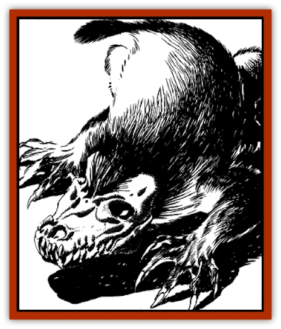

# Elemental Grue - Chaggrin

| Statistic | **Elemental Grue, Chaggrin** |
| --- | --- |
| **Activity Cycle:** | Any |
| **Alignment:** | Neutral evil |
| **Armor Class:** | 4 |
| **Climate/Terrain:** | Any |
| **Damage/Attack:** | 1d4+2/1d4+2 |
| **Diet:** | Mineral |
| **Frequency:** | Very rare (uncommon) |
| **Hit Dice:** | 5+5 |
| **Intelligence:** | Low to Average (5-10) |
| **Magic Resistance:** | Nil |
| **Morale:** | Average (8-10) |
| **Movement:** | 12, Br 3 |
| **No. Appearing:** | 1 (2-5) |
| **No. of Attacks:** | 2 |
| **Organization:** | Family |
| **Size:** | S |
| **Special Attacks:** | See below |
| **Special Defenses:** | +1 or better weapon to hit, immune to earth-based magic |
| **THAC0:** | 15 |
| **Treasure:** | Nil (C,Q&times;5) |
| **XP Value:** | 1,400 |

The chaggrin, or *soil beast*, is a grue from the plane of elemental Earth. When on the Prime Material plane, it typically takes the form of a yellowish hedgehog, although its skull-like head readily distinguishes it from a normal animal of that sort. It may also take the form of a large mole, or its natural form. Although only 2 or 3 feet long, a chaggrin weighs over 140 pounds, with some reaching as much as 210 pounds.

The natural form of a chaggrin is a disgusting, bipedal, manlike form, appearing much like lumpy, wet clay, with an asymmetrical, vicious face. Its small eyes gleam with feral light.

**Combat:** Whenever it desires, a chaggrin can assume the shape of a large mole, a hedgehog, or its natural form. The last is its usual shape on its own plane. In this form it can merge into surfaces of natural soil or stone. The only clue to the grue's presence is a damp, dark outline which is faintly perceptible if the area is carefully observed. Unwary creatures will have their surprise rolls penalized by -5. A chaggrin cannot travel through stone in this form; for that it must scrape its way along, burrowing with its powerful claws.

A chaggrin loves to torment its victim. It will usually attack by digging its long, razor-sharp foreclaws into its prey and then holding on while the hapless victim dashes hither and thither trying to escape from or dislodge the grue. Each round of such clinging inflicts an additional 1d6+6 hp damage. If the grue is in hedgehog form, its quills will inflict an additional 1-4 hit points of damage per round upon unprotected flesh.

No earth-based spell will work against a chaggrin, including *dig*, *earthquake*, *glassee*, *glassteel*, *move earth*, *passwall*, *statue*, *stone shape*, *stone to flesh*, *transmute rock to mud*, or *wall of stone*. The mere presence of a chaggrin within 40 feet of such magic dispels the enchantment, even if the dweomer was previously permanent. Magical items are unaffected.

**Habitat/Society:** Chaggrin are sometimes enslaved by the [[Genie|dao]] or [[Elemental_Earth_Kin_Chrysmal|crysmals]] to serve as diggers or as watchdogs. Most other races consider them too hateful to be efficient workers or reliable guards. On their own, chaggrin scratch out a living from rich mineral veins, which they devour. They live in extended families, sometimes cooperating in a limited way but often feuding among themselves. These families seldom accept new members by choice; mates are stolen from other families in violent raids and forced to adapt to their new circumstances. A chaggrin that leaves its family or is exiled never returns. To start a new family, it must capture a mate of its own.

Chaggrin encountered on the Prime Material plane are outcasts, exiled from their family for some treachery and unable to return to their own plane. They often agree to serve evil masters of the Underdark, such as [[Dwarf_Derro|derro]] and [[Dwarf_Duergar|duergar]]. Most [[Elf_Drow|drow]] consider them too small and loathsome to be of much use. Evil [[Gnome|gnomes]] who worship Urdlen consider chaggrin sacred and pamper them in underground temples.

**Ecology:** Because they devour valuable minerals, chaggrin are considered vermin on the plane of elemental Earth. Most sentient races there exterminate them without mercy, but some few tolerate them - some crysmals, for example, use their psionic powers to make the chaggrin harmless and keep them around as servants. Some of the [[Elemental_Air_Earth|earth elementals]] consider chaggrin delicious and will go to great lengths to obtain them. Mages sometimes capture chaggrin and use them to dispel earth-based magics placed by their rivals; elementalists are especially prone to this.

---
## Discovery & Documentation

**Source Publication:** ALQ4 Secrets of the Lamp (1993)
**Campaign Setting:** Al-Qadim (Forgotten Realms)
**Author(s):** Wolfgang Baur

### Other Creatures Found in This Source Book
   * [[Elemental_Grue_Harginn|Elemental Grue, Harginn]]
   * [[Elemental_Grue_Ildriss|Elemental Grue, Ildriss]]
   * [[Elemental_Grue_Varrdig|Elemental Grue, Varrdig]]
   * [[Elemental_Earth_Kin_Chrysmal|Elemental, Earth Kin, Chrysmal]]
   * [[Elemental_Fire_Kin_Azer|Elemental, Fire Kin, Azer]]
   * [[Genie_Tasked_Messenger|Genie, Tasked, Messenger]]
   * [[Genie_Tasked_Miner|Genie, Tasked, Miner]]
