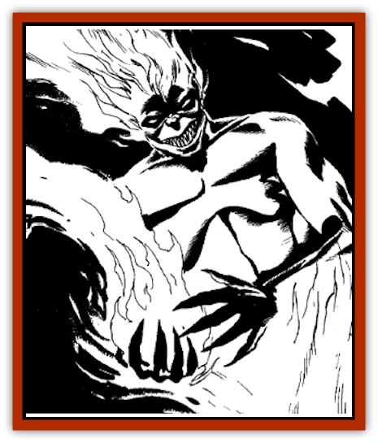

# Elemental Grue - Harginn

| Statistic | **Elemental Grue, Harginn** |
| --- | --- |
| **Activity Cycle:** | Day |
| **Alignment:** | Neutral evil |
| **Armor Class:** | 3 |
| **Climate/Terrain:** | Any hot |
| **Damage/Attack:** | By weapon or 1d4+4 |
| **Diet:** | Omnivore |
| **Frequency:** | Very rare (uncommon) |
| **Hit Dice:** | 4+4 |
| **Intelligence:** | Average to high (8-14) |
| **Magic Resistance:** | Nil |
| **Morale:** | Champion (15-16) |
| **Movement:** | 15 |
| **No. Appearing:** | 1 (2-8) |
| **No. of Attacks:** | 1 |
| **Organization:** | Caste |
| **Size:** | M |
| **Special Attacks:** | Spells, fire gout |
| **Special Defenses:** | +1 or better weapon to hit, immune to fire-based spells |
| **THAC0:** | 15 |
| **Treasure:** | Nil (I&times;½) |
| **XP Value:** | 650 |

The harginn, or *flame horror*, is a grue from the plane of elemental Fire. When summoned to the Prime Material plane, a harginn will typically appear in the form of a human with flames where its lower torso and legs would be. A harginn can assume the shape of a normal bonfire, a column of fire up to 8 feet high, or a bronzed human.

Harginn features, when discernable, express leering evil and great cruelty. Their eyes are glowing black, and their body colors are typically combinations of fiery hues such as scarlet and orange, crimson and purple-blue, yellow and orange.

**Combat:** A harginn moves rapidly in any form and attacks by sending forth a gout of flames from its fingertips. This flame balloons outward to encompass an area 3 feet wide and 6 feet long. All within the fiery blast take 1d4+4 hit points of damage.

Harginn can *blink* (as the wizard's spell) at will, and they will always do so in battle. Some harginn use weapons in melee, especially the pirate clans (see below). Cutlasses and long billhooks are favored weapons, and some clans of harginn use crossbows that launch tiny fiery projectiles. Creatures harmed by fire take an additional 1d6 points of fire damage from these sulfurous projectiles.

No fire-based spell will work against a harginn, including *burning hands*, *chariot of Sustarre*, *delayed blast fireball*, *fire seeds*, *fire storm*, *fireball*, *fire charm*, *fire shield*, *fire storm*, *fire trap*, *flame arrow*, *flame strike*, *incendiary cloud*, *meteor swarm*, *produce fire*, *produce flame*, and *pyrotechnics*. The mere presence of a harginn within 20 feet of such magic dispels it, even if the dweomer was previously permanent. Magical items are unaffected.

**Habitat/Society:** Harginn are organized into guilds, following a loose social order based on status; higher status guilds give orders to the lower ones, though they are not always obeyed and mutinies are common. Most harginn guilds are organized by function and sex, with females in the scout, shepherd, gatherer, weaver, and hunter guilds, and males in the farmer, soldier, cook, scribe, and priest guilds. Both males and females can be in the pariah guild, which is responsible for burning waste materials, fetching water, and other disagreeable tasks.

**Ecology:** Most harginn are servants and lackeys of the [[Genie|efreet]], though some few live in bands that wander across the seas of flame. They are generally on poor terms with most creatures of the plane of elemental Fire - even their efreet masters. They tend to be nomads everywhere but in the City of Brass.

**Pirate Harginn**

  Ship-sailing clans of harginn do exist, operating vessels stolen from the efreet. In these clans the females are the fisherfolk and the males are the sailors and marines. Though these clans are the most advanced of the harginn nations, they are also the most despised among other races of the plane of elemental Fire, for they are scalawags and cutthroats who sell their captives into slavery in the City of Brass. The efreet tolerate them as useful slavers and scavengers, though they mount occasional punitive expeditions against harginn who become too active. The piratical harginn accept tribute from some races of the plane in exchange for allowing them freedom from harginn harassment. The [[Elemental_Fire_Kin_Azer|azer]] are known to buy off the pirate harginn promptly, and thus their ships are the safest merchant vessels to travel on.

---
## Discovery & Documentation

**Source Publication:** ALQ4 Secrets of the Lamp (1993)
**Campaign Setting:** Al-Qadim (Forgotten Realms)
**Author(s):** Wolfgang Baur

### Other Creatures Found in This Source Book
   * [[Elemental_Grue_Chaggrin|Elemental Grue, Chaggrin]]
   * [[Elemental_Grue_Ildriss|Elemental Grue, Ildriss]]
   * [[Elemental_Grue_Varrdig|Elemental Grue, Varrdig]]
   * [[Elemental_Earth_Kin_Chrysmal|Elemental, Earth Kin, Chrysmal]]
   * [[Elemental_Fire_Kin_Azer|Elemental, Fire Kin, Azer]]
   * [[Genie_Tasked_Messenger|Genie, Tasked, Messenger]]
   * [[Genie_Tasked_Miner|Genie, Tasked, Miner]]
