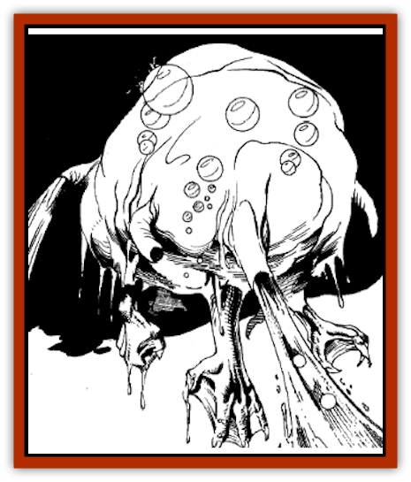
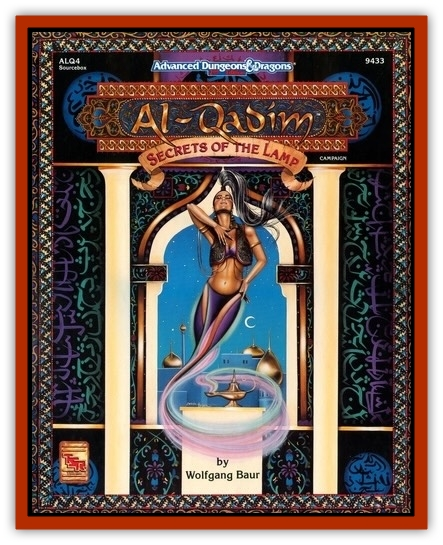

# Elemental Grue - Varrdig

| Statistic | **Elemental Grue, Varrdig** |
| --- | --- |
| **Activity Cycle:** | Night |
| **Alignment:** | Neutral evil |
| **Armor Class:** | 5 |
| **Climate/Terrain:** | Any |
| **Damage/Attack:** | 1-4/1-4 or 4d4/4d4 |
| **Diet:** | Omnivore |
| **Frequency:** | Very rare (uncommon) |
| **Hit Dice:** | 6+6 |
| **Intelligence:** | Semi- to Average (2 to 10) |
| **Magic Resistance:** | Nil |
| **Morale:** | Elite (13-14) |
| **Movement:** | 6, Sw 18 |
| **No. Appearing:** | 1-3 (2-5) |
| **No. of Attacks:** | 2 |
| **Organization:** | Triad |
| **Size:** | M (L) |
| **Special Attacks:** | Blinding, drowning |
| **Special Defenses:** | +1 or better weapon to hit, immune to water attacks |
| **THAC0:** | 13 |
| **Treasure:** | Nil (F&times;½) |
| **XP Value:** | 2,000 / Triad: 8,000 |

The varrdig, or *fluid brute*, is a creature from the plane of elemental Water. A varrdig can appear as a pool of water, a fountain, or as part of a greater body of water, although in the latter case its greenish tinge tends to make it noticeable if the observer is careful.

A varrdig's actual form is a globular, jelly-like blob. It is translucent, with a lower fringe of small, clawed legs and pipelike protrusions radiating from its middle. These flexible hoses provide propulsion by jetting water when the creature is in its element.

**Combat:** Out of water, a slow-moving varrdig uses jets of fluid to attack, and the considerable force of their stream of water can blind a victim up to 6 feet away. A varrdig attempting to blind an active opponent has a 1 in 6 chance of doing so for 1-4 rounds. The stream also inflicts 1-4 hit points of stunning damage; a creature reduced to 0 hit points in this fashion is rendered unconscious. A helpless air-breathing opponent can be drowned in a single round - the varrdig simply thrusts a tube into a nostril.

In water, the varrdig attacks by ramming with a speed unexpected in such an awkward-looking beast. When attacking, the varrdig's rapid, propulsion slams its own body into contact with its opponent. This ramming causes 4-16 points of damage and is always immediately followed up by a second ramming attack, allowing the varrdig two attacks per round.

No water-based spell will work against a varrdig, including *airy water*, *create food and water*, *create water*, *ice storm*, *lower water*, *obscurement*, *part water*, *purify food and drink*, *purify water*, *wall of ice*, and *water breathing*. The mere presence of a varrdig within 30 feet of such magic dispels the enchantment, even if the dweomer was previously permanent. Magical items are unaffected.

**Habitat/Society:** Varrdigs often travel in packs of three, the better to assume their fused form in the event of a powerful threat. It is not known whether varrdig triads are the only ones to fuse or whether other varrdigs can join in the fusion. Varrdig fusion may be a religious sacrament as well as a defensive and hunting strategy. Varrdig triads seek out and claim territories that they defend from all others. These hunting grounds are soon depopulated by the varrdigs' voracious appetites, and they move on to fresher waters.

**Ecology:** Vardiggs are scavengers, though they are not above killing off weak, diseased, or elderly creatures they meet. They are exterminated by the [[Genie|marid]] whenever the two species meet, but they are on good terms with other water elemental races, and creatures such as the [[Ixitxachitl|ixitxachitl]] and the [[Sahuagin|sahuagin]].

**Vardigg Triad**

  A trio of varrdigs can fuse, forming a three-lobed entity that resembles a snowman. This triad fusion requires 1-3 rounds to complete, after which the creatures act as one. The fused varrdig's hit points are equal to the total of three individuals that combined, and the creature's THAC0 improves to 5. Their combined jets move the triad along smoothly. The midbody portion is believed to house the sensory organs (if any do exist), as evidenced by odd outgrowths of cilia and stalks, and the upper body portion sprouts 3-6 propulsion tubes. Out of the water, those tubes can shoot water streams out to 10 feet, inflicting 1-6 hit points of stunning damage with the usual blinding effect, one target per tube, on up to six targets per round. Underwater, the triad makes a single ramming attack for 4-24 (4d6) points of damage. Its morale improves to Champion (15-16).

---
## Discovery & Documentation

**Source Publication:** ALQ4 Secrets of the Lamp (1993)
**Campaign Setting:** Al-Qadim (Forgotten Realms)
**Author(s):** Wolfgang Baur

### Other Creatures Found in This Source Book
   * [[Elemental_Grue_Chaggrin|Elemental Grue, Chaggrin]]
   * [[Elemental_Grue_Harginn|Elemental Grue, Harginn]]
   * [[Elemental_Grue_Ildriss|Elemental Grue, Ildriss]]
   * [[Elemental_Earth_Kin_Chrysmal|Elemental, Earth Kin, Chrysmal]]
   * [[Elemental_Fire_Kin_Azer|Elemental, Fire Kin, Azer]]
   * [[Genie_Tasked_Messenger|Genie, Tasked, Messenger]]
   * [[Genie_Tasked_Miner|Genie, Tasked, Miner]]
