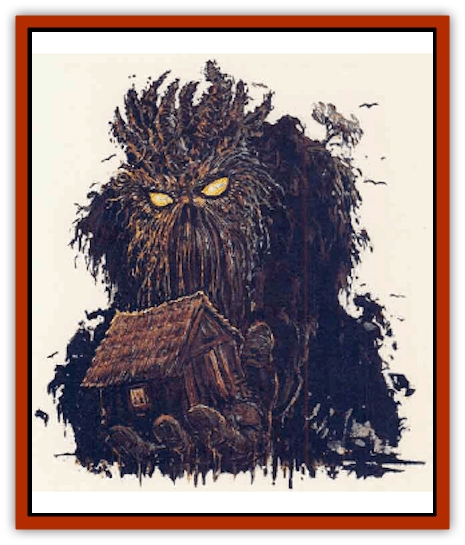

# Elemental - Nature

| Statistic | **Elemental, Nature** |
| --- | --- |
| **Activity Cycle:** | Any |
| **Alignment:** | Neutral |
| **Armor Class:** | 0 |
| **Climate/Terrain:** | Forest |
| **Damage/Attack:** | 5d10/5d10 |
| **Diet:** | Unknown |
| **Frequency:** | Very rare |
| **Hit Dice:** | 18 |
| **Intelligence:** | Average (8-10) |
| **Magic Resistance:** | Nil |
| **Morale:** | Fearless (20) |
| **Movement:** | 12 |
| **No. Appearing:** | 1 |
| **No. of Attacks:** | 2 |
| **Organization:** | Solitary |
| **Size:** | G (35'+) |
| **Special Attacks:** | Nil |
| **Special Defenses:** | Regeneration, immune to protection from evil |
| **THAC0:** | 5 |
| **Treasure:** | Nil |
| **XP Value:** | 15,000 |

The nature [[Elemental_General_Information|elemental]] is a being whose origins date back to the height of Netheril, and adventurers can find the spell to summon one only in libraries and tombs dating back more than 2,000 years. The nature elemental is composed of earth, fire, water, and air, as well as the force that some sages call the fifth element, spirit, or life. The nature elemental is one of the most powerful of elemental beings.

Upon being summoned, nature elementals take on a roughly humanoid appearance. They are gigantic, and easily attain heights of 35 or more feet. They look like walking humanoids composed of the biosystem they are summoned in. Generally, they appear as earthen forms covered in sod and shrubs, with small rivulets running over their bodies in defiance of gravity, and small animals moving over them. Nature elementals do not speak and are summoned for one task only: to return a certain area to an uncultivated state. Things such as villages, buildings, and even human and humanoid creatures are destroyed by the elemental in the process of performing its duty. Even the smallest grass hut is not above the notice of the elemental. The only persons immune to the elemental's fury are the caster of the summoning spell and up to 10 people per the caster's level within a 100-yard-radius, designated by the summoner upon executing the spell.

Unlike other elementals, nature elementals are not and cannot be controlled by their summoners. Their duties and the area in which they are to perform them are set upon their summoning. If the area a nature elemental is summoned into is free of signs of civilization, the creature merely returns to its place of origin. Nature elementals are also unaffected by *protection from evil* spells and like magics intended to hold at bay extraplanar creatures.

**Combat:** Fighting a nature elemental is extremely difficult. Most people would prefer to avoid one rather than confront it. To kill a nature elemental, one must deal damage in one round equal to the creature's total hit points; otherwise, it regenerates all damage it has sustained at the end of the round. If the elemental is somehow separated from contact with its surrounding environment (including air), it cannot regenerate. However, the circumstances that would cause it to be isolated in this manner are extremely hard to generate (place it magically in a vacuum, tug it into wildspace or the phlogiston, etc.)

If confronted, the massive fists of the elemental strike twice per round for 5d10 points of damage. The creature has the equivalent of titan strength (Strength 25). Magical items the creature moves across (not simply magical weapons used to attack it) must make a saving throw vs. disintegration or be restructured into the new environment and destroyed. The elemental never tires, but will disperse after its 1-mile area is "renovated" or 24 hours have elapsed.

**Habitat/Society:** The origins of these elementals are a mystery, since their exact home plane of existence is unknown. Some theorize that a nature elemental is actually an extremely minor avatar of a deity worshiped by the caster. For lack of a better explanation, most sages hold to this one.

**Ecology:** The nature elemental actually restructures the immediate environment. New plants grow to a mature state in its wake almost immediately, animals are attracted overnight to the location, water sources are purified, and signs of destruction, cultivation, and civilized habitation or influence disappear.

Nature elementals are summoned by the 7th-level priest spell *conjure nature elemental*. This spell is conjuration/summoning magic of the elemental, plant, and summoning spheres, and is reversible. The reverse of this spell, *dismiss nature elemental*, disperses a summoned nature elemental. The material components for this spell are burning incense, soft clay, sulfur, phosphorus, water, and sand, and a duly consecrated holy symbol of the deity to be invoked. The holy symbol is the only component to survive the spell's casting. *Conjure nature elemental* is detailed in full in the "New Spells" chapter of the *Campaign Book* in the *Ruins of Zhentil Keep* boxed set (TSR 1120).

---
## Discovery & Documentation

**Source Publication:** Ruins of Zhentil Keep (1995)
**Campaign Setting:** Forgotten Realms
**Author(s):** John Terra and Kevin Melka

### Other Creatures Found in This Source Book
   * [[Banedead|Banedead]]
   * [[Banelich|Banelich]]
   * [[Burnbones|Burnbones]]
   * [[Gargoyle_Guardgoyle|Gargoyle, Guardgoyle]]
   * [[Golem_Magic|Golem, Magic]]
   * [[Golem_Vault_Guardian|Golem, Vault Guardian]]
   * [[Hybsil|Hybsil]]
   * [[Magedoom|Magedoom]]
   * [[Mist_Scarlet_Dancer|Mist, Scarlet Dancer]]
   * [[Orc_Ondonti|Orc, Ondonti]]
   * [[Rat_Zhentish_Sewer|Rat, Zhentish Sewer]]
   * [[Render|Render]]
   * [[Sacaanti|Sacaanti]]
   * [[Snake_Messenger|Snake, Messenger]]
   * [[Zhentarim_Spirit|Zhentarim Spirit]]
