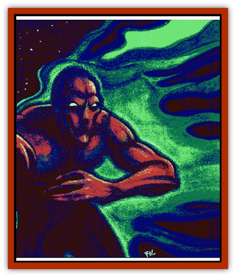

# Elemental - Negative Energy

| Statistic | **Elemental, Negative Energy** |
| --- | --- |
| **Activity Cycle:** | Any |
| **Alignment:** | Chaotic evil |
| **Armor Class:** | 2 |
| **Climate/Terrain:** | Negative Energy Plane |
| **Damage/Attack:** | 3d8 (fist) |
| **Diet:** | Life Force |
| **Frequency:** | Very rare |
| **Hit Dice:** | 8, 12, or 16 |
| **Intelligence:** | Low (5-7) |
| **Magic Resistance:** | Nil |
| **Morale:** | Fanatic (17) |
| **Movement:** | 12 |
| **No. Appearing:** | 1 |
| **No. of Attacks:** | 1 |
| **Organization:** | Solitary |
| **Size:** | L to H (8-16' tall) |
| **Special Attacks:** | Energy drain |
| **Special Defenses:** | +2 weapons to hit |
| **THAC0:** | 8 HD: 13 / 12 HD: 9 / 16 HD: 5 |
| **Treasure:** | Nil |
| **XP Value:** | 8 HD: 5,000 / 12 HD: 9,000 / 16 HD: 13,000 |

Negative energy [[Elemental_General_Information|elementals]] are so named because they are composed of the "material" of their home: the Negative Energy Plane. They appear as vaguely humanoid sheets of ebony flame. When on planes other than their home plane, negative enemy elementals leave death and decay in their wakes.

**Combat:** The mere presence of these creatures is anathema to life; everything within a 30-feet radius of a negative energy elemental is affected as follows:

<ul><li>Undead within the area are more difficult to turn; they turn as if two categories higher.</li><li>All undead regenerate at a rate of 2 hit points a round. Undead that already have regeneration abilities add 2 hit points a round to their usual rate.</li><li>Freshly slain living creatures in the area have a 50% chance to spontaneously animate as standard [[Zombie|zombies]].</li><li>Healing spells in the area of effect only cure half the hit points rolled.</li><li>A supernatural chill inflicts 1 point of damage per turn to those who do not possess magical protection against cold.</li></ul>When a negative energy elemental attacks, it either forms a humanoid fist to deliver a hammering attack or it merely sweeps over its victim in a midnight wave of death. A successful attack inflicts 3d8 points of damage due to cell death plus the loss of two levels of experience. Their touch also causes up to 1,000 cubic feet (a 10-foot cube) of materials derived from organic substances (such as food, parchment, wood, cloth, and the like) to rot and be destroyed. A successful item saving throw vs. acid negates the effect.

Because of its close association with the Negative Energy Plane, these creatures are particularly susceptible to elemental manifestations. Attacks made by any type of elemental or elemental being against a negative energy elemental gain a +2 attack bonus and +2 points per damage die delivered. Additionally, negative energy elementals save against manifestations of elements (*fireball*, *lightning bolt*, etc.) with a -2 penalty.

**Habitat/Society:** The creatures do not leave the Negative Energy Plane by choice, but they can be summoned by the appropriate spells or spell-like abilities. If a summoner of a negative energy elemental loses control of the creature, he or she must immediately make a successful saving throw vs. death magic or lose 1d4 levels of experience in a negative backlash.

Additionally, the elemental attacks its summoner for three rounds before fading back into the inner plane of its birth.

**Ecology:** When away from the Negative Energy Plane longer than a day, a negative energy elemental is forced to consume life force. If it is unable to consume at least 10 hit points or 1 level each day, the creature returns to its plane of origin. Therefore, it is difficult for one of these elementals to remain hidden in any area for too long before its appetite gives it away.

If a negative energy elemental were to be bound into a magical item in just the proper way (an excedingly dangerous undertaking), the effects of the negative aura could prove a beneficial item to an evil wizard or necromancer. However, for every month a negative energy elemental remains bound into an item, there is a 5% chance it will burst free. An elemental that finds freedom is uncontrollable afterwards and seeks to slay the creature who bound it until one or the other is dead.

---
## Discovery & Documentation

**Source Publication:** Return to the Tomb of Horrors (1998)
**Campaign Setting:** Greyhawk
**Author(s):** Bruce R. Cordell, Gary Gygax

### Other Creatures Found in This Source Book
   * [[Bone_Weird|Bone Weird]]
   * [[Fundamental_Negative|Fundamental, Negative]]
   * [[Moilian_Heart|Moilian Heart]]
   * [[Moilian_Zombie|Moilian Zombie]]
   * [[Vestige|Vestige]]
   * [[Winter-Wight|Winter-Wight]]
