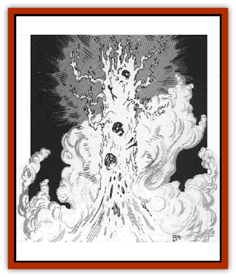
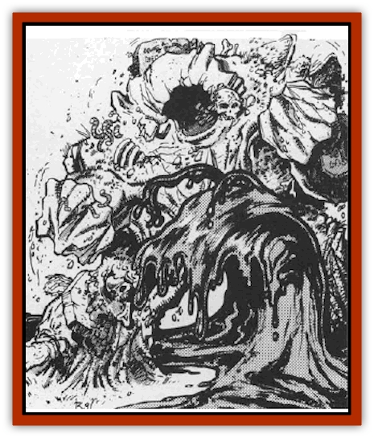

# Elemental - Ravenloft

| Statistic | **Blood** | **Grave** | **Mist** | **Pyre** |
| --- | --- | --- | --- | --- |
| **Activity Cycle:** | Any | Any | Any | Any |
| **Alignment:** | Neutral | Neutral | Neutral | Neutral |
| **Armor Class:** | 0 | 0 | 0 | 0 |
| **Climate/Terrain:** | Any Ravenloft | Any Ravenloft Graveyard | Any Ravenloft | Any Ravenloft land |
| **Damage/Attack:** | 3d6 | 4-40 (4d10) | 2-20 (2d10) | 3d8 |
| **Diet:** | Special | Special | Special | Special |
| **Frequency:** | Very Rare | Very rare | Very rare | Very rare |
| **Hit Dice:** | 8, 12, or 16 | 8, 12, or 16 | 8, 12, or 16 | 8, 12, or 16 |
| **Intelligence:** | Low (5-7) | Low (5-7) | Low (5-7) | Low (5-7) |
| **Magic Resistance:** | Nil | Nil | Nil | Nil |
| **Morale:** | 8 HD: Champion (15-16) / 12 HD: Champion (15-16) / 16 HD: Fanatic (17-18) | 8 HD: Champion (15-16) / 12 HD: Champion (15-16) / 16 HD: Fanatic (17-18) | 8 HD: Champion (15-16) / 12 HD: Champion (15-16) / 16 HD: Fanatic (17-18) | 8 HD: Champion (15-16) / 12 HD: Champion (15-16) / 16 HD: Fanatic (17-18) |
| **Movement:** | 12 | 6 | Fl 36 (A) | 12 |
| **No. Appearing:** | 1 | 1 | 1 | 1 |
| **No. of Attacks:** | 1 | 1 | 1 | 1 |
| **Organization:** | Solitary | Solitary | Solitary | Solitary |
| **Size:** | 8 HD: L (8' tall) / 12 HD: L (12' tall) / 16 HD: H (16' tall) | 8 HD: L (8' tall) / 12 HD: L (12' tall) / 16 HD: H (16' tall) | 8 HD: L (8' tall) / 12 HD: L (12' tall) / 16 HD: H (16' tall) | 8 HD: L (8' tall) / 12 HD: L (12' tall) / 16 HD: H (16' tall) |
| **Special Attacks:** | See below | Sink | <i>Infuse evil</i> | See below |
| **Special Defenses:** | See below | See below | See below | See below |
| **THAC0:** | 8 HD: 13 / 12 HD: 9 / 16 HD: 5 | 8 HD: 13 / 12 HD: 9 / 16 HD: 5 | 8 HD: 13 / 12 HD: 9 / 16 HD: 5 | 8 HD: 13 / 12 HD: 9 / 16 HD: 5 |
| **Treasure:** | Nil | Nil | Nil | Nil |
| **XP Value:** | 8 HD: 3,000 / 12 HD: 7,000 / 16 HD: 11,000 | 8 HD: 3,000 / 12 HD: 7,000 / 16 HD: 11,000 | 8 HD: 4,000 / 12 HD: 8,000 / 16 HD: 12,000 | 8 HD: 3,000 / 12 HD: 7,000 / 16 HD: 11,000 |

## 

Pyre Elemental

The wild and dancing pyre elemental is drawn from the flames of a funeral pyre or some large burning associated with a burial rite.

A pyre elemental appears as a slender column of intense flame with tendrils of fire licking away from it like the waving arms of a dancer.

**Combat:** A pyre elemental attacks those it encounters with unmatched savagery, taking delight in the destruction and death it causes. Anyone who is struck by one of the lashing streams of fire that it wields whip-like in combat suffers 3d8 points of damage. Their armor (including shields and magical items of protection) must make saving throws vs. magical fire. Suits of armor that fail their saves have their armor class reduced in effectiveness one step. Thus, a suit of brigandine armor that fails its saving throw is reduced from AC 6 to AC 7. Shields and magical devices that improve the wearer's armor class which fail their saves are destroyed.

## Blood Elemental

A blood elemental can be called forth only from a large quantity of blood or from water drawn from the lungs of drowned men. Because of the difficulty in obtaining these materials, they are the rarest of the [[Elemental_Ravenloft_General_Information|Ravenloft elementals]].

Blood elementals appear as roughly humanoid creatures composed entirely of blood. They leave a trail of drying blood on the ground behind them and fill the air around them with the smells of salt and iron. A pair of fluid tentacles whip about the creature and allow it to manipulate objects and attack enemies.

**Combat:** A blood elemental will attack in one of two ways. The first, and most common means of attack is a blow from one of its tentacles. Each such strike inflicts 3d6 points of damage. Further, the victim of such an attack must make a saving throw versus spells or have a portion of his own blood drawn forth from his body and added to that of the elemental. The amount of blood lost in this way is equal to the damage done by the initial blow. Thus, an attack that inflicts 12 points of damage is followed by a potential blood drain that inflicts an additional 12 points of damage. Hit points lost to the blood drain are added directly to the elemental's own hit point total (to a maximum of 8 hit points per Hit Die). When striking at a target that has no blood of its own (a [[Golem_General_Information|golem]], say), the blood elemental cannot employ its blood drain attack and suffers a -2 penalty per die on all damage rolls (to a minimum of 1 point per die).

In any round that the elemental chooses not to attack, it may attempt to smother an opponent. To do so, the elemental makes a normal attack roll to hurl itself onto the target of the attack. If it succeeds, the victim of the attack must make a saving throw versus death or find that the elemental has filled his nose, mouth, and lungs with blood. The victim of this attack has a very good chance of drowning (as described in the *AD&D Player's Handbook*). On the next round, the elemental is free to move away from this victim and attack another character, leaving the first target for dead. Attacks on the elemental while it is smothering do full damage to the elemental and half damage to the victim (who is unable to lash out at the elemental while being smothered).

Curiously, although they are a variant on [[Elemental_Fire_Water|water elementals]], blood elementals are unable to enter or cross open water. If forced into such a situation, they begin to dissipate - suffering 1d10 points of damage per round-until such time as they break contact with the water.

## Mist Elemental

A mist elemental is a relative of the traditional air elemental who has been formed from the essences of the Ravenloft Mists themselves. Once conjured, the mist elemental appears as a drifting cloud of white vapor that looks like nothing more than a patch of fog. Because of this, a mist elemental that is moving about in a region of fog or mist is treated as if it were invisible.

**Combat:** When a mist elemental chooses to attack, it does so with its chilling, evil touch. Moving with a speed one would never expect from a being that seems to drift about at the mercy of the wind, the elemental moves toward (and then through) its target. In so doing, the creature has the ability to employ one of two attack modes. The first is a simple, straight-forward attack that inflicts 2d20 points of damage from the creature's chilling presence.

In lieu of inflicting damage, however, the mist elemental may seek to *infuse evil* into the victim. When it does so, the creature seems to enter the body of the victim and then pass on through it without harm. However, anyone subject to such an attack must save vs. spells or have their alignment shifted to chaotic evil. In addition, a character who has been infused is also *charmed* by the elemental and will not act against it. The elemental may not *infuse evil* twice in a row. That is, it may not *infuse evil* again until after it attacks and attempts to inflict damage. This attack may be against the same character or another one. All of the normal penalties associated with an involuntary alignment change are in effect following an attack by a mist elemental. In order to regain their original alignment and break the *charm* upon them, *infused* characters must receive a *remove curse* spell cast by an individual of their true alignment.

## Grave Elemental

The grave elemental is a variant [[Elemental_Air_Earth|earth elemental]] that is drawn from the soil of a graveyard or similar resting place of the dead. It appears as a towering, man-shaped mass of earth with bones and the shattered remnants of coffins protruding from it.

**Combat:** A grave elemental cannot travel through water, but can move effortlessly through earth and stone. It often uses the latter ability to allow it to lurk beneath the surface of the ground while would-be victims draw near. When they are right above it, it explodes upward and attacks, imposing a -4 penalty on all surprise rolls made by its adversaries.

When grave elementals engage in combat, their preferred means of attack is simply a blow from their mighty fists. The damage they inflict with such an attack is dependant on their size, with 8 HD elementals delivering 4d8 points of damage, 12 HD elementals delivering 4d10 points of damage, and the massive 16 HD elementals inflicting a crushing 4d12 points of damage.Grave elementals are less effective when striking at targets who are sir- or waterborne. Obviously, they cannot employ their *sink* power (see below) against such creatures and any physical damage they inflict on them is reduced by 2 points per die (to a minimum of 1 point per die).

In lieu of attacking with brute force, they may employ a magical power that functions as the *sink* spell of a wizard whose level is equal to their Hit Dice. They may cast this spell but once per hour and may only use it against creatures or objects standing on an earth or stone surface. Although this is an innate power and has no casting time or components, the elemental is unable to undertake any other action in the round that it attempts to *sink* an opponent.

Grave elementals share the earth elemental's ability to lash out at buildings with earthen or stone foundations. Their attacks against such structures can be devastating and are far more effective than those made by other creatures of similar power due to the elemental's affinity for the building materials used.

---
## Discovery & Documentation

**Source Publication:** MC10 Ravenloft Appendix I (1989)
**Campaign Setting:** Planescape
**Author(s):** William W. Connors

### Other Creatures Found in This Source Book
   * [[Bastellus|Bastellus]]
   * [[Bat_Ravenloft|Bat (Ravenloft)]]
   * [[Bowlyn|Bowlyn]]
   * [[Broken_One|Broken One]]
   * [[Bussengeist|Bussengeist]]
   * [[Darkling|Darkling]]
   * [[Doom_Guard|Doom Guard]]
   * [[Doppelganger_Plant|Doppelganger Plant]]
   * [[Ermordenung|Ermordenung]]
   * [[Ghoul_Lord|Ghoul Lord]]
   * [[Goblyn|Goblyn]]
   * [[Golem_III|Golem III]]
   * [[Golem_IV|Golem IV]]
   * [[Golem_Ravenloft|Golem (Ravenloft)]]
   * [[Grim_Reaper|Grim Reaper]]
   * [[Human_Abber_Nomad|Human, Abber Nomad]]
   * [[Human_Ravenloft|Human (Ravenloft)]]
   * [[Imp_Assassin|Imp, Assassin]]
   * [[Impersonator|Impersonator]]
   * [[Lycanthrope_Werebat|Lycanthrope, Werebat]]
   * [[Lycanthrope_Wereraven|Lycanthrope, Wereraven]]
   * [[Mist_Horror|Mist Horror]]
   * [[Mummy_Greater|Mummy, Greater]]
   * [[Quevari|Quevari]]
   * [[Quickwood|Quickwood]]
   * [[Ravenkin|Ravenkin]]
   * [[Reaver|Reaver]]
   * [[Scarecrow_Ravenloft|Scarecrow (Ravenloft)]]
   * [[Shadow_Fiend|Shadow Fiend]]
   * [[Skeleton_Giant|Skeleton, Giant]]
   * [[Strahd's_Skeletal_Steed|Strahd's Skeletal Steed]]
   * [[Treant_Evil|Treant, Evil]]
   * [[Treant_Undead|Treant, Undead]]
   * [[Valpurgeist|Valpurgeist]]
   * [[Vampire_Dwarf|Vampire, Dwarf]]
   * [[Vampire_Elf|Vampire, Elf]]
   * [[Vampire_Gnome|Vampire, Gnome]]
   * [[Vampire_Halfling|Vampire, Halfling]]
   * [[Vampire_General_Information|Vampire, General Information]]
   * [[Vampire_Kender|Vampire, Kender]]
   * [[Vampyre|Vampyre]]
   * [[Widow_Red|Widow, Red]]
   * [[Wolfwere_Greater|Wolfwere, Greater]]
   * [[Zombie_Lord|Zombie Lord]]
