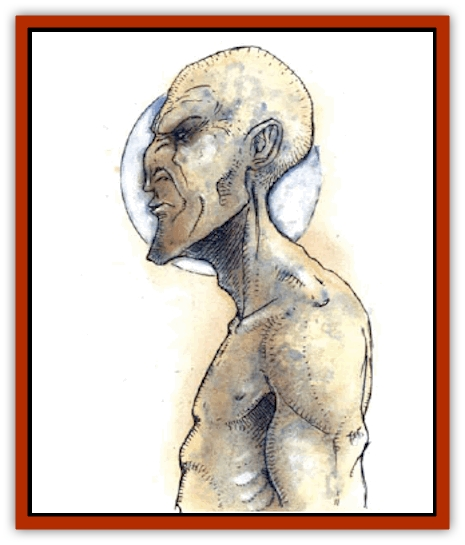

# Elemental - Sandman

| Statistic | **Elemental, Sandman** |
| --- | --- |
| **Activity Cycle:** | Night |
| **Alignment:** | Neutral evil |
| **Armor Class:** | 3 |
| **Climate/Terrain:** | Subtropical or tropical/desert |
| **Damage/Attack:** | Nil |
| **Diet:** | Minerals |
| **Frequency:** | Rare |
| **Hit Dice:** | 4 |
| **Intelligence:** | Average (8-10) |
| **Magic Resistance:** | 20% |
| **Morale:** | Elite (13-14) |
| **Movement:** | 9 |
| **No. Appearing:** | 1d6 |
| **No. of Attacks:** | 1 |
| **Organization:** | Family |
| **Size:** | M (5-6' tall) |
| **Special Attacks:** | Sleep |
| **Special Defenses:** | See below |
| **THAC0:** | 17 |
| **Treasure:** | A,Q |
| **XP Value:** | 975 |

The sandman's name describes it exactly: This [[Elemental_General_Information|elemental]] is a manlike biped made entirely of sand, held together by magical cohesion. Sandmen are creatures of the Elemental Plane of Earth, but on the Prime Material Plane they serve as slave-takers of the [[Genie|dao]]. Their ability to capture foes unharmed makes them especially successful in this role.

Sandmen apparently communicate telepathically between themselves, but they speak no languages - indeed, they do not speak at all - and only dao seem to be able to understand what they are thinking. Sandmen can understand what other intelligent creatures are saying (or perhaps thinking), however.

**Combat:** Sandmen prefer to fight from ambush or at night, when they can flee encounters that go against them. Any character or monster coming within 20 feet of a sandman must successfully save vs. spell or fall asleep, regardless of experience level. (Elves remain 90% resistant to this effect.) Those who manage to stay awake must attempt to save again each time they touch a sandman or are touched by it (a hit on the sandman with a weapon does not constitute a touch).

Once a sandman has put a victim to sleep, it takes no further hostile action against him, leaving him to doze while the sandmen and the dao take the victim to slave markets, or while the sleepers are simply ejected from their lands.

Victims remain asleep for three full turns regardless of noise, motion, or magic applied to them. Thereafter, there is a cumulative 10% chance per turn of a sleeper waking of his own accord, and a 95% chance per round of him waking if violently disturbed. Creatures attacked while asleep are automatically hit for maximum damage for a single round of attacks, but thereafter, they may respond normally.

Sandmen have the natural ability of *protection from normal missiles*. Missiles striking a sandman simply pass through its form and fall to the ground.

When a sandman is slain, it immediately crumbles into dust.

**Habitat/Society:** Sandmen automatically attack humans and need never check morale. Sandmen hate humans because human and demihuman magi often slay them simply to use their remains in working magic. This is why sandmen always seek out human or demihuman slaves for their dao masters - for revenge.

**Ecology:** Sandmen are often slaves of the dao. They are allowed to win their freedom by bringing replacement slaves to [[Genie_Noble_Dao|dao nobles]], to take their places. The dao have learned to bind sandman through the use of magical amulets; this ensure that sandmen sent to the Prime Material Plane to fetch more slaves do not simply run away. Sandman hate their masters fiercely, but they loathe humans even more, for they consider them weak. They despise any creature that they can ensorcel into sleep, and they fear any creature immune to their powers.

Sandmen seem to require neither food nor drink, and they are excellent at surviving even the harshest deserts or mines. They derive their food from stone, sand, and dust, and can starve only if they are kept airborne for a lengthy period.

The powder into which a destroyed sandman crumbles can be used to make a *potion of dreaming* or *sand of truths*. If used as the material component in a *sleep* spell, the spell affects double the normal number of levels or Hit Dice. The dust of a sandman is enough for only one potion or two spells.

---
## Discovery & Documentation

**Source Publication:** Monstrous Compendium, 1994 Annual, Volume 1 (1995)
**Campaign Setting:** Advanced Dungeons & Dragons 2nd Edition
**Author(s):** David Wise

### Other Creatures Found in This Source Book
   * [[Abyss_Ant|Abyss Ant]]
   * [[Achaierai|Achaierai]]
   * [[Afanc|Afanc]]
   * [[Al-Jahar|Al-Jahar]]
   * [[Baelnorn|Baelnorn]]
   * [[Baneguard|Baneguard]]
   * [[Banelar|Banelar]]
   * [[Bird_Talking|Bird, Talking]]
   * [[Blazing_Bones|Blazing Bones]]
   * [[Campestri|Campestri]]
   * [[Caniquine|Caniquine]]
   * [[Cat_Winged|Cat, Winged]]
   * [[Crypt_Servant|Crypt Servant]]
   * [[Death's_Head_Tree|Death's Head Tree]]
   * [[Dog_Saluqi|Dog, Saluqi]]
   * [[Dragon_Electrum|Dragon, Electrum]]
   * [[Dragon_Fang|Dragon, Fang]]
   * [[Dragon_Linnorm_Corpse_Tearer|Dragon, Linnorm, Corpse Tearer]]
   * [[Dragon_Linnorm_Dread|Dragon, Linnorm, Dread]]
   * [[Dragon_Linnorm_Flame|Dragon, Linnorm, Flame]]
   * [[Dragon_Linnorm_Forest|Dragon, Linnorm, Forest]]
   * [[Dragon_Linnorm_Frost|Dragon, Linnorm, Frost]]
   * [[Dragon_Linnorm_Gray|Dragon, Linnorm, Gray]]
   * [[Dragon_Linnorm_Land|Dragon, Linnorm, Land]]
   * [[Dragon_Linnorm_Midgard|Dragon, Linnorm, Midgard]]
   * [[Dragon_Linnorm_Rain|Dragon, Linnorm, Rain]]
   * [[Dragon_Linnorm_Sea|Dragon, Linnorm, Sea]]
   * [[Dragon_Neutral_Jacinth|Dragon, Neutral, Jacinth]]
   * [[Dragon_Neutral_Jade|Dragon, Neutral, Jade]]
   * [[Dragon_Neutral_Pearl|Dragon, Neutral, Pearl]]
   * [[Dread|Dread]]
   * [[Dragon-kin|Dragon-kin]]
   * [[Elemental_Earth_Kin_Chrysmal|Elemental, Earth Kin, Chrysmal]]
   * [[Elemental_Earth_Kin_Earth_Weird|Elemental, Earth Kin, Earth Weird]]
   * [[Elemental_Fire_Kin_Azer|Elemental, Fire Kin, Azer]]
   * [[Elemental_Wind_Walker|Elemental, Wind Walker]]
   * [[Elemental_Vermin|Elemental Vermin]]
   * [[Feystag|Feystag]]
   * [[Flame_Skull|Flame Skull]]
   * [[Foulwing|Foulwing]]
   * [[Gambado|Gambado]]
   * [[Garbug|Garbug]]
   * [[Genie_Tasked_Administrator|Genie, Tasked, Administrator]]
   * [[Genie_Tasked_Deceiver|Genie, Tasked, Deceiver]]
   * [[Genie_Tasked_Harim_Servant|Genie, Tasked, Harim Servant]]
   * [[Genie_Tasked_Messenger|Genie, Tasked, Messenger]]
   * [[Genie_Tasked_Miner|Genie, Tasked, Miner]]
   * [[Genie_Tasked_Oathbinder|Genie, Tasked, Oathbinder]]
   * [[Gibbering_Mouther|Gibbering Mouther]]
   * [[Gnasher|Gnasher]]
   * [[Gnasher_Winged|Gnasher, Winged]]
   * [[Golem_Brain|Golem, Brain]]
   * [[Golem_Hammer|Golem, Hammer]]
   * [[Golem_Metagolem|Golem, Metagolem]]
   * [[Golem_Spiderstone|Golem, Spiderstone]]
   * [[Gorynych|Gorynych]]
   * [[Greelox|Greelox]]
   * [[Helmed_Horror|Helmed Horror]]
   * [[Jarbo|Jarbo]]
   * [[Laraken|Laraken]]
   * [[Lich_Psionic|Lich, Psionic]]
   * [[Living_Steel|Living Steel]]
   * [[Lock_Lurker|Lock Lurker]]
   * [[Loxo|Loxo]]
   * [[Lycanthrope_Loup_de_Noir|Lycanthrope, Loup de Noir]]
   * [[Lycanthrope_Werebadger|Lycanthrope, Werebadger]]
   * [[Lycanthrope_Werejaguar|Lycanthrope, Werejaguar]]
   * [[Lythlyx|Lythlyx]]
   * [[Magebane|Magebane]]
   * [[Marrashi|Marrashi]]
   * [[Metalmaster|Metalmaster]]
   * [[Mimic_House_Hunter|Mimic, House Hunter]]
   * [[Naga_Bone|Naga, Bone]]
   * [[Nautilus_Giant|Nautilus, Giant]]
   * [[Nightshade_Toril|Nightshade (Toril)]]
   * [[Nishruu|Nishruu]]
   * [[Noran|Noran]]
   * [[Opinicus|Opinicus]]
   * [[Ormyrr|Ormyrr]]
   * [[Parasite|Parasite]]
   * [[Pasari-Niml|Pasari-Niml]]
   * [[Plant_Vampire_Moss|Plant, Vampire Moss]]
   * [[Pteraman|Pteraman]]
   * [[Rautym|Rautym]]
   * [[Shadeling|Shadeling]]
   * [[Skum|Skum]]
   * [[Snake_Giant_Cobra|Snake, Giant Cobra]]
   * [[Snake_Stone|Snake, Stone]]
   * [[Spectral_Wizard|Spectral Wizard]]
   * [[Spell_Weaver|Spell Weaver]]
   * [[Spider_Brain|Spider, Brain]]
   * [[Suwyze|Suwyze]]
   * [[Tatalla|Tatalla]]
   * [[Tick_Heart|Tick, Heart]]
   * [[Tree_Dark|Tree, Dark]]
   * [[Tree_Singing|Tree, Singing]]
   * [[Tressym|Tressym]]
   * [[Troll_Snow|Troll, Snow]]
   * [[Tuyewera|Tuyewera]]
   * [[Ulitharid|Ulitharid]]
   * [[Undead_Dwarf|Undead Dwarf]]
   * [[Undead_Lake_Monster|Undead Lake Monster]]
   * [[Whipsting|Whipsting]]
   * [[Windghost|Windghost]]
   * [[Wolf_Dread|Wolf, Dread]]
   * [[Wolf_Stone|Wolf, Stone]]
   * [[Wolf_Vampiric|Wolf, Vampiric]]
   * [[Wraith_Shimmering|Wraith, Shimmering]]
   * [[Xantravar|Xantravar]]
   * [[Xaver|Xaver]]
