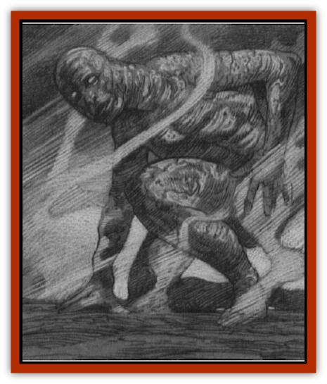

# Elemental - Smoke

| Statistic | **Elemental, Smoke** |
| --- | --- |
| **Activity Cycle:** | Any |
| **Alignment:** | Neutral |
| **Armor Class:** | 3 |
| **Climate/Terrain:** | Any smoke |
| **Damage/Attack:** | See below |
| **Diet:** | Smoke |
| **Frequency:** | Very rare |
| **Hit Dice:** | 4 |
| **Intelligence:** | Low (5-7) |
| **Magic Resistance:** | See below |
| **Morale:** | Elite (14) |
| **Movement:** | 12 |
| **No. Appearing:** | 1 |
| **No. of Attacks:** | 1-4 |
| **Organization:** | Solitary |
| **Size:** | S (4' tall) |
| **Special Attacks:** | See below |
| **Special Defenses:** | +1 weapon or better to hit |
| **THAC0:** | 17 |
| **Treasure:** | Nil |
| **XP Value:** | 1,400 |

Smoke [[Elemental_General_Information|elementals]] are hybrid creatures, a strange combination of the elements of [[Elemental_Fire_Water|Fire]] and [[Elemental_Air_Earth|Earth]]. These swirling clouds of hot soot, ash, and smoke are conjured from large amounts of nonmagical smoke. Sometimes this cloud contains glowing red sparks. It can assume any shape, but its edges tend to be hazy and illdefined. If adopting a form with eyes, it will concentrate a cluster of soot and ash particles into swirling balls that resemble eyes, but this is for the sake of appearance only. A smoke [[Elemental_Ravenloft_General_Information|elemental]] "sees" by sensing the lower temperatures of the creatures and objects around it.

**Combat:** Smoke elementals are unfettered by gravity. Because they have no solid form, they can slip through thin cracks and tiny holes, but they then must spend one round reforming into their chosen shape.

A smoke elemental attacks by engulfing an opponent's head. Once it has done this, the victim suffers 2d4 points of damage from heat, plus 2d4 points of damage from suffocation, per round. Victims choke to death as their lungs fill with hot smoke. A smoke elemental continues to engulf a single opponent until that victim is dead or unconscious. It then moves on to its next target. If a victim flees, the smoke elemental follows it, moving so that the victim's head remains inside the damaging cloud of smoke.

Smoke elementals have the unusual ability to divide themselves into four parts, each of which can act on its own initiative. These smaller clouds seek to enter a creature's lungs, where they inflict 1d4 points of damage each round. Once one of these smaller smoke elementals has lodged itself inside a creature's lungs, it remains there until its victim is unconscious or dead. Until then, it can only be removed by magical means (see below). Each of these tiny smoke elementals has 1 Hit Die.

Smoke elementals are immune to fire-based attacks, but they are vulnerable to cold-based attacks and suffer twice normal damage from them. They are also vulnerable to large gusts of wind, which do not harm the monsters, but can be successfully used to drive them away or keep them at bay. Because they are magical constructs, they can be magically dispelled.

**Habitat/Society:** Smoke elementals are magical constructs whose constituents are drawn both from the Elemental Plane of Fire (heat) and the Elemental Plane of Earth (soot or ash). Although they are sentient, they have no form on any plane but the Prime Material and Ethereal Planes. They cannot be *banished* or *dismissed* back to a home plane, since they don't have one, but such spells will drive them from a victim's lungs.

**Ecology:** Smoke elementals are typically created by a team of three priests who simultaneously cast the magical spells *conjure fire elemental*, *conjure earth elemental*, and *combine*. They are often used by priests as magical guardians of temples, and they are typically created out of sweet-smelling incense smoke, although they can be formed from the smoke of mundane fires.

There have also been reports of tiny (1-HD) smoke elementals conjured from tobacco smoke, but most sages insist these reports are merely attempts by tobacconists to falsely attribute a magical cause to deaths that are caused by the tobacco smoke itself.

---
## Discovery & Documentation

**Source Publication:** The Awakening (1994)
**Campaign Setting:** Ravenloft
**Author(s):** Lisa Smedman, Richard Pike-Brown 

### Other Creatures Found in This Source Book
   * [[Cat_Crypt|Cat, Crypt]]
   * [[Cat_Plains|Cat, Plains]]
