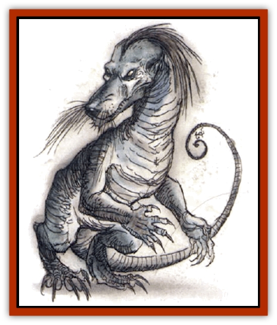
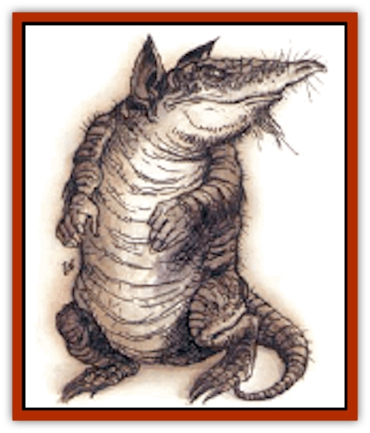
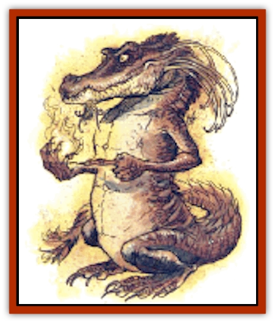
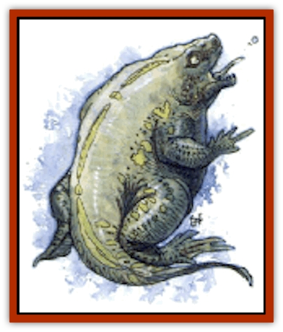

# Elemental Vermin

| Statistic | **Air (Duster)** | **Earth (Crawler)** | **Fire (Flameling)** | **Water (Spitter)** |
| --- | --- | --- | --- | --- |
| **Activity Cycle:** | Any | Any | Any | Any |
| **Alignment:** | Neutral | Neutral | Neutral | Neutral |
| **Armor Class:** | 4 | 3 | 4 | 6 |
| **Climate/Terrain:** | Any | Any | Any dry, warm | Any moist, cool |
| **Damage/Attack:** | 1d4 | 1-3/1-3/1-3 | 1-3/1-2 | 1d4 |
| **Diet:** | Scents, flowers, and ambergris | Vegetable and mineral matter | Any flammable material | Any liquid |
| **Frequency:** | Rare | Rare | Rare | Rare |
| **Hit Dice:** | 2 | 2 | 2 | 2 |
| **Intelligence:** | Semi- (2-4) | Animal (1) | Semi- (2-4) | Animal (1) |
| **Magic Resistance:** | Nil | Nil | Nil | Nil |
| **Morale:** | Average (8-10) | Champion (15-16) | Elite (13-14) | Steady (11-12) |
| **Movement:** | 6, Fl 6 | 6, Br 6 | 6, Fl 6 | 6, Sw 6 |
| **No. Appearing:** | 1 | 1-6 | 2-8 | 1 |
| **No. of Attacks:** | 1 | 3 | 2 (bite, tail) | 1 |
| **Organization:** | Solitary | Pack | Pack | Solitary |
| **Size:** | T (18&rdquo; tall) | T (1' tall) | T (9&rdquo; tall) | T (1' tall) |
| **Special Attacks:** | Obscurement | Rear claws, 1-4/1-4 | Fire (see below) | Spit |
| **Special Defenses:** | Invisibility | Disguise | Immune to fire | Regeneration |
| **THAC0:** | 19 | 19 | 19 | 19 |
| **Treasure:** | See below | See below | See below | See below |
| **XP Value:** | 175 | 175 | 175 | 175 |

These are creatures from the elemental planes. On those planes, they are simply pests, but they can be a greater problem on the Prime Material plane. Each is basically humanoid in shape; more complete descriptions can be found in the individual entries below.

Elemental vermin do not speak any languages, and their relatively low intelligence makes any sort of telepathic contact fairly unrewarding.

**Combat:** Though some elemental vermin would rather run away than fight, all fight tenaciously if cornered or disturbed during feeding. Each has a special attack and a special defense, described below.

**Habitat/Society:** Elemental vermin traveled to the Prime Material plane through various gates. They appear in places frequented by [[Genie|genies]] and [[Elemental_General_Information|elementals]] and prefer to live in areas heavy in their element (high nests for dusters, underground burrows for crawlers, fires and furnaces for flamelings, and wells and rivers for spitters.

**Ecology:** While just normal scavengers on their home planes, elemental vermin are detrimental to their environments on the Prime Material plane. They have tastes for things that are important to humans, such as perfume, gems, silks, and wine, and they can be rather dangerous.

There is no known use for or by product of elemental vermin. Their elemental "essence" is too weak to be of any use in the making of potions, and no one would buy a captured vermin unless they had some peculiar revenge in mind.

**Duster**

  This weak [[Elemental_Air_Earth|air elemental]] is a variety of dust devil, as summoned by the 2nd level priest spell of that name. A duster looks like a gray, upright armadillo with human hands, long ears, and a long proboscis.

Dusters would rather run than fight, and they use their abilities to fly and become invisible to their advantage. The duster attacks with its beak, usually creating a whirlwind that obscures normal vision and extinguishes small, open, non-magical flames. Those within the dust cloud created are blinded while inside and for one round after they emerge, suffering a -4 penalty to attack rolls.

**

Crawler**

  This weak [[Elemental_Air_Earth|earth elemental]] has vicious claws and a crested, doglike head with brushlike feelers attached to the snout. These feelers help the creature sense its way through dark tunnels, and to find tasty morsels for it to eat. It is primarily brown in color.

Crawlers are very temperamental, leaping to the attack when disturbed. They attack with claws and bite. If both front claws hit, they also rake with their rear claws.

**

Flameling**

  A weak [[Elemental_Fire_Water|fire elemental]], the flameling uses flame and is resistant to heat. The flameling's head looks something like an alligator's, but it has bulging, forward-facing eyes and a crest of stiff tentacles that serve as sensory organs. It appears to be covered in red, flamelike scales.

This creature attacks with its bite and a slap from its macelike tail. In addition, it can throw miniature fireballs up to 10 feet away twice per round. These flames cause only 1 point of damage, but they ignite flammable materials.

**

Spitter**

  The water elemental vermin has head, hands, and feet like those of a frog, though the mouth is filled with many sharp teeth. Its body is greenish and covered in ridges and bumps.

The spitter attacks with a bite, or by spitting a pellet of water. It can do the latter once per round for 1d4 points of damage.

---
## Discovery & Documentation

**Source Publication:** City of Delights (1993)
**Campaign Setting:** Al-Qadim (Forgotten Realms)
**Author(s):** tom Prusa, Tim Beach, Steve Kurtz

### Other Creatures Found in This Source Book
   * [[Afanc|Afanc]]
   * [[Al-Jahar|Al-Jahar]]
   * [[Bird_Talking|Bird, Talking]]
   * [[Cat_Winged|Cat, Winged]]
   * [[Crypt_Servant|Crypt Servant]]
   * [[Genie_Tasked_Harim_Servant|Genie, Tasked, Harim Servant]]
   * [[Ogre_Zakhara|Ogre (Zakhara)]]
   * [[Opinicus|Opinicus]]
   * [[Parasite|Parasite]]
   * [[Pasari-Niml|Pasari-Niml]]
   * [[Sirine|Sirine]]
   * [[Tatalla|Tatalla]]
   * [[Tree_Singing|Tree, Singing]]
