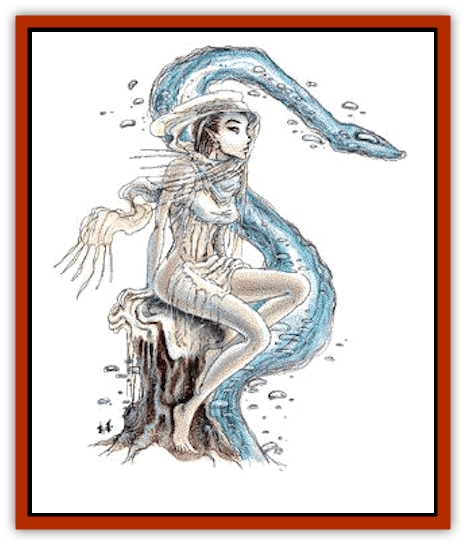
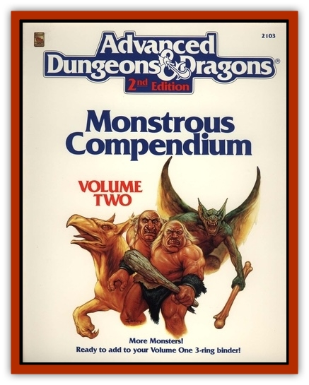

# Elemental - Water Kin

| Statistic | **Nereid** | **Water Weird** |
| --- | --- | --- |
| **Activity Cycle:** | Any | Any |
| **Alignment:** | Any chaotic | Chaotic evil |
| **Armor Class:** | 10 | 4 |
| **Climate/Terrain:** | Tropical or temperate water | Any water |
| **Damage/Attack:** | Nil | Nil |
| **Diet:** | Clean water | See below |
| **Frequency:** | Very rare | Very rare |
| **Hit Dice:** | 4 | 3+3 |
| **Intelligence:** | Very (12) | Very (11-12) |
| **Magic Resistance:** | 50% | Nil |
| **Morale:** | Steady (11) | Elite (13) |
| **Movement:** | 12, Sw 12 | 12 |
| **No. Appearing:** | 1-4 | 1-3 |
| **No. of Attacks:** | 0 | 0 |
| **Organization:** | Solitary | Solitary |
| **Size:** | M (4-5' tall) | L (10'+ long) |
| **Special Attacks:** | See below | Drowning |
| **Special Defenses:** | See below | See below |
| **THAC0:** | 17 | 15 |
| **Treasure:** | X | I,O,P,Y |
| **XP Value:** | 975 | 420 |

Many a male has thrown his life away for the fleeting embrace of the "honeyed ones", the beautiful nereids from the elemental plane of Water. Playful and flighty, and as unpredictable as their watery homes, the nereids tempt and trick sailors to their dooms.

In the water nereids are transparent, 95% undetectable except as golden angel seaweed, but these creatures assume human form on contact with air. Gorgeous and voluptuous, these forms are almost always females, young and slim with long, golden hair, pearly white skin. and sparkling green eyes. Their voices are heavenly and their songs are engaging to humans and demihumans. While they always carry a white shawl, either in their hands or draped over their head and shoulders, they are otherwise lightly clad in white and gold.

If confronted by only female humans or elves, the nereid appears in a male guise, but its powers are not as effective on women and there is a 65% chance that the women distrust the beguiling nereid. All males that look at a nereid find themselves incapable of harming the creature (no saving throw), and it seems to be a shy and flirtatious girl playing by the shore.

Nereid are capricious, but whether they are good, neutral, or evil depends on the individual, with the majority (50%) being chaotic neutral in their actions.

**Combat:** As creatures of the element water, nereids have few physical attacks should their roles as sirens fall. Nereids can spit a venom up to 20 feet that blinds a target for 2d6 rounds if it hits, and it can be washed away with water. A blinded victim suffer a -4 penalty to his attack roll, and both saving throws and Armor Class are worsened by 4 until the effects wear off.

Nereids can control the watery of their lair out to a distance of 30 feet, and they often do this to form pleasant watery shapes to amuse and entertain themselves. This power can also be used to defend against invaders by causing the waters to heave in great waves that slow movement to � normal or by making the water boil and froth, increasing the chance of drowning by 10%. Nereids can cause the waves to crash with a enormous roar so great that characters within 60 feet may be deafened for 3d4 rounds if precautions are not taken. They can also form the water into the shape of a serpent or fist, and cause it to strike as a 4-Hit Die monster and inflict 1d4 points of damage. Only one of these attacks may be done per round.

Nereids are 85% likely to have a pet that tries to protect its master. To find out the type of pet, roll 1d8 and consult the following table:

| D8 Roll | Pet |
| --- | --- |
| 1 | Giant eel |
| 2 | Giant otter |
| 3 | Giant snake (poisonous) |
| 4 | Giant octopus |
| 5 | Giant squid |
| 6 | Dolphin |
| 7 | Giant leech |
| 8 | Sting ray |

If a nereid is caught by an amorous man, it rolls a saving throw vs. poison, and if successful, it flows away like water. The nereid also gets a saving throw vs. poison to avoid damage from a weapon. Most men or demihumans try to catch a nereid to gain a kiss. While it is loath to give these, in its kisses lie its final defense - once their lips touch, the character must roll a successful saving throw vs. breath weapon, with a -2 penalty, or drown instantly. If he doesn't drown, he finds total ecstasy.

The nereid protects its shawl at all costs, since it contains the nereid's essence and if it is destroyed the nereid will dissolve into formless water. Possession of a nereid's shawl gives a character control over the fearful creature, and it can be commanded to do one's bidding. A nereid will lie and attempt anything short of hostile actions to regain its soul-shawl.

**Habitat/Society:** Nereids can be found in the sea, rivers, wells, mountain and cavern springs, and on the elemental plane of Water. If they are on the Prime Material plane, then they have discovered a means to escape from their plane of existence, or have been deposited in this world as punishment. Usually one nereid is located in a certain body of water, but sometimes a group of 1d4 creatures lives in an area, especially along an ocean front or in shoals around a rocky and deserted island. A group of nereid join together because of like alignment, and control of the group is always held by the eldest.

Fresh, clean waters sustain them, while polluted waters drain their vigor and often cause them to move to a new place. Even good nereids have been known to attack those who wantonly pollute their lairs. While they don't need food, they hunt or fish for their pets, and evil nereids lure men and demihumans close so that their pets may feed. They don't value metals and discard gold and silver, but any magical treasure they gain from a fallen sailor or amorous fool is saved in their watery lair. True to its nature, the nereid has no goals or ambitions, choosing instead to splash and cavort in the waters, to the delight of males everywhere.

**Ecology:** These creatures take little from the environment and give little in return. Powerful sea captains might wear nereid shawls as scarves, to show their command over the creatures of the sea; the forlorn nereids can be glimpsed following in the wake of their ships, sobbing and begging for the return of their essences. These shawls command handsome sums from those who need the services of a water creature, but they are seldom sold and are very scarce. It is rumored that wizards who hold a shawl use their enslaved nereid as a guide on journeys to the elemental plane of Water.

**Water Weird**

  These strange creatures from the plane of Water are hostile when encountered on the Prime Material plane, as they are usually magically kept from going home. If communication is achieved, a bargain can sometimes be struck with the creature.

[[Elemental_Water_Kin_Water_Weird|Water weirds]] appear to be common water; a *detect invisibility* reveals something amiss, but not the nature of the threat. When a water weird detects a living being, it assumes serpentine form (this takes two rounds). It attacks as a 6 HD creature; those hit must make a successful saving throw vs. paralyzation, or be pulled into the water. Each round spent in the water requires another saving throw; failure indicates death by drowning, which releases energy that the water weird consumes. A water weird that comes in contact with a normal water elemental has a 50% chance to usurp control of it.

Water weirds take only 1 hp damage from piercing and slashing weapons. The take half damage from fire, none if they make a successful saving throw. Intense cold acts as a *slow* spell on water weirds. If reduced to 0 hp or less, a water weird is disrupted, and it reforms in two rounds. A *purify water* spell will instantly kill a single water weird.

---
## Discovery & Documentation

**Source Publication:** MC2 Volume II (1993)
**Campaign Setting:** Advanced Dungeons & Dragons 2nd Edition
**Author(s):** Jay Batista, Scott Bennie, Grant Boucher, William W. Connors, Steve Gilbert, Heike Kubasch, James Lowder, David Edward Martin, Bruce Nesmith, Jean Rabe, Rick Swan, John J. Terra, Gary L. Thomas

### Other Creatures Found in This Source Book
   * [[Ant|Ant]]
   * [[Ant_Lion_Giant|Ant Lion, Giant]]
   * [[Ape_Carnivorous|Ape, Carnivorous]]
   * [[Baboon|Baboon]]
   * [[Badger|Badger]]
   * [[Barracuda|Barracuda]]
   * [[Beetle_Giant|Beetle, Giant]]
   * [[Bulette|Bulette]]
   * [[Bullywug|Bullywug]]
   * [[Dwarf_Duergar|Dwarf, Duergar]]
   * [[Dwarf_Gully|Dwarf, Gully]]
   * [[Eagle|Eagle]]
   * [[Eel|Eel]]
   * [[Elemental_Air_Kin|Elemental, Air Kin]]
   * [[Elemental_Water_Kin_Water_Weird|Elemental, Water Kin, Water Weird]]
   * [[Firestar|Firestar]]
   * [[Firetail|Firetail]]
   * [[Fish_Giant|Fish, Giant]]
   * [[Frog|Frog]]
   * [[Gorgon|Gorgon]]
   * [[Hawk|Hawk]]
   * [[Heucuva|Heucuva]]
   * [[Hippocampus|Hippocampus]]
   * [[Hippogriff|Hippogriff]]
   * [[Kelpie|Kelpie]]
   * [[Kenku|Kenku]]
   * [[Killmoulis|Killmoulis]]
   * [[Kuo-Toa|Kuo-Toa]]
   * [[Lamia|Lamia]]
   * [[Lammasu|Lammasu]]
   * [[Lamprey|Lamprey]]
   * [[Leech|Leech]]
   * [[Leprechaun|Leprechaun]]
   * [[Leucrotta|Leucrotta]]
   * [[Locathah|Locathah]]
   * [[Lycanthrope_Wereboar|Lycanthrope, Wereboar]]
   * [[Lycanthrope_Werefox|Lycanthrope, Werefox]]
   * [[Mammal_Minimal|Mammal, Minimal]]
   * [[Mammal_Small|Mammal, Small]]
   * [[Mimic|Mimic]]
   * [[Morkoth|Morkoth]]
   * [[Muckdweller|Muckdweller]]
   * [[Myconid|Myconid]]
   * [[Naga|Naga]]
   * [[Obliviax|Obliviax]]
   * [[Octopus_Giant|Octopus, Giant]]
   * [[Otyugh|Otyugh]]
   * [[Piranha|Piranha]]
   * [[Plant_Dangerous_I|Plant, Dangerous I]]
   * [[Plant_Intelligent|Plant, Intelligent]]
   * [[Poltergeist|Poltergeist]]
   * [[Porcupine|Porcupine]]
   * [[Rat_Osquip|Rat, Osquip]]
   * [[Roc|Roc]]
   * [[Roper|Roper]]
   * [[Rot_Grub|Rot Grub]]
   * [[Rust_Monster|Rust Monster]]
   * [[Sahuagin|Sahuagin]]
   * [[Sea_Lion|Sea Lion]]
   * [[Sea_Horse_Giant|Sea Horse, Giant]]
   * [[Shambling_Mound|Shambling Mound]]
   * [[Shark|Shark]]
   * [[Sphinx|Sphinx]]
   * [[Squid_Giant|Squid, Giant]]
   * [[Stirge|Stirge]]
   * [[Swanmay|Swanmay]]
   * [[Tarrasque|Tarrasque]]
   * [[Tasloi|Tasloi]]
   * [[Triton|Triton]]
   * [[Troglodyte|Troglodyte]]
   * [[Urchin|Urchin]]
   * [[Urd|Urd]]
   * [[Weasel|Weasel]]
   * [[Wolverine|Wolverine]]
   * [[Yellow_Musk_Creeper|Yellow Musk Creeper]]
