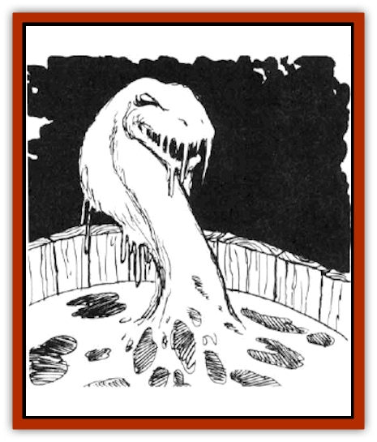

# Elemental - Water Kin - Water Weird

| Statistic | **Elemental, Water Kin, Water Weird** |
| --- | --- |
| **Activity Cycle:** | Any |
| **Alignment:** | Chaotic evil |
| **Armor Class:** | 4 |
| **Climate/Terrain:** | Any water |
| **Damage/Attack:** | Nil |
| **Diet:** | See below |
| **Frequency:** | Very rare |
| **Hit Dice:** | 3+3 |
| **Intelligence:** | Very (11-12) |
| **Magic Resistance:** | Nil |
| **Morale:** | Elite (13) |
| **Movement:** | 12 |
| **No. Appearing:** | 1-3 |
| **No. of Attacks:** | 0 |
| **Organization:** | Solitary |
| **Size:** | L (10'+ long) |
| **Special Attacks:** | Drowning |
| **Special Defenses:** | See below |
| **THAC0:** | 15 |
| **Treasure:** | I,O,P,Y |
| **XP Value:** | 420 |

These unusual creatures are natives of the elemental plane of Water, but they are being encountered more and more on the Prime Material plane. When they are found in this realm, they are violent and hostile, attacking all living things instantly. In some manner that has never been fully divined, they are able to feed on the life essences of those they slay.

**Combat:** When first encountered, these creatures seem to be nothing more than a common body of water in a well, fountain, or similar basin. The use of a *detect invisible* spell, however, reveals to the caster that something is amiss, although the specific nature of the threat is not obvious.

Once the water weird senses a living creature, it begins to change the water into a serpentine form. This transformation takes two rounds to occur. Once in this shape, it lashes out and strikes as a 6-Hit Die monster. Anyone who is hit by the weird must roll a saving throw vs. paralyzation. Failure indicates that the victim has been pulled into the water and faces the prospect of drowning. Each round that the victim spends inside the water requires an additional saving throw. with failure indicating death by drowning.

Many forms of attack cause little or no harm to the water weird because of its fluid body. Sharp weapons, such as swords and axes, inflict only 1 point of damage each time they strike, although blunt weapons, like hammers and maces, inflict their normal damage. Cold-based attacks affect a water weird as a *slow* spell. Fireball spells cause half damage if the weird fails its saving throw, no damage if it succeeds.

A water weird that is reduced to 0 hit points by any of these attacks is not slain, but is disrupted. After two rounds, it re-forms its serpentine body and resumes its attack. Most other types of attack cannot harm the creature in any way.

A *purify water* spell instantly slays a water weird. By breaking down its life essence, this invocation annihilates the creature. Each casting of this spell is effective against only a single entity, however, so that an attack by three water weirds must be met with three *purify water* spells to wholly eliminate the menace.

A water weird that comes into physical contact with a [[Elemental_Fire_Water|water elemental]] may attempt to ursurp control of it. In order to accomplish this feat, the creature must roll an 11 or better on 1d20. Failure prevents subsequent attempts during that encounter.

**Habitat/Society:** For the most part, these unusual beings are loners who do not interact with others of their kind. On those occasions when two or three water weirds are found together, it is simply because they have found a location were prey is easy to come by.

Those water weirds found on the Prime Material plane are frequently the victims of magical bonds that hold them in this realm. As such, they are often watching for some way to break their links with this world and return to their home. Because of their keen intelligence, they can be persuaded to refrain from combat if a means of communication can be found and a common ground agreed upon. Of course, their chaotic nature makes any bargain reached with a water weird an uncertain proposition at best.

**Ecology:** The manner in which water weirds sustain themselves has never been fully determined. As creatures of the elemental plane of Water, they are difficult to study and even harder to understand. It seems clear, however, that they feed on the energies released by those who drown within their serpentine bodies. It may be that this is similar in some way to the like energy that is consumed by [[Will_O'Wisp|will-o-wisps]].

For the most part, water weirds found on the Prime Material plane are here by the hand of a wizard who has called the creatures from their home dimension to serve him in some manner.

---
## Discovery & Documentation

**Source Publication:** MC2 Volume II (1993)
**Campaign Setting:** Advanced Dungeons & Dragons 2nd Edition
**Author(s):** Jay Batista, Scott Bennie, Grant Boucher, William W. Connors, Steve Gilbert, Heike Kubasch, James Lowder, David Edward Martin, Bruce Nesmith, Jean Rabe, Rick Swan, John J. Terra, Gary L. Thomas

### Other Creatures Found in This Source Book
   * [[Ant|Ant]]
   * [[Ant_Lion_Giant|Ant Lion, Giant]]
   * [[Ape_Carnivorous|Ape, Carnivorous]]
   * [[Baboon|Baboon]]
   * [[Badger|Badger]]
   * [[Barracuda|Barracuda]]
   * [[Beetle_Giant|Beetle, Giant]]
   * [[Bulette|Bulette]]
   * [[Bullywug|Bullywug]]
   * [[Dwarf_Duergar|Dwarf, Duergar]]
   * [[Dwarf_Gully|Dwarf, Gully]]
   * [[Eagle|Eagle]]
   * [[Eel|Eel]]
   * [[Elemental_Air_Kin|Elemental, Air Kin]]
   * [[Elemental_Water_Kin|Elemental, Water Kin]]
   * [[Firestar|Firestar]]
   * [[Firetail|Firetail]]
   * [[Fish_Giant|Fish, Giant]]
   * [[Frog|Frog]]
   * [[Gorgon|Gorgon]]
   * [[Hawk|Hawk]]
   * [[Heucuva|Heucuva]]
   * [[Hippocampus|Hippocampus]]
   * [[Hippogriff|Hippogriff]]
   * [[Kelpie|Kelpie]]
   * [[Kenku|Kenku]]
   * [[Killmoulis|Killmoulis]]
   * [[Kuo-Toa|Kuo-Toa]]
   * [[Lamia|Lamia]]
   * [[Lammasu|Lammasu]]
   * [[Lamprey|Lamprey]]
   * [[Leech|Leech]]
   * [[Leprechaun|Leprechaun]]
   * [[Leucrotta|Leucrotta]]
   * [[Locathah|Locathah]]
   * [[Lycanthrope_Wereboar|Lycanthrope, Wereboar]]
   * [[Lycanthrope_Werefox|Lycanthrope, Werefox]]
   * [[Mammal_Minimal|Mammal, Minimal]]
   * [[Mammal_Small|Mammal, Small]]
   * [[Mimic|Mimic]]
   * [[Morkoth|Morkoth]]
   * [[Muckdweller|Muckdweller]]
   * [[Myconid|Myconid]]
   * [[Naga|Naga]]
   * [[Obliviax|Obliviax]]
   * [[Octopus_Giant|Octopus, Giant]]
   * [[Otyugh|Otyugh]]
   * [[Piranha|Piranha]]
   * [[Plant_Dangerous_I|Plant, Dangerous I]]
   * [[Plant_Intelligent|Plant, Intelligent]]
   * [[Poltergeist|Poltergeist]]
   * [[Porcupine|Porcupine]]
   * [[Rat_Osquip|Rat, Osquip]]
   * [[Roc|Roc]]
   * [[Roper|Roper]]
   * [[Rot_Grub|Rot Grub]]
   * [[Rust_Monster|Rust Monster]]
   * [[Sahuagin|Sahuagin]]
   * [[Sea_Lion|Sea Lion]]
   * [[Sea_Horse_Giant|Sea Horse, Giant]]
   * [[Shambling_Mound|Shambling Mound]]
   * [[Shark|Shark]]
   * [[Sphinx|Sphinx]]
   * [[Squid_Giant|Squid, Giant]]
   * [[Stirge|Stirge]]
   * [[Swanmay|Swanmay]]
   * [[Tarrasque|Tarrasque]]
   * [[Tasloi|Tasloi]]
   * [[Triton|Triton]]
   * [[Troglodyte|Troglodyte]]
   * [[Urchin|Urchin]]
   * [[Urd|Urd]]
   * [[Weasel|Weasel]]
   * [[Wolverine|Wolverine]]
   * [[Yellow_Musk_Creeper|Yellow Musk Creeper]]
