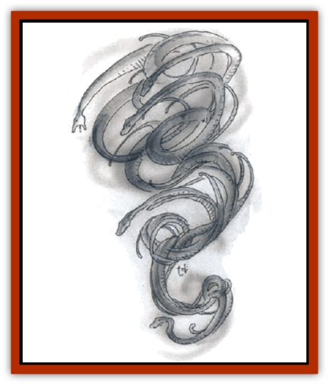

# Elemental - Wind Walker

| Statistic | **Elemental, Wind Walker** |
| --- | --- |
| **Activity Cycle:** | Day |
| **Alignment:** | Chaotic neutral |
| **Armor Class:** | 7 |
| **Climate/Terrain:** | Tropical mountains, deserts, and plains |
| **Damage/Attack:** | 3d6 |
| **Diet:** | Special |
| **Frequency:** | Rare |
| **Hit Dice:** | 6+3 |
| **Intelligence:** | Very (11-12) |
| **Magic Resistance:** | See below |
| **Morale:** | Elite (13-14) |
| **Movement:** | Fl 30 (A) |
| **No. Appearing:** | 1d3 |
| **No. of Attacks:** | 1 per creature within 10' |
| **Organization:** | Pack |
| **Size:** | L (10-12' long) |
| **Special Attacks:** | Attack in series |
| **Special Defenses:** | Spell immunities |
| **THAC0:** | 13 |
| **Treasure:** | C,R |
| **XP Value:** | 2,000 |

Wind walkers are creatures from the Elemental Plane of Air, where they are the servants of the [[Genie|djinn]]. On the Prime Material Plane, they prefer to live high in the mountains or in great caverns far below the surface.

Their approach is detectable at 100 to 300 yards as a whistling, howling, or roaring, depending on the number coming. Normally only faintly visible, in fog or sandstorms they look like a mass of coiling, writhing serpents, constantly churning out tendrils of wind and losing fragments of themselves as trailing bits of vapor or dust. Whenever they touch the ground, they spin off tiny whirlwinds, pushing dust and grit into the air.

**Combat:** Wind walkers are telepathic and can detect thoughts within 100 yards. If they work in series to boost their range, they may detect thoughts within 300 yards.

Wind walkers attack by wind force. Each wind walker causes 3d6 points of damage per round to all creatures within 10 feet. They can disperse any cloud or gaseous attack in a single round (though they suffer its full effects for that round), and they inflict double damage (6d6) upon creatures in gaseous form. The noise of their movement can cover most sounds of combat; if they wish, a battle with them sounds only like rushing winds, as all shrieks and cries are carried away by the force of their wind.

Wind walkers are partially ethereal and thus can be fought by other ethereal creatures such as [[Genie|genies]], [[Invisible_Stalker|invisible stalkers]], or [[Elemental_Air_Kin_Aerial_Servant|aerial servants]]. A weapon of +1 or better enchantment is required to hit them in any event.

These creatures are immune to most spell attacks, but are affected by certain spells such as *control weather* (unless the walker makes a successful save vs. spell, it dies), *slow* (damages the monster as a *fireball*), and *ice storm* (drives the creatures away for 1d4 melee rounds). *Haste* inflicts half the damage of a *fireball* upon wind walkers, but it also doubles the amount of damage inflicted by them. Magical barriers like *protection from evil*, *wall of force*, or *prismatic wall* stop them (though *blade barrier* is ineffective). Wind walkers otherwise pursue their victims for a minimum of 1d4+1 rounds. They are subject to attack by telepathy.

With effort, wind walkers can also moderate their winds to a less violent level, and thus they have the spell-like ability to cast *ride the wind* four times daily as a 12th-level caster.

**Habitat/Society:** Wind walkers are kept as cloud sculptors by the djinn. Other creatures have retained them to herd rain clouds to their lands, or to keep the life-giving rains from others. Desert tribesmen are careful not to insult the wind walkers or to disparage them as mere servants of the djinn - the genie races are powerful, and even their servants must be feared.

Wind walkers are sometimes forced into servitude by [[Giant_Storm|storm giants]], [[Giant_Cloud|cloud giants]], djinn, and other creatures of the windy mountains. Wind walkers keep to themselves; the only [[Elemental_General_Information|elementals]] they willingly associate with are [[Elemental_Air_Earth|air elementals]]. Some sages believe that wind walkers are simply young air elementals, while others are sure that they are a separate species.

**Ecology:** Wind walkers eat only airborne water vapor and minute particles of dust. Strangely, they seem to enjoy strong fragrances and can be lured into traps or binding circles with aromatic oils or essences. Unless kept as servants by djinn or wizards, they get their food from the clouds.

---
## Discovery & Documentation

**Source Publication:** Monstrous Compendium, 1994 Annual, Volume 1 (1995)
**Campaign Setting:** Advanced Dungeons & Dragons 2nd Edition
**Author(s):** David Wise

### Other Creatures Found in This Source Book
   * [[Abyss_Ant|Abyss Ant]]
   * [[Achaierai|Achaierai]]
   * [[Afanc|Afanc]]
   * [[Al-Jahar|Al-Jahar]]
   * [[Baelnorn|Baelnorn]]
   * [[Baneguard|Baneguard]]
   * [[Banelar|Banelar]]
   * [[Bird_Talking|Bird, Talking]]
   * [[Blazing_Bones|Blazing Bones]]
   * [[Campestri|Campestri]]
   * [[Caniquine|Caniquine]]
   * [[Cat_Winged|Cat, Winged]]
   * [[Crypt_Servant|Crypt Servant]]
   * [[Death's_Head_Tree|Death's Head Tree]]
   * [[Dog_Saluqi|Dog, Saluqi]]
   * [[Dragon_Electrum|Dragon, Electrum]]
   * [[Dragon_Fang|Dragon, Fang]]
   * [[Dragon_Linnorm_Corpse_Tearer|Dragon, Linnorm, Corpse Tearer]]
   * [[Dragon_Linnorm_Dread|Dragon, Linnorm, Dread]]
   * [[Dragon_Linnorm_Flame|Dragon, Linnorm, Flame]]
   * [[Dragon_Linnorm_Forest|Dragon, Linnorm, Forest]]
   * [[Dragon_Linnorm_Frost|Dragon, Linnorm, Frost]]
   * [[Dragon_Linnorm_Gray|Dragon, Linnorm, Gray]]
   * [[Dragon_Linnorm_Land|Dragon, Linnorm, Land]]
   * [[Dragon_Linnorm_Midgard|Dragon, Linnorm, Midgard]]
   * [[Dragon_Linnorm_Rain|Dragon, Linnorm, Rain]]
   * [[Dragon_Linnorm_Sea|Dragon, Linnorm, Sea]]
   * [[Dragon_Neutral_Jacinth|Dragon, Neutral, Jacinth]]
   * [[Dragon_Neutral_Jade|Dragon, Neutral, Jade]]
   * [[Dragon_Neutral_Pearl|Dragon, Neutral, Pearl]]
   * [[Dread|Dread]]
   * [[Dragon-kin|Dragon-kin]]
   * [[Elemental_Earth_Kin_Chrysmal|Elemental, Earth Kin, Chrysmal]]
   * [[Elemental_Earth_Kin_Earth_Weird|Elemental, Earth Kin, Earth Weird]]
   * [[Elemental_Fire_Kin_Azer|Elemental, Fire Kin, Azer]]
   * [[Elemental_Sandman|Elemental, Sandman]]
   * [[Elemental_Vermin|Elemental Vermin]]
   * [[Feystag|Feystag]]
   * [[Flame_Skull|Flame Skull]]
   * [[Foulwing|Foulwing]]
   * [[Gambado|Gambado]]
   * [[Garbug|Garbug]]
   * [[Genie_Tasked_Administrator|Genie, Tasked, Administrator]]
   * [[Genie_Tasked_Deceiver|Genie, Tasked, Deceiver]]
   * [[Genie_Tasked_Harim_Servant|Genie, Tasked, Harim Servant]]
   * [[Genie_Tasked_Messenger|Genie, Tasked, Messenger]]
   * [[Genie_Tasked_Miner|Genie, Tasked, Miner]]
   * [[Genie_Tasked_Oathbinder|Genie, Tasked, Oathbinder]]
   * [[Gibbering_Mouther|Gibbering Mouther]]
   * [[Gnasher|Gnasher]]
   * [[Gnasher_Winged|Gnasher, Winged]]
   * [[Golem_Brain|Golem, Brain]]
   * [[Golem_Hammer|Golem, Hammer]]
   * [[Golem_Metagolem|Golem, Metagolem]]
   * [[Golem_Spiderstone|Golem, Spiderstone]]
   * [[Gorynych|Gorynych]]
   * [[Greelox|Greelox]]
   * [[Helmed_Horror|Helmed Horror]]
   * [[Jarbo|Jarbo]]
   * [[Laraken|Laraken]]
   * [[Lich_Psionic|Lich, Psionic]]
   * [[Living_Steel|Living Steel]]
   * [[Lock_Lurker|Lock Lurker]]
   * [[Loxo|Loxo]]
   * [[Lycanthrope_Loup_de_Noir|Lycanthrope, Loup de Noir]]
   * [[Lycanthrope_Werebadger|Lycanthrope, Werebadger]]
   * [[Lycanthrope_Werejaguar|Lycanthrope, Werejaguar]]
   * [[Lythlyx|Lythlyx]]
   * [[Magebane|Magebane]]
   * [[Marrashi|Marrashi]]
   * [[Metalmaster|Metalmaster]]
   * [[Mimic_House_Hunter|Mimic, House Hunter]]
   * [[Naga_Bone|Naga, Bone]]
   * [[Nautilus_Giant|Nautilus, Giant]]
   * [[Nightshade_Toril|Nightshade (Toril)]]
   * [[Nishruu|Nishruu]]
   * [[Noran|Noran]]
   * [[Opinicus|Opinicus]]
   * [[Ormyrr|Ormyrr]]
   * [[Parasite|Parasite]]
   * [[Pasari-Niml|Pasari-Niml]]
   * [[Plant_Vampire_Moss|Plant, Vampire Moss]]
   * [[Pteraman|Pteraman]]
   * [[Rautym|Rautym]]
   * [[Shadeling|Shadeling]]
   * [[Skum|Skum]]
   * [[Snake_Giant_Cobra|Snake, Giant Cobra]]
   * [[Snake_Stone|Snake, Stone]]
   * [[Spectral_Wizard|Spectral Wizard]]
   * [[Spell_Weaver|Spell Weaver]]
   * [[Spider_Brain|Spider, Brain]]
   * [[Suwyze|Suwyze]]
   * [[Tatalla|Tatalla]]
   * [[Tick_Heart|Tick, Heart]]
   * [[Tree_Dark|Tree, Dark]]
   * [[Tree_Singing|Tree, Singing]]
   * [[Tressym|Tressym]]
   * [[Troll_Snow|Troll, Snow]]
   * [[Tuyewera|Tuyewera]]
   * [[Ulitharid|Ulitharid]]
   * [[Undead_Dwarf|Undead Dwarf]]
   * [[Undead_Lake_Monster|Undead Lake Monster]]
   * [[Whipsting|Whipsting]]
   * [[Windghost|Windghost]]
   * [[Wolf_Dread|Wolf, Dread]]
   * [[Wolf_Stone|Wolf, Stone]]
   * [[Wolf_Vampiric|Wolf, Vampiric]]
   * [[Wraith_Shimmering|Wraith, Shimmering]]
   * [[Xantravar|Xantravar]]
   * [[Xaver|Xaver]]
