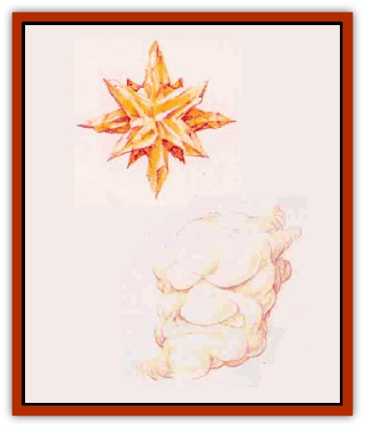

# Elemental of Law - Air - Earth

| Statistic | **Anemo** | **Kryst** |
| --- | --- | --- |
| **Activity Cycle:** | Any | Any |
| **Alignment:** | Lawful neutral | Lawful good |
| **Armor Class:** | 1 | 2 |
| **Climate/Terrain:** | Any air | Any earth |
| **Damage/Attack:** | 1d10/1d10/1d10 | 1d12/1d12/1d12 |
| **Diet:** | Air | Earth, rock |
| **Frequency:** | Very rare | Very rare |
| **Hit Dice:** | 9 | 9 |
| **Intelligence:** | Very (12) | Average (10) |
| **Magic Resistance:** | Nil | Nil |
| **Morale:** | Elite (14) | Elite (14) |
| **Movement:** | 12, Fl 36 (A) | 24 |
| **No. Appearing:** | 1d6 | 1d6 |
| **No. of Attacks:** | 3 | 3 |
| **Organization:** | Flock | Cluster |
| **Size:** | M (5' across) | M (6' across) |
| **Special Attacks:** | Spells | Spells |
| **Special Defenses:** | See below | See below |
| **THAC0:** | 11 | 11 |
| **Treasure:** | Nil | Nil |
| **XP Value:** | 6,000 | 6,000 |

The [[Elemental_General_Information|elementals]] of law are intelligent creatures native to one of the four elemental planes. Each dedicates itself to maintaining the forces of law on both its home plane and the Prime Material Plane, yet they differ wildly in their methods of achieving this goal.

All elementals of law are immune to poison, normal weapons, and 1st- and 2nd-level spells. They also can cast *detect invisibility* at will.

## Anemo

The anemos, native to the Elemental Plane of Air, direct their energies at creating order from the raw stuff of chaos.

These cottony-looking creatures, approximately 5 feet around, consist of a complex and ordered network of off-white fibers. Their extremely light bodies enable them to perform unbelievably dexterous aerial maneuvers.

**Combat:** An anemo has little fear of battle, choosing to fight whoever aids the forces of chaos. In combat, an anemo usually attacks by forming itself into a whirlwind, whipping its opponents with a multitude of thin, abrasive fibers. It can attack up to three times per round, causing ldlO points of damage with each assault.

The anerno is immune to all air-based attacks. It can use *detect magic*, *dispel magic*, *solid fog*, and *wind wall* each three times per day (at 9th level). In addition, it can *cast control* winds (at 15th level) and *aerial servant* (which cannot attack the elemental) once per day. An anemo remains vulnerable to earth-based attacks, suffering +3 points of damage per die.

**Habitat/Society:** Each anemo works closely with others of its kind, forever attempting to catalogue and order all of existence. These creatures are the most likely of all elementals of law to be found outside their home plane.

**Ecology:** Anemos hate all creatures of chaos, particularly the elementals of chaos, and especially [[Elemental_of_Chaos_Fire_Water|pyrophors]]; they dislike [[Invisible_Stalker|invisible stalkers]] as well. They fear earth-based creatures and earth-based attacks.

## Kryst

Krysts, intelligent beings native to the Elemental Plane of Earth, have bodies made of quartzlike rock; each kryst looks like a group of 12 golden, crystal spikes all projecting outward from a central point.

A kryst normally speaks via telepathy (120-foot-range). If mental contact causes a poor reaction, it accomodates others by switching to written communication. (It etches messages with one of its spikes.)

**Combat:** Although a kryst never enters a battle without first determining it has no better option, it fights fiercely once committed. These elementals normally attack by ramming their opponents repearedly with their long spikes. A kryst can attack in this manner up to three times per round, causing 1d12 points of damage with each successful hit.

Krysts are immune to all earth-based attacks and can use detect magic, dispel magic, wall of stone, and transmute rock to mud each three times per day. In addition, krysts can cast stone tell once per day. They cast all spells at 9th level. Krysts remain very vulnerable to air-based attacks, suffering double damage from them.

**Habitat/Society:** Krysts have a widespread and complex society in their own realms, peacefully living with and helping [[Elemental_Air_Earth|earth elementals]]. They welcome visitors and eagerly seek new knowledge of all types.

**Ecology:** These elementals fear and hate the [[Horde|hordes]], with whom they wage a never-ending war. They are also enemies of the [[Elemental_of_Law_Fire_Water|hydrax]], though they rarely encounter them. All krysts fear air-based creatures and air-based attacks, although they view no group of these beings as their particular enemies.

---
## Discovery & Documentation

**Source Publication:** Mystara Appendix (1994)
**Campaign Setting:** Mystara
**Author(s):** John Nephew, Teeuwynn Woodruff, John Terra, Skip Williams

### Other Creatures Found in This Source Book
   * [[Actaeon|Actaeon]]
   * [[Agarat|Agarat]]
   * [[Ash_Crawler|Ash Crawler]]
   * [[Baldandar|Baldandar]]
   * [[Bargda|Bargda]]
   * [[Bhut|Bhut]]
   * [[Bird_Mystara|Bird (Mystara)]]
   * [[Blackball|Blackball]]
   * [[Choker|Choker]]
   * [[Coltpixie|Coltpixie]]
   * [[Crone_of_Chaos|Crone of Chaos]]
   * [[Darkhood|Darkhood]]
   * [[Darkwing|Darkwing]]
   * [[Decapus|Decapus]]
   * [[Deep_Glaurant|Deep Glaurant]]
   * [[Diabolus|Diabolus]]
   * [[Dimensional_Warper|Dimensional Warper]]
   * [[Dragon_Mystara_Crystalline|Dragon (Mystara), Crystalline]]
   * [[Dragon_Mystara_Jade|Dragon (Mystara), Jade]]
   * [[Dragon_Mystara_Onyx|Dragon (Mystara), Onyx]]
   * [[Dragon_Mystara_Ruby|Dragon (Mystara), Ruby]]
   * [[Drake_Mystara|Drake (Mystara)]]
   * [[Dragonfly|Dragonfly]]
   * [[Dusanu|Dusanu]]
   * [[Elemental_of_Chaos_Air_Earth|Elemental of Chaos, Air/Earth]]
   * [[Elemental_of_Chaos_Fire_Water|Elemental of Chaos, Fire/Water]]
   * [[Elemental_of_Law_Fire_Water|Elemental of Law, Fire/Water]]
   * [[Familiar_Mystara|Familiar (Mystara)]]
   * [[Frost_Salamander|Frost Salamander]]
   * [[Fundamental_Air_Earth|Fundamental, Air/Earth]]
   * [[Fundamental_Fire_Water|Fundamental, Fire/Water]]
   * [[Gargantua_Mystara|Gargantua (Mystara)]]
   * [[Geonid|Geonid]]
   * [[Ghostly_Horde|Ghostly Horde]]
   * [[Giant_Athach|Giant, Athach]]
   * [[Giant_Hephaeston|Giant, Hephaeston]]
   * [[Golem_Drolem|Golem, Drolem]]
   * [[Golem_Mystara_I|Golem (Mystara) I]]
   * [[Golem_Mystara_II|Golem (Mystara) II]]
   * [[Golem_Mystara_III|Golem (Mystara) III]]
   * [[Gray_Philosopher|Gray Philosopher]]
   * [[Guardian_Warrior|Guardian Warrior]]
   * [[Gyerian|Gyerian]]
   * [[Herex|Herex]]
   * [[Hivebrood|Hivebrood]]
   * [[Horde|Horde]]
   * [[Hsiao|Hsiao]]
   * [[Huptzeen|Huptzeen]]
   * [[Hutaakan|Hutaakan]]
   * [[Imp_Mystara|Imp (Mystara)]]
   * [[Jellyfish_Giant_Mystara|Jellyfish, Giant (Mystara)]]
   * [[Kna|Kna]]
   * [[Kopru|Kopru]]
   * [[Lizard_Mystara|Lizard (Mystara)]]
   * [[Lizard-kin_Mystara|Lizard-kin (Mystara)]]
   * [[Lupin|Lupin]]
   * [[Lycanthrope_Werejaguar_Mystara|Lycanthrope, Werejaguar (Mystara)]]
   * [[Lycanthrope_Wereswine|Lycanthrope, Wereswine]]
   * [[Magen|Magen]]
   * [[Manikin|Manikin]]
   * [[Mek|Mek]]
   * [[Mujina|Mujina]]
   * [[Nagpa|Nagpa]]
   * [[Neh-thalggu|Neh-thalggu]]
   * [[Nightshade_Mystara|Nightshade (Mystara)]]
   * [[Nuckalavee|Nuckalavee]]
   * [[Pegataur|Pegataur]]
   * [[Phanaton|Phanaton]]
   * [[Plant_Dangerous_Mystara|Plant, Dangerous (Mystara)]]
   * [[Plasm|Plasm]]
   * [[Rakasta|Rakasta]]
   * [[Rock_Man|Rock Man]]
   * [[Sabreclaw|Sabreclaw]]
   * [[Sacrol|Sacrol]]
   * [[Scamille|Scamille]]
   * [[Shapeshifter|Shapeshifter]]
   * [[Shargugh|Shargugh]]
   * [[Shark-kin|Shark-kin]]
   * [[Sollux|Sollux]]
   * [[Spectral_Death|Spectral Death]]
   * [[Spectral_Hound|Spectral Hound]]
   * [[Spider-kin|Spider-kin]]
   * [[Spirit_Mystara|Spirit (Mystara)]]
   * [[Statue_Living|Statue, Living]]
   * [[Surtaki|Surtaki]]
   * [[Tabi|Tabi]]
   * [[Thoul|Thoul]]
   * [[Thunderhead|Thunderhead]]
   * [[Tiger_Ebon|Tiger, Ebon]]
   * [[Topi|Topi]]
   * [[Tortle|Tortle]]
   * [[Vampire_Velya|Vampire, Velya]]
   * [[White_Fang|White Fang]]
   * [[Worm_Mystara|Worm (Mystara)]]
   * [[Wyrd|Wyrd]]
   * [[Yowler|Yowler]]
   * [[Zombie_Lightning|Zombie, Lightning]]
