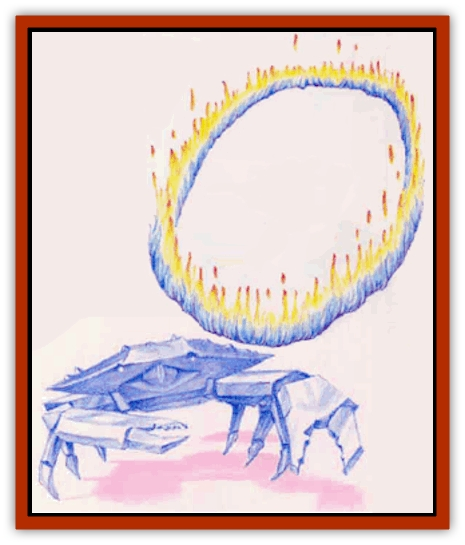

# Elemental of Law - Fire - Water

| Statistic | **Helion** | **Hydrax** |
| --- | --- | --- |
| **Activity Cycle:** | Any | Any |
| **Alignment:** | Lawful good | Lawful evil or Lawful neutral |
| **Armor Class:** | 1 | 2 |
| **Climate/Terrain:** | Any fire | Any water |
| **Damage/Attack:** | 2d8 (squeeze) | 1d10 (claw)/1d10 (claw) |
| **Diet:** | Fire | Ice |
| **Frequency:** | Very rare | Very rare |
| **Hit Dice:** | 9 | 5-12 |
| **Intelligence:** | High (14) | Very (12) |
| **Magic Resistance:** | Nil | Nil |
| **Morale:** | Elite (14) | Elite (14) |
| **Movement:** | 9, Fl 24 (A) | 6, Sw 18 |
| **No. Appearing:** | 1d4+1 | 1 |
| **No. of Attacks:** | 1 | 2 |
| **Organization:** | Family | Solitary |
| **Size:** | T-G (1-40' diam.) | L (8' wide) |
| **Special Attacks:** | Spells, trap | Spells |
| **Special Defenses:** | See below | See below |
| **THAC0:** | 11 | 5-6 HD: 15 / 7-8 HD: 13 / 9-10 HD: 11 / 11-12 HD: 9 |
| **Treasure:** | Nil | Nil |
| **XP Value:** | 6,000 | 5 HD: 1,400 / 6 HD: 2,000 / 7 HD: 3,000 / 8 HD: 4,000 / 9 HD: 5,000 / 10 HD: 6,000 / 11 HD: 7,000 / 12 HD: 8,000 |

The [[Elemental_General_Information|elementals]] of law are intelligent creatures native to one of the four elemental planes. Each dedicates itself to maintaining the forces of law on both its home plane and the Prime Material Plane, yet they differ wildly in their methods of achieving this goal.

All elementals of law are immune to poison, normal weapons, and 1st- and 2nd-level spells. They also can cast *detect invisibiliry* at will.

## Helion

Helions (HEE-lee-ons) are native to the Elemental Plane of Fire, and characters rarely encounter them elsewhere. These extremely good creatures shun violence of all sorts.

A helion normally looks like a huge (20-foot diameter) ring of pulsating flame. However, helions can twist their bodies in an extraordinary range of motion; they can shrink down to a mere 1 foot across or expand their diameters to 40 feet.

**Combat:** Helions loathe combat and, even in the midst of battle, constantly search for a more peaceful resolution to conflict. When in combat, a helion attempts to form a ring around its opponent. On a successful attack roll, the elemental around its victim(s) in a trap. (The helion can control its own temperature and will not bum a trapped victim.) It its captured foe for 2d8 points of damage per round, but it rarely tries to damage opponents this way, preferring to negotiate peaceful terms.

A helion can use detect magic, dispel magic, wall of fire, and purifying flame (works as a cure disease spell) three times per day. Additionally, a helion can cast affect normal fires at will. It casts all spells at 9th level. Helions, though immune to all flame-based attacks, remain vulnerable to water-based attacks, from which they suffer double damage.

**Habitat/Society:** Helions form tight family groups known as rings. Each ring has 1d4+1 members. Rings of helions move methodically about the Elemental Plane of Fire, meeting to discuss and debate philosophical matters of all kinds.

**Ecology:** The helions are famed philosophers and negotiators. In times of great crisis, brave adventurers journey to the Elemental Plane of Fire to find aid for their people. The main foes of helions include the efreet and the elementals of chaos.

## Hydrax

Hydraxes are native to the Elemental Plane of Water, and of all the elementals of law, they seem the least likely to venture from their home plane. These large, crablike creatures of deep blue ice have 8-foot bodies with six legs and two claws.

**Combat:** In battle, the hydrax attacks with either its two icy claws (causing 1d10 points of damage each) or with spells. It can cast *detect magic*, *web*, *dispel magic*, *wall of ice*, and *transmute dust to water* three times per day. Once per week it also may use *reflecting pool* at the level at which it casts the others - as a 9th-level spellcaster. Hydraxes are immune to all water-based attacks, but suffer maximum damage from fire-based attacks.

**Habitat/Society:** Hydraxes are solitary creatures who, though lawful in behavior, tend to align with the forces of evil. They spend much of their time creating complex cities and devices of great beauty with tools made of ice. They seldom work together on such efforts, however. Each hydrax instead waits its turn to add to their strange group efforts.

**Ecology:** The most common enemies of the hydraxes are the [[Elemental_of_Chaos_Fire_Water|undines]] and the [[Elemental_of_Chaos_Air_Earth|erdeens]]; the crablike elementals fear earth-type creatures and earth attacks, pamcularly those of the erdeens.

---
## Discovery & Documentation

**Source Publication:** Mystara Appendix (1994)
**Campaign Setting:** Mystara
**Author(s):** John Nephew, Teeuwynn Woodruff, John Terra, Skip Williams

### Other Creatures Found in This Source Book
   * [[Actaeon|Actaeon]]
   * [[Agarat|Agarat]]
   * [[Ash_Crawler|Ash Crawler]]
   * [[Baldandar|Baldandar]]
   * [[Bargda|Bargda]]
   * [[Bhut|Bhut]]
   * [[Bird_Mystara|Bird (Mystara)]]
   * [[Blackball|Blackball]]
   * [[Choker|Choker]]
   * [[Coltpixie|Coltpixie]]
   * [[Crone_of_Chaos|Crone of Chaos]]
   * [[Darkhood|Darkhood]]
   * [[Darkwing|Darkwing]]
   * [[Decapus|Decapus]]
   * [[Deep_Glaurant|Deep Glaurant]]
   * [[Diabolus|Diabolus]]
   * [[Dimensional_Warper|Dimensional Warper]]
   * [[Dragon_Mystara_Crystalline|Dragon (Mystara), Crystalline]]
   * [[Dragon_Mystara_Jade|Dragon (Mystara), Jade]]
   * [[Dragon_Mystara_Onyx|Dragon (Mystara), Onyx]]
   * [[Dragon_Mystara_Ruby|Dragon (Mystara), Ruby]]
   * [[Drake_Mystara|Drake (Mystara)]]
   * [[Dragonfly|Dragonfly]]
   * [[Dusanu|Dusanu]]
   * [[Elemental_of_Chaos_Air_Earth|Elemental of Chaos, Air/Earth]]
   * [[Elemental_of_Chaos_Fire_Water|Elemental of Chaos, Fire/Water]]
   * [[Elemental_of_Law_Air_Earth|Elemental of Law, Air/Earth]]
   * [[Familiar_Mystara|Familiar (Mystara)]]
   * [[Frost_Salamander|Frost Salamander]]
   * [[Fundamental_Air_Earth|Fundamental, Air/Earth]]
   * [[Fundamental_Fire_Water|Fundamental, Fire/Water]]
   * [[Gargantua_Mystara|Gargantua (Mystara)]]
   * [[Geonid|Geonid]]
   * [[Ghostly_Horde|Ghostly Horde]]
   * [[Giant_Athach|Giant, Athach]]
   * [[Giant_Hephaeston|Giant, Hephaeston]]
   * [[Golem_Drolem|Golem, Drolem]]
   * [[Golem_Mystara_I|Golem (Mystara) I]]
   * [[Golem_Mystara_II|Golem (Mystara) II]]
   * [[Golem_Mystara_III|Golem (Mystara) III]]
   * [[Gray_Philosopher|Gray Philosopher]]
   * [[Guardian_Warrior|Guardian Warrior]]
   * [[Gyerian|Gyerian]]
   * [[Herex|Herex]]
   * [[Hivebrood|Hivebrood]]
   * [[Horde|Horde]]
   * [[Hsiao|Hsiao]]
   * [[Huptzeen|Huptzeen]]
   * [[Hutaakan|Hutaakan]]
   * [[Imp_Mystara|Imp (Mystara)]]
   * [[Jellyfish_Giant_Mystara|Jellyfish, Giant (Mystara)]]
   * [[Kna|Kna]]
   * [[Kopru|Kopru]]
   * [[Lizard_Mystara|Lizard (Mystara)]]
   * [[Lizard-kin_Mystara|Lizard-kin (Mystara)]]
   * [[Lupin|Lupin]]
   * [[Lycanthrope_Werejaguar_Mystara|Lycanthrope, Werejaguar (Mystara)]]
   * [[Lycanthrope_Wereswine|Lycanthrope, Wereswine]]
   * [[Magen|Magen]]
   * [[Manikin|Manikin]]
   * [[Mek|Mek]]
   * [[Mujina|Mujina]]
   * [[Nagpa|Nagpa]]
   * [[Neh-thalggu|Neh-thalggu]]
   * [[Nightshade_Mystara|Nightshade (Mystara)]]
   * [[Nuckalavee|Nuckalavee]]
   * [[Pegataur|Pegataur]]
   * [[Phanaton|Phanaton]]
   * [[Plant_Dangerous_Mystara|Plant, Dangerous (Mystara)]]
   * [[Plasm|Plasm]]
   * [[Rakasta|Rakasta]]
   * [[Rock_Man|Rock Man]]
   * [[Sabreclaw|Sabreclaw]]
   * [[Sacrol|Sacrol]]
   * [[Scamille|Scamille]]
   * [[Shapeshifter|Shapeshifter]]
   * [[Shargugh|Shargugh]]
   * [[Shark-kin|Shark-kin]]
   * [[Sollux|Sollux]]
   * [[Spectral_Death|Spectral Death]]
   * [[Spectral_Hound|Spectral Hound]]
   * [[Spider-kin|Spider-kin]]
   * [[Spirit_Mystara|Spirit (Mystara)]]
   * [[Statue_Living|Statue, Living]]
   * [[Surtaki|Surtaki]]
   * [[Tabi|Tabi]]
   * [[Thoul|Thoul]]
   * [[Thunderhead|Thunderhead]]
   * [[Tiger_Ebon|Tiger, Ebon]]
   * [[Topi|Topi]]
   * [[Tortle|Tortle]]
   * [[Vampire_Velya|Vampire, Velya]]
   * [[White_Fang|White Fang]]
   * [[Worm_Mystara|Worm (Mystara)]]
   * [[Wyrd|Wyrd]]
   * [[Yowler|Yowler]]
   * [[Zombie_Lightning|Zombie, Lightning]]
