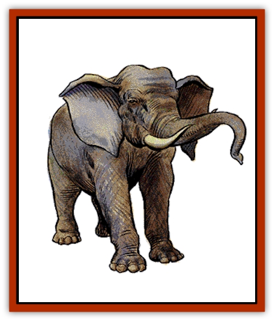

# Elephant

| Statistic | **Elephant (African)** | **Mammoth** | **Mastodon** | **Oliphant** |
| --- | --- | --- | --- | --- |
| **Activity Cycle:** | Dawn, dusk, early morning and evening | Day | Any | Day |
| **Alignment:** | Neutral | Neutral | Neutral | Neutral |
| **Armor Class:** | 6 | 5 | 6 | 4 |
| **Climate/Terrain:** | Subtropical to tropical jungle and plains | Subarctic plains | Subarctic plains | Temperate to subartic plains and tundra |
| **Damage/Attack:** | 2-16/2-16/ / 2-12/2-12/2-12 | 3-18/3-18/ / 2-16/2-12/2-12 | 2-16/2-16/ / 2-12/2-12/2-12 | 3-12/3-12/ / 3-12/3-12 |
| **Diet:** | Herbivore | Herbivore | Herbivore | Herbivore |
| **Frequency:** | Common | Very rare (Common) | Very rare (Common) | Rare |
| **Hit Dice:** | 11 | 13 | 12 | 8+4 (10+5) |
| **Intelligence:** | Semi- (2-4) | Semi- (2-4) | Semi- (2-4) | Low (5-7) |
| **Magic Resistance:** | Nil | Nil | Nil | Nil |
| **Morale:** | Unsteady (7) | Unsteady (7) | Unsteady (7) | 8+4 HD: Unsteady (7) / 10+5 HD: Average (10) |
| **Movement:** | 15 | 12 | 15 | 15 |
| **No. Appearing:** | 1-12 | 1-12 | 1-12 | 1-8 |
| **No. of Attacks:** | 5 | 5 | 5 | 4 |
| **Organization:** | Herd | Herd | Herd | Herd |
| **Size:** | L (11' tall) | L to H (10-14' tall) | L (10' tall) | L (8-10' tall) |
| **Special Attacks:** | Nil | Nil | Nil | Nil |
| **Special Defenses:** | Nil | Nil | Nil | Nil |
| **THAC0:** | 9 | 7 | 9 | 8+4 HD: 11 / 10+5 HD: 9 |
| **Treasure:** | Nil | Nil | Nil | Nil |
| **XP Value:** | 4,000 | 6,000 | 5,000 | 8+4 HD: 2,000 / 10+5 HD: 4,000 |

Elephants have thick, baggy hides, covered with sparse and very coarse tufts of gray hair. The elephant's most renowned feature is its trunk, which it uses as a grasping limb.

**Combat:** An elephant can make up to five attacks at one time in a battle. It can do stabbing damage of 2-16 points (2d8) with each of its two tusks; constricting damage of 2-12 points with its trunk; and 2-12 points of trampling damage with each of its front feet. No single opponent can be subject to more than two of these attacks at any one time. However, the elephant can battle up to six man-sized opponents at one time.

Creatures larger than ogre-sized are not subject to the elephant's trunk attack. Also, an elephant will never attempt to grasp anything that might harm its trunk - like an object covered with sharp spikes. Elephants greatly fear fire.

**Habitat/Society:** Elephants are peaceful herbivores that travel in a herd. The herd is made up of both male and female elephants, as well as their young. If a herd of 10 or more elephants is encountered, there will be 1-4 young, from 20% to 70% mature, with the group. In the herd, a clear hierarchy exists, with the older males in a clear position of dominance.

Occasionally, an older male elephant will be beaten by a rival in the herd. The defeated elephant must then leave the group, at which point it becomes a violent "rogue". Rogue elephants encountered alone are 90% likely to attack, and will have no fewer than 6 hit points per hit die.

**Ecology:** Elephants are commonly captured when young and trained. They make good beasts of burden, but are often used in warfare as mounts and living battering rams, as well.

Elephant tusks are worth 100 to 600 hundred gold pieces each, or about 4 gp per pound. In areas heavily populated by elephants, a substantial trade in this ivory will be common.

**Mammoth**

  This ancestor of the elephant was common during the Pleistocene era. Mammoths are covered with thicker, woolier hair than the modern elephant, and they are considerably larger.

Mammoths are much more aggressive than elephants and will attack with less provocation. Because they are heavier, a mammoth's tusks are worth 50% more than an elephant's. Mammoths are rare when encountered outside of a Pleistocene campaign, and will only be found in subarctic plains.

**Mastodon**

  Like the mammoth, the mastodon is an ancestor of the elephant that was common in the Pleistocene era, when they roamed from subarctic to tropical plains. They are larger than the modern elephant, hairier, and somewhat greater in length. Encountered outside of a Pleistocene campaign, mastodons are rare, and found only in subarctic plains.

**Oliphant**

  The oliphant is a modern-day mastadon, with shaggy hair and tusks that curve down. The oliphant's trunk is too short to be used in combat. This limits the number of man-sized opponents an oliphant can attack at one time to four. Oliphants are more intelligent than elephants and do not share its cousins' unreasoning fear of fire. They are also very aggressive, and when properly trained and fed, oliphants grow to greater bulk (10+5 Hit Dice) than their wild counterparts. These trained oliphants are excellent for combat duty and have a morale of 10. An oliphant's tusks are worth 100 to 400 gold pieces each, or about 4 gp per pound, but are smaller than an elephant's.

---
## Discovery & Documentation

**Source Publication:** MC1 Volume I (w/binder #1) (1991)
**Campaign Setting:** Advanced Dungeons & Dragons 2nd Edition
**Author(s):** Jay Batista, Scott Bennie, Grant Boucher, William W. Connors, Steve Gilbert, Heike Kubasch, James Lowder, David Edward Martin, Bruce Nesmith, Jean Rabe, Rick Swan, John J. Terra, Gary L. Thomas

### Other Creatures Found in This Source Book
   * [[Bat|Bat]]
   * [[Bear|Bear]]
   * [[Behir|Behir]]
   * [[Boar|Boar]]
   * [[Bookworm|Bookworm]]
   * [[Brownie|Brownie]]
   * [[Bugbear|Bugbear]]
   * [[Carrion_Crawler|Carrion Crawler]]
   * [[Cat_Great|Cat, Great]]
   * [[Catoblepas|Catoblepas]]
   * [[Dragon_General_Information|Dragon, General Information]]
   * [[Dragonfish|Dragonfish]]
   * [[Elemental_Air_Kin_Aerial_Servant|Elemental, Air Kin, Aerial Servant]]
   * [[Elemental_Earth_Kin_Sandling|Elemental, Earth Kin, Sandling]]
   * [[Gnoll|Gnoll]]
   * [[Hobgoblin|Hobgoblin]]
   * [[Homunculus|Homunculus]]
   * [[Hornet_Giant|Hornet, Giant]]
   * [[Horse|Horse]]
   * [[Hyena|Hyena]]
   * [[Jackal|Jackal]]
   * [[Jackalwere|Jackalwere]]
   * [[Korred|Korred]]
   * [[Lich|Lich]]
   * [[Lizard|Lizard]]
   * [[Lizard_Man|Lizard Man]]
   * [[Lycanthrope_General_Information|Lycanthrope, General Information]]
   * [[Lycanthrope_Seawolf|Lycanthrope, Seawolf]]
   * [[Lycanthrope_Werebear|Lycanthrope, Werebear]]
   * [[Lycanthrope_Weretiger|Lycanthrope, Weretiger]]
   * [[Lycanthrope_Werewolf|Lycanthrope, Werewolf]]
   * [[Manticore|Manticore]]
   * [[Medusa|Medusa]]
   * [[Mind_Flayer|Mind Flayer]]
   * [[Minotaur|Minotaur]]
   * [[Mudman|Mudman]]
   * [[Mummy|Mummy]]
   * [[Nixie|Nixie]]
   * [[Nymph|Nymph]]
   * [[Ogre|Ogre]]
   * [[Ooze_Slime_Jelly_I|Ooze/Slime/Jelly I]]
   * [[Ooze_Slime_Jelly_II|Ooze/Slime/Jelly II]]
   * [[Orc|Orc]]
   * [[Owl|Owl]]
   * [[Owlbear_I|Owlbear I]]
   * [[Pegasus|Pegasus]]
   * [[Piercer|Piercer]]
   * [[Pudding_Deadly|Pudding, Deadly]]
   * [[Rakshasa|Rakshasa]]
   * [[Rat|Rat]]
   * [[Ray|Ray]]
   * [[Remorhaz|Remorhaz]]
   * [[Satyr|Satyr]]
   * [[Scorpion|Scorpion]]
   * [[Selkie|Selkie]]
   * [[Shadow|Shadow]]
   * [[Skeleton|Skeleton]]
   * [[Skunk|Skunk]]
   * [[Snake|Snake]]
   * [[Spectre|Spectre]]
   * [[Spider|Spider]]
   * [[Sprite|Sprite]]
   * [[Toad_Giant|Toad, Giant]]
   * [[Treant|Treant]]
   * [[Troll|Troll]]
   * [[Umber_Hulk|Umber Hulk]]
   * [[Unicorn|Unicorn]]
   * [[Vampire|Vampire]]
   * [[Wight|Wight]]
   * [[Will_O'Wisp|Will O'Wisp]]
   * [[Wolf|Wolf]]
   * [[Wolfwere|Wolfwere]]
   * [[Wraith|Wraith]]
   * [[Wyvern|Wyvern]]
   * [[Yeti|Yeti]]
   * [[Yuan-ti|Yuan-ti]]
   * [[Zombie|Zombie]]
