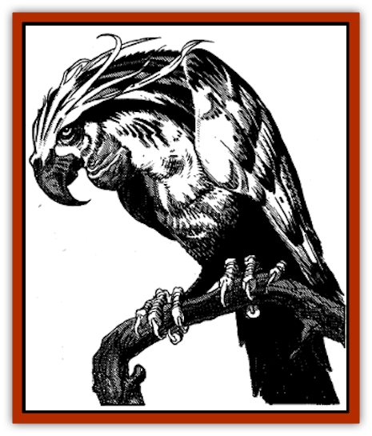

# Elephant Bird

| Statistic | **Elephant Bird** |
| --- | --- |
| **Activity Cycle:** | Night |
| **Alignment:** | Neutral |
| **Armor Class:** | 5 |
| **Climate/Terrain:** | Jungle |
| **Damage/Attack:** | 1-10 or 1-4/1-4/1-6 |
| **Diet:** | Omnivore |
| **Frequency:** | Rare |
| **Hit Dice:** | 3+3 |
| **Intelligence:** | Animal (1) |
| **Magic Resistance:** | Nil |
| **Morale:** | Unsteady to Average (5-9) |
| **Movement:** | Fl 18 (C) |
| **No. Appearing:** | 10-100 |
| **No. of Attacks:** | 1 or 3 |
| **Organization:** | Flocks |
| **Size:** | M (5') |
| **Special Attacks:** | Heated rocks |
| **Special Defenses:** | Nil |
| **THAC0:** | 17 |
| **Treasure:** | Nil |
| **XP Value:** | 420 |

The elephant bird is a man-sized [[Bird|bird]] with green plumage and a yellowish, cruel-looking, curved beak. They have a strange, protruding gullet dangling from their throats. Males often have red "racing stripes" that run from their eyes to their tailfeathers, while females are a rather drab green. Their cries are a harsh squawk, distinctive to those versed in the ways of the jungle.

Elephant birds generally travel in pairs and threes, although they are never far from the rest of their flock. When their leader gives the signal, they mass for their hunting flights. They rise in their hunting flight to create a huge cloud of green, and any creature which has had experience with them will seek cover. Anyone who has encountered these creatures when they are on a hunting flight knows the reason they are called "elephant birds". When they begin their attack, it is apparent that they could kill an [[Elephant|elephant]]. Tales abound of such killings, the birds assaulting their beleaguered prey until it finally perishes from their massed attacks.

**Combat:** Elephant birds do not initiate combat unless they are traveling in a hunting flight. When they have the advantage of numbers, they are fierce opponents. Otherwise, they are generally harmless, preferring flight to combat.

In combat, elephant birds usually carry three stones in their thick gullets. The birds superheat the stones in their body then drop these stones on creatures they are attempting to slaughter, causing 1d10 points of damage, as well as 1-4 additional points of damage the next round, from the intense heat generated. They can reharge themselves during combat if they can snatch extra rocks for the attack. The superheating takes only one round to accomplish. Each bird can carry only three stones.

If no rocks are available to the elephant birds, they attack with their fierce claws and beak. The birds attempt to overbear their opponents, adding 1 to their attack rolls for every three birds in the attack. Once an opponent is prone, they add 4 to their attack rolls for their beak strikes, and score automatically with their claws for 1d4 points each. Their beaks rend their prey for 1d6 points a round.

If they cannot overbear their opponents, they will attempt to land on them and blind them with flapping wings and flying feathers. Although this attack causes no damage, it does force the opponent to attack at a -3 on his attack roll.

**Habitat/Society:** Elephant birds dwell near clearings in the leafy, humid jungles of Zakhara, or in the thinning trees at the edges of these jungles. Their relatively open habitat enables them to respond quickly to the presence of prey in the jungle or near the perimeter.

Their nests are generally located in the upper reaches of the trees, where they can spot those who seek to harm them long before any damage is done. Their eggs are prized as a delicacy by many jungle creatures, although the predators only dare to approach the nests while the birds are hunting. Even then, there is always the chance that several birds have remained behind.

**Ecology:** Elephant birds feed on nearly anything they can find, although they prefer freshly killed meat. If none is available, they will eat carrion. If there is no carrion, they can survive by eating berries, worms, insects, or grains. By working together, elephant birds have established themselves at the top the food chain, feeding on what they like, avoiding those who would feed on them. Few predators hunt the elephant bird. Its only natural enemies are humans and humanoids. Since the birds are a menace to humanoids as well as their crops, beings who live near the elephant bird hunt them at every opportunity. For this reason, elephant birds avoid human territory. They will occasionally venture into human and other settlements if food is scarce or the pickings look especially good.

---
## Discovery & Documentation

**Source Publication:** MC13 Al-Qadim Appendix (1992)
**Campaign Setting:** Al-Qadim (Forgotten Realms)
**Author(s):** C. Terry Phillips

### Other Creatures Found in This Source Book
   * [[Ammut|Ammut]]
   * [[Ashira|Ashira]]
   * [[Asuras|Asuras]]
   * [[Black_Cloud_of_Vengeance|Black Cloud of Vengeance]]
   * [[Buraq|Buraq]]
   * [[Camel|Camel]]
   * [[Camel_of_the_Pearl|Camel of the Pearl]]
   * [[Centaur_Desert|Centaur, Desert]]
   * [[Copper_Automaton|Copper Automaton]]
   * [[Debbi|Debbi]]
   * [[Gen|Gen]]
   * [[Genie_Noble_Dao|Genie, Noble Dao]]
   * [[Genie_Noble_Djinni|Genie, Noble Djinni]]
   * [[Genie_Noble_Efreeti|Genie, Noble Efreeti]]
   * [[Genie_Noble_Marid|Genie, Noble Marid]]
   * [[Genie_Tasked_Architect_Builder|Genie, Tasked, Architect/Builder]]
   * [[Genie_Tasked_Artist|Genie, Tasked, Artist]]
   * [[Genie_Tasked_Guardian|Genie, Tasked, Guardian]]
   * [[Genie_Tasked_Herdsman|Genie, Tasked, Herdsman]]
   * [[Genie_Tasked_Slayer|Genie, Tasked, Slayer]]
   * [[Genie_Tasked_Warmonger|Genie, Tasked, Warmonger]]
   * [[Genie_Tasked_Winemaker|Genie, Tasked, Winemaker]]
   * [[Ghost_Mount|Ghost Mount]]
   * [[Ghul|Ghul]]
   * [[Giant_Desert|Giant, Desert]]
   * [[Giant_Jungle|Giant, Jungle]]
   * [[Giant_Reef|Giant, Reef]]
   * [[Giant_Zakhara_General_Information|Giant (Zakhara), General Information]]
   * [[Hama|Hama]]
   * [[Heway|Heway]]
   * [[Living_Idol|Living Idol]]
   * [[Lycanthrope_Werehyena|Lycanthrope, Werehyena]]
   * [[Lycanthrope_Werelion|Lycanthrope, Werelion]]
   * [[Markeen|Markeen]]
   * [[Maskhi|Maskhi]]
   * [[Mason_Wasp_Giant|Mason Wasp, Giant]]
   * [[Nasnas|Nasnas]]
   * [[Pahari|Pahari]]
   * [[Rom|Rom]]
   * [[Sabu_Lord|Sabu Lord]]
   * [[Sakina|Sakina]]
   * [[Serpent_Lord|Serpent Lord]]
   * [[Serpent_Winged|Serpent, Winged]]
   * [[Silat|Silat]]
   * [[Simurgh|Simurgh]]
   * [[Stone_Maiden|Stone Maiden]]
   * [[Vishap|Vishap]]
   * [[Zaratan|Zaratan]]
   * [[Zin|Zin]]
