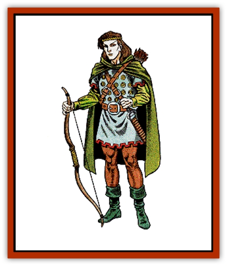

# Elf

| Statistic | **Elf** |
| --- | --- |
| **Activity Cycle:** | Any |
| **Alignment:** | Chaotic good |
| **Armor Class:** | 5 (10) |
| **Climate/Terrain:** | Temperate to subtropical forest |
| **Damage/Attack:** | 1-10 |
| **Diet:** | Omnivore |
| **Frequency:** | Uncommon |
| **Hit Dice:** | 1+1 |
| **Intelligence:** | High to Supra-genius (14-20) |
| **Magic Resistance:** | 90% resistance to <i>sleep</i> and all <i>charm</i>-related spells |
| **Morale:** | Elite (13) |
| **Movement:** | 12 |
| **No. Appearing:** | 20-200 |
| **No. of Attacks:** | 1 |
| **Organization:** | Bands |
| **Size:** | M (5'+ tall) |
| **Special Attacks:** | +1 to hit with bow or sword |
| **Special Defenses:** | See below |
| **THAC0:** | 19 (18) |
| **Treasure:** | Individual: N; G,S,T in lair |
| **XP Value:** | 420 |

Though their lives span several human generations, elves appear at first glance to be frail when compared to man. However, elves have a number of special talents that more than make up for their slightly weaker constitutions.

High elves, the most common type of elf, are somewhat shorter than men, never growing much over than 5 feet tall. Male elves usually weigh between 90 and 120 pounds, and females weigh between 70 and 100 pounds. Most high elves are dark-haired, and their eyes are a beautiful, deep shade of green. They posses infravision up to 60 feet. The features of an elf are delicate and finely chiseled.

Elves have very pale complexions, which is odd because they spend a great deal of time outdoors. They tend to be slim, almost fragile. Their pale complexion and slight builds are the result of a constitution that is weaker than man's. Elves, therefore, always subtract 1 point from their initial Constitution score. Though they are not as sturdy as humans, elves are much more agile, and always add 1 point to their initial Dexterity scores.

Elven clothing tends to be colorful, but not garish. They often wear pastel colors, especially blues and greens. Because they dwell in forests, however, high elves often wear greenish grey cloaks to afford them quick camouflage.

Elves have learned that it is very important to understand the creatures, both good and evil, that share their forest home. Because of this, elves may speak the tongues of goblins, orcs, hobgoblins, gnolls, gnomes, and halflings, in addition to common and their own highly-developed language. They will always show an interest in anything that will allow them to communicate with, and learn from, their neighbors.

**Combat:** Elves are cautious fighters and always use their strengths to advantage if possible. One of their greatest strengths is the ability to pass through natural surroundings, woods, or forests, silently and almost invisibly. By moving quietly and blending into vegetation for cover, elves will often surprise a person or party (opponents have a surprise modifier of -4). As long as they are not attacking, the elves hiding in the forest can only be spotted by someone or something with the ability to see invisible objects. The military value of this skill is immense, and elven armies will always send scouts to spy on the enemy, since such spies are rarely caught - or even seen.

Although their constitutions are weak, elves posses an extremely strong will, such strong wills, in fact, that they have a 90% immunity to all *charm* and *sleep* spells. And even if their natural resistance to these spells fails, they get a normal saving throw - making it unlikely an elf will fall victim to these spells very often.

Elves live in the wild, so weapons are used for everything from dealing with the hostile creatures around their camps, to such mundane tasks as hunting for dinner. The elves' rigorous training with bows and swords, in addition to their great dexterity, gives them a natural bonus of +1 to hit when fighting with a short or long sword, or when using a bow of any kind, other than a crossbow. Elves are especially proficient in the use of the bow. Because of their agility, elves can move, fire a bow, and move again, all in the same round. Their archers are extremely mobile, and therefore dangerous.

Because of limitations of horses in forest combat, elves do not usually ride. Elves prefer to fight as foot soldiers and are generally armed as such. Most elves wear scale, ring, or chain mail, and almost all high elves carry shields. Although elves have natural bonuses when they use bows and swords, their bands carry a variety of weapons. The weapons composition of a band of elves is: spear 30%; sword 20%; sword and spear 20%; sword and bow 10%; bow 15%; two-handed sword 5%.

Elven fighters and multi-class fighters have a 10% chance per level to possess a magical item of use to his or her class. This percentage is cumulative and can be applied to each major type of magical item that character would use-for each class in the case of multi-class characters. (For example, a fighter/priest of level 4 or 5 would have a 40% chance to have a magical item useful to fighters and a 50% chance of having an item useful to priests.) In addition, if above 4th level, elven mages gain the same percentage chance to gain items, but gain 2-5 magical items useful to them if a successful roll is made.

For every 20 elves in a group, there will be one 2nd- or 3rd-level fighter (50% chance of either). For every party of 40 elves, and in addition to the higher level fighter, there will be a 1st- or 2nd-level mage (again, 50% chance of either). If 100 or more elves are encountered, the following additional characters will be present: two 4th-level fighter; one 8th-level mage; and a 4th-level fighter/4th-level mage/4th-level thief. Finally, if over 160 elves are encountered, they will be led by two 6th-level fighter/6th-level mage/6th-level thief. These two extremely powerful leaders will have two retainers each-a 4th-level fighter/5th-level mage, and a 3rd-level fighter/3rd-level mage/3rd-level thief. All of these are in addition to the total number of elves in the band.

Elven women are the equal of their male counterparts in all aspects of warfare. In fact, some bands of elves will contain units of female fighters, who will be mounted on [[Unicorn|unicorns]]. This occurs rarely (5% chance), and only 10-30 elf maidens will be encountered in such a unit. However, the legends of the destruction wrought by these elven women are rampant among the enemies of the elves.

**Habitat/Society:** Elves value their individual freedom highly and their social structure is based on independent bands. These small groups, usually consisting of no more than 200, recognize the authority of a royal overlord, who in turn owes allegiance to a king or queen. However, the laws and restraints set upon elven society are very few compared to human society and practically negligible when compared to dwarven society.

Elven camps are always well-hidden and protected. In addition to the large number of observation posts and personnel traps set around a camp, high elves typically set 2-12 [[Eagle|giant eagles]] as guardians of their encampments (65% of the time). For every 40 elves encountered in a camp, there will be the following high level elves, as well as the leaders noted above: a 4th-level fighter, a 4th-level cleric, and a 2nd-level fighter/2nd-level mage/2nd-level thief. A 4th-level fighter/7th-level mage, a 5th-level fighter, a 6th-level fighter, and a 7th-level cleric will also be present. Females found in a camp will equal 100%, children 50%, of the males encountered.

Because elves live for several hundred years, their view of the world is radically different from most other sentient beings. Elves do not place much importance on short-term gains nor do they hurry to finish projects. Humans see this attitude as frivolous; the elves simply find it hard to understand why everyone else is always in such a rush.

Elves prefer to surround themselves with things that will bring them joy over long periods of time - things like music and nature. The company of their own kind is also very important to elves, since they find it hard to share their experiences or their perspectives on the world with other races. This is one of the main reasons elven families are so close. However, as friendship, too is something to be valued, even friends of other races remain friends forever.

Though they are immune to a few specific spells, elves are captivated by magic. Not specific spells, of course, but the very concept of magic. Cooperation is far more likely to be had from an elf, by offering an obscure, even worthless, (but interesting) magical item, than it is with two sacks of gold. Ultimately, their radically different perspective separates the elves from the rest of their world. Elves find dwarves too dour and their adherence to strict codes of law unpleasant. However, elves do recognize dwarven craftsmanship as something to be praised. Elves think a bit more highly of humans, though they see man's race after wealth and fleeting power as sad. In the end, after a few hundred years, all elves leave the world they share with dwarves and men, and journey to a mysterious land where they live freely for the rest of their extremely long lives.

**Ecology:** Elves produce fine clothes, beautiful music, and brilliant poetry. It is for these things that other cultures know the folk of the forest best. In their world within the forest, however, elves hold in check the dark forces of evil, and the creatures that would plunder the forest and then move on to plunder another. For this reason alone, elves are irreplaceable.

**Grey Elf (Faerie)**

  Grey elves have either silver hair and amber eyes, or pale golden hair and violet eyes (the violet-eyed ones are known as faerie elves). They favor bright garments of white, gold, silver, or yellow, and wear cloaks of deep blue or purple. Grey elves are the rarest of elves, and they have little to do with the world outside their forests. They value intelligence very highly, and, unlike other elves, devote much time to study and contemplation. Their treatises on nature are astounding.

Grey elves value their independence from what they see as the corrupting influence of the outside world, and will fight fiercely to maintain their isolation. All grey elves carry swords, and most wear chain mail and carry shields. For mounts, grey elves will ride [[Hippogriff|hippogriffs]] (70%) or [[Griffon|griffons]] (30%). Those that ride griffons will have 3-12 griffons for guards in their camps, instead of giant eagles.

**Wood Elf**

  Also called *sylvan elves*, wood elves are the wild branch of the elf family. They are slightly darker in complexion than high elves, their hair ranges in color from yellow to coppery-red, and their eyes are light brown, light green, or hazel. They wear clothes of dark browns and greens, tans and russets, to blend in with their surroundings. Wood elves are very independent and value strength over intelligence. They will avoid contact with strangers 75% of the time.

In battle, wood elves wear studded leather or ring mail, and 50% of their band will be equipped with bows. Only 20% of wood elves carry swords, and only 40% use spears. Wood elves prefer to ambush their enemies, using their ability to hide in the forest until their foes are close at hand. In most cases (70%), wood elf camps are guarded by 2-8 [[Owl|giant owls]] (80%) or by 1-6 [[Cat_Great|giant lynx]] (20%). These elves speak only elf and the languages of some forest animals, and the treant. Wood elves are more inclined toward neutrality than good, and are not above killing people who stumble across their camps, in order to keep their locations secret.

**Half-Elf**

  [[Elf_Half-|Half-elves]] are of human stock, and have features of both the elf and human parents. They are slightly taller than common elves, growing as tall as 5 ½ feet and weighing up to 150 pounds. Though they do not gain the natural sword or bow bonuses from their elven relatives, but they do have normal elven infravision.

A half-elf can travel freely between most elven and human settlements, though occasionally prejudice will be a problem. The half-elf's life span is their biggest source of grief, however. Since a half-elf lives more than 125 years, he or she will outlive any human friends or relatives, but grow old too quickly to be a real part of elven society. Many half-elves deal with this by traveling frequently between the two societies, enjoying life as it comes; the best of both worlds. Half-elves may speak common, elf, gnome, halfling, goblin, hobgoblin, orc, and gnoll.

---
## Discovery & Documentation

**Source Publication:** Monstrous Manual (1995)
**Campaign Setting:** Advanced Dungeons & Dragons 2nd Edition
**Author(s):** Tim Beach

### Other Creatures Found in This Source Book
   * [[Aarakocra|Aarakocra]]
   * [[Aboleth|Aboleth]]
   * [[Ankheg|Ankheg]]
   * [[Arcane|Arcane]]
   * [[Argos|Argos]]
   * [[Aurumvorax|Aurumvorax]]
   * [[Baatezu_Lesser_Abishai|Baatezu, Lesser, Abishai]]
   * [[Baatezu_General_Information|Baatezu, General Information]]
   * [[Baatezu_Greater_Pit_Fiend|Baatezu, Greater, Pit Fiend]]
   * [[Banshee|Banshee]]
   * [[Basilisk|Basilisk]]
   * [[Bat|Bat]]
   * [[Bear|Bear]]
   * [[Beetle_Giant|Beetle, Giant]]
   * [[Behir|Behir]]
   * [[Beholder_and_Beholder-kin_I|Beholder and Beholder-kin I]]
   * [[Beholder_and_Beholder-kin_II|Beholder and Beholder-kin II]]
   * [[Bird|Bird]]
   * [[Brain_Mole|Brain Mole]]
   * [[Broken_One|Broken One]]
   * [[Brownie|Brownie]]
   * [[Bugbear|Bugbear]]
   * [[Bulette|Bulette]]
   * [[Bullywug|Bullywug]]
   * [[Carrion_Crawler|Carrion Crawler]]
   * [[Cat_Great|Cat, Great]]
   * [[Catoblepas|Catoblepas]]
   * [[Cat_Small|Cat, Small]]
   * [[Cave_Fisher|Cave Fisher]]
   * [[Centaur|Centaur]]
   * [[Centipede|Centipede]]
   * [[Chimera|Chimera]]
   * [[Cloaker|Cloaker]]
   * [[Cockatrice|Cockatrice]]
   * [[Couatl|Couatl]]
   * [[Crabman|Crabman]]
   * [[Crawling_Claw|Crawling Claw]]
   * [[Crocodile|Crocodile]]
   * [[Crustacean_Giant|Crustacean, Giant]]
   * [[Crypt_Thing|Crypt Thing]]
   * [[Death_Knight|Death Knight]]
   * [[Deepspawn|Deepspawn]]
   * [[Dinosaur_I|Dinosaur I]]
   * [[Displacer_Beast|Displacer Beast]]
   * [[Dog|Dog]]
   * [[Dog_Moon|Dog, Moon]]
   * [[Dolphin|Dolphin]]
   * [[Doppelganger|Doppelganger]]
   * [[Dracolich|Dracolich]]
   * [[Dragon_Brown|Dragon, Brown]]
   * [[Dragon_Chromatic_Black|Dragon, Chromatic, Black]]
   * [[Dragon_Chromatic_Blue|Dragon, Chromatic, Blue]]
   * [[Dragon_Chromatic_Green|Dragon, Chromatic, Green]]
   * [[Dragon_Cloud|Dragon, Cloud]]
   * [[Dragon_Chromatic_Red|Dragon, Chromatic, Red]]
   * [[Dragon_Chromatic_White|Dragon, Chromatic, White]]
   * [[Dragon_Deep|Dragon, Deep]]
   * [[Dragon_Gem_Amethyst|Dragon, Gem, Amethyst]]
   * [[Dragon_Gem_Crystal|Dragon, Gem, Crystal]]
   * [[Dragon_Gem_Emerald|Dragon, Gem, Emerald]]
   * [[Dragon_Gem_Sapphire|Dragon, Gem, Sapphire]]
   * [[Dragon_Gem_Topaz|Dragon, Gem, Topaz]]
   * [[Dragon_Metallic_Brass|Dragon, Metallic, Brass]]
   * [[Dragon_Metallic_Bronze|Dragon, Metallic, Bronze]]
   * [[Dragon_Metallic_Copper|Dragon, Metallic, Copper]]
   * [[Dragon_Mercury|Dragon, Mercury]]
   * [[Dragon_Metallic_Gold|Dragon, Metallic, Gold]]
   * [[Dragon_Mist|Dragon, Mist]]
   * [[Dragon_Metallic_Silver|Dragon, Metallic, Silver]]
   * [[Dragon_General_Information|Dragon, General Information]]
   * [[Dragon_Shadow|Dragon, Shadow]]
   * [[Dragon_Steel|Dragon, Steel]]
   * [[Dragon_Yellow|Dragon, Yellow]]
   * [[Dragonne|Dragonne]]
   * [[Dragon_Turtle|Dragon Turtle]]
   * [[Dragonet_Faerie_Dragon|Dragonet, Faerie Dragon]]
   * [[Dragonet_Fire_Drake|Dragonet, Fire Drake]]
   * [[Dragonet_Pseudodragon|Dragonet, Pseudodragon]]
   * [[Dryad|Dryad]]
   * [[Dwarf_Derro|Dwarf, Derro]]
   * [[Dwarf|Dwarf]]
   * [[Elemental_Athas_General_Information|Elemental (Athas), General Information]]
   * [[Elemental_Air_Kin|Elemental, Air Kin]]
   * [[Elemental_Earth_Kin|Elemental, Earth Kin]]
   * [[Elemental_Fire_Kin|Elemental, Fire Kin]]
   * [[Elemental_Water_Kin|Elemental, Water Kin]]
   * [[Elemental_of_Chaos_Air_Earth|Elemental of Chaos, Air/Earth]]
   * [[Elemental_of_Chaos_Fire_Water|Elemental of Chaos, Fire/Water]]
   * [[Elemental_Composite|Elemental, Composite]]
   * [[Elemental_Air_Earth|Elemental, Air/Earth]]
   * [[Elemental_Fire_Water|Elemental, Fire/Water]]
   * [[Elemental_General_Information|Elemental, General Information]]
   * [[Elephant|Elephant]]
   * [[Elf_Aquatic|Elf, Aquatic]]
   * [[Elf_Drow|Elf, Drow]]
   * [[Ettercap|Ettercap]]
   * [[Eyewing|Eyewing]]
   * [[Feyr|Feyr]]
   * [[Fish|Fish]]
   * [[Frog|Frog]]
   * [[Fungus|Fungus]]
   * [[Galeb_Duhr|Galeb Duhr]]
   * [[Gargantua|Gargantua]]
   * [[Gargoyle_I|Gargoyle I]]
   * [[Genie|Genie]]
   * [[Ghost|Ghost]]
   * [[Ghoul|Ghoul]]
   * [[Giant_Cloud|Giant, Cloud]]
   * [[Giant_Cyclops|Giant, Cyclops]]
   * [[Giant_Desert|Giant, Desert]]
   * [[Giant_Ettin|Giant, Ettin]]
   * [[Giant_Firbolg|Giant, Firbolg]]
   * [[Giant_Fire|Giant, Fire]]
   * [[Giant_Fog|Giant, Fog]]
   * [[Giant_Fomorian|Giant, Fomorian]]
   * [[Giant_Frost|Giant, Frost]]
   * [[Giant_Hill|Giant, Hill]]
   * [[Giant_Jungle|Giant, Jungle]]
   * [[Giant_Mountain|Giant, Mountain]]
   * [[Giant_Reef|Giant, Reef]]
   * [[Giant_Stone|Giant, Stone]]
   * [[Giant_Storm|Giant, Storm]]
   * [[Giant_Verbeeg|Giant, Verbeeg]]
   * [[Giant_Wood|Giant, Wood]]
   * [[Gibberling|Gibberling]]
   * [[Giff|Giff]]
   * [[Gith|Gith]]
   * [[Gith_Pirate_of|Gith, Pirate of]]
   * [[Githyanki|Githyanki]]
   * [[Githzerai|Githzerai]]
   * [[Gloomwing|Gloomwing]]
   * [[Gnoll|Gnoll]]
   * [[Gnome|Gnome]]
   * [[Gnome_Spriggan|Gnome, Spriggan]]
   * [[Goblin|Goblin]]
   * [[Golem_General_Information|Golem, General Information]]
   * [[Golem_I_Greater_Golem|Golem I (Greater Golem)]]
   * [[Golem_II_Lesser_Golem|Golem II (Lesser Golem)]]
   * [[Golem_III|Golem III]]
   * [[Golem_IV|Golem IV]]
   * [[Golem_V|Golem V]]
   * [[Golem_VI_Stone_Variants|Golem VI (Stone Variants)]]
   * [[Gorgon|Gorgon]]
   * [[Grell_Colonial|Grell, Colonial]]
   * [[Gremlin_Jermlaine|Gremlin, Jermlaine]]
   * [[Gremlin|Gremlin]]
   * [[Griffon|Griffon]]
   * [[Grimlock|Grimlock]]
   * [[Grippli|Grippli]]
   * [[Hag|Hag]]
   * [[Halfling|Halfling]]
   * [[Harpy|Harpy]]
   * [[Hatori|Hatori]]
   * [[Haunt|Haunt]]
   * [[Hell_Hound|Hell Hound]]
   * [[Heucuva|Heucuva]]
   * [[Hippocampus|Hippocampus]]
   * [[Hippogriff|Hippogriff]]
   * [[Hobgoblin|Hobgoblin]]
   * [[Homunculus|Homunculus]]
   * [[Hook_Horror|Hook Horror]]
   * [[Horse|Horse]]
   * [[Human|Human]]
   * [[Hydra|Hydra]]
   * [[Imp|Imp]]
   * [[Insect_Giant|Insect, Giant]]
   * [[Insect_Swarm|Insect Swarm]]
   * [[Intellect_Devourer|Intellect Devourer]]
   * [[Invisible_Stalker|Invisible Stalker]]
   * [[Ixitxachitl|Ixitxachitl]]
   * [[Jackalwere|Jackalwere]]
   * [[Kenku|Kenku]]
   * [[Ki-rin|Ki-rin]]
   * [[Kirre|Kirre]]
   * [[Kobold|Kobold]]
   * [[Kuo-Toa|Kuo-Toa]]
   * [[Lamia|Lamia]]
   * [[Lammasu|Lammasu]]
   * [[Leech|Leech]]
   * [[Leprechaun|Leprechaun]]
   * [[Leucrotta|Leucrotta]]
   * [[Lich|Lich]]
   * [[Living_Wall|Living Wall]]
   * [[Lizard|Lizard]]
   * [[Lizard_Man|Lizard Man]]
   * [[Locathah|Locathah]]
   * [[Lurker|Lurker]]
   * [[Lycanthrope_General_Information|Lycanthrope, General Information]]
   * [[Lycanthrope_Seawolf|Lycanthrope, Seawolf]]
   * [[Lycanthrope_Werebear|Lycanthrope, Werebear]]
   * [[Lycanthrope_Wereboar|Lycanthrope, Wereboar]]
   * [[Lycanthrope_Werebat|Lycanthrope, Werebat]]
   * [[Lycanthrope_Werefox|Lycanthrope, Werefox]]
   * [[Lycanthrope_Wererat|Lycanthrope, Wererat]]
   * [[Lycanthrope_Wereraven|Lycanthrope, Wereraven]]
   * [[Lycanthrope_Weretiger|Lycanthrope, Weretiger]]
   * [[Lycanthrope_Werewolf|Lycanthrope, Werewolf]]
   * [[Mammal|Mammal]]
   * [[Mammal_Giant|Mammal, Giant]]
   * [[Mammal_Herd_I|Mammal, Herd I]]
   * [[Mammal_Small|Mammal, Small]]
   * [[Manscorpion|Manscorpion]]
   * [[Manticore|Manticore]]
   * [[Medusa_Maedar|Medusa, Maedar]]
   * [[Medusa|Medusa]]
   * [[Mephit_General_Information|Mephit, General Information]]
   * [[Merman|Merman]]
   * [[Mimic|Mimic]]
   * [[Mind_Flayer|Mind Flayer]]
   * [[Minotaur|Minotaur]]
   * [[Mist_Crimson_Death|Mist, Crimson Death]]
   * [[Mist_Vampiric|Mist, Vampiric]]
   * [[Mold_I|Mold I]]
   * [[Moldman|Moldman]]
   * [[Mongrelman|Mongrelman]]
   * [[Morkoth|Morkoth]]
   * [[Muckdweller|Muckdweller]]
   * [[Mudman|Mudman]]
   * [[Mummy_Greater|Mummy, Greater]]
   * [[Mummy|Mummy]]
   * [[Myconid|Myconid]]
   * [[Naga|Naga]]
   * [[Naga_Dark|Naga, Dark]]
   * [[Neogi|Neogi]]
   * [[Nightmare|Nightmare]]
   * [[Nymph|Nymph]]
   * [[Octopus_Giant|Octopus, Giant]]
   * [[Ogre|Ogre]]
   * [[Ogre_Half-|Ogre, Half-]]
   * [[Ooze_Slime_Jelly_I|Ooze/Slime/Jelly I]]
   * [[Ooze_Slime_Jelly_II|Ooze/Slime/Jelly II]]
   * [[Ooze_Slime_Jelly_Slithering_Tracker|Ooze/Slime/Jelly, Slithering Tracker]]
   * [[Orc|Orc]]
   * [[Otyugh|Otyugh]]
   * [[Owlbear_I|Owlbear I]]
   * [[Pegasus|Pegasus]]
   * [[Peryton|Peryton]]
   * [[Phantom|Phantom]]
   * [[Phoenix|Phoenix]]
   * [[Piercer|Piercer]]
   * [[Plant_Dangerous_I|Plant, Dangerous I]]
   * [[Plant_Intelligent|Plant, Intelligent]]
   * [[Poltergeist|Poltergeist]]
   * [[Pudding_Deadly|Pudding, Deadly]]
   * [[Quaggoth|Quaggoth]]
   * [[Rakshasa|Rakshasa]]
   * [[Rat|Rat]]
   * [[Rat_Osquip|Rat, Osquip]]
   * [[Remorhaz|Remorhaz]]
   * [[Revenant|Revenant]]
   * [[Roc|Roc]]
   * [[Roper|Roper]]
   * [[Rust_Monster|Rust Monster]]
   * [[Sahuagin|Sahuagin]]
   * [[Satyr|Satyr]]
   * [[Scorpion|Scorpion]]
   * [[Sea_Lion|Sea Lion]]
   * [[Selkie|Selkie]]
   * [[Shadow|Shadow]]
   * [[Shedu|Shedu]]
   * [[Sirine|Sirine]]
   * [[Skeleton|Skeleton]]
   * [[Skeleton_Giant|Skeleton, Giant]]
   * [[Skeleton_Warrior|Skeleton, Warrior]]
   * [[Slaad|Slaad]]
   * [[Slug_Giant|Slug, Giant]]
   * [[Snake|Snake]]
   * [[Snake_Winged|Snake, Winged]]
   * [[Spectre|Spectre]]
   * [[Sphinx|Sphinx]]
   * [[Spider|Spider]]
   * [[Sprite|Sprite]]
   * [[Squid_Giant|Squid, Giant]]
   * [[Stirge|Stirge]]
   * [[Su-Monster|Su-Monster]]
   * [[Swanmay|Swanmay]]
   * [[Tabaxi|Tabaxi]]
   * [[Tako|Tako]]
   * [[Tanar'ri_True_Balor|Tanar'ri, True, Balor]]
   * [[Tanar'ri_True_Marilith|Tanar'ri, True, Marilith]]
   * [[Tarrasque|Tarrasque]]
   * [[Tasloi|Tasloi]]
   * [[Thought_Eater|Thought Eater]]
   * [[Thri-kreen|Thri-kreen]]
   * [[Titan|Titan]]
   * [[Toad_Giant|Toad, Giant]]
   * [[Treant|Treant]]
   * [[Triton|Triton]]
   * [[Troglodyte|Troglodyte]]
   * [[Troll|Troll]]
   * [[Umber_Hulk|Umber Hulk]]
   * [[Unicorn|Unicorn]]
   * [[Urchin|Urchin]]
   * [[Vampire|Vampire]]
   * [[Wemic|Wemic]]
   * [[Whale|Whale]]
   * [[Wight|Wight]]
   * [[Will_O'Wisp|Will O'Wisp]]
   * [[Wolf|Wolf]]
   * [[Wolfwere|Wolfwere]]
   * [[Worm|Worm]]
   * [[Wraith|Wraith]]
   * [[Wyvern|Wyvern]]
   * [[Xorn|Xorn]]
   * [[Yeti|Yeti]]
   * [[Yuan-ti_Histachii|Yuan-ti, Histachii]]
   * [[Yuan-ti|Yuan-ti]]
   * [[Yugoloth_Guardian|Yugoloth, Guardian]]
   * [[Zaratan|Zaratan]]
   * [[Zombie|Zombie]]
