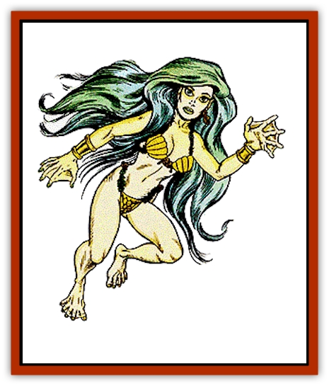

# Elf - Aquatic

| Statistic | **Elf, Aquatic** |
| --- | --- |
| **Activity Cycle:** | Any |
| **Alignment:** | Chaotic good |
| **Armor Class:** | 6 (9) |
| **Climate/Terrain:** | Temperate/Shallow salt water |
| **Damage/Attack:** | 1-8 (weapon) |
| **Diet:** | Omnivore |
| **Frequency:** | Very rare |
| **Hit Dice:** | 1+1 |
| **Intelligence:** | High to genius (14-18) |
| **Magic Resistance:** | 90% to <i>sleep</i> and <i>charm</i> spells |
| **Morale:** | Elite (13) |
| **Movement:** | 9, Sw 15 |
| **No. Appearing:** | 20-120 |
| **No. of Attacks:** | 1 or 2 |
| **Organization:** | Bands |
| **Size:** | M (6'+tall) |
| **Special Attacks:** | +1 with spears and tridents |
| **Special Defenses:** | See below |
| **THAC0:** | 19 |
| **Treasure:** | K,Q, (I,O,X,Y) |
| **XP Value:** | 420 |

Beneath the crashing waves of wild coastlines lives the sea-elf, aquatic cousin of the [[Elf|woodland elves]] in conduct and outlook.

Aquatic elves live for many centuries, and their eyes often show the effects of such great age. Otherwise, sea elves show little evidence of aging. They have gill slits on either side of their throats, and greenish-silver skin. Their hair is usually stringy, and emerald green to deep blue in color. Males usually wear their hair short, but females allow their hair to reach as much as 4 feet in length. Unlike [[Merman|mermen]], aquatic elves have legs and usually wear clothes woven from underwater plants and reeds. Their dress is quite intricate, most often of greens, blacks, and browns woven in subtle, swirling designs. Sea elves speak elvish, sahuagin, and an oddly accented common.

**Combat:** Sea elves are a peaceful culture. It is a rare sight to see an aquatic elf launch an attack, and rarer still for an entire band to prepare for war. Sea elves will leave their homes to go to battle only when the entire community is in danger, or against great enemies. When forced to war, they impress all opponents with their fierce bravery and skill.

If given their choice of battlefield, aquatic elves would prefer to fight in a bed of seaweed, or on the reefs, where their natural coloration and stealth skills can give them the chance to hide from their enemies. They can become as invisible in seaweed as their woodland cousins can in the forests, imposing a -5 penalty to their opponent's surprise roll. Sea elves enjoy the ability to move unhindered through seaweed, giving them tremendous advantages in maneuverability. While they lack the infravision of their land-based cousins, they can see clearly at amazing distances. An aquatic elf can count the troops of an enemy at distances of up to 1 mile.

Their preferred weapons are the trident and the spear. These are used for hunting as well as for combat. The trident and spear are wielded so well by sea elves, that they receive a + 1 bonus to their attack roll when using them. They will also use combat nets against their enemies. These off-hand weapons will bind an opponent if the wielder rolls a successful attack against AC 6. (Because of their great Dexterity, aquatic elves do not suffer a penalty to the attack roll for the nets.) Half the time, only a victim's weapon (including natural weapons, like a shark's teeth) will be entangled in the net. The rest of the time, the victim is trapped. A netted victim must either break the net (a bend bars roll) or disentangle himself (a Dexterity check with at a -3 penalty) to get free. Magical gestures are impossible in a net.

On some worlds, sea elves are unable to cast spells. The reasons for this are unknown, but there is a legend among these non-magical sea elves that the [[Elf_Drow|drow]] stole this ability from them, long ages ago. Like their surface counterparts, aquatic elves demonstrate strong resistance to *sleep* and *charm* spells. Aquatic elves also have a 90% immunity against *charm person* spells. And even if their natural resistance to *sleep* and *charm* spells fails, aquatic elves still get a normal saving throw.

In combat, leadership is divided according to the size of the war party. For every 20 elves in a band, there is an additional 3rd-level fighter. For every 40 elves, there is an additional 4th-level fighter. In a force numbering over 100, there will be an 8th-level fighter and two 5th-level lieutenants (in addition to the 3rd- and 4th-level fighters above). A combat unit of more than 160 elves are accompanied by a 9th-level fighter and a 6th-level thief, in addition to their original numbers.

Sea elves befriend [[Dolphin|dolphins]] and employ them as companions and comrades-in-arms. In any party of at least 20 sea elves, there's a 50% chance for them to be accompanied by 1d3 dolphins. The dolphins are companions, however, they are neither pets nor cannon fodder. When danger threatens, dolphins join the combat as willing allies.

Battle tactics of the sea elves differ from one band to another, but common strategies include the following:

<ul><li>A charge from directly beneath an opponent. This is particularly effective against unwanted visitors from the surface, who are unaccustomed to being attacked from below. If the elf launched this attack from a bed of seaweed, he might well escape back to cover before his opponents could react.</li><li>A beaching, usually by more than one elf. Sea elves can survive on land for a few minutes at a time, though in a state of growing discomfort. Many of their opponents, like [[Shark|sharks]], cannot. Several elves may attempt to wrestle an opponent to the beach, taking it well away from the ocean.</li><li>Traps. Beds of seaweed and coral reefs are excellent staging areas for all manner of spring-loaded booby-traps, nets, and perhaps magical entrapments designed and built by surface elves in return for favors. Predators have often decided to turn toward easier prey after encountering a sea elf band's defenses.</li></ul>**Habitat/Society:** Small communities of 3d100+100 normal inhabitants are the rule of aquatic elven lifestyle. These communities are often found in heavy weed beds in sheltered waters, though the aquatic elves may fashion homes in caverns in lagoon bottoms and coral reefs. Sea elf communities keep in touch with each other through an elaborate and inefficient custom of wandering herald/messengers who travel from one band to another, much like postal carriers transmitting oral messages. In each community, there are several leader-types, as outlined earlier, ruled over by a fighter of 10th-12th level, with a personal guard of eight 7th-level elf fighters. Magical weapons would be carried by the leader or one of his guards.

Aquatic elves are an anti-social race. They avoid air-breathers as well as other races that dwell beneath the waves. Their cities are usually carved from the rock beneath beds of seaweeds, practically invisible to non-elves. A character has the same opportunity to find a sea elf community as he has to detect a secret door.

As independent as the freedom-loving elves are of each others' communities, they live in even greater isolation from the rest of the undersea races, whom they would rather not deal with. Although the aquatic elves see nothing wrong with the mermen, the [[Triton|tritons]], and other good-aligned undersea races, the elves see no reason to involve themselves in the problems of such transitory peoples. It is part of the elven philosophy to let others go about their business with a minimum of interruption; aquatic elves would prefer it if others returned the favor.

Those aquatic elves who are willing to deal with non-elves are highly insulted if the non-elves expresses any lack of confidence in the sea elf's word. An aquatic elf who makes a promise will carry out his obligation unto death. Should he be killed before he can succeed, his entire band will work to see that the promise is fulfilled. On the other hand, aquatic elves do not accept promises from non-elven characters. The sea elves know that they are the only race with the honor to carry out the duties of its dead members. And, besides, only elves live long enough to guarantee that they will have the time to fulfill a vow.

Dolphins are one of the few creatures the sea elves genuinely like. There are 3d6+2 dolphins swimming about most aquatic elf bands, providing one of the few clues as to where the elven cities are located. Aquatic elves are also fairly fond of land elves. It is uncertain how closely related the two races are, although matings between land elves and aquatic elves produce elves with the coloring of high elves, but with greenish hair. As they have hidden gill slits that open up when they dive under the surface, these elves can breathe either air or water indefinitely. The attitudes and abilities of these half-breeds depend upon whether they were reared in the forests or the rich kelp beds, with individuals inclined (65%) to follow the lifestyles of their mothers.

Sea elves have an outlook on the world that comes from long lives among quiet natural beauty. Even with magical assistance to enable them to breathe air, aquatic elves are uncomfortable above the waves, and so very few have seen the forests that the high elves speak of with such enthusiasm. But there are few aquatic elves who would not like to take the impossible trip overland to see the wonders of a forest first-hand.

Sea elves hate [[Sahuagin|sahuagin]]. This isn't much of a surprise, as almost every undersea race, with the exception of the perverse [[Ixitxachitl|ixitxachitls]], hates the sea-devils. But sea elves generate a passion for conflict with the sahuagin that surprises even themselves. Aquatic elves leave their sheltered bands in war parties if they have reason to suspect that sahuagin are dwelling nearby. Should a party of sea elves encounter sahuagin, the former nearly always attack if they outnumber their hated foes. Aquatic elves also make it a point to kill any great sharks in their territory.

Sea elves have no other major enemies, but they dislike surface-dwelling fishermen, due to the numbers of sea elves snared in nets, or mistakenly killed as sahuagin by these ignorant humans. The sea elves have legends that speak of far-away undersea elves who have learned to shapechange into sea otters or dolphins. There have been search parties motivated by these tales, but no such elves have ever been found.

**Ecology:** Each band of sea elves is self-sufficient, raising their kelp and hunting fish when necessary. Sea elves scavenge. They are enchanted by the idea of magic, but they realize that land elves are more equipped to deal with it. They often trade rare or decorative items they have found to the high elves in exchange for metal weapons and tools, which they cannot forge underwater.

Aquatic elves are valuable sources of information regarding the lands beneath the sea. Their scavenging parties have uncovered artifacts and tidbits of knowledge from a vast collection of underwater ruins and sunken ships. Sea elf traders remember the histories of other races back beyond the imaginings of the current generation. The trick is to get them to reveal this information.

**Malenti**

  There is a bond between aquatic elves and their hated enemies, the sahuagin, that neither race openly acknowledges. If sea elves are present within a mile or so of a sahuagin encampment, then approximately one out of every hundred sahuagin births resembles an aquatic elf rather than a sea-devil. Most of the time, these offspring, known as malenti, are eaten by their parents. Once in a great while, a malenti is allowed to live to adulthood because its physical resemblance to an aquatic elf, in combination with its sahuagin upbringing and attitude, make it an ideal spy in elven communities. Indeed, malenti often develop the ability to sense the presence and position of any aquatic elves within 120 feet, an invaluable skill for either a spy or a scout for an invading sahuagin force. Few aquatic elves believe in the existence of malenti, as they suggest some disturbing possibilities about sahuagin origins.

Malenti do exist, however, and are identical to aquatic elves in most ways. They age much faster, though, with a life span of only 170 years or so. Although the sea elves themselves have a difficult time discerning malenti spies, dolphins might (20%) sense one of the changelings. Malenti, understandably, aren't fond of dolphins.

It is possible for sahuagin and Malenti to breed, the issue invariably being malenti. In this way, whole sahuagin communities have vanished, replaced by malenti. These extraordinarily rare bands resemble aquatic elves in nearly every way (except life span, known languages, and other obvious aspects), but they are just as evil as their sahuagin parents. They often fight in that style, and they worship the same evil powers as the sahuagin.

---
## Discovery & Documentation

**Source Publication:** Monstrous Manual (1995)
**Campaign Setting:** Advanced Dungeons & Dragons 2nd Edition
**Author(s):** Tim Beach

### Other Creatures Found in This Source Book
   * [[Aarakocra|Aarakocra]]
   * [[Aboleth|Aboleth]]
   * [[Ankheg|Ankheg]]
   * [[Arcane|Arcane]]
   * [[Argos|Argos]]
   * [[Aurumvorax|Aurumvorax]]
   * [[Baatezu_Lesser_Abishai|Baatezu, Lesser, Abishai]]
   * [[Baatezu_General_Information|Baatezu, General Information]]
   * [[Baatezu_Greater_Pit_Fiend|Baatezu, Greater, Pit Fiend]]
   * [[Banshee|Banshee]]
   * [[Basilisk|Basilisk]]
   * [[Bat|Bat]]
   * [[Bear|Bear]]
   * [[Beetle_Giant|Beetle, Giant]]
   * [[Behir|Behir]]
   * [[Beholder_and_Beholder-kin_I|Beholder and Beholder-kin I]]
   * [[Beholder_and_Beholder-kin_II|Beholder and Beholder-kin II]]
   * [[Bird|Bird]]
   * [[Brain_Mole|Brain Mole]]
   * [[Broken_One|Broken One]]
   * [[Brownie|Brownie]]
   * [[Bugbear|Bugbear]]
   * [[Bulette|Bulette]]
   * [[Bullywug|Bullywug]]
   * [[Carrion_Crawler|Carrion Crawler]]
   * [[Cat_Great|Cat, Great]]
   * [[Catoblepas|Catoblepas]]
   * [[Cat_Small|Cat, Small]]
   * [[Cave_Fisher|Cave Fisher]]
   * [[Centaur|Centaur]]
   * [[Centipede|Centipede]]
   * [[Chimera|Chimera]]
   * [[Cloaker|Cloaker]]
   * [[Cockatrice|Cockatrice]]
   * [[Couatl|Couatl]]
   * [[Crabman|Crabman]]
   * [[Crawling_Claw|Crawling Claw]]
   * [[Crocodile|Crocodile]]
   * [[Crustacean_Giant|Crustacean, Giant]]
   * [[Crypt_Thing|Crypt Thing]]
   * [[Death_Knight|Death Knight]]
   * [[Deepspawn|Deepspawn]]
   * [[Dinosaur_I|Dinosaur I]]
   * [[Displacer_Beast|Displacer Beast]]
   * [[Dog|Dog]]
   * [[Dog_Moon|Dog, Moon]]
   * [[Dolphin|Dolphin]]
   * [[Doppelganger|Doppelganger]]
   * [[Dracolich|Dracolich]]
   * [[Dragon_Brown|Dragon, Brown]]
   * [[Dragon_Chromatic_Black|Dragon, Chromatic, Black]]
   * [[Dragon_Chromatic_Blue|Dragon, Chromatic, Blue]]
   * [[Dragon_Chromatic_Green|Dragon, Chromatic, Green]]
   * [[Dragon_Cloud|Dragon, Cloud]]
   * [[Dragon_Chromatic_Red|Dragon, Chromatic, Red]]
   * [[Dragon_Chromatic_White|Dragon, Chromatic, White]]
   * [[Dragon_Deep|Dragon, Deep]]
   * [[Dragon_Gem_Amethyst|Dragon, Gem, Amethyst]]
   * [[Dragon_Gem_Crystal|Dragon, Gem, Crystal]]
   * [[Dragon_Gem_Emerald|Dragon, Gem, Emerald]]
   * [[Dragon_Gem_Sapphire|Dragon, Gem, Sapphire]]
   * [[Dragon_Gem_Topaz|Dragon, Gem, Topaz]]
   * [[Dragon_Metallic_Brass|Dragon, Metallic, Brass]]
   * [[Dragon_Metallic_Bronze|Dragon, Metallic, Bronze]]
   * [[Dragon_Metallic_Copper|Dragon, Metallic, Copper]]
   * [[Dragon_Mercury|Dragon, Mercury]]
   * [[Dragon_Metallic_Gold|Dragon, Metallic, Gold]]
   * [[Dragon_Mist|Dragon, Mist]]
   * [[Dragon_Metallic_Silver|Dragon, Metallic, Silver]]
   * [[Dragon_General_Information|Dragon, General Information]]
   * [[Dragon_Shadow|Dragon, Shadow]]
   * [[Dragon_Steel|Dragon, Steel]]
   * [[Dragon_Yellow|Dragon, Yellow]]
   * [[Dragonne|Dragonne]]
   * [[Dragon_Turtle|Dragon Turtle]]
   * [[Dragonet_Faerie_Dragon|Dragonet, Faerie Dragon]]
   * [[Dragonet_Fire_Drake|Dragonet, Fire Drake]]
   * [[Dragonet_Pseudodragon|Dragonet, Pseudodragon]]
   * [[Dryad|Dryad]]
   * [[Dwarf_Derro|Dwarf, Derro]]
   * [[Dwarf|Dwarf]]
   * [[Elemental_Athas_General_Information|Elemental (Athas), General Information]]
   * [[Elemental_Air_Kin|Elemental, Air Kin]]
   * [[Elemental_Earth_Kin|Elemental, Earth Kin]]
   * [[Elemental_Fire_Kin|Elemental, Fire Kin]]
   * [[Elemental_Water_Kin|Elemental, Water Kin]]
   * [[Elemental_of_Chaos_Air_Earth|Elemental of Chaos, Air/Earth]]
   * [[Elemental_of_Chaos_Fire_Water|Elemental of Chaos, Fire/Water]]
   * [[Elemental_Composite|Elemental, Composite]]
   * [[Elemental_Air_Earth|Elemental, Air/Earth]]
   * [[Elemental_Fire_Water|Elemental, Fire/Water]]
   * [[Elemental_General_Information|Elemental, General Information]]
   * [[Elephant|Elephant]]
   * [[Elf|Elf]]
   * [[Elf_Drow|Elf, Drow]]
   * [[Ettercap|Ettercap]]
   * [[Eyewing|Eyewing]]
   * [[Feyr|Feyr]]
   * [[Fish|Fish]]
   * [[Frog|Frog]]
   * [[Fungus|Fungus]]
   * [[Galeb_Duhr|Galeb Duhr]]
   * [[Gargantua|Gargantua]]
   * [[Gargoyle_I|Gargoyle I]]
   * [[Genie|Genie]]
   * [[Ghost|Ghost]]
   * [[Ghoul|Ghoul]]
   * [[Giant_Cloud|Giant, Cloud]]
   * [[Giant_Cyclops|Giant, Cyclops]]
   * [[Giant_Desert|Giant, Desert]]
   * [[Giant_Ettin|Giant, Ettin]]
   * [[Giant_Firbolg|Giant, Firbolg]]
   * [[Giant_Fire|Giant, Fire]]
   * [[Giant_Fog|Giant, Fog]]
   * [[Giant_Fomorian|Giant, Fomorian]]
   * [[Giant_Frost|Giant, Frost]]
   * [[Giant_Hill|Giant, Hill]]
   * [[Giant_Jungle|Giant, Jungle]]
   * [[Giant_Mountain|Giant, Mountain]]
   * [[Giant_Reef|Giant, Reef]]
   * [[Giant_Stone|Giant, Stone]]
   * [[Giant_Storm|Giant, Storm]]
   * [[Giant_Verbeeg|Giant, Verbeeg]]
   * [[Giant_Wood|Giant, Wood]]
   * [[Gibberling|Gibberling]]
   * [[Giff|Giff]]
   * [[Gith|Gith]]
   * [[Gith_Pirate_of|Gith, Pirate of]]
   * [[Githyanki|Githyanki]]
   * [[Githzerai|Githzerai]]
   * [[Gloomwing|Gloomwing]]
   * [[Gnoll|Gnoll]]
   * [[Gnome|Gnome]]
   * [[Gnome_Spriggan|Gnome, Spriggan]]
   * [[Goblin|Goblin]]
   * [[Golem_General_Information|Golem, General Information]]
   * [[Golem_I_Greater_Golem|Golem I (Greater Golem)]]
   * [[Golem_II_Lesser_Golem|Golem II (Lesser Golem)]]
   * [[Golem_III|Golem III]]
   * [[Golem_IV|Golem IV]]
   * [[Golem_V|Golem V]]
   * [[Golem_VI_Stone_Variants|Golem VI (Stone Variants)]]
   * [[Gorgon|Gorgon]]
   * [[Grell_Colonial|Grell, Colonial]]
   * [[Gremlin_Jermlaine|Gremlin, Jermlaine]]
   * [[Gremlin|Gremlin]]
   * [[Griffon|Griffon]]
   * [[Grimlock|Grimlock]]
   * [[Grippli|Grippli]]
   * [[Hag|Hag]]
   * [[Halfling|Halfling]]
   * [[Harpy|Harpy]]
   * [[Hatori|Hatori]]
   * [[Haunt|Haunt]]
   * [[Hell_Hound|Hell Hound]]
   * [[Heucuva|Heucuva]]
   * [[Hippocampus|Hippocampus]]
   * [[Hippogriff|Hippogriff]]
   * [[Hobgoblin|Hobgoblin]]
   * [[Homunculus|Homunculus]]
   * [[Hook_Horror|Hook Horror]]
   * [[Horse|Horse]]
   * [[Human|Human]]
   * [[Hydra|Hydra]]
   * [[Imp|Imp]]
   * [[Insect_Giant|Insect, Giant]]
   * [[Insect_Swarm|Insect Swarm]]
   * [[Intellect_Devourer|Intellect Devourer]]
   * [[Invisible_Stalker|Invisible Stalker]]
   * [[Ixitxachitl|Ixitxachitl]]
   * [[Jackalwere|Jackalwere]]
   * [[Kenku|Kenku]]
   * [[Ki-rin|Ki-rin]]
   * [[Kirre|Kirre]]
   * [[Kobold|Kobold]]
   * [[Kuo-Toa|Kuo-Toa]]
   * [[Lamia|Lamia]]
   * [[Lammasu|Lammasu]]
   * [[Leech|Leech]]
   * [[Leprechaun|Leprechaun]]
   * [[Leucrotta|Leucrotta]]
   * [[Lich|Lich]]
   * [[Living_Wall|Living Wall]]
   * [[Lizard|Lizard]]
   * [[Lizard_Man|Lizard Man]]
   * [[Locathah|Locathah]]
   * [[Lurker|Lurker]]
   * [[Lycanthrope_General_Information|Lycanthrope, General Information]]
   * [[Lycanthrope_Seawolf|Lycanthrope, Seawolf]]
   * [[Lycanthrope_Werebear|Lycanthrope, Werebear]]
   * [[Lycanthrope_Wereboar|Lycanthrope, Wereboar]]
   * [[Lycanthrope_Werebat|Lycanthrope, Werebat]]
   * [[Lycanthrope_Werefox|Lycanthrope, Werefox]]
   * [[Lycanthrope_Wererat|Lycanthrope, Wererat]]
   * [[Lycanthrope_Wereraven|Lycanthrope, Wereraven]]
   * [[Lycanthrope_Weretiger|Lycanthrope, Weretiger]]
   * [[Lycanthrope_Werewolf|Lycanthrope, Werewolf]]
   * [[Mammal|Mammal]]
   * [[Mammal_Giant|Mammal, Giant]]
   * [[Mammal_Herd_I|Mammal, Herd I]]
   * [[Mammal_Small|Mammal, Small]]
   * [[Manscorpion|Manscorpion]]
   * [[Manticore|Manticore]]
   * [[Medusa_Maedar|Medusa, Maedar]]
   * [[Medusa|Medusa]]
   * [[Mephit_General_Information|Mephit, General Information]]
   * [[Merman|Merman]]
   * [[Mimic|Mimic]]
   * [[Mind_Flayer|Mind Flayer]]
   * [[Minotaur|Minotaur]]
   * [[Mist_Crimson_Death|Mist, Crimson Death]]
   * [[Mist_Vampiric|Mist, Vampiric]]
   * [[Mold_I|Mold I]]
   * [[Moldman|Moldman]]
   * [[Mongrelman|Mongrelman]]
   * [[Morkoth|Morkoth]]
   * [[Muckdweller|Muckdweller]]
   * [[Mudman|Mudman]]
   * [[Mummy_Greater|Mummy, Greater]]
   * [[Mummy|Mummy]]
   * [[Myconid|Myconid]]
   * [[Naga|Naga]]
   * [[Naga_Dark|Naga, Dark]]
   * [[Neogi|Neogi]]
   * [[Nightmare|Nightmare]]
   * [[Nymph|Nymph]]
   * [[Octopus_Giant|Octopus, Giant]]
   * [[Ogre|Ogre]]
   * [[Ogre_Half-|Ogre, Half-]]
   * [[Ooze_Slime_Jelly_I|Ooze/Slime/Jelly I]]
   * [[Ooze_Slime_Jelly_II|Ooze/Slime/Jelly II]]
   * [[Ooze_Slime_Jelly_Slithering_Tracker|Ooze/Slime/Jelly, Slithering Tracker]]
   * [[Orc|Orc]]
   * [[Otyugh|Otyugh]]
   * [[Owlbear_I|Owlbear I]]
   * [[Pegasus|Pegasus]]
   * [[Peryton|Peryton]]
   * [[Phantom|Phantom]]
   * [[Phoenix|Phoenix]]
   * [[Piercer|Piercer]]
   * [[Plant_Dangerous_I|Plant, Dangerous I]]
   * [[Plant_Intelligent|Plant, Intelligent]]
   * [[Poltergeist|Poltergeist]]
   * [[Pudding_Deadly|Pudding, Deadly]]
   * [[Quaggoth|Quaggoth]]
   * [[Rakshasa|Rakshasa]]
   * [[Rat|Rat]]
   * [[Rat_Osquip|Rat, Osquip]]
   * [[Remorhaz|Remorhaz]]
   * [[Revenant|Revenant]]
   * [[Roc|Roc]]
   * [[Roper|Roper]]
   * [[Rust_Monster|Rust Monster]]
   * [[Sahuagin|Sahuagin]]
   * [[Satyr|Satyr]]
   * [[Scorpion|Scorpion]]
   * [[Sea_Lion|Sea Lion]]
   * [[Selkie|Selkie]]
   * [[Shadow|Shadow]]
   * [[Shedu|Shedu]]
   * [[Sirine|Sirine]]
   * [[Skeleton|Skeleton]]
   * [[Skeleton_Giant|Skeleton, Giant]]
   * [[Skeleton_Warrior|Skeleton, Warrior]]
   * [[Slaad|Slaad]]
   * [[Slug_Giant|Slug, Giant]]
   * [[Snake|Snake]]
   * [[Snake_Winged|Snake, Winged]]
   * [[Spectre|Spectre]]
   * [[Sphinx|Sphinx]]
   * [[Spider|Spider]]
   * [[Sprite|Sprite]]
   * [[Squid_Giant|Squid, Giant]]
   * [[Stirge|Stirge]]
   * [[Su-Monster|Su-Monster]]
   * [[Swanmay|Swanmay]]
   * [[Tabaxi|Tabaxi]]
   * [[Tako|Tako]]
   * [[Tanar'ri_True_Balor|Tanar'ri, True, Balor]]
   * [[Tanar'ri_True_Marilith|Tanar'ri, True, Marilith]]
   * [[Tarrasque|Tarrasque]]
   * [[Tasloi|Tasloi]]
   * [[Thought_Eater|Thought Eater]]
   * [[Thri-kreen|Thri-kreen]]
   * [[Titan|Titan]]
   * [[Toad_Giant|Toad, Giant]]
   * [[Treant|Treant]]
   * [[Triton|Triton]]
   * [[Troglodyte|Troglodyte]]
   * [[Troll|Troll]]
   * [[Umber_Hulk|Umber Hulk]]
   * [[Unicorn|Unicorn]]
   * [[Urchin|Urchin]]
   * [[Vampire|Vampire]]
   * [[Wemic|Wemic]]
   * [[Whale|Whale]]
   * [[Wight|Wight]]
   * [[Will_O'Wisp|Will O'Wisp]]
   * [[Wolf|Wolf]]
   * [[Wolfwere|Wolfwere]]
   * [[Worm|Worm]]
   * [[Wraith|Wraith]]
   * [[Wyvern|Wyvern]]
   * [[Xorn|Xorn]]
   * [[Yeti|Yeti]]
   * [[Yuan-ti_Histachii|Yuan-ti, Histachii]]
   * [[Yuan-ti|Yuan-ti]]
   * [[Yugoloth_Guardian|Yugoloth, Guardian]]
   * [[Zaratan|Zaratan]]
   * [[Zombie|Zombie]]
