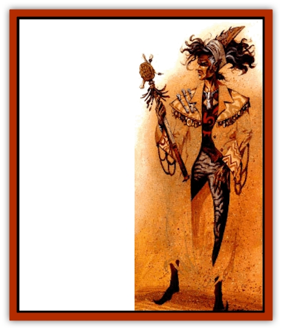

# Elf - Athas

| Statistic | **Elf (Athas)** |
| --- | --- |
| **Activity Cycle:** | Any |
| **Alignment:** | Chaotic neutral |
| **Armor Class:** | 6 (10) |
| **Climate/Terrain:** | Any land |
| **Damage/Attack:** | 1d2 or by weapon |
| **Diet:** | Omnivore |
| **Frequency:** | Common |
| **Hit Dice:** | 1+1 |
| **Intelligence:** | Average (8-10) |
| **Magic Resistance:** | Nil |
| **Morale:** | Steady (12-13) |
| **Movement:** | 12 |
| **No. Appearing:** | 3-30 (3d10) |
| **No. of Attacks:** | 1 |
| **Organization:** | Clan |
| **Size:** | M (7' tall) |
| **Special Attacks:** | Nil |
| **Special Defenses:** | Surprise |
| **THAC0:** | 19 |
| **Treasure:** | Varies |
| **XP Value:** | 35 / Hunting leaders: 65 / Raiding leaders: 420 / Psionicists: 650 / Clerics: 650 / Psionic leaders 975 / Chieftains: 2,000 |

The elves of Athas are perhaps the most prolific non-city-dwelling race of demihumans east of the Ringing Mountains. Though many of the tribes follow different customs, all elves hare one thing in common - a propensity for raiding and warfare.

The elves of Athas are lithe and tall, averaging 6½ to 7½ feet tall. They are extremely muscular despite their lean stature. However, the years of exposure have taken a toll on their frames, leading to a weaker Constitution. Sun-baked, wind-carved features dominate the chiseled elven faces. To survive the harsh elements of the deserts, elves are forced to clad themselves in dark, protective clothing. Often, elves will stitch clan symbols throughout their clothes, though never on outerwear, such as cloaks. These articles are painted or weaved to better camouflage the elf within the desert terrain. The elves consider such distinctive garb part of their elven culture, and are likely to continue wearing such attire even within the confines of weather-resistant shelters.

Many elves speak common, especially those who frequently deal with humans, but the elves do have their own language. This collection of short, usually monosyllabic words is fired off rapidly, making the language difficult for non-native speakers to grasp. As a result, elves find themselves forced to decrease their pace, which they find quite distasteful, when talking to outsiders. Because of this, elves to tend speak far less often to outsiders, an action that leads many to call the elves a bit aloof.

**Combat:** Elves have lightning reflexes, making them dangerous opponents in battle. Their agility makes them more difficult to attack and gives them fantastic accuracy with thrown and missile weapons. Athasian elves are filled with a ferocious savagery that makes them brutal combatants. Unarmed and outnumbered, cornered elves can still be fearsome enemies.

Elves are also exceptionally fleet of foot. They possess a natural swiftness that enables them to cross great distances in as little as half the time required for other demihumans near their size. This speed, referred to as the elf run, also appears in the short sprints of combat. The increase is based upon the elves. Dexterity, as follows (the bonus refers to the addition applied to the elves' movement rate each round):

|  |  |  |  |  |  |  |  |  |  |
| --- | --- | --- | --- | --- | --- | --- | --- | --- | --- |
| Dexterity | 12-13 | 14-15 | 16 | 17 | 18 | 19 | 20 | 21 | 22 |
| Bonus | +1 | +2 | +3 | +4 | +5 | +6 | +7 | +8 | +9 |

When hunting and fighting, elves prefer long, slender weapons such as long swords and pole weapons. There is an old elven legend that tells of a warrior who was able to strike his much stronger opponent three times before the other was even aware of his presence. The larger fighter was felled before he could successfully land a blow. Although more fiction than fact, the message is clear - quick and sharp wins the battle. This philosophy pervades all that makes up elven battle tactics, and no elf will select a cumbersome weapon with which to fight. Elves prefer bare hands over war hammers. Most elven weapons inflict 1-6 (1d6) points of damage, though the type of materials used in construction have some effect on the damage.

Another elven philosophy maintains that elves can only gain mastery with specific weapons, not just general weapon types. Elves take great pride in the weapons they wield, spending hours becoming familiar with them and practicing with them. In fact, when using a long sword or long bow crafted by a member of their native tribe, elves receive a +1 bonus to their attack roll. Other long swords and long bows, regardless if they are forged by elves in other tribes or by the finest smiths in Tyr, do not receive the bonus.

When in their natural terrain, the deserts and steppes of Athas, elves are especially hard to detect. Quite comfortable in their normal surrounding, elves are able to use their coloring, terrain knowledge, and physique to blend with the environment. Such abilities give the targets of an elven ambush a -4 to their surprise roll (except when ambushing other elves). Elves often take advantage of this knowledge, observing travelers for hours before springing an ambush. But these abilities do not work in reverse. Elves are surprised, even in their home territories, as easily as any other group.

When a war or hunting party is encountered (for example, groups of more than six), there is one hunting leader with 3 HD, THAC0 17, and AC 5 for every 10 elves. For every 15 elves, there is a raiding leader and a psionicist, both with 5 HD, THAC0 15, and AC 5. In their homeland, tribes of elves number from 50-200 elves. They also have psionicists and hunting and raiding leaders, as well as two clerics per 50 elves, each having 5 HD, THAC0 15, and AC 5. These is also a psionic leader with 7 HD, THAC0 13, and AC 4. In addition, the tribe has a chieftain, who has 10 HD, THAC0 11, AC 4, and clerical or psionic powers (50% chance for either).

Athasian elves do not have an innate resistance to *sleep* or *charm*-related spells and are forced to rely solely upon their saving throws against such attack forms. Athasian elves get their Armor Class from their shaped leather armor and their high Dexterity.

**Habitat/Society:** Elves share an intensely strong tribal unity that does not extend beyond tribal borders. Outlander elves are as much potential enemies as any other creature. With considerable effort, outsiders can gain acceptance by an individual or an entire tribe, but only through extensive service, sacrifice, and bravery. In much rarer instances, even such noble actions are not enough. Stories abound in taverns that tell of tribal leaders who mandate self-lnflicted wounds, such as dagger-drawn tattoos or hot-iron brands. The chance for this earned confidence does not increase because the newcomer is an elf.

Years of conditioning have instilled within the elves the ability to run quickly over sandy and rocky terrain. Elves have a higher resistance to heat and cold. They remain unaffected in temperatures as high as 110 degrees or as low as 32 degrees. (This applies only to naturally caused temperatures; magical changes still affect elves as they do other races.) Additionally, something in their metabolism permits elves to overcome weak Constitutions and inhibit the effects of fatigue. In fact, elves are able to add their Constitution scores directly to their normal and forced march rates of 24 and 30, respectively. Alone or with a war party, elves can traverse the landscape at a rate of 36 movement points per day (42 for a forced march). This speed, coupled with natural maneuverability, leads elves to disdain the use of beasts as transportation. Such clumsy animals would inhibit the elves' skill in moving across the land unseen. The elves' cross-country movement and 60-foot infravision make them a continual threat to those traveling in the wild between city-states.

Since they have spent most of their lives outdoors, Athasian elves do not receive a bonus to locate secret, concealed, or otherwise hidden doors. They do, however, have access to the communion or manifestation abilities described in *The Complete Book of Elves*.

Because of their shorter life spans on Athas, elves do require sleep.

**Ecology:** Most elves make a respectable living as herders, but a few choose the lucrative profession of merchant or the more dangerous raiding and thieving. The elf is well-equipped for either job because he is versatile at communication, is well-versed in a variety of landscapes, and is able to move much cargo across vast territories in a short time.

The elf's natural enemy is a [[Thri-kreen|thri-kreen]], who is likely to view the elf as a potential meal. An elf rarely lives past the age of 140.

**Half-Elves**

  Treading many of the same pathways, elves and humans cross company with each quite frequently. As such, it is natural to expect children born from a union between both races now and then. Called half-elves, they are a cross between both parents in build, but can usually pass for members of either race should the need arise.

It is difficult for half-elves to find acceptance within either parent's culture. Humans are far more tolerant of half-elves, though the few who are born within elven tribes are permitted to stay. Unlike [[Giant_Half-giant|half-giants]] and [[Mul|muls]], half-elves do not consider themselves a separate race, and therefore do not try to form half-elven communities. Most half-elves believe themselves to be outsiders, though. They tend to wander throughout their entire lives.

---
## Discovery & Documentation

**Source Publication:** Dark Sun Appendix II - Terrors Beyond Tyr (1991)
**Campaign Setting:** Dark Sun
**Author(s):** Jim Atkiss, Steve Brown, Timothy B. Brown, Andrew P. Morris, Bruce Nesmith, Wes Nicholson, Bill Slavicsek

### Other Creatures Found in This Source Book
   * [[Aarakocra_Athas|Aarakocra (Athas)]]
   * [[Animal_Domestic_Athas_II|Animal, Domestic (Athas) II]]
   * [[Aviarag|Aviarag]]
   * [[Baazrag|Baazrag]]
   * [[Baazrag_Boneclaw|Baazrag, Boneclaw]]
   * [[Bloodgrass|Bloodgrass]]
   * [[Cactus_Hunting|Cactus, Hunting]]
   * [[Cactus_Rock|Cactus, Rock]]
   * [[Cilops|Cilops]]
   * [[Crodlu|Crodlu]]
   * [[Dagorran|Dagorran]]
   * [[Dhaot|Dhaot]]
   * [[Drake_Lesser_Athas_General_Information|Drake, Lesser (Athas), General Information]]
   * [[Drake_Lesser_Athas_Magma|Drake, Lesser (Athas), Magma]]
   * [[Drake_Lesser_Athas_Rain|Drake, Lesser (Athas), Rain]]
   * [[Drake_Lesser_Athas_Silt|Drake, Lesser (Athas), Silt]]
   * [[Drake_Lesser_Athas_Sun|Drake, Lesser (Athas), Sun]]
   * [[Dray|Dray]]
   * [[Drik|Drik]]
   * [[Dune_Reaper|Dune Reaper]]
   * [[Dwarf_Athas|Dwarf (Athas)]]
   * [[Elemental_Beast_Athas_Air|Elemental Beast (Athas), Air]]
   * [[Elemental_Beast_Athas_Earth|Elemental Beast (Athas), Earth]]
   * [[Elemental_Beast_Athas_Fire|Elemental Beast (Athas), Fire]]
   * [[Elemental_Beast_Athas_Water|Elemental Beast (Athas), Water]]
   * [[Fael|Fael]]
   * [[Feylaar|Feylaar]]
   * [[Fordorran|Fordorran]]
   * [[Giant_Half-giant|Giant, Half-giant]]
   * [[Giant_Shadow|Giant, Shadow]]
   * [[Golem_Athas_Magma|Golem (Athas), Magma]]
   * [[Golem_Athas_Salt|Golem (Athas), Salt]]
   * [[Golem_Athas_General_Information|Golem (Athas), General Information]]
   * [[Gorak|Gorak]]
   * [[Halfling_Athas|Halfling (Athas)]]
   * [[Human_Athas|Human (Athas)]]
   * [[Jhakar|Jhakar]]
   * [[Kaisharga|Kaisharga]]
   * [[Kes'trekel|Kes'trekel]]
   * [[Klar|Klar]]
   * [[Krag|Krag]]
   * [[Kragling|Kragling]]
   * [[Lirr|Lirr]]
   * [[Mastyrial|Mastyrial]]
   * [[Meorty|Meorty]]
   * [[Mul|Mul]]
   * [[Nikaal|Nikaal]]
   * [[Paraelemental_Beast_General_Information|Paraelemental Beast, General Information]]
   * [[Paraelemental_Beast_Magma|Paraelemental Beast, Magma]]
   * [[Paraelemental_Beast_Rain|Paraelemental Beast, Rain]]
   * [[Paraelemental_Beast_Silt|Paraelemental Beast, Silt]]
   * [[Paraelemental_Beast_Sun|Paraelemental Beast, Sun]]
   * [[Pakubrazi|Pakubrazi]]
   * [[Psionocus|Psionocus]]
   * [[Psurlon|Psurlon]]
   * [[Raaig|Raaig]]
   * [[Retriever_Obsidian|Retriever, Obsidian]]
   * [[Ruktoi|Ruktoi]]
   * [[Ruvoka_Athas|Ruvoka (Athas)]]
   * [[Sand_Howler|Sand Howler]]
   * [[Scorpion_Athas|Scorpion (Athas)]]
   * [[Seed_Brain|Seed, Brain]]
   * [[Silt_Horror_Black|Silt Horror, Black]]
   * [[Silt_Horror_Magma|Silt Horror, Magma]]
   * [[Silt_Horror_Red|Silt Horror, Red]]
   * [[Silt_Spawn|Silt Spawn]]
   * [[Slig|Slig]]
   * [[Spider_Athas|Spider (Athas)]]
   * [[Spinewyrm|Spinewyrm]]
   * [[Ssurran|Ssurran]]
   * [[Stalking_Horror|Stalking Horror]]
   * [[Tarek|Tarek]]
   * [[Tari|Tari]]
   * [[Thri-kreen|Thri-kreen]]
   * [[T'liz|T'liz]]
   * [[Tohr-kreen_II|Tohr-kreen II]]
   * [[Tohr-kreen_III|Tohr-kreen III]]
   * [[Trin|Trin]]
   * [[Tul'k|Tul'k]]
   * [[Undead_Athas_General_Information|Undead (Athas), General Information]]
   * [[Wraith_Athas|Wraith (Athas)]]
   * [[Xerichou|Xerichou]]
   * [[Zombie_Thinking|Zombie, Thinking]]
