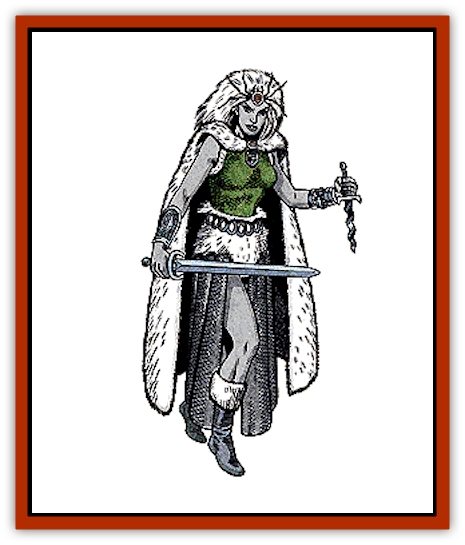

# Elf - Drow

| Statistic | **Drider** | **Drow** |
| --- | --- | --- |
| **Activity Cycle:** | Any underground, night above ground | Any underground, night above ground |
| **Alignment:** | Chaotic evil | Chaotic evil |
| **Armor Class:** | 3 | 4 (10) |
| **Climate/Terrain:** | Subterranean caves & cities | Subterranean caves & cities |
| **Damage/Attack:** | 1-4 or by weapon | By weapon |
| **Diet:** | See below | Omnivorous |
| **Frequency:** | Very rare | Very rare |
| **Hit Dice:** | 6+6 | 2 |
| **Intelligence:** | High (13-14) | High to Supra- (13-20) |
| **Magic Resistance:** | 15% | See below |
| **Morale:** | Elite (14) | Elite (14) |
| **Movement:** | 12 | 12 |
| **No. Appearing:** | 1 or 1-4 | 5-50 |
| **No. of Attacks:** | 1 | 1 or 2 |
| **Organization:** | Bands | Clans, bands |
| **Size:** | L (9' tall) | M (5' tall) |
| **Special Attacks:** | See below | See below |
| **Special Defenses:** | Nil | See below |
| **THAC0:** | 13 | 19 |
| **Treasure:** | N&times;2,Q | N&times;5,Q&times;2 |
| **XP Value:** | Transformed mages: 3,000 / Transformed priests: 5,000 | Priests: 975 / Others: 650 |

These dreaded, evil creatures were once part of the community of [[Elf|elves]] that still roam the world's forests. Now these dark elves inhabit black caves and winding tunnels under the earth, where they make dire plans against the races that still walk beneath the sun, on the surface of the green earth.

Drow have black skin and pale, usually white hair. They are shorter and more slender than humans, seldom reaching more than 5 feet in height. Male drow weigh between 80 and 110 pounds, and female between 95 and 120 pounds. Drow have finely chiseled features, and their fingers and toes are long and delicate. Like all elves, they have higher Dexterity and lower Constitution than men.

Drow clothing is usually black, functional, and often possesses special properties, although it does not radiate magic. For example, drow cloaks and boots act as if they are cloaks of and boots of elvenkind, except that the wearer is only 75% likely to remain undetected in shadows or to surprise enemies. The material used to make drow cloaks does not cut easily and is fire resistant, giving the cloaks a +6 bonus to saving throws vs. fire. These cloaks and boots fit and function only for those of elven size and build. Any attempt to alter a drow cloak has a 75% chance of unraveling the material, making it useless.

In the centuries they've spent underground, drow have learned the languages of many of the intelligent creatures of the underworld. Besides their own tongue, an exotic variant of elvish, drow speak both common and the subterranean trade language used by many races under the earth. They speak the languages of gnomes and other elves fluently.

Drow also have their own silent language composed of both signed hand movements and body language. These signs can convey information, but not subtle meaning or emotional content. If within 30 feet of another drow, they can also use complex facial expressions, body movements, and postures to convey meaning. Coupled with their hand signs, these expressions and gestures give the drow's silent language a potential for expression equal to most spoken languages.

**Combat:** The drow's world is one in which violent conflict is part of everyday life. It should not be surprising then, that most drow encountered, whether alone or in a group, are ready to fight. Drow encountered outside of a drow city are at least 2nd-level fighters. (See Society note below.)

Drow wear finely crafted, non-encumbering, black mesh armor. This extremely strong mail is made with a special alloy of steel containing adamantite. The special alloy, when worked by a drow armorer, yields mail that has the same properties of chain mail +1 to +5, although it does not radiate magic. Even the lowliest drow fighters have, in effect, chain mail +1, while higher level drow have more finely crafted, more powerful, mail. (The armor usually has a +1 for every four levels of experience of the drow wearing it.)

Dark elves also carry small shields (bucklers) fashioned of adamantite. Like drow armor, these special shields may be +1,+2, or even +3, though only the most important drow fighters have +3 bucklers.

Most drow carry a long dagger and a short sword of adamantite alloy. These daggers and swords can have a +1 to +3 bonus, and drow nobles may have daggers and swords of +4 bonus. Some drow (50%) also carry small crossbows that can be held in one hand and will shoot darts up to 60 yards. The darts only inflict 1-3 points of damage, but dark elves commonly coat them with poison that renders a victim unconscious, unless he rolls a successful saving throw vs. poison, with a -4 penalty. The effects last 2d4 hours.

A few drow carry adamantite maces (+1 to +5 bonus) instead of blades. Others carry small javelins coated with the same poison as the darts. They have a range of 90 yards with a short range bonus of +3, a +2 at medium, and a +1 at long.

Drow move silently and have superior infravision (120 feet). They also have the same intuitive sense about their underground world as dwarves do, and can detect secret doors with the same chance of success as other elves. A dark elf can only be surprised by an opponent on a roll of 1 on 1d10.

All dark elves receive training in magic, and are able to use the following spells once per day: *dancing lights*, *faerie fire*, and *darkness*. Drow above 4th level can use *levitate*, *know alignment*, and *detect magic* once per day. Drow priests can also use *detect lie*, *clairvoyance*, *suggestion*, and *dispel magic* once per day. (See also Wizard Spells, *Player's Handbook*)

Perhaps it is the common use of magic in drow society that has given the dark elves their incredible resistance. Drow have a base resistance to magic of 50%, which increases by 2% for each level of experience. (Multi-classed drow gain the bonus from only the class in which they have the highest level.) All dark elves save vs. all forms of magical attack (including devices) with a +2 bonus. Thus, a 5th-level drow has a 60% base magic resistance and a +2 bonus to her saving throws vs. spells that get past her magic resistance.

Drow encountered in a group always have a leader of a higher level than the rest of the party. If 10 or more drow are encountered, a fighter/mage of at least 3rd level in each class is leading them. If 20 drow are encountered, then, in addition to the higher level fighter/mage, there is a fighter/priest of at least the 6th level in both classes. If there are more than 30, up to 50% are priests and the leader is at least a 7th-level fighter/8th-level priest, with a 5th-level fighter/4th-level mage for an assistant, in addition to the other high level leaders.

Dark elves do have one great weakness - bright light. Because the drow have lived so long in the earth, rarely venturing to the surface, they are no longer able to tolerate bright light of any kind. Drow within the radius of a *light* or *continual light* spell are 90% likely to be seen. In addition, they lose 2 points from their Dexterity and attack with a -2 penalty inside the area of these spells. Characters subject to spells cast by drow affected by a *light* or *continual light* spell add a +2 bonus to their saving throws. If drow are attacking a target that is in the area of effect of a light or continual light spell, they suffer an additional -1 penalty to their attack rolls, and targets of drow magical attacks save at an additional +1. These penalties are cumulative (i.e., if both the drow and their targets are in the area of effect of a light spell, the drow suffer a -3 penalty to their attack rolls and the targets gain a +3).

Because of the serious negative effects of strong light on the drow, they are 75% likely to leave an area of bright light, unless they are in battle. Light sources like torches, lanterns, magical weapons, or *faerie fire* spells, do not affect drow.

**Habitat/Society:** Long ago, dark elves were part of the elven race that roamed the world's forests. Not long after they were created, though, the elves found themselves torn into rival factions - one following the tenets of evil, the other owning the ideals of good (or at least neutrality). A great civil war between the elves followed, and the selfish elves who followed the paths of evil and chaos were driven into the depths of the earth, into the bleak, lightless caverns and deep tunnels of the underworld. These dark elves became the drow.

The drow no longer wish to live upon the surface of the earth. In fact, few who live on the surface ever see a drow. But the dark elves resent the elves and faeries who drove them away, and scheme against those that dwell in the sunlight.

Drow live in magnificently dark, gloomy cities in the underworld that few humans or demihumans ever see. They construct their buildings entirely out of stone and minerals, carved into weird, fantastic shapes. Those few surface creatures that have seen a dark elf city (and returned to tell the tale) report that it is the stuff of which nightmares are made.

Drow society is fragmented into many opposing noble houses and merchant families, all scrambling for power. In fact, all drow carry brooches inscribed with the symbol of the merchant or noble group they are allied with, though they hide these and do not show them often. The drow believe that the strongest should rule; their rigid class system, with a long and complicated list of titles and prerogatives, is based on the idea.

They worship a dark goddess, called Lolth by some, and her priestesses hold very high places in society. Since most drow priests are female, women tend to fill nearly all positions of great importance.

Drow fighters go through rigorous training while they are young. Those who fail the required tests are killed at the program's conclusion. That is why dark elf fighters of less than 2nd level are rarely seen outside a drow city.

Drow often use [[Lizard|giant lizards]] as pack animals, and frequently take [[Bugbear|bugbears]] or [[Troglodyte|troglodytes]] as servants. Drow cities are havens for evil beings, including [[Mind_Flayer|mind flayers]], and drow are allied with many of the underworld's evil inhabitants. On the other hand, they are constantly at war with many of their neighbors beneath the earth, including dwarves or [[Gnome|dark gnomes]] (svirfneblin) who settle to close to a drow city. Dark elves frequently keep slaves of all types, including past allies who have failed to live up to drow expectations.

**Ecology:** The drow produce unusual weapons and clothing with quasi-magical properties. Some scribes and researchers suggest that it is the strange radiation around drow cities that make drow crafts special. Others theorize that fine workmanship gives their wonderfully strong metals and superior cloth its unique attributes. Whatever the reason, it's clear that the drow have discovered some way to make their clothing and weapons without the use of magic.

Direct sunlight utterly destroys drow cloth, boots, weapons, and armor. When any item produced by them is exposed to the light of the sun, irreversible decay begins. Within 2d6 days, the items lose their magical properties and rot, becoming totally worthless. Drow artifacts, protected from sunlight, retain their special properties for 1d20+30 days before becoming normal items. If a drow item is protected from direct sunlight and exposed to the radiations of the drow underworld for one week out of every four, it will retain its properties indefinitely.

Drow sleep poison, used on their darts and javelins, is highly prized by traders on the surface. However, this poison loses its potency instantly when exposed to sunlight, and remains effective for only 60 days after it is exposed to air. Drow poison remains potent for a year if kept in an unopened packet.

**Driders**

  These strange creatures have the head and torso of a drow and the legs and lower body of a giant spider. Driders are created by the drow's dark goddess. When a dark elf of above-average ability reaches 6th level, the goddess may put him or her through a special test. Failures become driders.

Driders are able to cast all spells a normal drow can use once per day. They also retain any magical or clerical skills they had before transformation. A majority of driders (60%) were priests of 6th or 7th level before they were changed, all other driders were mages of 6th, 7th, or 8th level.

Driders always fight as 7 Hit Die monsters. They often use swords or axes, though many carry bows. Driders can bite for 1d4 points of damage, and those bitten must save vs. poison with a -2 penalty or be paralyzed for 1-2 turns.

Because they have failed their goddess's test, driders are outcasts from their own communities. Driders are usually found alone or with 2d6 huge spiders (10% chance), rather than with drow or other driders. They are violent, aggressive creatures that favor blood over all types of food. They stalk their victims tirelessly, waiting for the right chance to strike.

---
## Discovery & Documentation

**Source Publication:** Monstrous Manual (1995)
**Campaign Setting:** Advanced Dungeons & Dragons 2nd Edition
**Author(s):** Tim Beach

### Other Creatures Found in This Source Book
   * [[Aarakocra|Aarakocra]]
   * [[Aboleth|Aboleth]]
   * [[Ankheg|Ankheg]]
   * [[Arcane|Arcane]]
   * [[Argos|Argos]]
   * [[Aurumvorax|Aurumvorax]]
   * [[Baatezu_Lesser_Abishai|Baatezu, Lesser, Abishai]]
   * [[Baatezu_General_Information|Baatezu, General Information]]
   * [[Baatezu_Greater_Pit_Fiend|Baatezu, Greater, Pit Fiend]]
   * [[Banshee|Banshee]]
   * [[Basilisk|Basilisk]]
   * [[Bat|Bat]]
   * [[Bear|Bear]]
   * [[Beetle_Giant|Beetle, Giant]]
   * [[Behir|Behir]]
   * [[Beholder_and_Beholder-kin_I|Beholder and Beholder-kin I]]
   * [[Beholder_and_Beholder-kin_II|Beholder and Beholder-kin II]]
   * [[Bird|Bird]]
   * [[Brain_Mole|Brain Mole]]
   * [[Broken_One|Broken One]]
   * [[Brownie|Brownie]]
   * [[Bugbear|Bugbear]]
   * [[Bulette|Bulette]]
   * [[Bullywug|Bullywug]]
   * [[Carrion_Crawler|Carrion Crawler]]
   * [[Cat_Great|Cat, Great]]
   * [[Catoblepas|Catoblepas]]
   * [[Cat_Small|Cat, Small]]
   * [[Cave_Fisher|Cave Fisher]]
   * [[Centaur|Centaur]]
   * [[Centipede|Centipede]]
   * [[Chimera|Chimera]]
   * [[Cloaker|Cloaker]]
   * [[Cockatrice|Cockatrice]]
   * [[Couatl|Couatl]]
   * [[Crabman|Crabman]]
   * [[Crawling_Claw|Crawling Claw]]
   * [[Crocodile|Crocodile]]
   * [[Crustacean_Giant|Crustacean, Giant]]
   * [[Crypt_Thing|Crypt Thing]]
   * [[Death_Knight|Death Knight]]
   * [[Deepspawn|Deepspawn]]
   * [[Dinosaur_I|Dinosaur I]]
   * [[Displacer_Beast|Displacer Beast]]
   * [[Dog|Dog]]
   * [[Dog_Moon|Dog, Moon]]
   * [[Dolphin|Dolphin]]
   * [[Doppelganger|Doppelganger]]
   * [[Dracolich|Dracolich]]
   * [[Dragon_Brown|Dragon, Brown]]
   * [[Dragon_Chromatic_Black|Dragon, Chromatic, Black]]
   * [[Dragon_Chromatic_Blue|Dragon, Chromatic, Blue]]
   * [[Dragon_Chromatic_Green|Dragon, Chromatic, Green]]
   * [[Dragon_Cloud|Dragon, Cloud]]
   * [[Dragon_Chromatic_Red|Dragon, Chromatic, Red]]
   * [[Dragon_Chromatic_White|Dragon, Chromatic, White]]
   * [[Dragon_Deep|Dragon, Deep]]
   * [[Dragon_Gem_Amethyst|Dragon, Gem, Amethyst]]
   * [[Dragon_Gem_Crystal|Dragon, Gem, Crystal]]
   * [[Dragon_Gem_Emerald|Dragon, Gem, Emerald]]
   * [[Dragon_Gem_Sapphire|Dragon, Gem, Sapphire]]
   * [[Dragon_Gem_Topaz|Dragon, Gem, Topaz]]
   * [[Dragon_Metallic_Brass|Dragon, Metallic, Brass]]
   * [[Dragon_Metallic_Bronze|Dragon, Metallic, Bronze]]
   * [[Dragon_Metallic_Copper|Dragon, Metallic, Copper]]
   * [[Dragon_Mercury|Dragon, Mercury]]
   * [[Dragon_Metallic_Gold|Dragon, Metallic, Gold]]
   * [[Dragon_Mist|Dragon, Mist]]
   * [[Dragon_Metallic_Silver|Dragon, Metallic, Silver]]
   * [[Dragon_General_Information|Dragon, General Information]]
   * [[Dragon_Shadow|Dragon, Shadow]]
   * [[Dragon_Steel|Dragon, Steel]]
   * [[Dragon_Yellow|Dragon, Yellow]]
   * [[Dragonne|Dragonne]]
   * [[Dragon_Turtle|Dragon Turtle]]
   * [[Dragonet_Faerie_Dragon|Dragonet, Faerie Dragon]]
   * [[Dragonet_Fire_Drake|Dragonet, Fire Drake]]
   * [[Dragonet_Pseudodragon|Dragonet, Pseudodragon]]
   * [[Dryad|Dryad]]
   * [[Dwarf_Derro|Dwarf, Derro]]
   * [[Dwarf|Dwarf]]
   * [[Elemental_Athas_General_Information|Elemental (Athas), General Information]]
   * [[Elemental_Air_Kin|Elemental, Air Kin]]
   * [[Elemental_Earth_Kin|Elemental, Earth Kin]]
   * [[Elemental_Fire_Kin|Elemental, Fire Kin]]
   * [[Elemental_Water_Kin|Elemental, Water Kin]]
   * [[Elemental_of_Chaos_Air_Earth|Elemental of Chaos, Air/Earth]]
   * [[Elemental_of_Chaos_Fire_Water|Elemental of Chaos, Fire/Water]]
   * [[Elemental_Composite|Elemental, Composite]]
   * [[Elemental_Air_Earth|Elemental, Air/Earth]]
   * [[Elemental_Fire_Water|Elemental, Fire/Water]]
   * [[Elemental_General_Information|Elemental, General Information]]
   * [[Elephant|Elephant]]
   * [[Elf|Elf]]
   * [[Elf_Aquatic|Elf, Aquatic]]
   * [[Ettercap|Ettercap]]
   * [[Eyewing|Eyewing]]
   * [[Feyr|Feyr]]
   * [[Fish|Fish]]
   * [[Frog|Frog]]
   * [[Fungus|Fungus]]
   * [[Galeb_Duhr|Galeb Duhr]]
   * [[Gargantua|Gargantua]]
   * [[Gargoyle_I|Gargoyle I]]
   * [[Genie|Genie]]
   * [[Ghost|Ghost]]
   * [[Ghoul|Ghoul]]
   * [[Giant_Cloud|Giant, Cloud]]
   * [[Giant_Cyclops|Giant, Cyclops]]
   * [[Giant_Desert|Giant, Desert]]
   * [[Giant_Ettin|Giant, Ettin]]
   * [[Giant_Firbolg|Giant, Firbolg]]
   * [[Giant_Fire|Giant, Fire]]
   * [[Giant_Fog|Giant, Fog]]
   * [[Giant_Fomorian|Giant, Fomorian]]
   * [[Giant_Frost|Giant, Frost]]
   * [[Giant_Hill|Giant, Hill]]
   * [[Giant_Jungle|Giant, Jungle]]
   * [[Giant_Mountain|Giant, Mountain]]
   * [[Giant_Reef|Giant, Reef]]
   * [[Giant_Stone|Giant, Stone]]
   * [[Giant_Storm|Giant, Storm]]
   * [[Giant_Verbeeg|Giant, Verbeeg]]
   * [[Giant_Wood|Giant, Wood]]
   * [[Gibberling|Gibberling]]
   * [[Giff|Giff]]
   * [[Gith|Gith]]
   * [[Gith_Pirate_of|Gith, Pirate of]]
   * [[Githyanki|Githyanki]]
   * [[Githzerai|Githzerai]]
   * [[Gloomwing|Gloomwing]]
   * [[Gnoll|Gnoll]]
   * [[Gnome|Gnome]]
   * [[Gnome_Spriggan|Gnome, Spriggan]]
   * [[Goblin|Goblin]]
   * [[Golem_General_Information|Golem, General Information]]
   * [[Golem_I_Greater_Golem|Golem I (Greater Golem)]]
   * [[Golem_II_Lesser_Golem|Golem II (Lesser Golem)]]
   * [[Golem_III|Golem III]]
   * [[Golem_IV|Golem IV]]
   * [[Golem_V|Golem V]]
   * [[Golem_VI_Stone_Variants|Golem VI (Stone Variants)]]
   * [[Gorgon|Gorgon]]
   * [[Grell_Colonial|Grell, Colonial]]
   * [[Gremlin_Jermlaine|Gremlin, Jermlaine]]
   * [[Gremlin|Gremlin]]
   * [[Griffon|Griffon]]
   * [[Grimlock|Grimlock]]
   * [[Grippli|Grippli]]
   * [[Hag|Hag]]
   * [[Halfling|Halfling]]
   * [[Harpy|Harpy]]
   * [[Hatori|Hatori]]
   * [[Haunt|Haunt]]
   * [[Hell_Hound|Hell Hound]]
   * [[Heucuva|Heucuva]]
   * [[Hippocampus|Hippocampus]]
   * [[Hippogriff|Hippogriff]]
   * [[Hobgoblin|Hobgoblin]]
   * [[Homunculus|Homunculus]]
   * [[Hook_Horror|Hook Horror]]
   * [[Horse|Horse]]
   * [[Human|Human]]
   * [[Hydra|Hydra]]
   * [[Imp|Imp]]
   * [[Insect_Giant|Insect, Giant]]
   * [[Insect_Swarm|Insect Swarm]]
   * [[Intellect_Devourer|Intellect Devourer]]
   * [[Invisible_Stalker|Invisible Stalker]]
   * [[Ixitxachitl|Ixitxachitl]]
   * [[Jackalwere|Jackalwere]]
   * [[Kenku|Kenku]]
   * [[Ki-rin|Ki-rin]]
   * [[Kirre|Kirre]]
   * [[Kobold|Kobold]]
   * [[Kuo-Toa|Kuo-Toa]]
   * [[Lamia|Lamia]]
   * [[Lammasu|Lammasu]]
   * [[Leech|Leech]]
   * [[Leprechaun|Leprechaun]]
   * [[Leucrotta|Leucrotta]]
   * [[Lich|Lich]]
   * [[Living_Wall|Living Wall]]
   * [[Lizard|Lizard]]
   * [[Lizard_Man|Lizard Man]]
   * [[Locathah|Locathah]]
   * [[Lurker|Lurker]]
   * [[Lycanthrope_General_Information|Lycanthrope, General Information]]
   * [[Lycanthrope_Seawolf|Lycanthrope, Seawolf]]
   * [[Lycanthrope_Werebear|Lycanthrope, Werebear]]
   * [[Lycanthrope_Wereboar|Lycanthrope, Wereboar]]
   * [[Lycanthrope_Werebat|Lycanthrope, Werebat]]
   * [[Lycanthrope_Werefox|Lycanthrope, Werefox]]
   * [[Lycanthrope_Wererat|Lycanthrope, Wererat]]
   * [[Lycanthrope_Wereraven|Lycanthrope, Wereraven]]
   * [[Lycanthrope_Weretiger|Lycanthrope, Weretiger]]
   * [[Lycanthrope_Werewolf|Lycanthrope, Werewolf]]
   * [[Mammal|Mammal]]
   * [[Mammal_Giant|Mammal, Giant]]
   * [[Mammal_Herd_I|Mammal, Herd I]]
   * [[Mammal_Small|Mammal, Small]]
   * [[Manscorpion|Manscorpion]]
   * [[Manticore|Manticore]]
   * [[Medusa_Maedar|Medusa, Maedar]]
   * [[Medusa|Medusa]]
   * [[Mephit_General_Information|Mephit, General Information]]
   * [[Merman|Merman]]
   * [[Mimic|Mimic]]
   * [[Mind_Flayer|Mind Flayer]]
   * [[Minotaur|Minotaur]]
   * [[Mist_Crimson_Death|Mist, Crimson Death]]
   * [[Mist_Vampiric|Mist, Vampiric]]
   * [[Mold_I|Mold I]]
   * [[Moldman|Moldman]]
   * [[Mongrelman|Mongrelman]]
   * [[Morkoth|Morkoth]]
   * [[Muckdweller|Muckdweller]]
   * [[Mudman|Mudman]]
   * [[Mummy_Greater|Mummy, Greater]]
   * [[Mummy|Mummy]]
   * [[Myconid|Myconid]]
   * [[Naga|Naga]]
   * [[Naga_Dark|Naga, Dark]]
   * [[Neogi|Neogi]]
   * [[Nightmare|Nightmare]]
   * [[Nymph|Nymph]]
   * [[Octopus_Giant|Octopus, Giant]]
   * [[Ogre|Ogre]]
   * [[Ogre_Half-|Ogre, Half-]]
   * [[Ooze_Slime_Jelly_I|Ooze/Slime/Jelly I]]
   * [[Ooze_Slime_Jelly_II|Ooze/Slime/Jelly II]]
   * [[Ooze_Slime_Jelly_Slithering_Tracker|Ooze/Slime/Jelly, Slithering Tracker]]
   * [[Orc|Orc]]
   * [[Otyugh|Otyugh]]
   * [[Owlbear_I|Owlbear I]]
   * [[Pegasus|Pegasus]]
   * [[Peryton|Peryton]]
   * [[Phantom|Phantom]]
   * [[Phoenix|Phoenix]]
   * [[Piercer|Piercer]]
   * [[Plant_Dangerous_I|Plant, Dangerous I]]
   * [[Plant_Intelligent|Plant, Intelligent]]
   * [[Poltergeist|Poltergeist]]
   * [[Pudding_Deadly|Pudding, Deadly]]
   * [[Quaggoth|Quaggoth]]
   * [[Rakshasa|Rakshasa]]
   * [[Rat|Rat]]
   * [[Rat_Osquip|Rat, Osquip]]
   * [[Remorhaz|Remorhaz]]
   * [[Revenant|Revenant]]
   * [[Roc|Roc]]
   * [[Roper|Roper]]
   * [[Rust_Monster|Rust Monster]]
   * [[Sahuagin|Sahuagin]]
   * [[Satyr|Satyr]]
   * [[Scorpion|Scorpion]]
   * [[Sea_Lion|Sea Lion]]
   * [[Selkie|Selkie]]
   * [[Shadow|Shadow]]
   * [[Shedu|Shedu]]
   * [[Sirine|Sirine]]
   * [[Skeleton|Skeleton]]
   * [[Skeleton_Giant|Skeleton, Giant]]
   * [[Skeleton_Warrior|Skeleton, Warrior]]
   * [[Slaad|Slaad]]
   * [[Slug_Giant|Slug, Giant]]
   * [[Snake|Snake]]
   * [[Snake_Winged|Snake, Winged]]
   * [[Spectre|Spectre]]
   * [[Sphinx|Sphinx]]
   * [[Spider|Spider]]
   * [[Sprite|Sprite]]
   * [[Squid_Giant|Squid, Giant]]
   * [[Stirge|Stirge]]
   * [[Su-Monster|Su-Monster]]
   * [[Swanmay|Swanmay]]
   * [[Tabaxi|Tabaxi]]
   * [[Tako|Tako]]
   * [[Tanar'ri_True_Balor|Tanar'ri, True, Balor]]
   * [[Tanar'ri_True_Marilith|Tanar'ri, True, Marilith]]
   * [[Tarrasque|Tarrasque]]
   * [[Tasloi|Tasloi]]
   * [[Thought_Eater|Thought Eater]]
   * [[Thri-kreen|Thri-kreen]]
   * [[Titan|Titan]]
   * [[Toad_Giant|Toad, Giant]]
   * [[Treant|Treant]]
   * [[Triton|Triton]]
   * [[Troglodyte|Troglodyte]]
   * [[Troll|Troll]]
   * [[Umber_Hulk|Umber Hulk]]
   * [[Unicorn|Unicorn]]
   * [[Urchin|Urchin]]
   * [[Vampire|Vampire]]
   * [[Wemic|Wemic]]
   * [[Whale|Whale]]
   * [[Wight|Wight]]
   * [[Will_O'Wisp|Will O'Wisp]]
   * [[Wolf|Wolf]]
   * [[Wolfwere|Wolfwere]]
   * [[Worm|Worm]]
   * [[Wraith|Wraith]]
   * [[Wyvern|Wyvern]]
   * [[Xorn|Xorn]]
   * [[Yeti|Yeti]]
   * [[Yuan-ti_Histachii|Yuan-ti, Histachii]]
   * [[Yuan-ti|Yuan-ti]]
   * [[Yugoloth_Guardian|Yugoloth, Guardian]]
   * [[Zaratan|Zaratan]]
   * [[Zombie|Zombie]]
