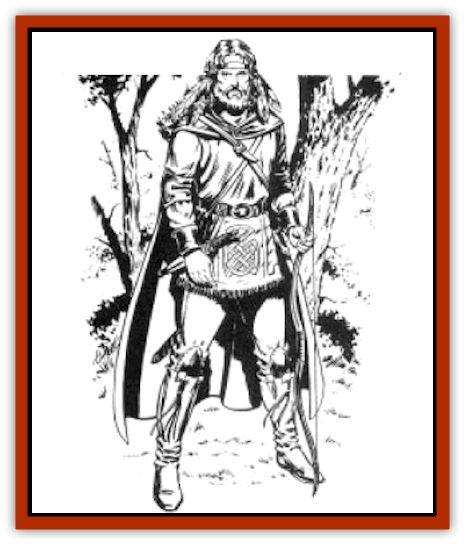

# Elf - Half

| Statistic | **Elf, Half-** |
| --- | --- |
| **Activity Cycle:** | Any |
| **Alignment:** | Varies, but usually lawful or neutral good |
| **Armor Class:** | 5 (10) |
| **Climate/Terrain:** | Tropical, subtropical and temperate/Forests and plains |
| **Damage/Attack:** | 1-10 (weapon) |
| **Diet:** | Omnivore |
| **Frequency:** | Very rare |
| **Hit Dice:** | 1+1 |
| **Intelligence:** | Varies (4-18) |
| **Magic Resistance:** | See below |
| **Morale:** | Elite (13) |
| **Movement:** | 9 (12) |
| **No. Appearing:** | 1 |
| **No. of Attacks:** | 1 |
| **Organization:** | Solitary |
| **Size:** | M (5-6' tall) |
| **Special Attacks:** | See below |
| **Special Defenses:** | See below |
| **THAC0:** | 19 (18) |
| **Treasure:** | K,V&times;½ |
| **XP Value:** | Varies |

Half-elves are the offspring of human and elven parents.

Half-elves strongly resemble their elven parent, but unlike the elven races, males have facial hair. They are slightly taller and somewhat stockier than most elves.

Since most are raised in an atmosphere of shame, half-elves are insecure and unsure of themselves. In extreme instances, this insecurity manifests itself in rebellious or anti-social behavior. Others are trusting of strangers, yet lack the openness necessary to establish true and lasting friendship. Many are natural leaders, but few feel worthy of a leader's responsibility Regardless of their disposition, all half-elves are loners - brooding, quiet, and struggling with self-doubt.

**Combat:** Half.elves are excellent fighters with no obvious tears. If there is a flaw in their fighting style, it iS their tendency to perform life-threatening acts of bravado. A half-elf often challenges the most formidable opponent in a group of attackers or volunteers for the most dangerous missions.

Half-elves particularly excel at melee attacks; magic-using half-elves usually reserve their spells for emergencies or to assist their companions. Long swords are their favorite weapons, but they also frequently use daggers and long bows. They wear a variety of armor, preferring chain mail when it is avariable. Unlike other elven races, half-elves can be skilled horsemen.

**Habitat/Society:** Because elves and humans are often attracted to each other, intermarriage is all but inevitable. No elven race, however, sanctions such marriages, forcing elven and human lovers into discreet relationships.

Reaction to half-elves from other races varies. The race-conscious [[Elf_High_Silvanesti|Silvanesti]], for instance, are particularly revolted by interracial marriages. [[Elf_High_Qualinesti|Qualinesti]] are more compassionate toward half-elves, treating them coldly but allowing them a place in their societies. However, half-elves seldom rise to positions of trust or responsibility in a Qualinesti community. [[Elf_Wild_Kagonesti|Kagonesti]] respect half-elves as they would any creature of nature, but they are never accepted as full members of a tribe.

Humans have a mixed reaction to half-elves. Years ago, half-elves in human society were considered a great blessing and brought honor to a human household, but this attitude has diminished considerably with the passage of time. Humans now view half-elves as a strange and vaguely inferior race.

There is no society or community that consists solely of half-elves. Though some halt-elves learn trades or crafts most drift from place to place

**Ecology:** Half-elves feel kinship with no race, although they occasionally find lasting friendship with humans and [[Dwarf_Hill_Neidar|Neidar]]. They prefer simple foods, but have no particular preferences.

---
## Discovery & Documentation

**Source Publication:** MC4 Dragonlance Appendix (w/binder #2) (1989)
**Campaign Setting:** Dragonlance
**Author(s):** Rick Swan

### Other Creatures Found in This Source Book
   * [[Anemone_Giant_Sea|Anemone, Giant Sea]]
   * [[Bear_Ice|Bear, Ice]]
   * [[Beast_Undead|Beast, Undead]]
   * [[Bird_Krynn|Bird (Krynn)]]
   * [[Disir|Disir]]
   * [[Draconian_Aurak|Draconian, Aurak]]
   * [[Draconian_Baaz|Draconian, Baaz]]
   * [[Draconian_Bozak|Draconian, Bozak]]
   * [[Draconian_Kapak|Draconian, Kapak]]
   * [[Draconian_General_Information|Draconian, General Information]]
   * [[Draconian_Sivak|Draconian, Sivak]]
   * [[Draconian_Proto-_Traag|Draconian, Proto-, Traag]]
   * [[Dragon_Amphi|Dragon, Amphi]]
   * [[Dragon_Astral|Dragon, Astral]]
   * [[Dragon_Kodragon|Dragon, Kodragon]]
   * [[Dragon_Krynn_Othlorx_General_Information|Dragon (Krynn), Othlorx, General Information]]
   * [[Dragon_Krynn_General_Information|Dragon (Krynn), General Information]]
   * [[Dragon_Sea|Dragon, Sea]]
   * [[Dreamshadow|Dreamshadow]]
   * [[Dreamwraith|Dreamwraith]]
   * [[Dwarf_Daergar|Dwarf, Daergar]]
   * [[Dwarf_Hill_Neidar|Dwarf, Hill, Neidar]]
   * [[Dwarf_Mountain_Hylar|Dwarf, Mountain, Hylar]]
   * [[Dwarf_Theiwar|Dwarf, Theiwar]]
   * [[Dwarf_Zakhar|Dwarf, Zakhar]]
   * [[Elf_High_Qualinesti|Elf, High, Qualinesti]]
   * [[Elf_High_Silvanesti|Elf, High, Silvanesti]]
   * [[Elf_Sea_Dargonesti|Elf, Sea, Dargonesti]]
   * [[Elf_Sea_Dimernesti|Elf, Sea, Dimernesti]]
   * [[Elf_Wild_Kagonesti|Elf, Wild, Kagonesti]]
   * [[Eyewing|Eyewing]]
   * [[Fetch|Fetch]]
   * [[Fire_Minion|Fire Minion]]
   * [[Fireshadow|Fireshadow]]
   * [[Gnome_Tinker|Gnome, Tinker]]
   * [[Gurik_Cha'ahl|Gurik Cha'ahl]]
   * [[Haunt_Knight|Haunt, Knight]]
   * [[Horax|Horax]]
   * [[Human_Krynn|Human (Krynn)]]
   * [[Imp_Blood_Sea|Imp, Blood Sea]]
   * [[Kalothagh|Kalothagh]]
   * [[Kani_Doll|Kani Doll]]
   * [[Kender|Kender]]
   * [[Kyrie|Kyrie]]
   * [[Lizard_Man_Krynn|Lizard Man (Krynn)]]
   * [[Minotaur_Krynn|Minotaur, Krynn]]
   * [[Ogre_High|Ogre, High]]
   * [[Ogre_Krynn|Ogre (Krynn)]]
   * [[Phaethon|Phaethon]]
   * [[Saqualaminoi|Saqualaminoi]]
   * [[Shadowperson|Shadowperson]]
   * [[Shimmerweed|Shimmerweed]]
   * [[Skrit|Skrit]]
   * [[Spectral_Minion|Spectral Minion]]
   * [[Spider_Krynn|Spider (Krynn)]]
   * [[Stag|Stag]]
   * [[Tayling|Tayling]]
   * [[Thanoi|Thanoi]]
   * [[Tylor|Tylor]]
   * [[Wichtlin|Wichtlin]]
   * [[Wyndlass|Wyndlass]]
   * [[Yaggol|Yaggol]]
