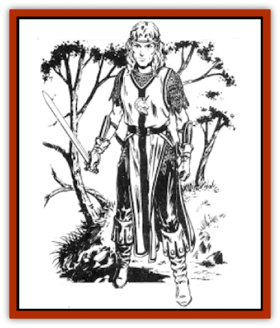

# Elf - High - Qualinesti

| Statistic | **Elf, High, Qualinesti** |
| --- | --- |
| **Activity Cycle:** | Any |
| **Alignment:** | Varies, but usually lawful or neutral good |
| **Armor Class:** | 5 (10) |
| **Climate/Terrain:** | Temperate/Forest |
| **Damage/Attack:** | 1-10 (weapon) |
| **Diet:** | Omnivore |
| **Frequency:** | Uncommon |
| **Hit Dice:** | 1+1 |
| **Intelligence:** | Varies (8-18) |
| **Magic Resistance:** | See below |
| **Morale:** | Elite (13) |
| **Movement:** | 12 |
| **No. Appearing:** | 10-100 |
| **No. of Attacks:** | 1 |
| **Organization:** | Clan |
| **Size:** | M (5' tall) |
| **Special Attacks:** | See below |
| **Special Defenses:** | See below |
| **THAC0:** | 19 (18) |
| **Treasure:** | M; (E,S&times;½,T) |
| **XP Value:** | Varies |

The Qualinesti, also known as the Western [[Elf|Elves]], are exiles from the [[Elf_High_Silvanesti|Silvanesti]] High Elves.

Qualinesti are smaller and darker than the Silvanesti, with eyes of blue or brown and hair ranging from honey-brown to blonde. They art nor as strikingly attractive as the Silvanesti. They prefer earth-toned clothing They have strong, pleasant voices and a friendly, open manner.

Qualinesti are more sociable than the Silvanesti. However, they share the Silvanesti's prejudice toward other races and are intolerant of interracial marriages.

**Combat:** Qualinesti are more aggressive than Silvanesti but not as tactically sophisticated. Still, opponents who underestimate them soon learn that Qualinesti are courageous, and confident combatants. Long swords, bows, and spears are among their preferred weapons. They usually wear chain mail or scale mail and often carry shields.

**Habitat/Society:** Qualinesti originally occupied the western regions of the Silvanesti kingdom. They left to form their own communities following a disagreement with their cousins' policy of strict caste systems. Though the Qualinesti hoped their new settlements would grow in trade and culture, their hopes were dashed by the Cataclysm, which introduced a period of terrorism and barbarism. The elves were seen as easy prey and the endless raids devastated their communities.

Many communities still exist in the forests west of the Kharolis Mountains, but these are small, isolated farming villages.

Today, there is only a single major Qualinesti city - Qualinost. Four immense spires rise from each corner of the city, all connected by arched bridges. A hilltop in the center of the city contains a dense grove of trees. Next to this grove is the Hall of the Sky, a huge open square rising above the trees containing an inlaid map of the adjacent lands. Though most of the private homes are modest, many are quite ornate.

An average group of Qualinesti includes a variety of all applicable classes and levels, as many as 20% have magical abilities, and at least 10% are 4th-level or higher fighters.

Qualinesti society is far less structured than that of their Silvanesti cousins. The Qualinesti are ruled by a Speaker of Suns who must be a blood relative of Kith-Kanan, the elven leader who originally established the Qualinesti. The Thalas-Enthia is a senate appointed to represent the various guilds and communities. In all matters of policy, the Thalas-Enthia brings its recommendations to the Speaker of Suns.

**Ecology:** The Qualinesti trade agricultural and mineral products with dwarves and humans. Bad feelings still linger with the Silvanesti. Qualinesti enjoy a wide range of foods, particularly venison, fresh fruits, and strong ales.

---
## Discovery & Documentation

**Source Publication:** MC4 Dragonlance Appendix (w/binder #2) (1989)
**Campaign Setting:** Dragonlance
**Author(s):** Rick Swan

### Other Creatures Found in This Source Book
   * [[Anemone_Giant_Sea|Anemone, Giant Sea]]
   * [[Bear_Ice|Bear, Ice]]
   * [[Beast_Undead|Beast, Undead]]
   * [[Bird_Krynn|Bird (Krynn)]]
   * [[Disir|Disir]]
   * [[Draconian_Aurak|Draconian, Aurak]]
   * [[Draconian_Baaz|Draconian, Baaz]]
   * [[Draconian_Bozak|Draconian, Bozak]]
   * [[Draconian_Kapak|Draconian, Kapak]]
   * [[Draconian_General_Information|Draconian, General Information]]
   * [[Draconian_Sivak|Draconian, Sivak]]
   * [[Draconian_Proto-_Traag|Draconian, Proto-, Traag]]
   * [[Dragon_Amphi|Dragon, Amphi]]
   * [[Dragon_Astral|Dragon, Astral]]
   * [[Dragon_Kodragon|Dragon, Kodragon]]
   * [[Dragon_Krynn_Othlorx_General_Information|Dragon (Krynn), Othlorx, General Information]]
   * [[Dragon_Krynn_General_Information|Dragon (Krynn), General Information]]
   * [[Dragon_Sea|Dragon, Sea]]
   * [[Dreamshadow|Dreamshadow]]
   * [[Dreamwraith|Dreamwraith]]
   * [[Dwarf_Daergar|Dwarf, Daergar]]
   * [[Dwarf_Hill_Neidar|Dwarf, Hill, Neidar]]
   * [[Dwarf_Mountain_Hylar|Dwarf, Mountain, Hylar]]
   * [[Dwarf_Theiwar|Dwarf, Theiwar]]
   * [[Dwarf_Zakhar|Dwarf, Zakhar]]
   * [[Elf_Half-|Elf, Half-]]
   * [[Elf_High_Silvanesti|Elf, High, Silvanesti]]
   * [[Elf_Sea_Dargonesti|Elf, Sea, Dargonesti]]
   * [[Elf_Sea_Dimernesti|Elf, Sea, Dimernesti]]
   * [[Elf_Wild_Kagonesti|Elf, Wild, Kagonesti]]
   * [[Eyewing|Eyewing]]
   * [[Fetch|Fetch]]
   * [[Fire_Minion|Fire Minion]]
   * [[Fireshadow|Fireshadow]]
   * [[Gnome_Tinker|Gnome, Tinker]]
   * [[Gurik_Cha'ahl|Gurik Cha'ahl]]
   * [[Haunt_Knight|Haunt, Knight]]
   * [[Horax|Horax]]
   * [[Human_Krynn|Human (Krynn)]]
   * [[Imp_Blood_Sea|Imp, Blood Sea]]
   * [[Kalothagh|Kalothagh]]
   * [[Kani_Doll|Kani Doll]]
   * [[Kender|Kender]]
   * [[Kyrie|Kyrie]]
   * [[Lizard_Man_Krynn|Lizard Man (Krynn)]]
   * [[Minotaur_Krynn|Minotaur, Krynn]]
   * [[Ogre_High|Ogre, High]]
   * [[Ogre_Krynn|Ogre (Krynn)]]
   * [[Phaethon|Phaethon]]
   * [[Saqualaminoi|Saqualaminoi]]
   * [[Shadowperson|Shadowperson]]
   * [[Shimmerweed|Shimmerweed]]
   * [[Skrit|Skrit]]
   * [[Spectral_Minion|Spectral Minion]]
   * [[Spider_Krynn|Spider (Krynn)]]
   * [[Stag|Stag]]
   * [[Tayling|Tayling]]
   * [[Thanoi|Thanoi]]
   * [[Tylor|Tylor]]
   * [[Wichtlin|Wichtlin]]
   * [[Wyndlass|Wyndlass]]
   * [[Yaggol|Yaggol]]
