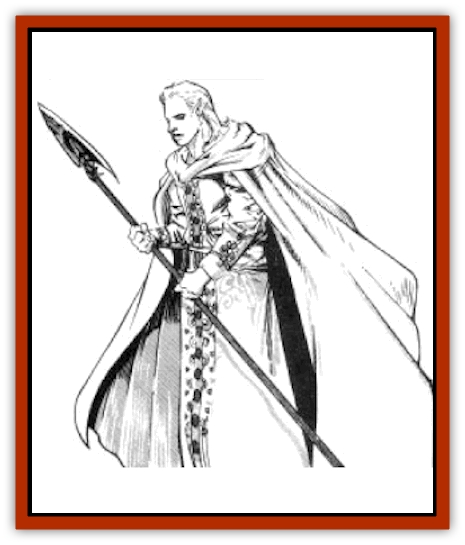

# Elf - High - Silvanesti

| Statistic | **Elf, High, Silvanesti** |
| --- | --- |
| **Activity Cycle:** | Any |
| **Alignment:** | Varies, but usually chaotic or neutral good |
| **Armor Class:** | 5 (10) |
| **Climate/Terrain:** | Temperate/Forest |
| **Damage/Attack:** | 1-10 (weapon) |
| **Diet:** | Omnivore |
| **Frequency:** | Uncommon |
| **Hit Dice:** | 1+1 |
| **Intelligence:** | Varies (10-18) |
| **Magic Resistance:** | See below |
| **Morale:** | Elite (13) |
| **Movement:** | 12 |
| **No. Appearing:** | 20-200 |
| **No. of Attacks:** | 1 |
| **Organization:** | Clan |
| **Size:** | M (5'+ tall) |
| **Special Attacks:** | See below |
| **Special Defenses:** | See below |
| **THAC0:** | 19 (18) |
| **Treasure:** | N; (G,S,T) |
| **XP Value:** | Varies |

Of the all [[Elf|elven]] races known, the Silvanesti is the oldest.

Silvanesti are fair-skinned. Their hair ranges from light-brown to blonde-white, and their eyes are hazel. They prefer loose garments, flowing robes, and billowing capes. Their clothes are various shades of green and brown. They speak in melodic tones and move with a natural grace.

Silvanesti are a proud, arrogant, and stoic people who have little use for other races, including other elves. They believe in strict racial purity.

**Combat:** Silvanesti are brave and able fighters, making optimum use of terrain for concealment and protection. They relish the opportunity to engage skilled opponents in combat. Typical weapons include long swords, two-handed swords, and spears. They also use bows of all types and sometimes tip their arrows with a special venom. Victims struck by these arrows must roll successful saving throws vs. paralyzation or be paralyzed for 1d10 rounds. Most wear chain mail, although some carry shields to improve their AC to 4.

**Habitat/Society:** The Silvanesti race has endured for over 3,000 years. They have become set in their ways. During the War of the Lance, the Silvanesti fled west and settled on the western shores of Harkun Bay. This is where most Silvanesti remain today.

Silvanesti abhor contact with humans or other races; marriages between humans and Silvanesti have occurred, albeit infrequently. Their relationship with the Qualinesti is strained.

Long years within a safe, settled empire have stratified the various crafts and tasks into a rigid system of castes, or Houses. At the top of the system is House Royal, the descendants of Silvanos, the first leader of the early elven clans and from whom the Silvanesti took their name.

Beneath this house are those of the craftsmen and guilds, such as House Mystic, House Gardener, House Mason, and House Woodshaper. The House Protector, also known as Wildrunners, serve as the army of the Silvanesti. No one marries outside his or her guild without permission, and permission is rarely granted.

A typical Silvanesti settlement includes a variety of all applicable classes and levels; at least 10% have magical abilities, and at least 10% are 4th-level or higher fighters. Silvanesti make their homes in glades surrounded by dense forests. Their buildings are tall, ornate structures of wood and stone. The most striking features of a Silvanesti settlement are the low stone pyramids used as tombs for the Silvanesti dead, and the large masses of briars and brambles created by House Woodshaper and House Gardener to serve as borders.

**Ecology:** Although their diet is supplemented by small portions of rabbit, squirrel, and venison, Silvanesti have more of an appetite for fruits, grains, and vegetables than they do for meat. Though the Silvanesti produce a variety of beautiful items, they rarely sell or trade them.

---
## Discovery & Documentation

**Source Publication:** MC4 Dragonlance Appendix (w/binder #2) (1989)
**Campaign Setting:** Dragonlance
**Author(s):** Rick Swan

### Other Creatures Found in This Source Book
   * [[Anemone_Giant_Sea|Anemone, Giant Sea]]
   * [[Bear_Ice|Bear, Ice]]
   * [[Beast_Undead|Beast, Undead]]
   * [[Bird_Krynn|Bird (Krynn)]]
   * [[Disir|Disir]]
   * [[Draconian_Aurak|Draconian, Aurak]]
   * [[Draconian_Baaz|Draconian, Baaz]]
   * [[Draconian_Bozak|Draconian, Bozak]]
   * [[Draconian_Kapak|Draconian, Kapak]]
   * [[Draconian_General_Information|Draconian, General Information]]
   * [[Draconian_Sivak|Draconian, Sivak]]
   * [[Draconian_Proto-_Traag|Draconian, Proto-, Traag]]
   * [[Dragon_Amphi|Dragon, Amphi]]
   * [[Dragon_Astral|Dragon, Astral]]
   * [[Dragon_Kodragon|Dragon, Kodragon]]
   * [[Dragon_Krynn_Othlorx_General_Information|Dragon (Krynn), Othlorx, General Information]]
   * [[Dragon_Krynn_General_Information|Dragon (Krynn), General Information]]
   * [[Dragon_Sea|Dragon, Sea]]
   * [[Dreamshadow|Dreamshadow]]
   * [[Dreamwraith|Dreamwraith]]
   * [[Dwarf_Daergar|Dwarf, Daergar]]
   * [[Dwarf_Hill_Neidar|Dwarf, Hill, Neidar]]
   * [[Dwarf_Mountain_Hylar|Dwarf, Mountain, Hylar]]
   * [[Dwarf_Theiwar|Dwarf, Theiwar]]
   * [[Dwarf_Zakhar|Dwarf, Zakhar]]
   * [[Elf_Half-|Elf, Half-]]
   * [[Elf_High_Qualinesti|Elf, High, Qualinesti]]
   * [[Elf_Sea_Dargonesti|Elf, Sea, Dargonesti]]
   * [[Elf_Sea_Dimernesti|Elf, Sea, Dimernesti]]
   * [[Elf_Wild_Kagonesti|Elf, Wild, Kagonesti]]
   * [[Eyewing|Eyewing]]
   * [[Fetch|Fetch]]
   * [[Fire_Minion|Fire Minion]]
   * [[Fireshadow|Fireshadow]]
   * [[Gnome_Tinker|Gnome, Tinker]]
   * [[Gurik_Cha'ahl|Gurik Cha'ahl]]
   * [[Haunt_Knight|Haunt, Knight]]
   * [[Horax|Horax]]
   * [[Human_Krynn|Human (Krynn)]]
   * [[Imp_Blood_Sea|Imp, Blood Sea]]
   * [[Kalothagh|Kalothagh]]
   * [[Kani_Doll|Kani Doll]]
   * [[Kender|Kender]]
   * [[Kyrie|Kyrie]]
   * [[Lizard_Man_Krynn|Lizard Man (Krynn)]]
   * [[Minotaur_Krynn|Minotaur, Krynn]]
   * [[Ogre_High|Ogre, High]]
   * [[Ogre_Krynn|Ogre (Krynn)]]
   * [[Phaethon|Phaethon]]
   * [[Saqualaminoi|Saqualaminoi]]
   * [[Shadowperson|Shadowperson]]
   * [[Shimmerweed|Shimmerweed]]
   * [[Skrit|Skrit]]
   * [[Spectral_Minion|Spectral Minion]]
   * [[Spider_Krynn|Spider (Krynn)]]
   * [[Stag|Stag]]
   * [[Tayling|Tayling]]
   * [[Thanoi|Thanoi]]
   * [[Tylor|Tylor]]
   * [[Wichtlin|Wichtlin]]
   * [[Wyndlass|Wyndlass]]
   * [[Yaggol|Yaggol]]
